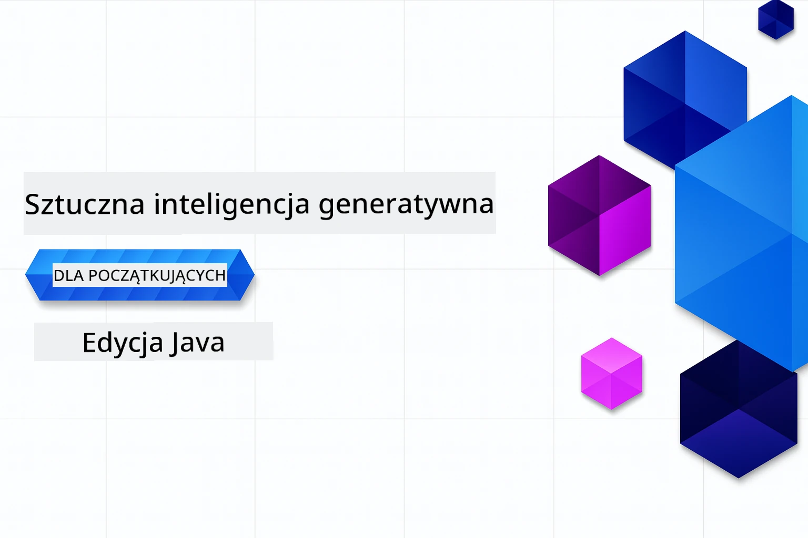

# Generatywna SI dla początkujących - edycja Java
[](https://discord.gg/nTYy5BXMWG)



**Czas potrzebny**: Całe warsztaty można ukończyć online bez lokalnej konfiguracji. Konfiguracja środowiska zajmuje 2 minuty, a eksploracja przykładów wymaga 1-3 godzin w zależności od głębokości eksploracji.

> **Szybki start** 

1. Zrób fork tego repozytorium na swoje konto GitHub
2. Kliknij **Code** → zakładka **Codespaces** → **...** → **New with options...**
3. Użyj ustawień domyślnych – spowoduje to wybranie kontenera developerskiego stworzonego dla tego kursu
4. Kliknij **Create codespace**
5. Poczekaj ~2 minuty aż środowisko będzie gotowe
6. Przejdź bezpośrednio do [Rozdziału 2: Provision Azure AI Foundry](./02-SetupDevEnvironment/README.md#step-2-provision-azure-ai-foundry)

## Wsparcie wielojęzyczne

### Wspierane przez GitHub Action (automatyczne i zawsze aktualne)

<!-- CO-OP TRANSLATOR LANGUAGES TABLE START -->
[Arabski](../ar/README.md) | [Bengalski](../bn/README.md) | [Bułgarski](../bg/README.md) | [Birmański (Myanmar)](../my/README.md) | [Chiński (uproszczony)](../zh-CN/README.md) | [Chiński (tradycyjny, Hongkong)](../zh-HK/README.md) | [Chiński (tradycyjny, Makau)](../zh-MO/README.md) | [Chiński (tradycyjny, Tajwan)](../zh-TW/README.md) | [Chorwacki](../hr/README.md) | [Czeski](../cs/README.md) | [Duński](../da/README.md) | [Holenderski](../nl/README.md) | [Estoński](../et/README.md) | [Fiński](../fi/README.md) | [Francuski](../fr/README.md) | [Niemiecki](../de/README.md) | [Grecki](../el/README.md) | [Hebrajski](../he/README.md) | [Hindi](../hi/README.md) | [Węgierski](../hu/README.md) | [Indonezyjski](../id/README.md) | [Włoski](../it/README.md) | [Japoński](../ja/README.md) | [Kannada](../kn/README.md) | [Khmer](../km/README.md) | [Koreański](../ko/README.md) | [Litewski](../lt/README.md) | [Malajski](../ms/README.md) | [Malajalam](../ml/README.md) | [Marathi](../mr/README.md) | [Nepalski](../ne/README.md) | [Nigeryjski Pidgin](../pcm/README.md) | [Norweski](../no/README.md) | [Perski (Farsi)](../fa/README.md) | [Polski](./README.md) | [Portugalski (Brazylia)](../pt-BR/README.md) | [Portugalski (Portugalia)](../pt-PT/README.md) | [Pendżabski (Gurmukhi)](../pa/README.md) | [Rumuński](../ro/README.md) | [Rosyjski](../ru/README.md) | [Serbski (cyrylica)](../sr/README.md) | [Słowacki](../sk/README.md) | [Słoweński](../sl/README.md) | [Hiszpański](../es/README.md) | [Suahili](../sw/README.md) | [Szwedzki](../sv/README.md) | [Tagalog (filipiński)](../tl/README.md) | [Tamilski](../ta/README.md) | [Telugu](../te/README.md) | [Tajski](../th/README.md) | [Turecki](../tr/README.md) | [Ukraiński](../uk/README.md) | [Urdu](../ur/README.md) | [Wietnamski](../vi/README.md)

> **Wolisz klonować lokalnie?**
>
> To repozytorium zawiera ponad 50 tłumaczeń, co znacznie zwiększa rozmiar pobierania. Aby sklonować bez tłumaczeń, użyj sparse checkout:
>
> **Bash / macOS / Linux:**
> ```bash
> git clone --filter=blob:none --sparse https://github.com/microsoft/Generative-AI-for-beginners-java.git
> cd Generative-AI-for-beginners-java
> git sparse-checkout set --no-cone '/*' '!translations' '!translated_images'
> ```
>
> **CMD (Windows):**
> ```cmd
> git clone --filter=blob:none --sparse https://github.com/microsoft/Generative-AI-for-beginners-java.git
> cd Generative-AI-for-beginners-java
> git sparse-checkout set --no-cone "/*" "!translations" "!translated_images"
> ```
>
> To zapewnia wszystko, czego potrzebujesz do ukończenia kursu z dużo szybszym pobraniem.
<!-- CO-OP TRANSLATOR LANGUAGES TABLE END -->

## Struktura kursu i ścieżka nauki

### **Rozdział 1: Wprowadzenie do generatywnej SI**
- **Podstawowe pojęcia**: Zrozumienie dużych modeli językowych, tokenów, osadzeń i możliwości SI
- **Ekosystem SI w Javie**: Przegląd Spring AI i OpenAI SDK
- **Protokół kontekstu modelu**: Wprowadzenie do MCP i jego roli w komunikacji agentów SI
- **Praktyczne zastosowania**: Scenariusze z życia, w tym chatboty i generowanie treści
- **[→ Rozpocznij Rozdział 1](./01-IntroToGenAI/README.md)**

### **Rozdział 2: Konfiguracja środowiska developerskiego**
- **Azure AI Foundry**: Provision GPT-5.6 Luna chat i embeddingi text-embedding-3-small za pomocą Bicep i Azure Developer CLI (azd)
- **Spring Boot 4.1.1 + Spring AI 2.0.1**: Nauka z `ChatClient`, wspierana przez oficjalne OpenAI Java SDK i Azure OpenAI v1
- **Uwierzytelnianie bez klucza**: Bezpieczne połączenie przez Microsoft Entra ID — bez zarządzania kluczami API
- **Narzędzia deweloperskie**: Kontenery Docker, VS Code i konfiguracja GitHub Codespaces
- **[→ Rozpocznij Rozdział 2](./02-SetupDevEnvironment/README.md)**

### **Rozdział 3: Podstawowe techniki generatywnej SI**
- **Oficjalne OpenAI Java SDK**: Bezpośrednie wywołanie Azure OpenAI v1 z uwierzytelnianiem bez klucza
- **Inżynieria promptów**: Techniki optymalnych odpowiedzi modeli SI
- **Osadzenia i operacje na wektorach**: Implementacja wyszukiwania semantycznego i dopasowania podobieństwa
- **Generacja wspomagana wyszukiwaniem (RAG)**: Łączenie SI z własnymi źródłami danych
- **Wywoływanie funkcji**: Rozszerzenie możliwości SI o niestandardowe narzędzia i wtyczki
- **[→ Rozpocznij Rozdział 3](./03-CoreGenerativeAITechniques/README.md)**

### **Rozdział 4: Praktyczne zastosowania i projekty**
- **Generator historii zwierząt domowych** (`petstory/`): Kreatywne generowanie treści z Azure AI Foundry
- **Demo lokalne Foundry** (`foundrylocal/`): Lokalna integracja modeli SI z OpenAI Java SDK
- **Usługa kalkulatora MCP** (`calculator/`): Podstawowa implementacja protokołu kontekstu modelu z Spring AI
- **[→ Rozpocznij Rozdział 4](./04-PracticalSamples/README.md)**

### **Rozdział 5: Odpowiedzialny rozwój SI**
- **Bezpieczeństwo treści Azure AI Foundry**: Testowanie wbudowanych filtrów bezpieczeństwa (twarde blokady i miękkie odmowy)
- **Demo odpowiedzialnej SI**: Praktyczny przykład działania nowoczesnych systemów bezpieczeństwa SI
- **Najlepsze praktyki**: Podstawowe wytyczne dotyczące etycznego rozwoju i wdrażania SI
- **[→ Rozpocznij Rozdział 5](./05-ResponsibleGenAI/README.md)**

## Dodatkowe zasoby

<!-- CO-OP TRANSLATOR OTHER COURSES START -->
### LangChain
[](https://aka.ms/langchain4j-for-beginners)
[](https://aka.ms/langchainjs-for-beginners?WT.mc_id=m365-94501-dwahlin)
[](https://github.com/microsoft/langchain-for-beginners?WT.mc_id=m365-94501-dwahlin)
---

### Azure / Edge / MCP / Agenci
[](https://github.com/microsoft/AZD-for-beginners?WT.mc_id=academic-105485-koreyst)
[](https://github.com/microsoft/edgeai-for-beginners?WT.mc_id=academic-105485-koreyst)
[](https://github.com/microsoft/mcp-for-beginners?WT.mc_id=academic-105485-koreyst)
[](https://github.com/microsoft/ai-agents-for-beginners?WT.mc_id=academic-105485-koreyst)

---
 
### Seria generatywnej SI
[](https://github.com/microsoft/generative-ai-for-beginners?WT.mc_id=academic-105485-koreyst)
[-9333EA?style=for-the-badge&labelColor=E5E7EB&color=9333EA)](https://github.com/microsoft/Generative-AI-for-beginners-dotnet?WT.mc_id=academic-105485-koreyst)
[-C084FC?style=for-the-badge&labelColor=E5E7EB&color=C084FC)](https://github.com/microsoft/generative-ai-for-beginners-java?WT.mc_id=academic-105485-koreyst)
[-E879F9?style=for-the-badge&labelColor=E5E7EB&color=E879F9)](https://github.com/microsoft/generative-ai-with-javascript?WT.mc_id=academic-105485-koreyst)

---
 
### Kluczowa nauka
[](https://aka.ms/ml-beginners?WT.mc_id=academic-105485-koreyst)
[](https://aka.ms/datascience-beginners?WT.mc_id=academic-105485-koreyst)
[](https://aka.ms/ai-beginners?WT.mc_id=academic-105485-koreyst)
[](https://github.com/microsoft/Security-101?WT.mc_id=academic-96948-sayoung)
[](https://aka.ms/webdev-beginners?WT.mc_id=academic-105485-koreyst)
[](https://aka.ms/iot-beginners?WT.mc_id=academic-105485-koreyst)
[](https://github.com/microsoft/xr-development-for-beginners?WT.mc_id=academic-105485-koreyst)

---
 
### Seria Copilot
[](https://aka.ms/GitHubCopilotAI?WT.mc_id=academic-105485-koreyst)
[](https://github.com/microsoft/mastering-github-copilot-for-dotnet-csharp-developers?WT.mc_id=academic-105485-koreyst)
[](https://github.com/microsoft/CopilotAdventures?WT.mc_id=academic-105485-koreyst)
<!-- CO-OP TRANSLATOR OTHER COURSES END -->

## Uzyskiwanie pomocy

Jeśli utkniesz lub masz pytania dotyczące budowy aplikacji SI, dołącz do innych uczących się i doświadczonych deweloperów w dyskusjach o MCP. To wspierająca społeczność, gdzie pytania są mile widziane, a wiedza jest swobodnie dzielona.

[](https://discord.gg/nTYy5BXMWG)

Jeśli masz opinie o produkcie lub zgłaszasz błędy podczas budowy, odwiedź:

[](https://aka.ms/foundry/forum)

---

<!-- CO-OP TRANSLATOR DISCLAIMER START -->
**Zastrzeżenie**:
Niniejszy dokument został przetłumaczony za pomocą usługi tłumaczenia AI [Co-op Translator](https://github.com/Azure/co-op-translator). Choć dążymy do dokładności, prosimy pamiętać, że automatyczne tłumaczenia mogą zawierać błędy lub niedokładności. Oryginalny dokument w jego języku źródłowym należy uznawać za autorytatywne źródło. W przypadku informacji krytycznych zalecane jest skorzystanie z profesjonalnego tłumaczenia wykonanego przez człowieka. Nie ponosimy odpowiedzialności za jakiekolwiek nieporozumienia lub błędne interpretacje wynikające z użycia tego tłumaczenia.
<!-- CO-OP TRANSLATOR DISCLAIMER END -->