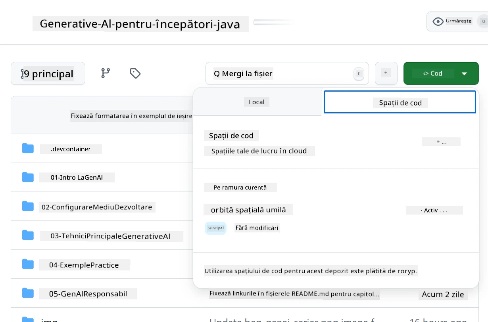
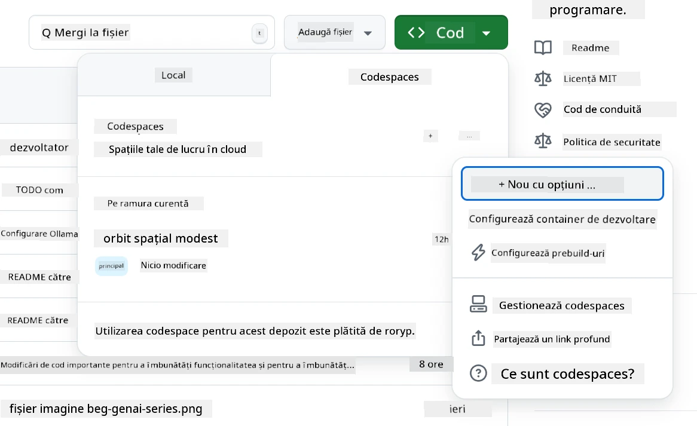
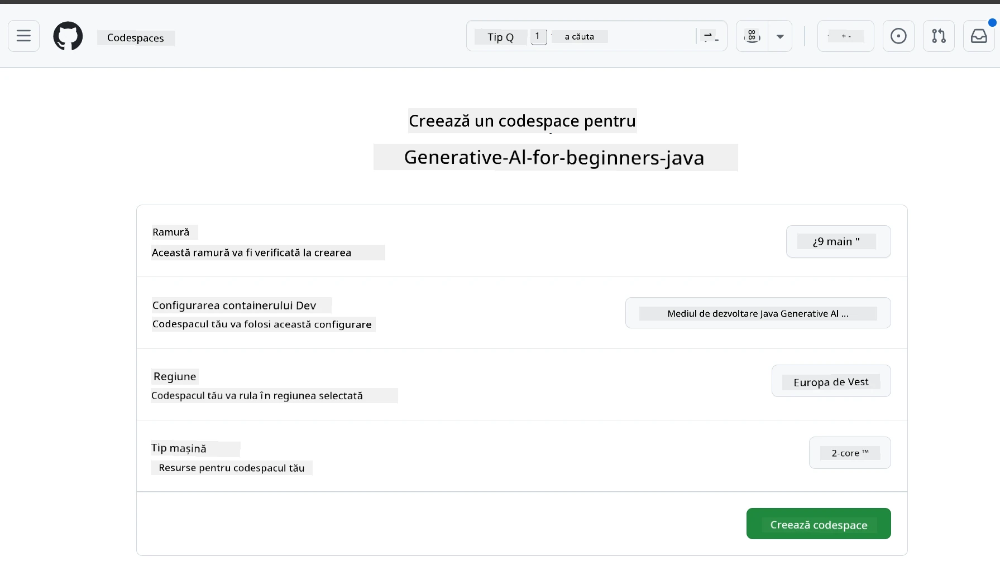
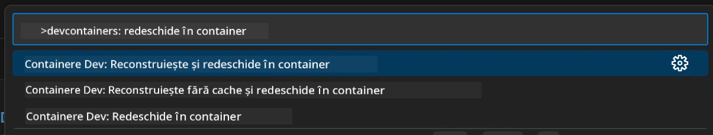
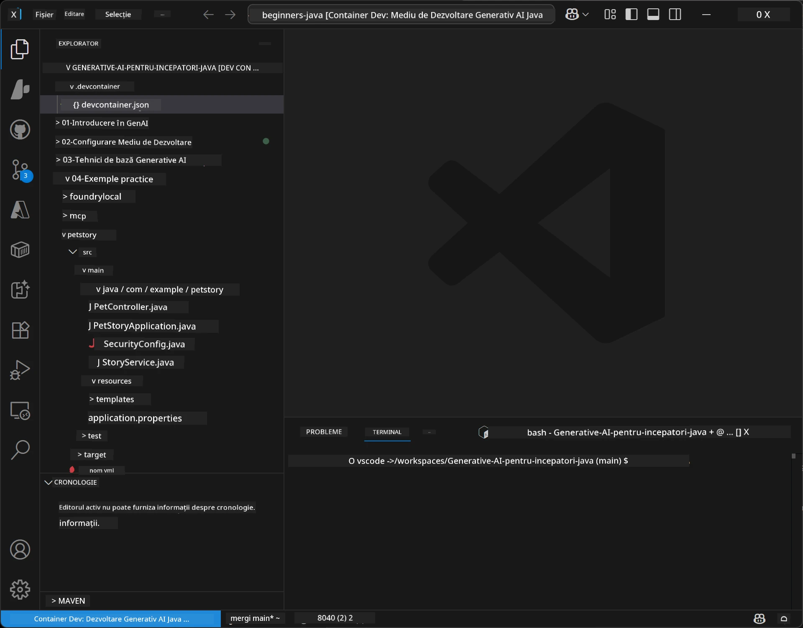
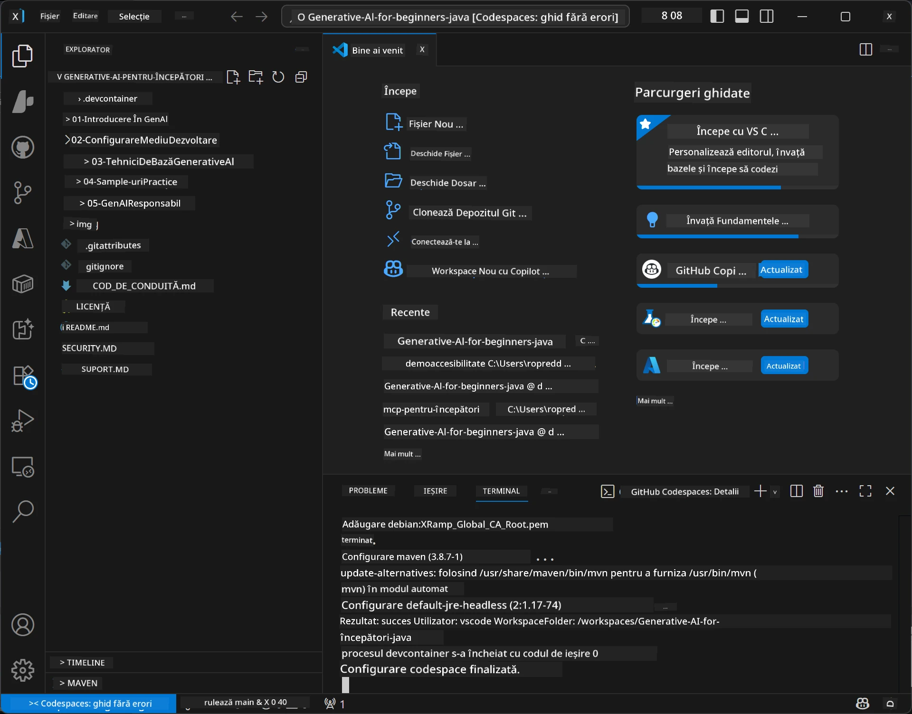

# Configurarea Mediului de Dezvoltare pentru Generative AI pentru Java

> **Pornire rapidă:** Provizionați modelele dvs. AI pe **Azure AI Foundry** ca cod cu Bicep + `azd` în câteva minute — vedeți [Ghidul de configurare Azure AI Foundry](getting-started-azure-openai.md). Autentificarea este **fără chei** (Microsoft Entra ID), deci nu trebuie să gestionați chei API.

## Ce Veți Învăța

- Configurați un mediu de dezvoltare Java pentru aplicații AI
- Alegeți și configurați mediul de dezvoltare preferat (cloud-first cu Codespaces, container local de dezvoltare sau configurare locală completă)
- Testați configurația conectându-vă la un model Azure AI Foundry

## Cuprins

- [Ce Veți Învăța](#ce-veți-învăța)
- [Introducere](#introducere)
- [Pasul 1: Configurați Mediul de Dezvoltare](#pasul-1-configurați-mediul-de-dezvoltare)
  - [Opțiunea A: GitHub Codespaces (Recomandat)](#opțiunea-a-github-codespaces-recomandat)
  - [Opțiunea B: Container Local de Dezvoltare](#opțiunea-b-container-local-de-dezvoltare)
  - [Opțiunea C: Folosiți Instalarea Locală Existenta](#opțiunea-c-folosiți-instalarea-locală-existenta)
- [Pasul 2: Provizionați Azure AI Foundry](#pasul-2-provizionați-azure-ai-foundry)
- [Pasul 3: Testați Configurația](#pasul-3-testați-configurația)
- [Depanare](#depanare)
- [Rezumat](#rezumat)
- [Pașii Următori](#pașii-următori)

## Introducere

Acest capitol vă va ghida prin configurarea unui mediu de dezvoltare. Vom folosi **Azure AI Foundry** pentru modelele pe tot parcursul acestui curs. Provisonați modelele ca și cod cu Bicep și Azure Developer CLI (`azd`), apoi vă conectați cu **autentificare fără chei** (Microsoft Entra ID) — fără chei API de copiat sau de care să scape.

**Nu este necesară nicio configurare locală!** Puteți folosi GitHub Codespaces, care oferă un mediu complet de dezvoltare direct în browserul dvs. și provisions Foundry de acolo.

Folosim **Azure AI Foundry** pentru acest curs deoarece este:
- **Provisonat ca și cod** — un singur `azd up` desfășoară contul și implementările modelului
- **Fără chei** — autentificați-vă cu semnătura dvs. Azure sau cu o identitate gestionată
- **Pregătit pentru producție** — același cod rulează local și în Azure
- **Flexibil** — schimbați modelele schimbând numele implementării, nu codul dvs.

> **Notă**: Implementările Azure AI Foundry sunt taxate per token (plată la consum). Consultați [Ghidul de configurare Azure AI Foundry](getting-started-azure-openai.md) pentru detalii despre provizionare, regiune și costuri.


## Pasul 1: Configurați Mediul de Dezvoltare

<a name="quick-start-cloud"></a>

Am creat un container de dezvoltare preconfigurat pentru a minimiza timpul de configurare și pentru a vă asigura că aveți toate uneltele necesare pentru acest curs Generative AI pentru Java. Alegeți abordarea de dezvoltare preferată:

### Opțiuni de Configurare a Mediului:

#### Opțiunea A: GitHub Codespaces (Recomandat)

**Începeți să scrieți cod în 2 minute - fără necesitate de configurare locală!**

1. Faceți un fork al acestui depozit în contul dvs. GitHub
   > **Notă**: Dacă doriți să editați configurația de bază, vă rugăm să consultați [Configurația Containerului de Dezvoltare](../../../.devcontainer/devcontainer.json)
2. Faceți clic pe **Code** → fila **Codespaces** → **...** → **New with options...**
3. Folosiți valorile implicite – aceasta va selecta **Configurația containerului de dezvoltare**: **Mediul de Dezvoltare Generative AI Java** creat special pentru acest curs
4. Faceți clic pe **Create codespace**
5. Așteptați ~2 minute pentru ca mediul să fie gata
6. Continuați la [Pasul 2: Provizionați Azure AI Foundry](#pasul-2-provizionați-azure-ai-foundry)








> **Beneficiile Codespaces**:
> - Nu necesită instalare locală
> - Funcționează pe orice dispozitiv cu browser
> - Preconfigurat cu toate uneltele și dependențele
> - 60 de ore gratuite pe lună pentru conturile personale
> - Mediu consecvent pentru toți cursanții

#### Opțiunea B: Container Local de Dezvoltare

**Pentru dezvoltatori care preferă dezvoltarea locală cu Docker**

1. Faceți fork și clonați acest depozit pe mașina dvs. locală
   > **Notă**: Dacă doriți să editați configurația de bază, vă rugăm să consultați [Configurația Containerului de Dezvoltare](../../../.devcontainer/devcontainer.json)
2. Instalați [Docker Desktop](https://www.docker.com/products/docker-desktop/) și [VS Code](https://code.visualstudio.com/)
3. Instalați [extensia Containere de Dezvoltare](https://marketplace.visualstudio.com/items?itemName=ms-vscode-remote.remote-containers) în VS Code
4. Deschideți folderul depozitului în VS Code
5. La prompt, faceți clic pe **Reopen in Container** (sau folosiți `Ctrl+Shift+P` → "Dev Containers: Reopen in Container")
6. Așteptați să se construiască și să pornească containerul
7. Continuați la [Pasul 2: Provizionați Azure AI Foundry](#pasul-2-provizionați-azure-ai-foundry)





#### Opțiunea C: Folosiți Instalarea Locală Existenta

**Pentru dezvoltatori cu medii Java existente**

Prerechizite:
- [Java 21+](https://www.oracle.com/java/technologies/javase/jdk21-archive-downloads.html) 
- [Maven 3.9+](https://maven.apache.org/download.cgi)
- [VS Code](https://code.visualstudio.com) sau IDE-ul preferat

Pași:
1. Clonați acest depozit pe mașina dvs. locală
2. Deschideți proiectul în IDE-ul dvs.
3. Continuați la [Pasul 2: Provizionați Azure AI Foundry](#pasul-2-provizionați-azure-ai-foundry)

> **Sfat profesional**: Dacă aveți o mașină cu specificații reduse, dar doriți VS Code local, folosiți GitHub Codespaces! Vă puteți conecta VS Code local la un Codespace găzduit în cloud pentru cele mai bune avantaje.




## Pasul 2: Provizionați Azure AI Foundry

Implementați modelele AI ale cursului pe Azure AI Foundry ca și cod. Din rădăcina depozitului:

```bash
cd 02-SetupDevEnvironment
azd auth login
az login
azd up
```

`azd` solicită un nume de mediu, abonament și regiune, provisionează un cont Azure AI Foundry cu implementările `gpt-5.6-luna` și `text-embedding-3-small`, și scrie endpoint-ul în `.env` al exemplului - totul cu autentificare **fără chei** (fără chei API).

> **Parcurgere completă:** Consultați [Ghidul de configurare Azure AI Foundry](getting-started-azure-openai.md) pentru prerechizite, alternativă manuală (portal), îndrumări pentru regiune și note privind costurile/curățarea.

## Pasul 3: Testați Configurația

Odată ce modelele Foundry sunt provizionate, testați conectarea cu aplicația exemplu în [`02-SetupDevEnvironment/examples/basic-chat-azure`](../../../02-SetupDevEnvironment/examples/basic-chat-azure).

1. Deschideți terminalul în mediul de dezvoltare.
2. Navigați la exemplu:
   ```bash
   cd 02-SetupDevEnvironment/examples/basic-chat-azure
   ```
3. Asigurați-vă că sunteți autentificat (autentificare fără chei necesită token):
   ```bash
   az login
   ```
   > Dacă ați rulat `azd up`, fișierul `.env` cu endpoint-ul a fost deja scris pentru dvs.
4. Rulați aplicația:
   ```bash
   mvn clean spring-boot:run
   ```

Ar trebui să vedeți un răspuns de la modelul `gpt-5.6-luna`.

### Înțelegerea Codului Exemplu

Exemplul [basic-chat](./examples/basic-chat-azure/README.md) folosește **Spring Boot 4.1.1** și **Spring AI 2.0.1**. `ChatClient` din Spring AI este susținut de SDK-ul oficial OpenAI Java, conectându-se la endpoint-ul Azure OpenAI **v1** cu autentificare fără chei.

**Ce face acest cod:**
- **Se conectează** la Azure AI Foundry folosind semnătura dvs. Azure (Microsoft Entra ID) — fără cheie API
- **Trimite** un prompt modelului `gpt-5.6-luna`
- **Primește** și afișează răspunsul AI-ului
- **Validează** că configurația dvs. funcționează corect

**Dependențe cheie** (extras din [pom.xml](../../../02-SetupDevEnvironment/examples/basic-chat-azure/pom.xml)):
```xml
<dependency>
    <groupId>org.springframework.ai</groupId>
    <artifactId>spring-ai-starter-model-openai</artifactId>
</dependency>
<dependency>
    <groupId>com.openai</groupId>
    <artifactId>openai-java</artifactId>
</dependency>
<dependency>
    <groupId>com.azure</groupId>
    <artifactId>azure-identity</artifactId>
    <version>${azure-identity.version}</version>
</dependency>
```

POM gestionează OpenAI Java **4.63.1** și setează explicit Azure Identity **1.18.6**. Spring AI 2 a eliminat starterul specific Azure; Azure Identity este încă necesar pentru bean-ul de credențiale.

**Configurație** ([application.yml](../../../02-SetupDevEnvironment/examples/basic-chat-azure/src/main/resources/application.yml)):
```yaml
spring:
  ai:
    openai:
      base-url: ${AZURE_OPENAI_ENDPOINT}
      microsoft-foundry: true
      chat:
        model: ${AZURE_OPENAI_DEPLOYMENT:gpt-5.6-luna}
        reasoning-effort: none
        max-completion-tokens: 500
```

Autentificarea fără chei este configurată explicit în [BasicChatApplication.java](../../../02-SetupDevEnvironment/examples/basic-chat-azure/src/main/java/com/example/BasicChatApplication.java), nu dedusă din lipsa cheii API. Credințialul bearer folosește `DefaultAzureCredential` cu scopul `https://ai.azure.com/.default`, iar `OpenAIClient` țintește `/openai/v1`. Aplicația oferă acest client modelului de chat din Spring AI, astfel încât o cheie globală `OPENAI_API_KEY` nu poate suprascrie autentificarea Azure.

Setările chat sunt direct sub `spring.ai.openai.chat`, fără un bloc `options`. Lecția păstrează Chat Completions cu `reasoning-effort: none` și o limită de 500 tokeni pentru completare; nu setează `temperature` sau `max-tokens`. Consultați [referința de configurare a exemplului](./examples/basic-chat-azure/README.md#spring-configuration) pentru alegerea API și îndrumări privind apelarea uneltelor.

## Rezumat

După ce ați finalizat pașii de mai sus, veți avea:

- Modelele Azure AI Foundry provizionate ca și cod cu Bicep + `azd`
- Mediul dvs. de dezvoltare Java funcțional (fie că este Codespaces, containere de dezvoltare sau local)
- Conectare la Azure AI Foundry cu autentificare fără chei (Microsoft Entra ID) — fără chei API
- Testat funcționarea cu un exemplu simplu care vorbește cu modelul dvs.

## Pașii Următori

[Capitolul 3: Tehnici de bază pentru Generative AI](../03-CoreGenerativeAITechniques/README.md)

## Depanare

Aveți probleme? Iată probleme comune și soluții:

- **Autentificarea eșuează (401/403)?**
  - Rulați `az login` — autentificarea este fără chei, deci trebuie să fiți autentificat
  - Verificați că contul dvs. are rolul **Cognitive Services OpenAI User** pe resursa respectivă
  - Dacă tocmai ați provizionat, așteptați un minut pentru propagarea asignării rolului

- **Maven nu este găsit?**
  - Dacă folosiți containere de dezvoltare/Codespaces, Maven ar trebui să fie preinstalat
  - Pentru configurare locală, asigurați-vă că Java 21+ și Maven 3.9+ sunt instalate
  - Încercați `mvn --version` pentru a verifica instalarea

- **`azd` nu este găsit sau provizionarea eșuează?**
  - Instalați [Azure Developer CLI](https://aka.ms/azure-dev/install) și rulați `azd auth login`
  - Alegeți o regiune unde sunt disponibile `gpt-5.6-luna` și `text-embedding-3-small` (de exemplu, `eastus2`), cu cotă suficientă în abonamentul selectat
  - Consultați [ghidul de configurare Azure AI Foundry](getting-started-azure-openai.md) pentru detalii

- **Containerul de dezvoltare nu pornește?**
  - Asigurați-vă că Docker Desktop rulează (pentru dezvoltare locală)
  - Încercați reconstrucția containerului: `Ctrl+Shift+P` → "Dev Containers: Rebuild Container"

- **Erori de compilare a aplicației?**
  - Asigurați-vă că sunteți în directorul corect: `02-SetupDevEnvironment/examples/basic-chat-azure`
  - Încercați curățarea și recompilarea: `mvn clean compile`

> **Aveți nevoie de ajutor?**: Aveți probleme în continuare? Deschideți o problemă în depozit și vă vom ajuta.

---

<!-- CO-OP TRANSLATOR DISCLAIMER START -->
**Declinare a responsabilității**:
Acest document a fost tradus folosind serviciul de traducere AI [Co-op Translator](https://github.com/Azure/co-op-translator). În timp ce ne străduim pentru acuratețe, vă rugăm să rețineți că traducerile automate pot conține erori sau inexactități. Documentul original în limba sa nativă trebuie considerat sursa autorizată. Pentru informații critice, se recomandă traducerea profesională realizată de un om. Nu ne asumăm responsabilitatea pentru eventualele neînțelegeri sau interpretări greșite care decurg din utilizarea acestei traduceri.
<!-- CO-OP TRANSLATOR DISCLAIMER END -->