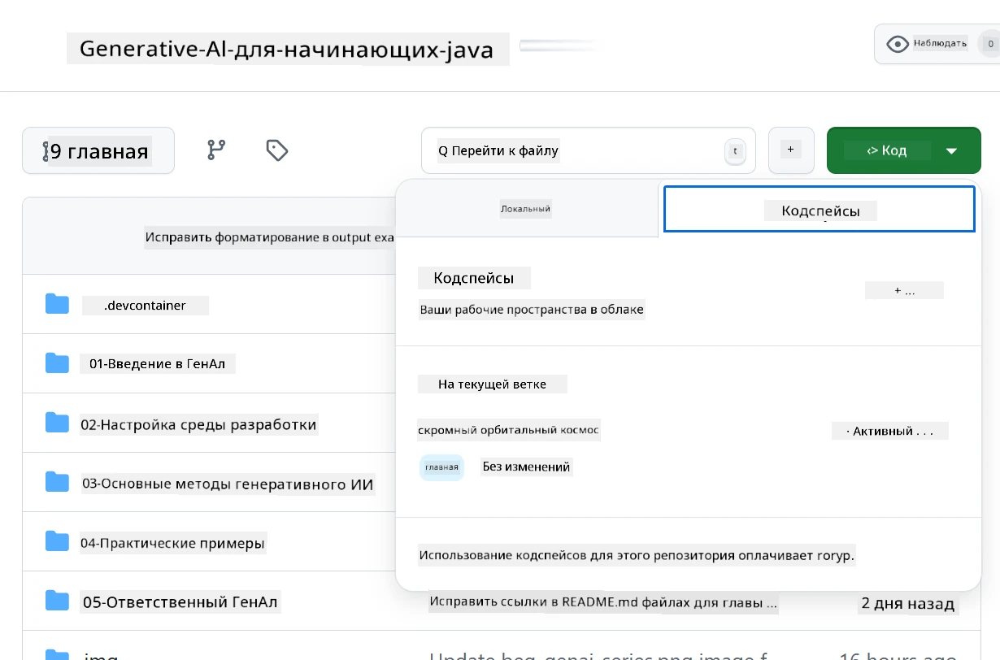
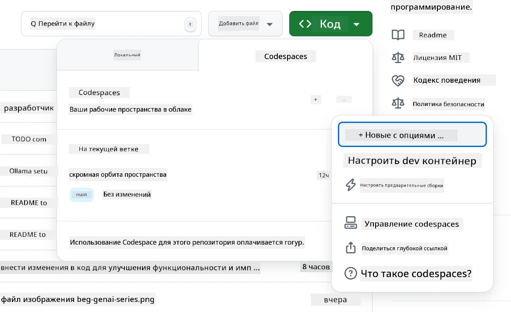
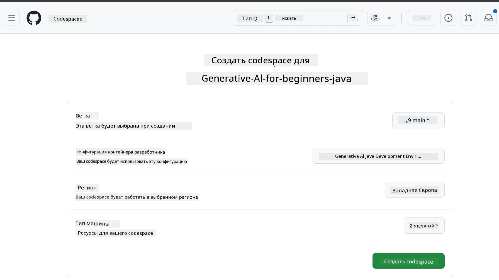
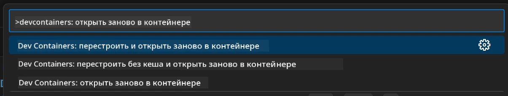
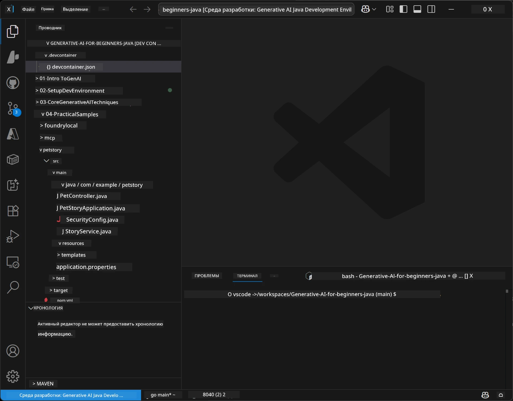
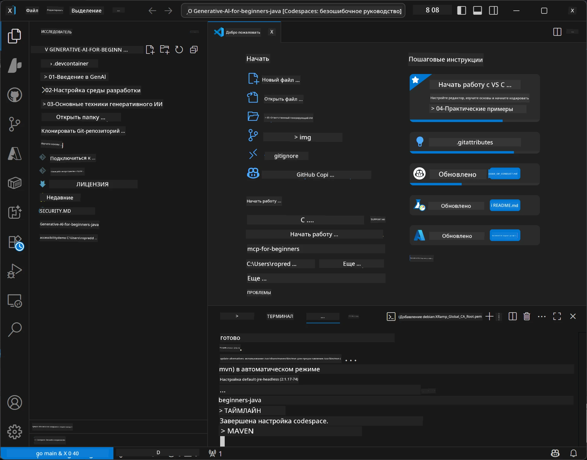

# Настройка среды разработки для Generative AI на Java

> **Быстрый старт:** Разверните свои модели ИИ в **Azure AI Foundry** как код с помощью Bicep + `azd` за несколько минут — смотрите [Руководство по настройке Azure AI Foundry](getting-started-azure-openai.md). Аутентификация — **без ключей** (Microsoft Entra ID), поэтому не нужно управлять API-ключами.

## Чему вы научитесь

- Настроить среду разработки Java для AI-приложений
- Выбрать и настроить предпочитаемую среду разработки (в первую очередь облачная с Codespaces, локальный dev container или полностью локальная установка)
- Проверить установку, подключившись к модели Azure AI Foundry

## Содержание

- [Чему вы научитесь](#чему-вы-научитесь)
- [Введение](#введение)
- [Шаг 1: Настройка среды разработки](#шаг-1-настройка-среды-разработки)
  - [Вариант А: GitHub Codespaces (рекомендуется)](#вариант-а-github-codespaces-рекомендуется)
  - [Вариант B: Локальный Dev Container](#вариант-b-локальный-dev-container)
  - [Вариант C: Использование существующей локальной установки](#вариант-c-использование-существующей-локальной-установки)
- [Шаг 2: Развертывание Azure AI Foundry](#шаг-2-развертывание-azure-ai-foundry)
- [Шаг 3: Проверка вашей установки](#шаг-3-проверка-вашей-установки)
- [Устранение неполадок](#устранение-неполадок)
- [Итог](#итог)
- [Дальнейшие шаги](#дальнейшие-шаги)

## Введение

Эта глава проведет вас через настройку среды разработки. В течение курса мы будем использовать **Azure AI Foundry** для моделей. Вы разворачиваете модели как код с помощью Bicep и Azure Developer CLI (`azd`), а затем подключаетесь с помощью **аутентификации без ключей** (Microsoft Entra ID) — без копирования или утечки API-ключей.

**Локальная установка не требуется!** Вы можете использовать GitHub Codespaces, который предоставляет полную среду разработки в браузере, и развернуть Foundry оттуда.

Мы используем **Azure AI Foundry** для этого курса, потому что он:
- **Развертывается как код** — одна команда `azd up` разворачивает учетную запись и развертывания моделей
- **Без ключей** — аутентификация с помощью вашей учетной записи Azure или управляемой идентичности
- **Готов к продакшену** — тот же код работает локально и в Azure
- **Гибкий** — меняйте модели, изменяя имя развертывания, а не код

> **Примечание**: Развертывания Azure AI Foundry тарифицируются по токенам (оплата по мере использования). Видите [руководство по настройке Azure AI Foundry](getting-started-azure-openai.md) для деталей о развертывании, регионах и стоимости.


## Шаг 1: Настройка среды разработки

<a name="quick-start-cloud"></a>

Мы подготовили предварительно настроенный контейнер для разработки, чтобы минимизировать время установки и обеспечить вас всем необходимым для курса Generative AI для Java. Выберите предпочитаемый подход к разработке:

### Варианты настройки среды:

#### Вариант А: GitHub Codespaces (рекомендуется)

**Начинайте кодить за 2 минуты — локальная установка не требуется!**

1. Форкните этот репозиторий в свой аккаунт GitHub
   > **Примечание**: Если хотите редактировать базовую конфигурацию, обратитесь к [Dev Container Configuration](../../../.devcontainer/devcontainer.json)
2. Нажмите **Code** → вкладка **Codespaces** → **...** → **New with options...**
3. Используйте настройки по умолчанию – это выберет **Dev container configuration**: **Generative AI Java Development Environment** — кастомный devcontainer, созданный для этого курса
4. Нажмите **Create codespace**
5. Подождите около 2 минут, пока среда подготовится
6. Перейдите к [Шагу 2: Развертывание Azure AI Foundry](#шаг-2-развертывание-azure-ai-foundry)








> **Преимущества Codespaces**:
> - Нет необходимости в локальной установке
> - Работает на любом устройстве с браузером
> - Предварительно настроен всеми инструментами и зависимостями
> - Бесплатно 60 часов в месяц для личных аккаунтов
> - Единая среда для всех обучающихся

#### Вариант B: Локальный Dev Container

**Для разработчиков, предпочитающих локальную разработку с Docker**

1. Форкните и клонируйте этот репозиторий на локальный компьютер
   > **Примечание**: Если хотите редактировать базовую конфигурацию, обратитесь к [Dev Container Configuration](../../../.devcontainer/devcontainer.json)
2. Установите [Docker Desktop](https://www.docker.com/products/docker-desktop/) и [VS Code](https://code.visualstudio.com/)
3. Установите расширение [Dev Containers extension](https://marketplace.visualstudio.com/items?itemName=ms-vscode-remote.remote-containers) в VS Code
4. Откройте папку репозитория в VS Code
5. При появлении запроса нажмите **Reopen in Container** (или используйте `Ctrl+Shift+P` → "Dev Containers: Reopen in Container")
6. Дождитесь сборки и запуска контейнера
7. Перейдите к [Шагу 2: Развертывание Azure AI Foundry](#шаг-2-развертывание-azure-ai-foundry)





#### Вариант C: Использование существующей локальной установки

**Для разработчиков с уже настроенными Java-окружениями**

Предварительные требования:
- [Java 21+](https://www.oracle.com/java/technologies/javase/jdk21-archive-downloads.html) 
- [Maven 3.9+](https://maven.apache.org/download.cgi)
- [VS Code](https://code.visualstudio.com) или предпочитаемая IDE

Шаги:
1. Клонируйте этот репозиторий на локальный компьютер
2. Откройте проект в вашей IDE
3. Перейдите к [Шагу 2: Развертывание Azure AI Foundry](#шаг-2-развертывание-azure-ai-foundry)

> **Полезный совет**: Если у вас слабый компьютер, но вы хотите использовать VS Code локально, используйте GitHub Codespaces! Вы можете подключить локальный VS Code к облачному Codespace для лучшего из обоих миров.




## Шаг 2: Развертывание Azure AI Foundry

Разверните AI-модели курса в Azure AI Foundry как код. Из корня репозитория:

```bash
cd 02-SetupDevEnvironment
azd auth login
az login
azd up
```

`azd` запросит имя среды, подписку и регион, развернет учетную запись Azure AI Foundry с развертываниями `gpt-5.6-luna` и `text-embedding-3-small`, а также запишет конечную точку в `.env` примера — всё это с **аутентификацией без ключей** (без API-ключей).

> **Полное руководство:** Смотрите [Руководство по настройке Azure AI Foundry](getting-started-azure-openai.md) для требований, альтернативы вручную (портал), рекомендаций по регионам, а также заметок о стоимости и очистке.

## Шаг 3: Проверка вашей установки

После развертывания моделей Foundry проверьте соединение с помощью примерного приложения в [`02-SetupDevEnvironment/examples/basic-chat-azure`](../../../02-SetupDevEnvironment/examples/basic-chat-azure).

1. Откройте терминал в вашей среде разработки.
2. Перейдите к примеру:
   ```bash
   cd 02-SetupDevEnvironment/examples/basic-chat-azure
   ```
3. Убедитесь, что вы вошли в систему (аутентификация без ключей требует токен):
   ```bash
   az login
   ```
   > Если вы запускали `azd up`, `.env` с вашей конечной точкой уже был создан автоматически.
4. Запустите приложение:
   ```bash
   mvn clean spring-boot:run
   ```

Вы должны увидеть ответ модели `gpt-5.6-luna`.

### Понимание примерного кода

[Пример basic-chat](./examples/basic-chat-azure/README.md) использует **Spring Boot 4.1.1** и **Spring AI 2.0.1**. `ChatClient` из Spring AI базируется на официальном OpenAI Java SDK, подключаясь к конечной точке Azure OpenAI **v1** с аутентификацией без ключей.

**Что делает этот код:**
- **Подключается** к Azure AI Foundry с помощью вашей учетной записи Azure (Microsoft Entra ID) — без API-ключа
- **Отправляет** запрос модели `gpt-5.6-luna`
- **Получает** и отображает ответ ИИ
- **Проверяет** корректность работы вашей установки

**Ключевые зависимости** (фрагмент из [pom.xml](../../../02-SetupDevEnvironment/examples/basic-chat-azure/pom.xml)):
```xml
<dependency>
    <groupId>org.springframework.ai</groupId>
    <artifactId>spring-ai-starter-model-openai</artifactId>
</dependency>
<dependency>
    <groupId>com.openai</groupId>
    <artifactId>openai-java</artifactId>
</dependency>
<dependency>
    <groupId>com.azure</groupId>
    <artifactId>azure-identity</artifactId>
    <version>${azure-identity.version}</version>
</dependency>
```

В POM явно управляется версия OpenAI Java **4.63.1** и Azure Identity **1.18.6**. В Spring AI 2 убран Azure-специфичный стартер, но Azure Identity всё ещё нужен для bean с учетными данными.

**Конфигурация** ([application.yml](../../../02-SetupDevEnvironment/examples/basic-chat-azure/src/main/resources/application.yml)):
```yaml
spring:
  ai:
    openai:
      base-url: ${AZURE_OPENAI_ENDPOINT}
      microsoft-foundry: true
      chat:
        model: ${AZURE_OPENAI_DEPLOYMENT:gpt-5.6-luna}
        reasoning-effort: none
        max-completion-tokens: 500
```

Аутентификация без ключей настраивается явно в [BasicChatApplication.java](../../../02-SetupDevEnvironment/examples/basic-chat-azure/src/main/java/com/example/BasicChatApplication.java), а не выводится из отсутствующего API-ключа. Ее удостоверения используют `DefaultAzureCredential` с областью `https://ai.azure.com/.default`, а `OpenAIClient` направлен на `/openai/v1`. Приложение передает этого клиента для модели чата Spring AI, поэтому глобальный `OPENAI_API_KEY` не может переопределить аутентификацию Azure.

Настройки чата находятся прямо под `spring.ai.openai.chat`, без блока `options`. В уроке сохранен Chat Completions с `reasoning-effort: none` и ограничением в 500 токенов; не установлены `temperature` и `max-tokens`. Смотрите [справочную конфигурацию примера](./examples/basic-chat-azure/README.md#spring-configuration) для выбора API и рекомендаций по вызову инструментов.

## Итог

По завершении описанных шагов вы получите:

- Развернутые модели Azure AI Foundry как код с Bicep + `azd`
- Рабочую среду разработки Java (будь то Codespaces, dev container или локальная установка)
- Подключение к Azure AI Foundry с аутентификацией без ключей (Microsoft Entra ID) — без API-ключей
- Проверку работы на простом примере, который взаимодействует с вашей моделью

## Дальнейшие шаги

[Глава 3: Основные техники генеративного ИИ](../03-CoreGenerativeAITechniques/README.md)

## Устранение неполадок

Возникли проблемы? Вот распространенные проблемы и их решения:

- **Аутентификация не проходит (401/403)?** 
  - Выполните `az login` — аутентификация без ключей, поэтому необходимо войти в систему
  - Убедитесь, что у вашей учетной записи есть роль **Cognitive Services OpenAI User** на ресурсе
  - Если вы только что развернули, подождите минуту, пока назначение роли распространится

- **Maven не найден?** 
  - Для dev containers/Codespaces Maven должен быть предустановлен
  - Для локальной установки убедитесь в наличии Java 21+ и Maven 3.9+
  - Проверьте установку командой `mvn --version`

- **`azd` не найден или развертывание не удается?** 
  - Установите [Azure Developer CLI](https://aka.ms/azure-dev/install) и выполните `azd auth login`
  - Выберите регион, где доступны `gpt-5.6-luna` и `text-embedding-3-small` (например, `eastus2`), с достаточной квотой в выбранной подписке
  - Смотрите [руководство по настройке Azure AI Foundry](getting-started-azure-openai.md) для деталей

- **Dev container не запускается?** 
  - Проверьте, что Docker Desktop запущен (для локальной разработки)
  - Попробуйте пересобрать контейнер: `Ctrl+Shift+P` → "Dev Containers: Rebuild Container"

- **Ошибки компиляции приложения?**
  - Убедитесь, что вы находитесь в правильном каталоге: `02-SetupDevEnvironment/examples/basic-chat-azure`
  - Попробуйте очистить и собрать заново: `mvn clean compile`

> **Нужна помощь?**: Всё ещё возникают проблемы? Откройте issue в репозитории, и мы поможем.

---

<!-- CO-OP TRANSLATOR DISCLAIMER START -->
**Отказ от ответственности**:
Этот документ был переведен с использованием сервиса машинного перевода [Co-op Translator](https://github.com/Azure/co-op-translator). Несмотря на наши усилия по обеспечению точности, имейте в виду, что автоматический перевод может содержать ошибки или неточности. Оригинальный документ на его исходном языке следует считать авторитетным источником. Для получения критически важной информации рекомендуется обратиться к профессиональному человеческому переводу. Мы не несем ответственности за любые недоразумения или неправильные толкования, возникшие в результате использования этого перевода.
<!-- CO-OP TRANSLATOR DISCLAIMER END -->