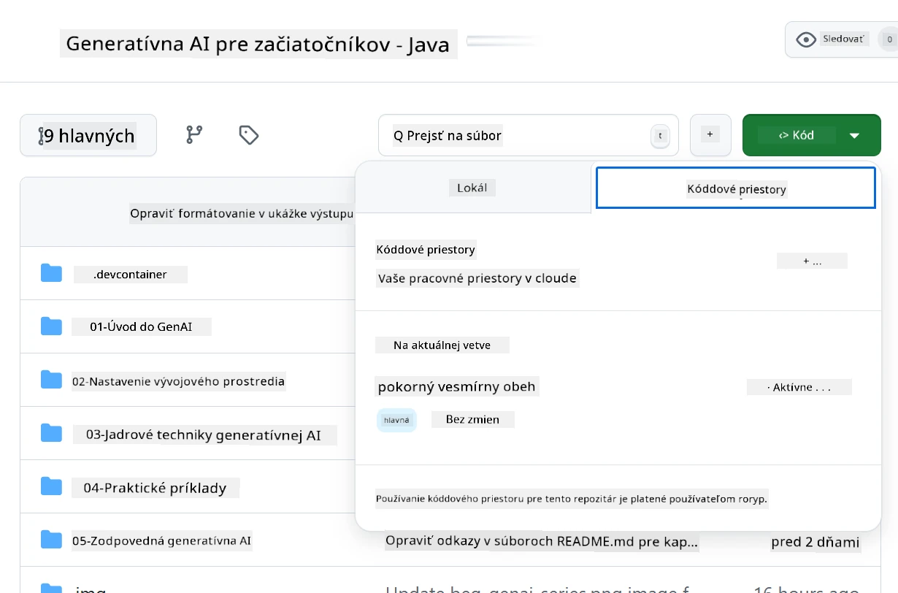
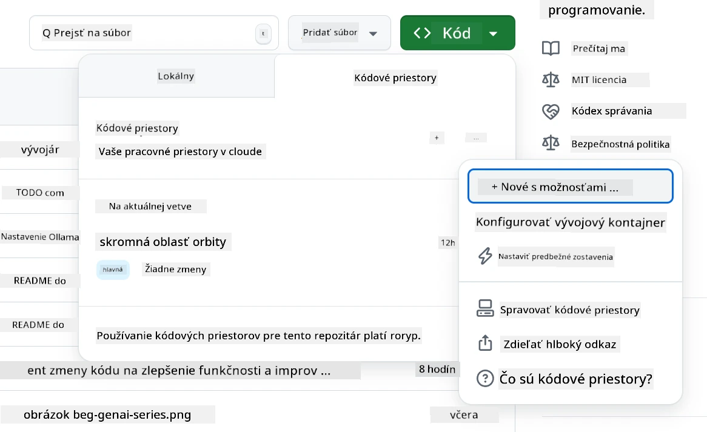
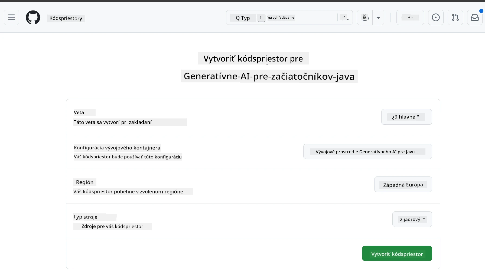
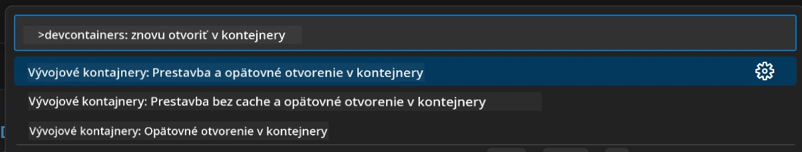
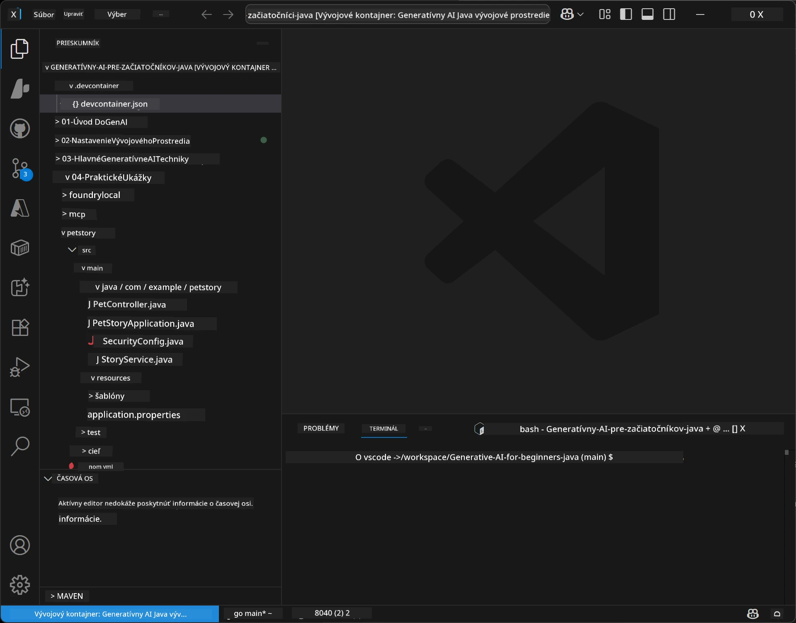
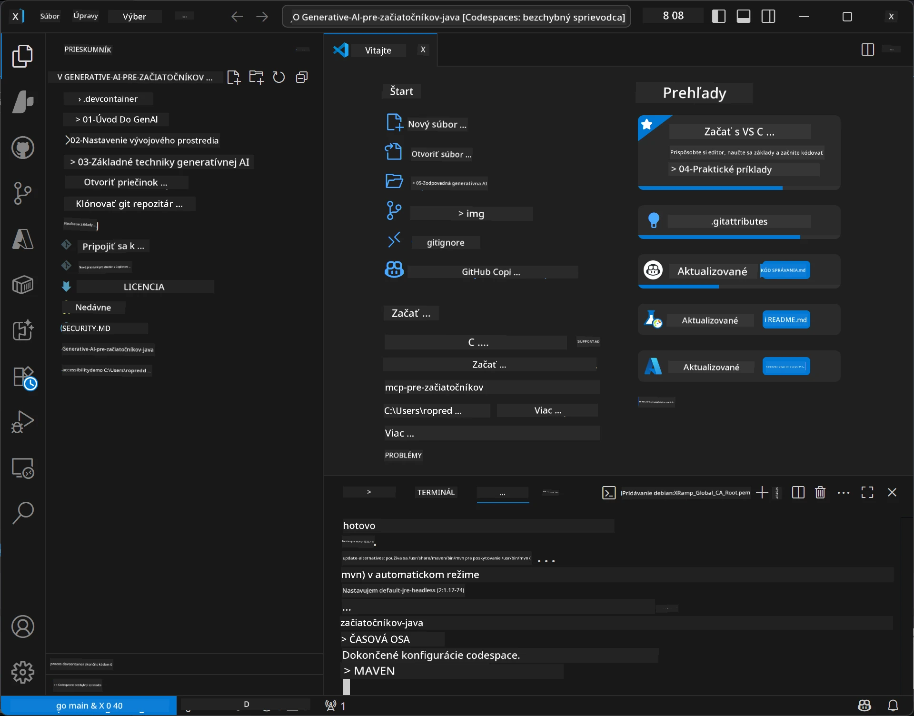

# Nastavenie vývojového prostredia pre Generatívnu AI pre Java

> **Rýchly štart:** Nasmerujte svoje AI modely na **Azure AI Foundry** ako kód pomocou Bicep + `azd` za pár minút — pozrite si [Sprievodcu nastavením Azure AI Foundry](getting-started-azure-openai.md). Autentifikácia je **bez kľúčov** (Microsoft Entra ID), takže nemusíte spravovať žiadne API kľúče.

## Čo sa naučíte

- Nastaviť vývojové prostredie pre Java pre AI aplikácie
- Vybrať a nakonfigurovať preferované vývojové prostredie (cloud-first s Codespaces, lokálny dev kontajner alebo plná lokálna inštalácia)
- Otestovať nastavenie pripojením k modelu Azure AI Foundry

## Obsah

- [Čo sa naučíte](#čo-sa-naučíte)
- [Úvod](#úvod)
- [Krok 1: Nastavte si vývojové prostredie](#krok-1-nastavte-si-vývojové-prostredie)
  - [Možnosť A: GitHub Codespaces (Odporúčané)](#možnosť-a-github-codespaces-odporúčané)
  - [Možnosť B: Lokálny Dev Containter](#možnosť-b-lokálny-dev-containter)
  - [Možnosť C: Použite existujúcu lokálnu inštaláciu](#možnosť-c-použite-existujúcu-lokálnu-inštaláciu)
- [Krok 2: Nasadenie Azure AI Foundry](#krok-2-nasadenie-azure-ai-foundry)
- [Krok 3: Otestujte svoje nastavenie](#krok-3-otestujte-svoje-nastavenie)
- [Riešenie problémov](#riešenie-problémov)
- [Zhrnutie](#zhrnutie)
- [Ďalšie kroky](#ďalšie-kroky)

## Úvod

Táto kapitola vás prevedie nastavením vývojového prostredia. Počas celého kurzu budeme používať **Azure AI Foundry** pre modely. Modely nasadíte ako kód pomocou Bicep a Azure Developer CLI (`azd`), potom sa pripojíte pomocou **autentifikácie bez kľúčov** (Microsoft Entra ID) — bez kopírovania alebo úniku API kľúčov.

**Nie je potrebné žiadne lokálne nastavenie!** Môžete použiť GitHub Codespaces, ktorý poskytuje plné vývojové prostredie priamo v prehliadači a odtiaľ nasadiť Foundry.

Používame **Azure AI Foundry** pre tento kurz, pretože je:
- **Nasadené ako kód** — jeden príkaz `azd up` nasadí účet a modely
- **Bez kľúča** — prihlásenie cez Azure účet alebo spravovanú identitu
- **Pripravené na produkciu** — ten istý kód beží lokálne aj v Azure
- **Flexibilné** — modely vymeníte zmenou názvu nasadenia, nie kódu

> **Poznámka**: Nasadenia Azure AI Foundry sa účtujú podľa tokenu (pay-as-you-go). Viac o nasadení, regiónoch a nákladoch nájdete v [sprievodcovi nastavením Azure AI Foundry](getting-started-azure-openai.md).


## Krok 1: Nastavte si vývojové prostredie

<a name="quick-start-cloud"></a>

Vytvorili sme prednastavený vývojový kontajner, aby ste minimalizovali čas nastavenia a mali všetky potrebné nástroje pre kurz Generatívnej AI pre Javu. Vyberte si preferovaný prístup k vývoju:

### Možnosti nastavenia prostredia:

#### Možnosť A: GitHub Codespaces (Odporúčané)

**Začnite kódovať za 2 minúty - bez lokálneho nastavenia!**

1. Forknite si tento repozitár do svojho účtu GitHub
   > **Poznámka**: Ak chcete upraviť základnú konfiguráciu, pozrite sa na [Konfiguráciu Dev Containera](../../../.devcontainer/devcontainer.json)
2. Kliknite na **Code** → záložka **Codespaces** → **...** → **New with options...**
3. Použite prednastavené hodnoty – vyberie sa **Dev container configuration**: **Generative AI Java Development Environment** špeciálny devcontainer vytvorený pre tento kurz
4. Kliknite na **Create codespace**
5. Počkajte približne 2 minúty, kým bude prostredie pripravené
6. Pokračujte na [Krok 2: Nasadenie Azure AI Foundry](#krok-2-nasadenie-azure-ai-foundry)








> **Výhody Codespaces**:
> - Nie je potrebná lokálna inštalácia
> - Funguje na akomkoľvek zariadení s prehliadačom
> - Predkonfigurované so všetkými nástrojmi a závislosťami
> - Zadarmo 60 hodín mesačne pre osobné účty
> - Konzistentné prostredie pre všetkých študentov

#### Možnosť B: Lokálny Dev Containter

**Pre vývojárov, ktorí uprednostňujú lokálny vývoj s Dockerom**

1. Forknite a sklonujte tento repozitár do svojho počítača
   > **Poznámka**: Ak chcete upraviť základnú konfiguráciu, pozrite sa na [Konfiguráciu Dev Containera](../../../.devcontainer/devcontainer.json)
2. Nainštalujte [Docker Desktop](https://www.docker.com/products/docker-desktop/) a [VS Code](https://code.visualstudio.com/)
3. Nainštalujte [rozšírenie Dev Containers](https://marketplace.visualstudio.com/items?itemName=ms-vscode-remote.remote-containers) vo VS Code
4. Otvorte repozitár vo VS Code
5. Keď vás systém vyzve, kliknite na **Reopen in Container** (alebo použite `Ctrl+Shift+P` → "Dev Containers: Reopen in Container")
6. Počkajte, kým sa kontajner vytvorí a spustí
7. Pokračujte na [Krok 2: Nasadenie Azure AI Foundry](#krok-2-nasadenie-azure-ai-foundry)





#### Možnosť C: Použite existujúcu lokálnu inštaláciu

**Pre vývojárov s existujúcim Java prostredím**

Predpoklady:
- [Java 21+](https://www.oracle.com/java/technologies/javase/jdk21-archive-downloads.html) 
- [Maven 3.9+](https://maven.apache.org/download.cgi)
- [VS Code](https://code.visualstudio.com) alebo vaše preferované IDE

Kroky:
1. Sklonujte tento repozitár do svojho počítača
2. Otvorte projekt vo svojom IDE
3. Pokračujte na [Krok 2: Nasadenie Azure AI Foundry](#krok-2-nasadenie-azure-ai-foundry)

> **Tip od odborníka**: Ak máte slabší počítač, ale chcete VS Code lokálne, použite GitHub Codespaces! Môžete prepojiť lokálne VS Code s cloud-hostovaným Codespace pre to najlepšie z oboch svetov.




## Krok 2: Nasadenie Azure AI Foundry

Nasadte AI modely kurzu do Azure AI Foundry ako kód. V koreňovom adresári repozitára:

```bash
cd 02-SetupDevEnvironment
azd auth login
az login
azd up
```

`azd` vás vyzve na zadanie názvu prostredia, predplatného a regiónu, nasadí účet Azure AI Foundry s modelmi `gpt-5.6-luna` a `text-embedding-3-small` a zapíše koncový bod do `.env` súboru príkladu - to všetko s **autentifikáciou bez kľúčov** (žiadne API kľúče).

> **Kompletný návod:** Pozrite si [Sprievodcu nastavením Azure AI Foundry](getting-started-azure-openai.md) pre predpoklady, manuálnu (portálovú) alternatívu, výber regiónu a poznámky o nákladoch/čistení.

## Krok 3: Otestujte svoje nastavenie

Po nasadení Foundry modelov otestujte pripojenie pomocou ukážkovej aplikácie v [`02-SetupDevEnvironment/examples/basic-chat-azure`](../../../02-SetupDevEnvironment/examples/basic-chat-azure).

1. Otvorte terminál vo svojom vývojovom prostredí.
2. Prejdite do ukážky:
   ```bash
   cd 02-SetupDevEnvironment/examples/basic-chat-azure
   ```
3. Uistite sa, že ste prihlásený (autentifikácia bez kľúčov vyžaduje token):
   ```bash
   az login
   ```
   > Ak ste spustili `azd up`, `.env` súbor s vaším koncovým bodom už bol zapísaný za vás.
4. Spustite aplikáciu:
   ```bash
   mvn clean spring-boot:run
   ```

Mali by ste vidieť odpoveď od modelu `gpt-5.6-luna`.

### Pochopenie ukážkového kódu

[Ukážka basic-chat](./examples/basic-chat-azure/README.md) používa **Spring Boot 4.1.1** a **Spring AI 2.0.1**. `ChatClient` zo Spring AI využíva oficiálny OpenAI Java SDK, ktorý sa pripája ku koncovému bodu Azure OpenAI **v1** s autentifikáciou bez kľúčov.

**Čo tento kód robí:**
- **Pripája sa** k Azure AI Foundry pomocou vášho Azure prihlásenia (Microsoft Entra ID) — bez API kľúča
- **Odosiela** prompt modelu `gpt-5.6-luna`
- **Prijíma** a zobrazuje odpoveď AI
- **Overuje** správnosť nastavenia

**Kľúčové závislosti** (výpis z [pom.xml](../../../02-SetupDevEnvironment/examples/basic-chat-azure/pom.xml)):
```xml
<dependency>
    <groupId>org.springframework.ai</groupId>
    <artifactId>spring-ai-starter-model-openai</artifactId>
</dependency>
<dependency>
    <groupId>com.openai</groupId>
    <artifactId>openai-java</artifactId>
</dependency>
<dependency>
    <groupId>com.azure</groupId>
    <artifactId>azure-identity</artifactId>
    <version>${azure-identity.version}</version>
</dependency>
```

POM spravuje OpenAI Java **4.63.1** a explicitne nastavuje Azure Identity **1.18.6**. Spring AI 2 odstránil Azure špecifický starter; Azure Identity je stále potrebná pre credential bean.

**Konfigurácia** ([application.yml](../../../02-SetupDevEnvironment/examples/basic-chat-azure/src/main/resources/application.yml)):
```yaml
spring:
  ai:
    openai:
      base-url: ${AZURE_OPENAI_ENDPOINT}
      microsoft-foundry: true
      chat:
        model: ${AZURE_OPENAI_DEPLOYMENT:gpt-5.6-luna}
        reasoning-effort: none
        max-completion-tokens: 500
```

Autentifikácia bez kľúča je explicitne nakonfigurovaná v [BasicChatApplication.java](../../../02-SetupDevEnvironment/examples/basic-chat-azure/src/main/java/com/example/BasicChatApplication.java), nie odvodzovaná z neexistujúceho API kľúča. Credential použije `DefaultAzureCredential` so scope `https://ai.azure.com/.default` a `OpenAIClient` cieli na `/openai/v1`. Aplikácia poskytuje tento klient spring AI chat modelu, takže globálny `OPENAI_API_KEY` nemôže prekryť autentifikáciu Azure.

Nastavenia chatu sú priamo pod `spring.ai.openai.chat`, bez bloku `options`. Lekcia zachováva Chat Completions s `reasoning-effort: none` a maximálnym počtom 500 tokenov; `temperature` ani `max-tokens` sa nenastavujú. Pozrite si [referenciu konfigurácie príkladu](./examples/basic-chat-azure/README.md#spring-configuration) pre výber API a pokyny pre volanie nástrojov.

## Zhrnutie

Po dokončení vyššie uvedených krokov budete mať:

- Nasadené Azure AI Foundry modely ako kód pomocou Bicep + `azd`
- Bežiace Java vývojové prostredie (či už Codespaces, dev containery alebo lokálne)
- Pripojené k Azure AI Foundry s autentifikáciou bez kľúčov (Microsoft Entra ID) — žiadne API kľúče
- Otestované, že všetko funguje pomocou jednoduchej ukážky komunikujúcej s modelom

## Ďalšie kroky

[Kapitola 3: Základné techniky generatívnej AI](../03-CoreGenerativeAITechniques/README.md)

## Riešenie problémov

Máte problém? Tu sú najčastejšie problémy a riešenia:

- **Autentifikácia neúspešná (401/403)?** 
  - Spustite `az login` — autentifikácia je bez kľúčov, musíte byť prihlásený
  - Overte, že váš účet má rolu **Cognitive Services OpenAI User** na zdroji
  - Ak ste práve nasadili, počkajte chvíľu, kým sa rozšíri priradenie role

- **Maven nenájdený?** 
  - Ak používate dev containery/Codespaces, Maven by mal byť predinštalovaný
  - Pri lokálnom nastavení sa uistite, že máte Java 21+ a Maven 3.9+
  - Skúste `mvn --version` pre overenie inštalácie

- **`azd` nenájdený alebo nasadenie zlyháva?** 
  - Nainštalujte [Azure Developer CLI](https://aka.ms/azure-dev/install) a spustite `azd auth login`
  - Vyberte región, kde sú dostupné `gpt-5.6-luna` a `text-embedding-3-small` (napr. `eastus2`), s dostatočnou kvótou v predplatnom
  - Pozrite si [sprievodcu nastavením Azure AI Foundry](getting-started-azure-openai.md) pre detaily

- **Dev container sa nespúšťa?** 
  - Uistite sa, že Docker Desktop beží (pri lokálnom vývoji)
  - Skúste znovu zostaviť kontajner: `Ctrl+Shift+P` → "Dev Containers: Rebuild Container"

- **Chyby pri kompilácii aplikácie?**
  - Uistite sa, že ste v správnom adresári: `02-SetupDevEnvironment/examples/basic-chat-azure`
  - Skúste vyčistiť a znovu zostaviť: `mvn clean compile`

> **Potrebujete pomoc?**: Stále máte problémy? Vytvorte issue v repozitári a radi vám pomôžeme.

---

<!-- CO-OP TRANSLATOR DISCLAIMER START -->
**Vyhlásenie o zodpovednosti**:
Tento dokument bol preložený pomocou AI prekladateľskej služby [Co-op Translator](https://github.com/Azure/co-op-translator). Hoci sa snažíme o presnosť, vezmite prosím na vedomie, že automatické preklady môžu obsahovať chyby alebo nepresnosti. Pôvodný dokument v jeho natívnom jazyku by mal byť považovaný za autoritatívny zdroj. Pre kritické informácie sa odporúča profesionálny ľudský preklad. Nie sme zodpovední za žiadne nedorozumenia alebo nesprávne interpretácie vyplývajúce z použitia tohto prekladu.
<!-- CO-OP TRANSLATOR DISCLAIMER END -->