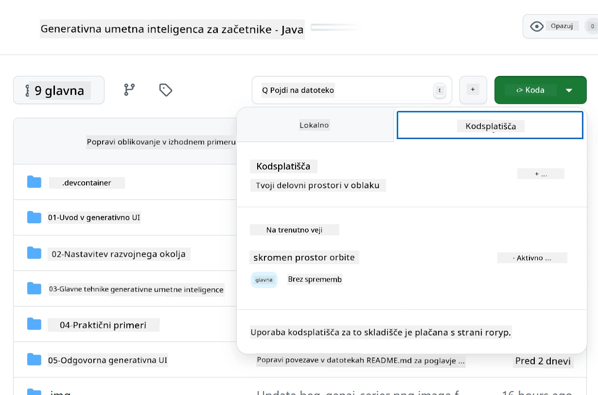
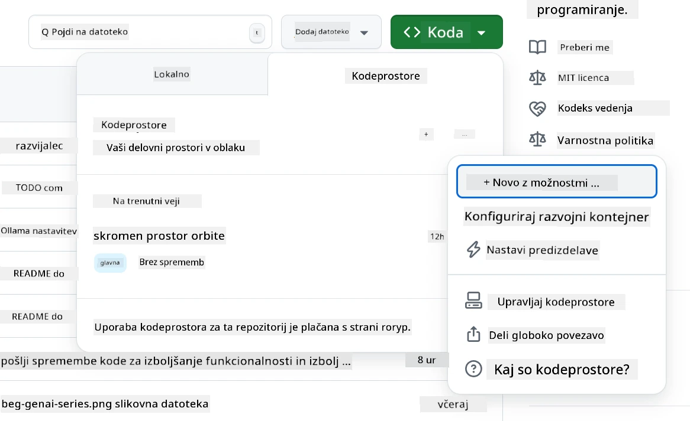
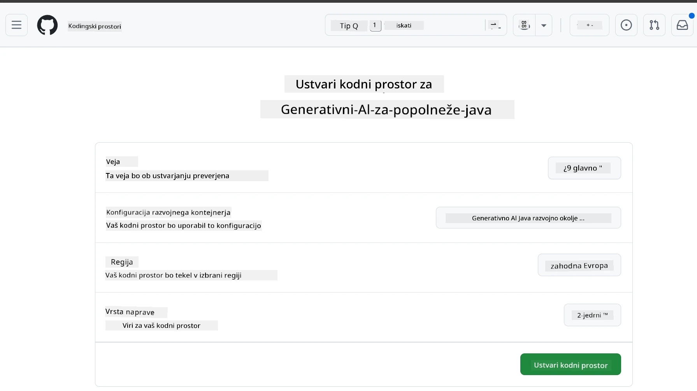
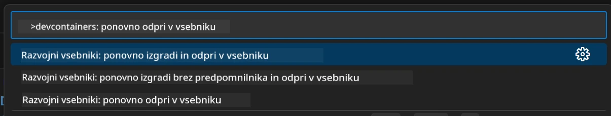
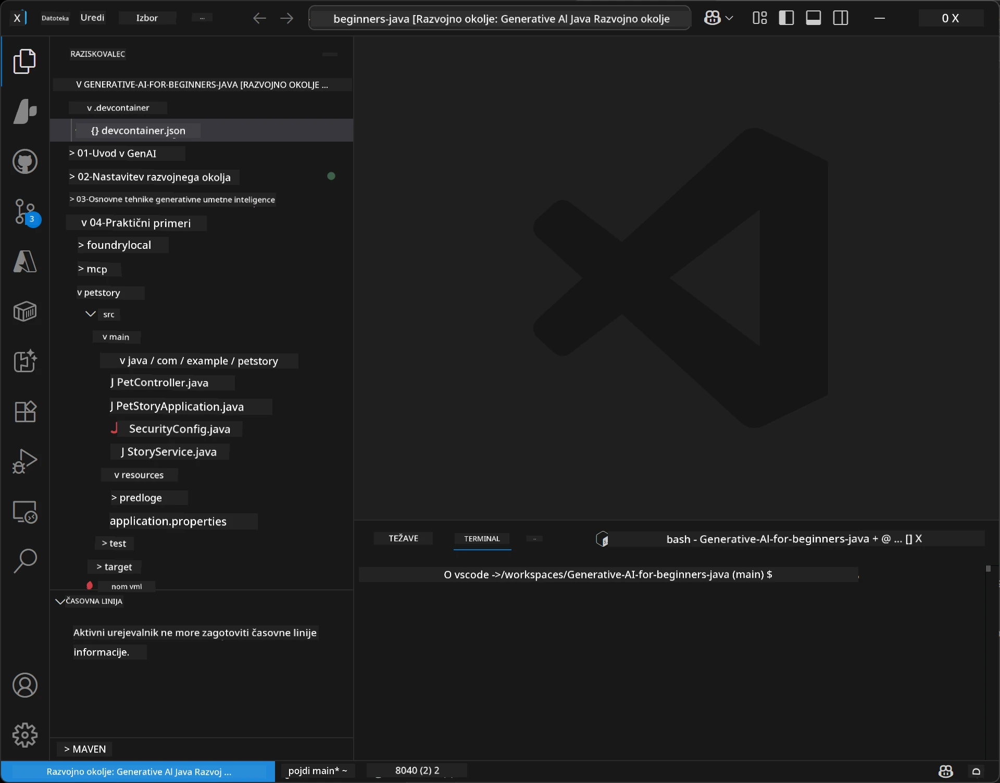
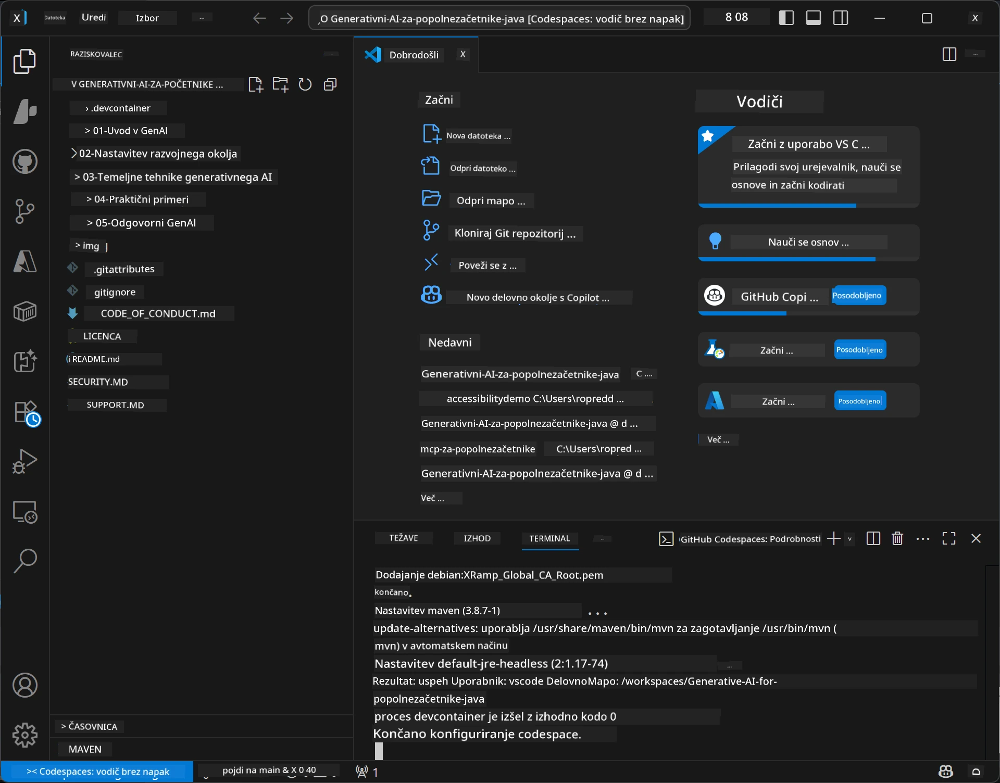

# Nastavitev razvojnega okolja za Generativno AI za Java

> **Hiter začetek:** Zagotovite svoje AI modele na **Azure AI Foundry** kot kodo z Bicepom + `azd` v nekaj minutah — oglejte si [Vodnik za nastavitev Azure AI Foundry](getting-started-azure-openai.md). Avtentikacija je **brez ključev** (Microsoft Entra ID), zato ni treba upravljati API ključev.

## Kaj se boste naučili

- Nastaviti razvojno okolje za Java za AI aplikacije
- Izbrati in konfigurirati svoje priljubljeno razvojno okolje (prednostno oblak z Codespaces, lokalni razvojni zabojnik ali popolna lokalna nastavitev)
- Preizkusiti svojo nastavitev z povezovanjem na model Azure AI Foundry

## Kazalo vsebine

- [Kaj se boste naučili](#kaj-se-boste-naučili)
- [Uvod](#uvod)
- [Korak 1: Nastavite razvojno okolje](#korak-1-nastavite-svojo-razvojno-okolje)
  - [Opcija A: GitHub Codespaces (Priporočeno)](#opcija-a-github-codespaces-priporočeno)
  - [Opcija B: Lokalni razvojni zabojnik](#opcija-b-lokalni-razvojni-zabojnik)
  - [Opcija C: Uporabite svojo obstoječo lokalno namestitev](#opcija-c-uporabite-svojo-obstoječo-lokalno-namestitev)
- [Korak 2: Zagotovite Azure AI Foundry](#korak-2-zagotovite-azure-ai-foundry)
- [Korak 3: Preizkusite svojo nastavitev](#korak-3-preizkusite-svojo-nastavitev)
- [Reševanje težav](#reševanje-težav)
- [Povzetek](#povzetek)
- [Naslednji koraki](#naslednji-koraki)

## Uvod

Ta poglavje vas bo vodilo skozi nastavitev razvojnega okolja. Za modele bomo skozi tečaj uporabljali **Azure AI Foundry**. Modele zagotovite kot kodo z Bicepom in Azure Developer CLI (`azd`), nato pa se povežite z **brezključnim preverjanjem pristnosti** (Microsoft Entra ID) — ni treba kopirati ali razkriti API ključev.

**Lokalna nastavitev ni potrebna!** Uporabite lahko GitHub Codespaces, ki zagotavlja polno razvojno okolje v vašem brskalniku, in od tam zagotovite Foundry.

Za ta tečaj uporabljamo **Azure AI Foundry**, ker je:
- **Zagotovljen kot koda** — en ukaz `azd up` implementira račun in modele
- **Brezključen** — preverjanje pristnosti preko vašega Azure prijavnega računa ali upravljane identitete
- **Pripravljen za produkcijo** — ista koda teče lokalno in v Azure
- **Fleksibilen** — zamenjajte modele z menjavo imena implementacije, ne kode

> **Opomba**: Azure AI Foundry implementacije se obračunavajo na osnovi porabljenih žetonov (plačaš po uporabi). Za podrobnosti o zagotavljanju, regijah in stroških si oglejte [vodnik za nastavitev Azure AI Foundry](getting-started-azure-openai.md).


## Korak 1: Nastavite svojo razvojno okolje

<a name="quick-start-cloud"></a>

Ustvarili smo vnaprej konfiguriran razvojni zabojnik, da zmanjšamo čas nastavitve in zagotovimo vse potrebne pripomočke za ta tečaj Generativne AI za Javo. Izberite svoj najljubši način razvoja:

### Možnosti nastavitve okolja:

#### Opcija A: GitHub Codespaces (Priporočeno)

**Začnite s kodiranjem v 2 minutah - lokalna nastavitev ni potrebna!**

1. Razvezi ta repozitorij na svoj GitHub račun
   > **Opomba**: Če želite urediti osnovno konfiguracijo, si oglejte [Konfiguracijo razvojnega zabojnika](../../../.devcontainer/devcontainer.json)
2. Kliknite **Code** → zavihek **Codespaces** → **...** → **New with options...**
3. Uporabite privzete nastavitve – to bo izbralo **konfiguracijo razvojnega zabojnika**: **Generative AI Java Development Environment** prilagojeni devcontainer za ta tečaj
4. Kliknite **Create codespace**
5. Počakajte približno 2 minuti, da bo okolje pripravljeno
6. Nadaljujte na [Korak 2: Zagotovite Azure AI Foundry](#korak-2-zagotovite-azure-ai-foundry)








> **Prednosti Codespaces**:
> - Ni potrebna lokalna namestitev
> - Deluje na katerikoli napravi z brskalnikom
> - Vnaprej konfigurirano z vsemi orodji in odvisnostmi
> - 60 brezplačnih ur na mesec za osebne račune
> - Enotno okolje za vse udeležence

#### Opcija B: Lokalni razvojni zabojnik

**Za razvijalce, ki raje lokalno razvijajo z Dockerjem**

1. Razvezi in kloniraj ta repozitorij na svoj lokalni računalnik
   > **Opomba**: Če želite urediti osnovno konfiguracijo, si oglejte [Konfiguracijo razvojnega zabojnika](../../../.devcontainer/devcontainer.json)
2. Namesti [Docker Desktop](https://www.docker.com/products/docker-desktop/) in [VS Code](https://code.visualstudio.com/)
3. Namesti razširitev [Dev Containers extension](https://marketplace.visualstudio.com/items?itemName=ms-vscode-remote.remote-containers) v VS Code
4. Odpri mapo repozitorija v VS Code
5. Ko te vprašajo, klikni **Reopen in Container** (ali uporabi `Ctrl+Shift+P` → "Dev Containers: Reopen in Container")
6. Počakaj, da se zabojnik zgradi in zažene
7. Nadaljuj na [Korak 2: Zagotovite Azure AI Foundry](#korak-2-zagotovite-azure-ai-foundry)





#### Opcija C: Uporabite svojo obstoječo lokalno namestitev

**Za razvijalce z že obstoječimi Java okolji**

Zahteve:
- [Java 21+](https://www.oracle.com/java/technologies/javase/jdk21-archive-downloads.html) 
- [Maven 3.9+](https://maven.apache.org/download.cgi)
- [VS Code](https://code.visualstudio.com) ali vaš najljubši IDE

Koraki:
1. Klonirajte ta repozitorij na svoj lokalni računalnik
2. Odprite projekt v svojem IDE
3. Nadaljujte na [Korak 2: Zagotovite Azure AI Foundry](#korak-2-zagotovite-azure-ai-foundry)

> **Nasvet**: Če imate računalnik z nizko zmogljivostjo, a želite lokalni VS Code, uporabite GitHub Codespaces! Vaš lokalni VS Code se lahko poveže s Codespace v oblaku za najboljše iz obeh svetov.




## Korak 2: Zagotovite Azure AI Foundry

Implementirajte AI modele tečaja v Azure AI Foundry kot kodo. Iz korena repozitorija:

```bash
cd 02-SetupDevEnvironment
azd auth login
az login
azd up
```

`azd` vas vpraša za ime okolja, naročnino in regijo, zagotovi račun Azure AI Foundry z implmentacijami `gpt-5.6-luna` in `text-embedding-3-small`, ter zapiše končno točko v primer `.env` - vse to z **brezključnim** preverjanjem pristnosti (brez API ključev).

> **Celotna navodila:** Oglejte si [Vodnik za nastavitev Azure AI Foundry](getting-started-azure-openai.md) za zahteve, ročno (portal) alternativo, navodila glede regije in podrobnosti o stroških/čiščenju.

## Korak 3: Preizkusite svojo nastavitev

Ko so vaši Foundry modeli zagotovljeni, preizkusite povezavo z vzorčno aplikacijo v [`02-SetupDevEnvironment/examples/basic-chat-azure`](../../../02-SetupDevEnvironment/examples/basic-chat-azure).

1. Odprite terminal v svojem razvojnem okolju.
2. Pomaknite se do primere:
   ```bash
   cd 02-SetupDevEnvironment/examples/basic-chat-azure
   ```
3. Prepričajte se, da ste prijavljeni (brezključna avtentikacija potrebuje žeton):
   ```bash
   az login
   ```
   > Če ste izvedli `azd up`, je datoteka `.env` z vašo končno točko že bila ustvarjena.
4. Zaženite aplikacijo:
   ```bash
   mvn clean spring-boot:run
   ```

Videli bi morali odziv iz modela `gpt-5.6-luna`.

### Razumevanje vzorčne kode

[Vzorčni primer basic-chat](./examples/basic-chat-azure/README.md) uporablja **Spring Boot 4.1.1** in **Spring AI 2.0.1**. Spring AI-jev `ChatClient` je podprt z uradnim OpenAI Java SDK, ki se povezuje na Azure OpenAI **v1** končno točko z brezključnim preverjanjem pristnosti.

**Kaj ta koda počne:**
- **Poveže** se na Azure AI Foundry z vašo Azure prijavo (Microsoft Entra ID) — brez API ključa
- **Pošlje** poziv modelu `gpt-5.6-luna`
- **Prejme** in prikaže odgovor AI
- **Preveri**, da vaša nastavitev deluje pravilno

**Ključne odvisnosti** (izsek iz [pom.xml](../../../02-SetupDevEnvironment/examples/basic-chat-azure/pom.xml)):
```xml
<dependency>
    <groupId>org.springframework.ai</groupId>
    <artifactId>spring-ai-starter-model-openai</artifactId>
</dependency>
<dependency>
    <groupId>com.openai</groupId>
    <artifactId>openai-java</artifactId>
</dependency>
<dependency>
    <groupId>com.azure</groupId>
    <artifactId>azure-identity</artifactId>
    <version>${azure-identity.version}</version>
</dependency>
```

POM upravlja OpenAI Java **4.63.1** in izrecno določa Azure Identity **1.18.6**. Spring AI 2 je odstranil Azure-specifični starter; Azure Identity je še vedno potrebna za credential bean.

**Konfiguracija** ([application.yml](../../../02-SetupDevEnvironment/examples/basic-chat-azure/src/main/resources/application.yml)):
```yaml
spring:
  ai:
    openai:
      base-url: ${AZURE_OPENAI_ENDPOINT}
      microsoft-foundry: true
      chat:
        model: ${AZURE_OPENAI_DEPLOYMENT:gpt-5.6-luna}
        reasoning-effort: none
        max-completion-tokens: 500
```

Brezključna avtentikacija je izrecno konfigurirana v [BasicChatApplication.java](../../../02-SetupDevEnvironment/examples/basic-chat-azure/src/main/java/com/example/BasicChatApplication.java), ne izpeljana iz odsotnosti API ključa. Njegov bearer credential uporablja `DefaultAzureCredential` s scope `https://ai.azure.com/.default`, njegov `OpenAIClient` cilja na `/openai/v1`. Aplikacija tega klienta predaja Spring AI-jevemu chat modelu, zato globalni `OPENAI_API_KEY` ne more preglasiti Azure avtentikacije.

Nastavitve chata so neposredno pod `spring.ai.openai.chat`, brez bloka `options`. Lekcija ohranja Chat Completion z `reasoning-effort: none` in omejitvijo 500 žetonov; ne nastavlja `temperature` ali `max-tokens`. Oglejte si [referenco konfiguracije primera](./examples/basic-chat-azure/README.md#spring-configuration) za izbiro API in navodila o klicu orodij.

## Povzetek

Po izvedbi zgornjih korakov boste:

- Zagotovili Azure AI Foundry modele kot kodo z Bicepom + `azd`
- Imeli delujoče razvojno okolje Java (bodisi Codespaces, razvojni zabojniki ali lokalno)
- Povezani na Azure AI Foundry z brezključnim preverjanjem pristnosti (Microsoft Entra ID) — brez API ključev
- Preizkusili, da vse deluje z enostavnim primerom, ki komunicira z vašim modelom

## Naslednji koraki

[Poglavje 3: Osnovne tehnike generativne AI](../03-CoreGenerativeAITechniques/README.md)

## Reševanje težav

Imate težave? Tu so pogoste težave in rešitve:

- **Avtentikacija ne uspeva (401/403)?** 
  - Zaženite `az login` — preverjanje pristnosti je brezključeno, zato morate biti prijavljeni
  - Preverite, da ima vaš račun viriinorez **Cognitive Services OpenAI User**
  - Če ste pravkar zagotovili, počakajte minuto, da se dodelitev vloge propagira

- **Maven ni najden?** 
  - Če uporabljate razvojne zabojnike ali Codespaces, naj bi bil Maven že nameščen
  - Za lokalno nastavitev zagotovite Java 21+ in Maven 3.9+ sta nameščena
  - Preizkusite z `mvn --version`, da preverite namestitev

- **`azd` ni najden ali zagotavljanje ne uspeva?** 
  - Namestite [Azure Developer CLI](https://aka.ms/azure-dev/install) in zaženite `azd auth login`
  - Izberite regijo, kjer sta na voljo `gpt-5.6-luna` in `text-embedding-3-small` (npr. `eastus2`), z dovolj kvotami v izbrani naročnini
  - Za podrobnosti glejte [vodnik za nastavitev Azure AI Foundry](getting-started-azure-openai.md)

- **Razvojni zabojnik se ne zaganja?** 
  - Preverite, da je Docker Desktop zagnan (za lokalni razvoj)
  - Poskusite znova zgraditi zabojnik: `Ctrl+Shift+P` → "Dev Containers: Rebuild Container"

- **Napake pri prevajanju aplikacije?**
  - Prepričajte se, da ste v pravilni mapi: `02-SetupDevEnvironment/examples/basic-chat-azure`
  - Poskusite očistiti in ponovno zgraditi: `mvn clean compile`

> **Potrebujete pomoč?** Še vedno imate težave? Odprite težavo v repozitoriju, pomagali vam bomo.

---

<!-- CO-OP TRANSLATOR DISCLAIMER START -->
**Omejitev odgovornosti**:
Ta dokument je bil preveden z uporabo AI prevajalske storitve [Co-op Translator](https://github.com/Azure/co-op-translator). Čeprav si prizadevamo za natančnost, vas prosimo, da upoštevate, da avtomatizirani prevodi lahko vsebujejo napake ali netočnosti. Izvirni dokument v njegovem izvirnem jeziku je treba obravnavati kot avtoritativni vir. Za kritične informacije je priporočljiv strokovni človeški prevod. Ne odgovarjamo za morebitna nesporazume ali napačne interpretacije, ki izhajajo iz uporabe tega prevoda.
<!-- CO-OP TRANSLATOR DISCLAIMER END -->