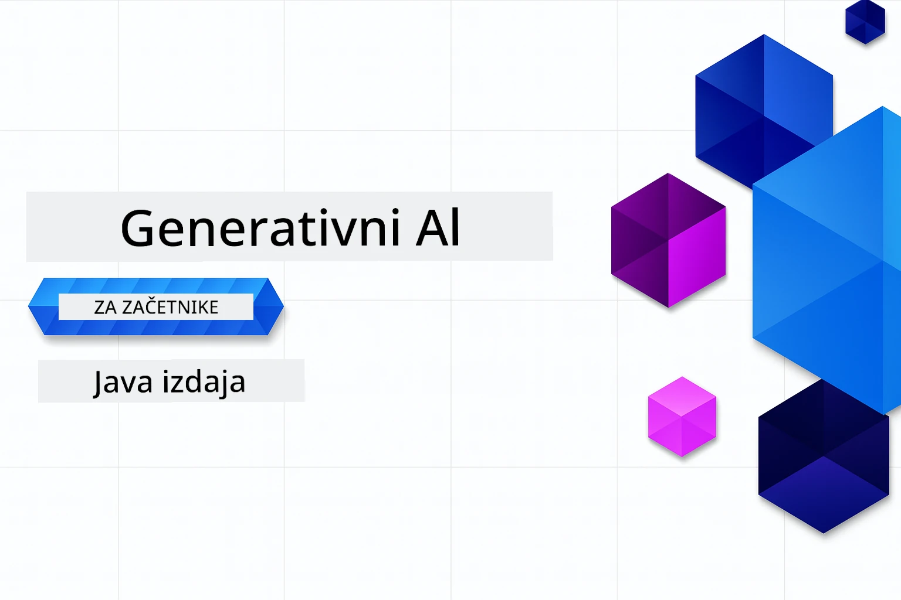

# Generativna AI za začetnike - Java izdaja
[](https://discord.gg/nTYy5BXMWG)



**Časovna zaveza**: Delavnico je mogoče v celoti izvesti na spletu brez lokalne namestitve. Nastavitev okolja traja 2 minuti, raziskovanje primerov pa 1-3 ure, odvisno od globine raziskovanja.

> **Hiter začetek** 

1. Naredite fork tega repozitorija na svoj GitHub račun
2. Kliknite **Code** → zavihek **Codespaces** → **...** → **Novo z možnostmi...**
3. Uporabite privzete nastavitve – to bo izbralo razvojni kontejner, ustvarjen za ta tečaj
4. Kliknite **Ustvari codespace**
5. Počakajte približno 2 minuti, da je okolje pripravljeno
6. Pojdite neposredno na [2. poglavje: Zagotovitev Azure AI Foundry](./02-SetupDevEnvironment/README.md#step-2-provision-azure-ai-foundry)

## Podpora za več jezikov

### Podprto preko GitHub Action (Samodejno in vedno posodobljeno)

<!-- CO-OP TRANSLATOR LANGUAGES TABLE START -->
[Arabščina](../ar/README.md) | [Bengalščina](../bn/README.md) | [Bolgarščina](../bg/README.md) | [Burmanščina (Myanmar)](../my/README.md) | [Kitajščina (poenostavljena)](../zh-CN/README.md) | [Kitajščina (tradicionalna, Hongkong)](../zh-HK/README.md) | [Kitajščina (tradicionalna, Macau)](../zh-MO/README.md) | [Kitajščina (tradicionalna, Tajvan)](../zh-TW/README.md) | [Hrvaščina](../hr/README.md) | [Češčina](../cs/README.md) | [Danščina](../da/README.md) | [Nizozemščina](../nl/README.md) | [Estonščina](../et/README.md) | [Finščina](../fi/README.md) | [Francosščina](../fr/README.md) | [Nemščina](../de/README.md) | [Grščina](../el/README.md) | [Hebrejščina](../he/README.md) | [Hindijščina](../hi/README.md) | [Madžarščina](../hu/README.md) | [Indonezijščina](../id/README.md) | [Italijanščina](../it/README.md) | [Japonščina](../ja/README.md) | [Kannada](../kn/README.md) | [Khmer](../km/README.md) | [Korejščina](../ko/README.md) | [Litovščina](../lt/README.md) | [Malajščina](../ms/README.md) | [Malajalščina](../ml/README.md) | [Marathi](../mr/README.md) | [Nepalščina](../ne/README.md) | [Nigerijski pidgin](../pcm/README.md) | [Norveščina](../no/README.md) | [Perzijščina (Farsi)](../fa/README.md) | [Poljščina](../pl/README.md) | [Portugalska (Brazilija)](../pt-BR/README.md) | [Portugalska (Portugalska)](../pt-PT/README.md) | [Punjabi (Gurmukhi)](../pa/README.md) | [Romunščina](../ro/README.md) | [Ruščina](../ru/README.md) | [Srbski (cirilica)](../sr/README.md) | [Slovaščina](../sk/README.md) | [Slovenščina](./README.md) | [Španščina](../es/README.md) | [Svahili](../sw/README.md) | [Švedščina](../sv/README.md) | [Tagalog (Filipinščina)](../tl/README.md) | [Tamilščina](../ta/README.md) | [Telugujščina](../te/README.md) | [Tajščina](../th/README.md) | [Turščina](../tr/README.md) | [Ukrajinščina](../uk/README.md) | [Urdujščina](../ur/README.md) | [Vietnamščina](../vi/README.md)

> **Raje klonirate lokalno?**
>
> Ta repozitorij vključuje več kot 50 jezikovnih prevodov, kar bistveno poveča velikost prenosa. Za kloniranje brez prevodov uporabite sparse checkout:
>
> **Bash / macOS / Linux:**
> ```bash
> git clone --filter=blob:none --sparse https://github.com/microsoft/Generative-AI-for-beginners-java.git
> cd Generative-AI-for-beginners-java
> git sparse-checkout set --no-cone '/*' '!translations' '!translated_images'
> ```
>
> **CMD (Windows):**
> ```cmd
> git clone --filter=blob:none --sparse https://github.com/microsoft/Generative-AI-for-beginners-java.git
> cd Generative-AI-for-beginners-java
> git sparse-checkout set --no-cone "/*" "!translations" "!translated_images"
> ```
>
> Tako dobite vse, kar potrebujete za dokončanje tečaja s precej hitrejšim prenosom.
<!-- CO-OP TRANSLATOR LANGUAGES TABLE END -->

## Struktura tečaja in učna pot

### **1. poglavje: Uvod v generativno AI**
- **Osnovni pojmi**: Razumevanje velikih jezikovnih modelov, tokenov, vgraditev in zmogljivosti AI
- **Java AI ekosistem**: Pregled Spring AI in OpenAI SDK-jev
- **Protokol konteksta modela**: Uvod v MCP in njegova vloga v komunikaciji AI agentov
- **Praktične uporabe**: Resnični scenariji, vključno s klepetalniki in generiranjem vsebine
- **[→ Začni 1. poglavje](./01-IntroToGenAI/README.md)**

### **2. poglavje: Nastavitev razvojnega okolja**
- **Azure AI Foundry**: Zagotovitev GPT-5.6 Luna klepeta in tekstovno-vgradnih dreves velikosti 3-small z Bicep in Azure Developer CLI (azd)
- **Spring Boot 4.1.1 + Spring AI 2.0.1**: Naučite se z `ChatClient`, podprt s uradnim OpenAI Java SDK-jem in Azure OpenAI v1
- **Avtentikacija brez ključa**: Varnostna povezava z Microsoft Entra ID — brez upravljanja API ključev
- **Razvojna orodja**: Docker kontejnerji, VS Code in konfiguracija GitHub Codespaces
- **[→ Začni 2. poglavje](./02-SetupDevEnvironment/README.md)**

### **3. poglavje: Osnovne tehnike generativne AI**
- **Uradni OpenAI Java SDK**: Neposredni klic Azure OpenAI v1 s ključem brez avtentikacije
- **Inženiring pozivov**: Tehnike za optimalne odzive modelov AI
- **Vgradnje in vektorske operacije**: Uporabite semantično iskanje in ujemanje podobnosti
- **Povečana generacija z iskanjem (RAG)**: Združite AI z vašimi lastnimi podatkovnimi viri
- **Klic funkcij**: Razširite zmogljivosti AI z lastnimi orodji in vtičniki
- **[→ Začni 3. poglavje](./03-CoreGenerativeAITechniques/README.md)**

### **4. poglavje: Praktične uporabe in projekti**
- **Generator zgodb o hišnih ljubljenčkih** (`petstory/`): Ustvarjalno generiranje vsebin z Azure AI Foundry
- **Foundry lokalna demonstracija** (`foundrylocal/`): Lokalna integracija AI modela z OpenAI Java SDK
- **MCP kalkulator** (`calculator/`): Osnovna implementacija Model Context Protocol s Spring AI
- **[→ Začni 4. poglavje](./04-PracticalSamples/README.md)**

### **5. poglavje: Odgovoren razvoj AI**
- **Varnost vsebine v Azure AI Foundry**: Testiranje vgrajenih filtrov in varnostnih mehanizmov (trdi bloki in mehke zavrnitve)
- **Demonstracija odgovorne AI**: Praktičen primer delovanja sodobnih varnostnih sistemov AI
- **Priporočene prakse**: Ključna priporočila za etični razvoj in uvajanje AI
- **[→ Začni 5. poglavje](./05-ResponsibleGenAI/README.md)**

## Dodatni viri

<!-- CO-OP TRANSLATOR OTHER COURSES START -->
### LangChain
[](https://aka.ms/langchain4j-for-beginners)
[](https://aka.ms/langchainjs-for-beginners?WT.mc_id=m365-94501-dwahlin)
[](https://github.com/microsoft/langchain-for-beginners?WT.mc_id=m365-94501-dwahlin)
---

### Azure / Edge / MCP / Agentje
[](https://github.com/microsoft/AZD-for-beginners?WT.mc_id=academic-105485-koreyst)
[](https://github.com/microsoft/edgeai-for-beginners?WT.mc_id=academic-105485-koreyst)
[](https://github.com/microsoft/mcp-for-beginners?WT.mc_id=academic-105485-koreyst)
[](https://github.com/microsoft/ai-agents-for-beginners?WT.mc_id=academic-105485-koreyst)

---
 
### Serija Generativna AI
[](https://github.com/microsoft/generative-ai-for-beginners?WT.mc_id=academic-105485-koreyst)
[-9333EA?style=for-the-badge&labelColor=E5E7EB&color=9333EA)](https://github.com/microsoft/Generative-AI-for-beginners-dotnet?WT.mc_id=academic-105485-koreyst)
[-C084FC?style=for-the-badge&labelColor=E5E7EB&color=C084FC)](https://github.com/microsoft/generative-ai-for-beginners-java?WT.mc_id=academic-105485-koreyst)
[-E879F9?style=for-the-badge&labelColor=E5E7EB&color=E879F9)](https://github.com/microsoft/generative-ai-with-javascript?WT.mc_id=academic-105485-koreyst)

---
 
### Osnovno učenje
[](https://aka.ms/ml-beginners?WT.mc_id=academic-105485-koreyst)
[](https://aka.ms/datascience-beginners?WT.mc_id=academic-105485-koreyst)
[](https://aka.ms/ai-beginners?WT.mc_id=academic-105485-koreyst)
[](https://github.com/microsoft/Security-101?WT.mc_id=academic-96948-sayoung)
[](https://aka.ms/webdev-beginners?WT.mc_id=academic-105485-koreyst)
[](https://aka.ms/iot-beginners?WT.mc_id=academic-105485-koreyst)
[](https://github.com/microsoft/xr-development-for-beginners?WT.mc_id=academic-105485-koreyst)

---
 
### Serija Copilot
[](https://aka.ms/GitHubCopilotAI?WT.mc_id=academic-105485-koreyst)
[](https://github.com/microsoft/mastering-github-copilot-for-dotnet-csharp-developers?WT.mc_id=academic-105485-koreyst)
[](https://github.com/microsoft/CopilotAdventures?WT.mc_id=academic-105485-koreyst)
<!-- CO-OP TRANSLATOR OTHER COURSES END -->

## Pomoč pri težavah

Če naletite na težave ali imate vprašanja o gradnji AI aplikacij, se pridružite drugim učencem in izkušenim razvijalcem v razpravah o MCP. To je podporna skupnost, kjer so vprašanja dobrodošla in kjer se znanje prosto deli.

[](https://discord.gg/nTYy5BXMWG)

Če imate povratne informacije o izdelku ali napake med gradnjo, obiščite:

[](https://aka.ms/foundry/forum)

---

<!-- CO-OP TRANSLATOR DISCLAIMER START -->
**Omejitev odgovornosti**:
Ta dokument je bil preveden z uporabo AI prevajalske storitve [Co-op Translator](https://github.com/Azure/co-op-translator). Čeprav si prizadevamo za natančnost, vas prosimo, da upoštevate, da avtomatizirani prevodi lahko vsebujejo napake ali netočnosti. Izvirni dokument v njegovem izvirnem jeziku je treba obravnavati kot avtoritativni vir. Za kritične informacije je priporočljiv strokovni človeški prevod. Ne odgovarjamo za morebitna nesporazume ali napačne interpretacije, ki izhajajo iz uporabe tega prevoda.
<!-- CO-OP TRANSLATOR DISCLAIMER END -->