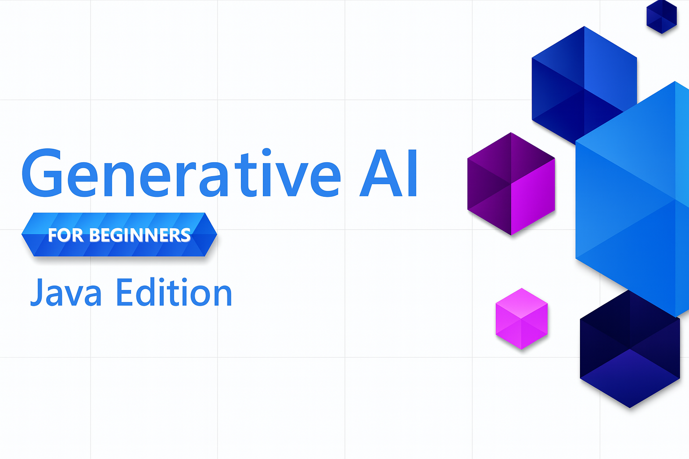

<!--
CO_OP_TRANSLATOR_METADATA:
{
  "original_hash": "a49b35508745c032a0033d914df7901b",
  "translation_date": "2025-07-25T12:21:15+00:00",
  "source_file": "README.md",
  "language_code": "sl"
}
-->
# Generativna umetna inteligenca za začetnike - Java izdaja

**Časovna zaveza**: Celotno delavnico lahko dokončate na spletu brez lokalne namestitve. Če želite zagnati primere, nastavitev okolja traja 2 minuti, raziskovanje primerov pa zahteva 1-3 ure, odvisno od globine raziskovanja.

> **Hiter začetek**

1. Forkajte to repozitorij na svoj GitHub račun
2. Kliknite **Code** → zavihek **Codespaces** → **...** → **New with options...**
3. Uporabite privzete nastavitve – to bo izbralo razvojni kontejner, ustvarjen za ta tečaj
4. Kliknite **Create codespace**
5. Počakajte približno 2 minuti, da bo okolje pripravljeno
6. Takoj začnite z [Ustvarjanjem svojega GitHub Models žetona](./02-SetupDevEnvironment/README.md#step-2-create-a-github-personal-access-token)

## Podpora za več jezikov

### Podprto prek GitHub Action (Avtomatizirano in vedno posodobljeno)

[French](../fr/README.md) | [Spanish](../es/README.md) | [German](../de/README.md) | [Russian](../ru/README.md) | [Arabic](../ar/README.md) | [Persian (Farsi)](../fa/README.md) | [Urdu](../ur/README.md) | [Chinese (Simplified)](../zh/README.md) | [Chinese (Traditional, Macau)](../mo/README.md) | [Chinese (Traditional, Hong Kong)](../hk/README.md) | [Chinese (Traditional, Taiwan)](../tw/README.md) | [Japanese](../ja/README.md) | [Korean](../ko/README.md) | [Hindi](../hi/README.md) | [Bengali](../bn/README.md) | [Marathi](../mr/README.md) | [Nepali](../ne/README.md) | [Punjabi (Gurmukhi)](../pa/README.md) | [Portuguese (Portugal)](../pt/README.md) | [Portuguese (Brazil)](../br/README.md) | [Italian](../it/README.md) | [Polish](../pl/README.md) | [Turkish](../tr/README.md) | [Greek](../el/README.md) | [Thai](../th/README.md) | [Swedish](../sv/README.md) | [Danish](../da/README.md) | [Norwegian](../no/README.md) | [Finnish](../fi/README.md) | [Dutch](../nl/README.md) | [Hebrew](../he/README.md) | [Vietnamese](../vi/README.md) | [Indonesian](../id/README.md) | [Malay](../ms/README.md) | [Tagalog (Filipino)](../tl/README.md) | [Swahili](../sw/README.md) | [Hungarian](../hu/README.md) | [Czech](../cs/README.md) | [Slovak](../sk/README.md) | [Romanian](../ro/README.md) | [Bulgarian](../bg/README.md) | [Serbian (Cyrillic)](../sr/README.md) | [Croatian](../hr/README.md) | [Slovenian](./README.md) | [Ukrainian](../uk/README.md) | [Burmese (Myanmar)](../my/README.md)

## Struktura tečaja in učna pot

### **Poglavje 1: Uvod v generativno umetno inteligenco**
- **Osnovni koncepti**: Razumevanje velikih jezikovnih modelov, tokenov, vektorskih predstavitev in zmogljivosti umetne inteligence
- **Java AI ekosistem**: Pregled Spring AI in OpenAI SDK-jev
- **Protokol konteksta modela**: Uvod v MCP in njegovo vlogo pri komunikaciji AI agentov
- **Praktične aplikacije**: Resnični scenariji, vključno s klepetalniki in generiranjem vsebine
- **[→ Začni poglavje 1](./01-IntroToGenAI/README.md)**

### **Poglavje 2: Nastavitev razvojnega okolja**
- **Konfiguracija več ponudnikov**: Nastavitev GitHub Models, Azure OpenAI in OpenAI Java SDK integracij
- **Spring Boot + Spring AI**: Najboljše prakse za razvoj AI aplikacij v podjetjih
- **GitHub Models**: Brezplačen dostop do AI modelov za prototipiranje in učenje (brez kreditne kartice)
- **Razvojna orodja**: Konfiguracija Docker kontejnerjev, VS Code in GitHub Codespaces
- **[→ Začni poglavje 2](./02-SetupDevEnvironment/README.md)**

### **Poglavje 3: Osnovne tehnike generativne umetne inteligence**
- **Inženiring pozivov**: Tehnike za optimalne odgovore AI modelov
- **Vektorske predstavitve in operacije**: Implementacija semantičnega iskanja in ujemanja podobnosti
- **Generacija z obogatenim iskanjem (RAG)**: Kombinacija AI z lastnimi podatkovnimi viri
- **Klicanje funkcij**: Razširitev zmogljivosti AI z orodji in vtičniki po meri
- **[→ Začni poglavje 3](./03-CoreGenerativeAITechniques/README.md)**

### **Poglavje 4: Praktične aplikacije in projekti**
- **Generator zgodb o hišnih ljubljenčkih** (`petstory/`): Kreativno generiranje vsebine z GitHub Models
- **Foundry lokalna predstavitev** (`foundrylocal/`): Lokalna integracija AI modelov z OpenAI Java SDK
- **MCP kalkulatorska storitev** (`mcp/calculator/`): Osnovna implementacija protokola konteksta modela z Spring AI
- **[→ Začni poglavje 4](./04-PracticalSamples/README.md)**

### **Poglavje 5: Razvoj odgovorne umetne inteligence**
- **Varnost GitHub Models**: Testiranje vgrajenega filtriranja vsebine in varnostnih mehanizmov
- **Predstavitev odgovorne AI**: Praktičen primer, ki prikazuje delovanje varnostnih filtrov AI
- **Najboljše prakse**: Ključne smernice za etični razvoj in uvajanje umetne inteligence
- **[→ Začni poglavje 5](./05-ResponsibleGenAI/README.md)**

## Dodatni viri 

- [AI Agents For Beginners](https://github.com/microsoft/ai-agents-for-beginners)
- [Generative AI for Beginners using .NET](https://github.com/microsoft/Generative-AI-for-beginners-dotnet)
- [Generative AI for Beginners using JavaScript](https://github.com/microsoft/generative-ai-with-javascript)
- [Generative AI for Beginners](https://github.com/microsoft/generative-ai-for-beginners)
- [ML for Beginners](https://aka.ms/ml-beginners)
- [Data Science for Beginners](https://aka.ms/datascience-beginners)
- [AI for Beginners](https://aka.ms/ai-beginners)
- [Cybersecurity for Beginners](https://github.com/microsoft/Security-101)
- [Web Dev for Beginners](https://aka.ms/webdev-beginners)
- [IoT for Beginners](https://aka.ms/iot-beginners)
- [XR Development for Beginners](https://github.com/microsoft/xr-development-for-beginners)
- [Mastering GitHub Copilot for AI Paired Programming](https://aka.ms/GitHubCopilotAI)
- [Mastering GitHub Copilot for C#/.NET Developers](https://github.com/microsoft/mastering-github-copilot-for-dotnet-csharp-developers)
- [Choose Your Own Copilot Adventure](https://github.com/microsoft/CopilotAdventures)
- [RAG Chat App with Azure AI Services](https://github.com/Azure-Samples/azure-search-openai-demo-java)

**Omejitev odgovornosti**:  
Ta dokument je bil preveden z uporabo storitve AI za prevajanje [Co-op Translator](https://github.com/Azure/co-op-translator). Čeprav si prizadevamo za natančnost, vas prosimo, da upoštevate, da lahko avtomatizirani prevodi vsebujejo napake ali netočnosti. Izvirni dokument v njegovem maternem jeziku je treba obravnavati kot avtoritativni vir. Za ključne informacije priporočamo profesionalni človeški prevod. Ne odgovarjamo za morebitna nesporazumevanja ali napačne razlage, ki izhajajo iz uporabe tega prevoda.