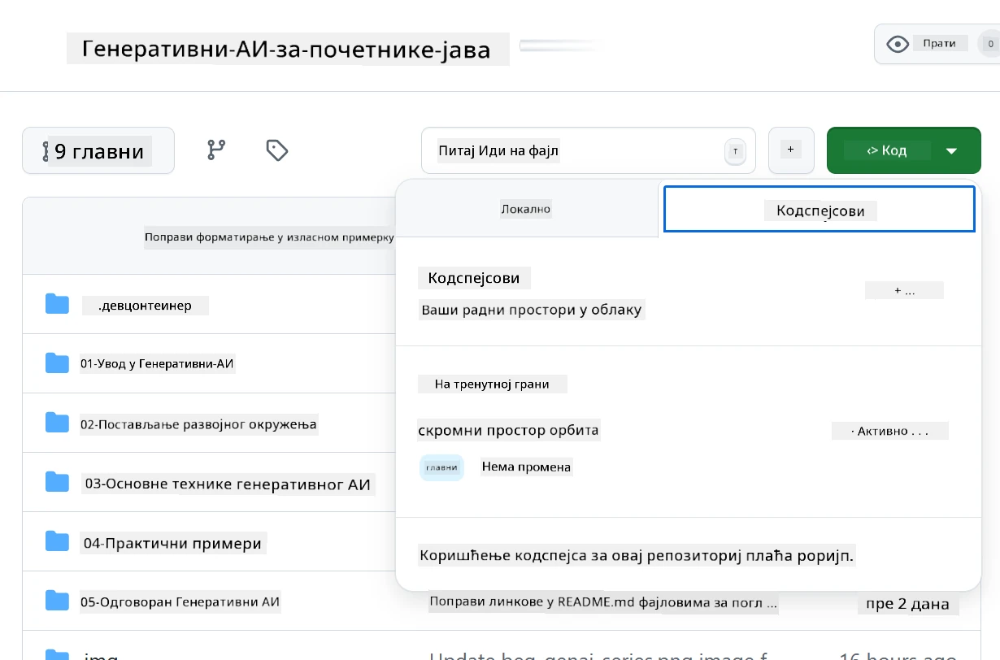
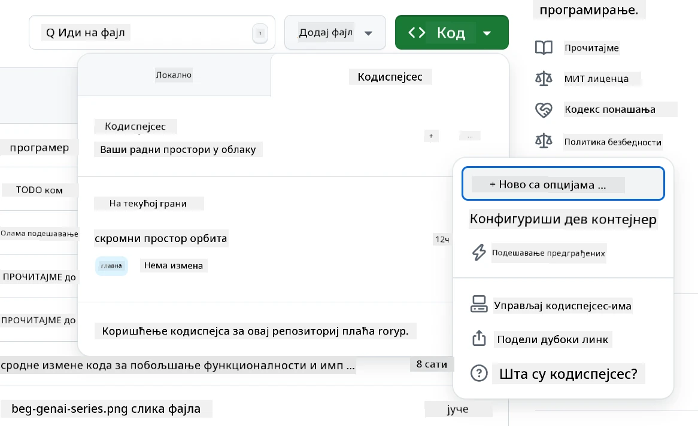
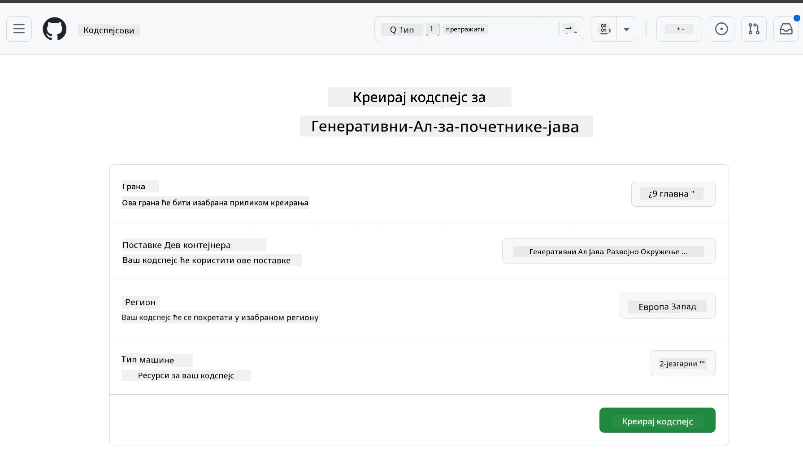
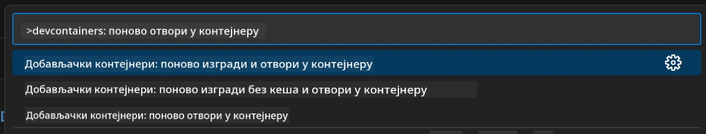
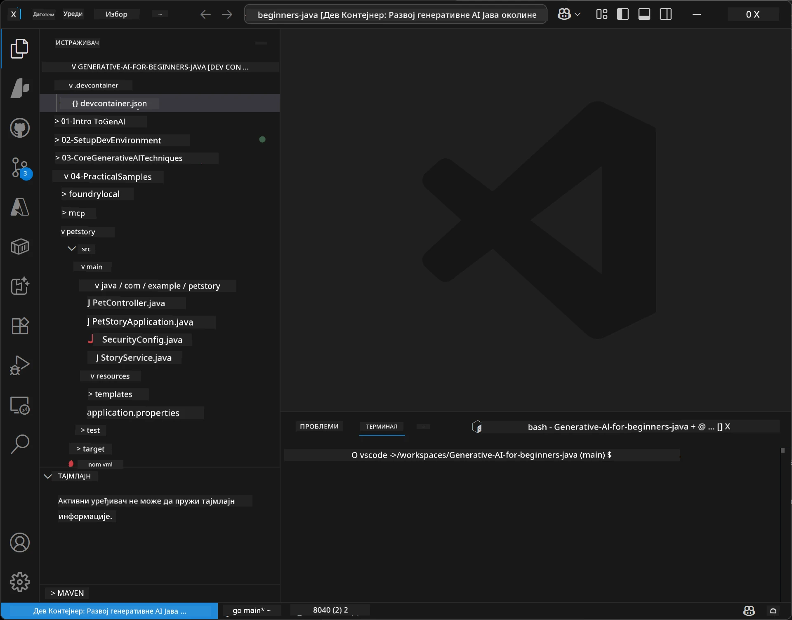
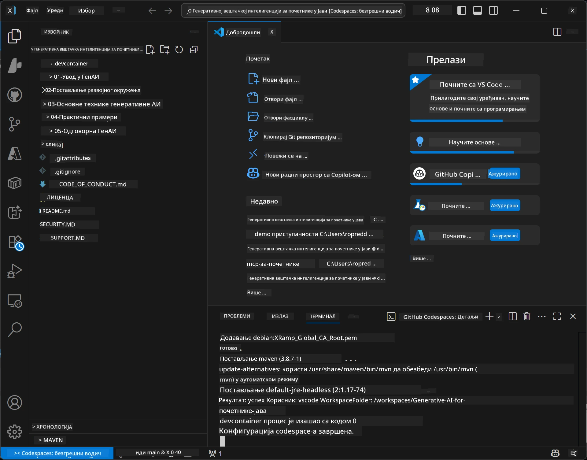

# Подешавање развојног окружења за Генеративни AI за Јаву

> **Брзи почетак:** Поставите своје AI моделе на **Azure AI Foundry** као код помоћу Bicep + `azd` за неколико минута — погледајте [Водич за подешавање Azure AI Foundry](getting-started-azure-openai.md). Аутентификација је **без кључева** (Microsoft Entra ID), тако да нема API кључева које треба управљати.

## Шта ћете научити

- Подесити развојно окружење за Јава апликације са AI
- Изабрати и конфигурисати ваше омиљено развојно окружење (првенствено у облаку са Codespaces, локални дев контејнер или пуна локална поставка)
- Тестирати своје окружење повезивањем на Azure AI Foundry модел

## Садржај

- [Шта ћете научити](#шта-ћете-научити)
- [Увод](#увод)
- [Корак 1: Подесите своје развојно окружење](#корак-1-подесите-своје-развојно-окружење)
  - [Опција А: GitHub Codespaces (Препоручено)](#опција-а-github-codespaces-препоручено)
  - [Опција Б: Локални дев контејнер](#опција-б-локални-дев-контејнер)
  - [Опција Ц: Користите своју постојећу локалну инсталацију](#опција-ц-користите-своју-постојећу-локалну-инсталацију)
- [Корак 2: Постављате Azure AI Foundry](#корак-2-поставите-azure-ai-foundry)
- [Корак 3: Тестирајте своје окружење](#корак-3-тестирајте-своје-окружење)
- [Решавање проблема](#решавање-проблема)
- [Резиме](#резиме)
- [Следећи кораци](#следећи-кораци)

## Увод

Ово поглавље ће вас провести кроз подешавање развојног окружења. Користићемо **Azure AI Foundry** за моделе током целог курса. Постављате моделе као код помоћу Bicep и Azure Developer CLI (`azd`), затим се повезујете са **автентикацијом без кључева** (Microsoft Entra ID) — без копирања или цурења API кључева.

**Није потребна локална инсталација!** Можете користити GitHub Codespaces, који обезбеђује пуну развојну средину у вашем прегледачу, и одатле поставити Foundry.

За овај курс користимо **Azure AI Foundry** јер је:
- **Постављен као код** — један `azd up` деплојује налог и распоређене моделе
- **Без кључева** — аутентификује се вашим Azure пријављивањем или managed identity
- **Спреман за производњу** — исти код ради локално и у Azure-у
- **Флексибилан** — мењајте моделе тако што ћете променити назив делопојбе, а не свој код

> **Напомена**: Azure AI Foundry распоређивање се наплаћује по броју токена (плаћај по коришћењу). Погледајте [водич за подешавање Azure AI Foundry](getting-started-azure-openai.md) за детаље о поставци, регији и трошковима.


## Корак 1: Подесите своје развојно окружење

<a name="quick-start-cloud"></a>

Направили смо предконфигурисани дев контејнер како бисмо смањили време подешавања и обезбедили да имате све потребне алате за овај курс Генеративног AI за Јаву. Изаберите свој омиљени приступ развоју:

### Опције за подешавање окружења:

#### Опција А: GitHub Codespaces (Препоручено)

**Почните са кодирањем за 2 минута - није потребна локална инсталација!**

1. Форкујте овај репозиторијум у свој GitHub налог
   > **Напомена**: Ако желите да измените основну конфигурацију, погледајте [Dev Container Configuration](../../../.devcontainer/devcontainer.json)
2. Кликните на **Code** → таб **Codespaces** → **...** → **New with options...**
3. Користите подразумеване вредности – ово ће изабрати **Dev container configuration**: **Generative AI Java Development Environment** прилагођен девконтејнер креиран за овај курс
4. Кликните **Create codespace**
5. Сачекајте ~2 минута да окружење буде спремно
6. Наставите на [Корак 2: Поставите Azure AI Foundry](#корак-2-поставите-azure-ai-foundry)








> **Предности Codespaces-а**:
> - Није потребна локална инсталација
> - Ради на било ком уређају са прегледачем
> - Предконфигурисан са свим алатима и зависностима
> - Бесплатних 60 сати месечно за личне налоге
> - Конзистентно окружење за све полазнике

#### Опција Б: Локални дев контејнер

**За програмере који више воле локални развој помоћу Докера**

1. Форкујте и клоните овај репозиторијум на свој рачунар
   > **Напомена**: Ако желите да измените основну конфигурацију, погледајте [Dev Container Configuration](../../../.devcontainer/devcontainer.json)
2. Инсталирајте [Docker Desktop](https://www.docker.com/products/docker-desktop/) и [VS Code](https://code.visualstudio.com/)
3. Инсталирајте [Dev Containers extension](https://marketplace.visualstudio.com/items?itemName=ms-vscode-remote.remote-containers) у VS Code
4. Отворите фасциклу репозиторијума у VS Code
5. Када вас пита, кликните на **Reopen in Container** (или користите `Ctrl+Shift+P` → "Dev Containers: Reopen in Container")
6. Сачекајте да се контејнер изгради и покрене
7. Наставите на [Корак 2: Поставите Azure AI Foundry](#корак-2-поставите-azure-ai-foundry)





#### Опција Ц: Користите своју постојећу локалну инсталацију

**За програмере са постојећим Java окружењима**

Претпоставке:
- [Java 21+](https://www.oracle.com/java/technologies/javase/jdk21-archive-downloads.html) 
- [Maven 3.9+](https://maven.apache.org/download.cgi)
- [VS Code](https://code.visualstudio.com) или ваш омиљени IDE

Кораци:
1. Клоните овај репозиторијум на свој рачунар
2. Отворите пројекат у свом IDE-ју
3. Наставите на [Корак 2: Поставите Azure AI Foundry](#корак-2-поставите-azure-ai-foundry)

> **Полезан савет**: Ако имате машину са слабом конфигурацијом, али желите VS Code локално, користите GitHub Codespaces! Можете повезати свој локални VS Code на клауд-хостирани Codespace за најбоље од оба света.




## Корак 2: Поставите Azure AI Foundry

Распоредите AI моделе курса на Azure AI Foundry као код. Из корена репозиторијума:

```bash
cd 02-SetupDevEnvironment
azd auth login
az login
azd up
```

`azd` тражи име окружења, претплату и регион, поставља Azure AI Foundry налог са `gpt-5.6-luna` и `text-embedding-3-small` деплојментима, и уписује тачку краја у `.env` примера — све уз **аутентификацију без кључева** (нема API кључева).

> **Потпуни водич:** Погледајте [Водич за подешавање Azure AI Foundry](getting-started-azure-openai.md) за претпоставке, алтернативу (портал), смернице о регионима и напомене о трошковима/чишћењу.

## Корак 3: Тестирајте своје окружење

Када ваши Foundry модели буду постављени, тестирате везу са пример апликације у [`02-SetupDevEnvironment/examples/basic-chat-azure`](../../../02-SetupDevEnvironment/examples/basic-chat-azure).

1. Отворите терминал у вашем развојном окружењу.
2. Идите до примера:
   ```bash
   cd 02-SetupDevEnvironment/examples/basic-chat-azure
   ```
3. Уверите се да сте пријављени (автентикација без кључева захтева токен):
   ```bash
   az login
   ```
   > Ако сте покренули `azd up`, `.env` фајл са вашем тачком краја је већ написан за вас.
4. Покрените апликацију:
   ```bash
   mvn clean spring-boot:run
   ```

Треба да видите одговор од `gpt-5.6-luna` модела.

### Разумевање пример кода

[Основни-chat пример](./examples/basic-chat-azure/README.md) користи **Spring Boot 4.1.1** и **Spring AI 2.0.1**. Spring AI-јев `ChatClient` се ослања на званични OpenAI Java SDK, повезујући се на Azure OpenAI **v1** тачку краја аутентификацијом без кључева.

**Шта овај код ради:**
- **Повезује се** са Azure AI Foundry користећи ваше Azure пријављивање (Microsoft Entra ID) — без API кључа
- **Слање** упита `gpt-5.6-luna` моделу
- **Прима** и приказује одговор AI
- **Валидација** да ваше окружење ради исправно

**Кључне зависности** (извод из [pom.xml](../../../02-SetupDevEnvironment/examples/basic-chat-azure/pom.xml)):
```xml
<dependency>
    <groupId>org.springframework.ai</groupId>
    <artifactId>spring-ai-starter-model-openai</artifactId>
</dependency>
<dependency>
    <groupId>com.openai</groupId>
    <artifactId>openai-java</artifactId>
</dependency>
<dependency>
    <groupId>com.azure</groupId>
    <artifactId>azure-identity</artifactId>
    <version>${azure-identity.version}</version>
</dependency>
```

POM управља OpenAI Java **4.63.1** и експлицитно поставља Azure Identity **1.18.6**. Spring AI 2 је уклонио Azure-специфичан стартер; Azure Identity је и даље потребан за bean креденцијал.

**Конфигурација** ([application.yml](../../../02-SetupDevEnvironment/examples/basic-chat-azure/src/main/resources/application.yml)):
```yaml
spring:
  ai:
    openai:
      base-url: ${AZURE_OPENAI_ENDPOINT}
      microsoft-foundry: true
      chat:
        model: ${AZURE_OPENAI_DEPLOYMENT:gpt-5.6-luna}
        reasoning-effort: none
        max-completion-tokens: 500
```

Аутентификација без кључева је експлицитно подешена у [BasicChatApplication.java](../../../02-SetupDevEnvironment/examples/basic-chat-azure/src/main/java/com/example/BasicChatApplication.java), не извлачи се из недостатка API кључа. Његов bearer креденцијал користи `DefaultAzureCredential` са опсегом `https://ai.azure.com/.default`, а `OpenAIClient` циља `/openai/v1`. Апликација обезбеђује тог клијента за Spring AI чат модел, тако да глобални `OPENAI_API_KEY` не може променити Azure аутентификацију.

Подешавања за ћаскање су директно испод `spring.ai.openai.chat`, без блока `options`. У лекцији се задржавају Chat Completions са `reasoning-effort: none` и ограничење на 500 токена; није подешена `temperature` или `max-tokens`. Погледајте [референцу конфигурације примера](./examples/basic-chat-azure/README.md#spring-configuration) за избор API и упутства о позиву алата.

## Резиме

Након извршења горе наведених корака, имаћете:

- Постављене Azure AI Foundry моделе као код помоћу Bicep + `azd`
- Покренуто ваше Јава развојно окружење (без обзира да ли је то Codespaces, дев контејнери или локално)
- Повезано са Azure AI Foundry аутентификацијом без кључева (Microsoft Entra ID) — без API кључева
- Тестирано да све ради са једноставним примером који комуницира са вашим моделом

## Следећи кораци

[Поглавље 3: Основне технике генеративног AI](../03-CoreGenerativeAITechniques/README.md)

## Решавање проблема

Имаш проблема? Ово су честе потешкоће и решења:

- **Аутентификација не успева (401/403)?** 
  - Покрени `az login` — аутентикација је без кључева, па мораш бити пријављен
  - Потврди да твој налог има улогу **Cognitive Services OpenAI User** на ресурсу
  - Ако си тек поставио, сачекај минут да се улога прошири

- **Maven се не налази?** 
  - Ако користиш дев контејнере/Codespaces, Maven треба да је већ инсталиран
  - За локалну поставку, осигурај да су Java 21+ и Maven 3.9+ инсталирани
  - Покушај `mvn --version` да провириш инсталацију

- **`azd` није пронађен или поставка не успева?** 
  - Инсталирај [Azure Developer CLI](https://aka.ms/azure-dev/install) и покрени `azd auth login`
  - Изабери регион где су доступни `gpt-5.6-luna` и `text-embedding-3-small` (нпр. `eastus2`), са довољном квотом у твојој претплати
  - Погледај [водич за подешавање Azure AI Foundry](getting-started-azure-openai.md) за детаље

- **Дев контејнер не почиње?** 
  - Осигурај да Docker Desktop ради (за локални развој)
  - Покушај поново да изградиш контејнер: `Ctrl+Shift+P` → "Dev Containers: Rebuild Container"

- **Грешке при компилацији апликације?**
  - Увери се да си у исправном директоријуму: `02-SetupDevEnvironment/examples/basic-chat-azure`
  - Покушај да очистиш и изградиш поново: `mvn clean compile`

> **Треба помоћ?**: Још увек имаш проблема? Отвори issue у репозиторијуму и помоћи ћемо ти.

---

<!-- CO-OP TRANSLATOR DISCLAIMER START -->
**Изјава о одрицању одговорности**:
Овај документ је преведен коришћењем услуге за аутоматски превод [Co-op Translator](https://github.com/Azure/co-op-translator). Иако тежимо тачности, имајте у виду да аутоматски преводи могу садржати грешке или нетачности. Оригинални документ на његовом изворном језику треба сматрати ауторитативним извором. За критичне информације препоручује се професионални људски превод. Нисмо одговорни за било каква неспоразума или погрешна тумачења која произилазе из коришћења овог превода.
<!-- CO-OP TRANSLATOR DISCLAIMER END -->