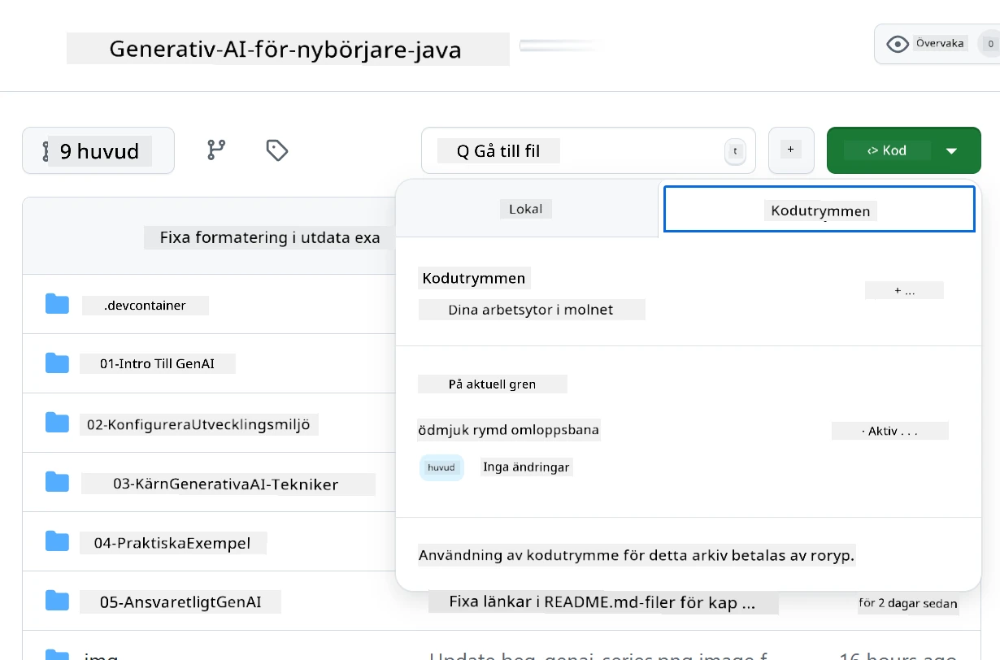
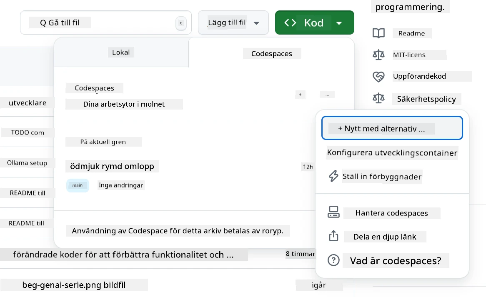
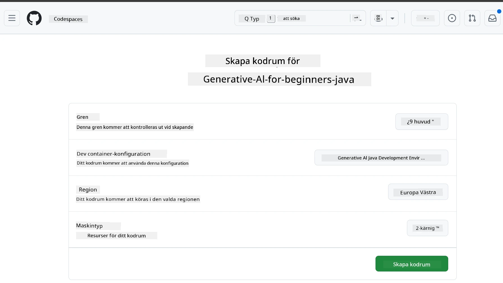
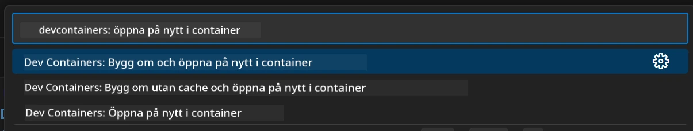
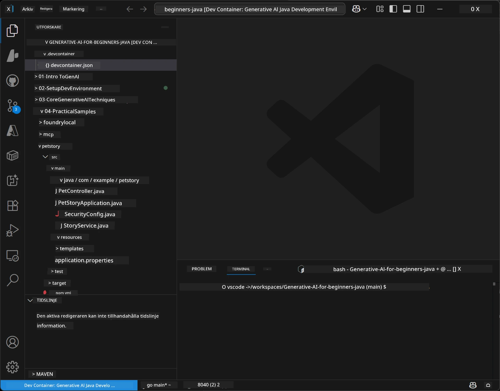
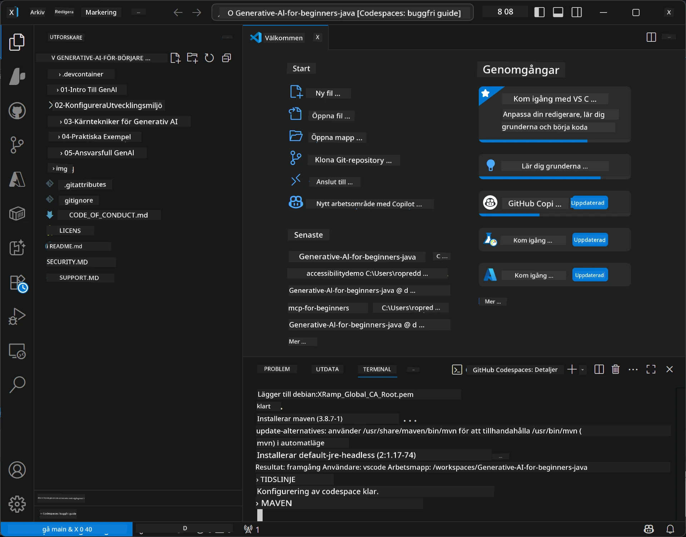

# Ställa in utvecklingsmiljön för Generativ AI för Java

> **Snabbstart:** Provisionera dina AI-modeller på **Azure AI Foundry** som kod med Bicep + `azd` på några minuter — se [Azure AI Foundry Setup Guide](getting-started-azure-openai.md). Autentisering är **nyckellös** (Microsoft Entra ID), så det finns inga API-nycklar att hantera.

## Vad du kommer att lära dig

- Ställ in en Java-utvecklingsmiljö för AI-applikationer
- Välj och konfigurera din föredragna utvecklingsmiljö (molnbaserad med Codespaces, lokal utvecklingscontainer eller fullständig lokal installation)
- Testa din installation genom att ansluta till en modell i Azure AI Foundry

## Innehållsförteckning

- [Vad du kommer att lära dig](#vad-du-kommer-att-lära-dig)
- [Introduktion](#introduktion)
- [Steg 1: Ställ in din utvecklingsmiljö](#steg-1-ställ-in-din-utvecklingsmiljö)
  - [Alternativ A: GitHub Codespaces (Rekommenderat)](#alternativ-a-github-codespaces-rekommenderat)
  - [Alternativ B: Lokal utvecklingscontainer](#alternativ-b-lokal-utvecklingscontainer)
  - [Alternativ C: Använd din befintliga lokala installation](#alternativ-c-använd-din-befintliga-lokala-installation)
- [Steg 2: Provisionera Azure AI Foundry](#steg-2-provisionera-azure-ai-foundry)
- [Steg 3: Testa din installation](#steg-3-testa-din-installation)
- [Felsökning](#felsökning)
- [Sammanfattning](#sammanfattning)
- [Nästa steg](#nästa-steg)

## Introduktion

Detta kapitel guide dig genom att ställa in en utvecklingsmiljö. Vi använder **Azure AI Foundry** för modellerna under hela kursen. Du provisionerar modellerna som kod med Bicep och Azure Developer CLI (`azd`), sedan ansluter du med **nyckellös autentisering** (Microsoft Entra ID) — inga API-nycklar behöver kopieras eller riskera att läcka.

**Ingen lokal installation krävs!** Du kan använda GitHub Codespaces, som erbjuder en fullständig utvecklingsmiljö i din webbläsare, och provisionera Foundry därifrån.

Vi använder **Azure AI Foundry** för denna kurs eftersom det är:
- **Provisionerat som kod** — en `azd up` distribuerar konto och modellimplementeringar
- **Nyckellöst** — autentisera med ditt Azure-inlogg eller en hanterad identitet
- **Produktionsklart** — samma kod körs lokalt och i Azure
- **Flexibelt** — byt modeller genom att ändra ett distributionsnamn, inte din kod

> **Notera**: Azure AI Foundry-deployment debiteras per token (betala efter användning). Se [Azure AI Foundry Setup Guide](getting-started-azure-openai.md) för provisioning, region och kostnadsdetaljer.


## Steg 1: Ställ in din utvecklingsmiljö

<a name="quick-start-cloud"></a>

Vi har skapat en förkonfigurerad utvecklingscontainer för att minimera installationstid och säkerställa att du har alla nödvändiga verktyg för denna Generative AI för Java-kurs. Välj din föredragna utvecklingsmetod:

### Alternativ för miljöinstallation:

#### Alternativ A: GitHub Codespaces (Rekommenderat)

**Börja koda på 2 minuter - ingen lokal installation krävs!**

1. Forka detta repo till ditt GitHub-konto
   > **Notera**: Om du vill redigera grundkonfigurationen, ta en titt på [Dev Container Configuration](../../../.devcontainer/devcontainer.json)
2. Klicka **Code** → fliken **Codespaces** → **...** → **New with options...**
3. Använd standardinställningarna – detta väljer **Dev container configuration**: **Generative AI Java Development Environment** specialanpassad devcontainer skapad för denna kurs
4. Klicka på **Create codespace**
5. Vänta cirka 2 minuter tills miljön är klar
6. Gå vidare till [Steg 2: Provisionera Azure AI Foundry](#steg-2-provisionera-azure-ai-foundry)








> **Fördelar med Codespaces**:
> - Ingen lokal installation krävs
> - Fungerar på vilken enhet som helst med en webbläsare
> - Förkonfigurerad med alla verktyg och beroenden
> - Gratis 60 timmar per månad för personliga konto
> - Konsekvent miljö för alla användare

#### Alternativ B: Lokal utvecklingscontainer

**För utvecklare som föredrar lokal utveckling med Docker**

1. Forka och klona detta repo till din lokala dator
   > **Notera**: Om du vill redigera grundkonfigurationen, ta en titt på [Dev Container Configuration](../../../.devcontainer/devcontainer.json)
2. Installera [Docker Desktop](https://www.docker.com/products/docker-desktop/) och [VS Code](https://code.visualstudio.com/)
3. Installera [Dev Containers extension](https://marketplace.visualstudio.com/items?itemName=ms-vscode-remote.remote-containers) i VS Code
4. Öppna repots mapp i VS Code
5. Klicka på uppmaningen **Reopen in Container** (eller använd `Ctrl+Shift+P` → "Dev Containers: Reopen in Container")
6. Vänta tills containern byggs och startar
7. Fortsätt till [Steg 2: Provisionera Azure AI Foundry](#steg-2-provisionera-azure-ai-foundry)





#### Alternativ C: Använd din befintliga lokala installation

**För utvecklare med befintliga Java-miljöer**

Förutsättningar:
- [Java 21+](https://www.oracle.com/java/technologies/javase/jdk21-archive-downloads.html) 
- [Maven 3.9+](https://maven.apache.org/download.cgi)
- [VS Code](https://code.visualstudio.com) eller din föredragna IDE

Steg:
1. Klona detta repo till din lokala dator
2. Öppna projektet i din IDE
3. Fortsätt till [Steg 2: Provisionera Azure AI Foundry](#steg-2-provisionera-azure-ai-foundry)

> **Proffstips**: Om du har en maskin med låg prestanda men vill använda VS Code lokalt, använd GitHub Codespaces! Du kan ansluta din lokala VS Code till en molnhostad Codespace och få det bästa av två världar.




## Steg 2: Provisionera Azure AI Foundry

Distribuera kursens AI-modeller till Azure AI Foundry som kod. Från repoets rotmapp:

```bash
cd 02-SetupDevEnvironment
azd auth login
az login
azd up
```

`azd` frågar efter ett miljönamn, prenumeration och region, provisionerar ett Azure AI Foundry-konto med `gpt-5.6-luna` och `text-embedding-3-small` distributioner, och skriver slutpunkten i exempelns `.env` - allt med **nyckellös** autentisering (inga API-nycklar).

> **Fullständig genomgång:** Se [Azure AI Foundry Setup Guide](getting-started-azure-openai.md) för förutsättningar, ett manuellt (portal) alternativ, regionanvisningar och kostnads-/rensningsinformation.

## Steg 3: Testa din installation

När dina Foundry-modeller är provisionerade, testa anslutningen med exempelappen i [`02-SetupDevEnvironment/examples/basic-chat-azure`](../../../02-SetupDevEnvironment/examples/basic-chat-azure).

1. Öppna terminalen i din utvecklingsmiljö.
2. Navigera till exemplet:
   ```bash
   cd 02-SetupDevEnvironment/examples/basic-chat-azure
   ```
3. Säkerställ att du är inloggad (nyckellös autentisering behöver en token):
   ```bash
   az login
   ```
   > Om du körde `azd up` skrevs `.env`-filen med din slutpunkt redan åt dig.
4. Kör applikationen:
   ```bash
   mvn clean spring-boot:run
   ```

Du borde se ett svar från `gpt-5.6-luna`-modellen.

### Förstå exempelns kod

[basic-chat exemplet](./examples/basic-chat-azure/README.md) använder **Spring Boot 4.1.1** och **Spring AI 2.0.1**. Spring AI:s `ChatClient` bygger på det officiella OpenAI Java SDK, och ansluter till Azure OpenAI **v1**-slutpunkten med nyckellös autentisering.

**Vad denna kod gör:**
- **Ansluter** till Azure AI Foundry med din Azure-inloggning (Microsoft Entra ID) — ingen API-nyckel
- **Skickar** en prompt till `gpt-5.6-luna`-modellen
- **Tar emot** och visar AI:s svar
- **Verifierar** att din installation fungerar korrekt

**Viktiga beroenden** (utdrag från [pom.xml](../../../02-SetupDevEnvironment/examples/basic-chat-azure/pom.xml)):
```xml
<dependency>
    <groupId>org.springframework.ai</groupId>
    <artifactId>spring-ai-starter-model-openai</artifactId>
</dependency>
<dependency>
    <groupId>com.openai</groupId>
    <artifactId>openai-java</artifactId>
</dependency>
<dependency>
    <groupId>com.azure</groupId>
    <artifactId>azure-identity</artifactId>
    <version>${azure-identity.version}</version>
</dependency>
```

POM:en hanterar OpenAI Java **4.63.1** och sätter Azure Identity **1.18.6** explicit. Spring AI 2 tog bort Azure-specifik starter; Azure Identity behövs fortfarande för credential bean.

**Konfiguration** ([application.yml](../../../02-SetupDevEnvironment/examples/basic-chat-azure/src/main/resources/application.yml)):
```yaml
spring:
  ai:
    openai:
      base-url: ${AZURE_OPENAI_ENDPOINT}
      microsoft-foundry: true
      chat:
        model: ${AZURE_OPENAI_DEPLOYMENT:gpt-5.6-luna}
        reasoning-effort: none
        max-completion-tokens: 500
```

Nyckellös autentisering konfigureras explicit i [BasicChatApplication.java](../../../02-SetupDevEnvironment/examples/basic-chat-azure/src/main/java/com/example/BasicChatApplication.java), inte härledd från en frånvarande API-nyckel. Dess bearer credential använder `DefaultAzureCredential` med `https://ai.azure.com/.default` scope, och dess `OpenAIClient` är riktad mot `/openai/v1`. Appen tillhandahåller klienten till Spring AIs chattmodell, så en global `OPENAI_API_KEY` kan inte åsidosätta Azure-autentisering.

Chattinställningar ligger direkt under `spring.ai.openai.chat`, utan en `options`-block. Lektionen behåller Chat Completions med `reasoning-effort: none` och en 500-token gräns; den sätter inte `temperature` eller `max-tokens`. Se [exempelns konfigurationsreferens](./examples/basic-chat-azure/README.md#spring-configuration) för API-val och verktygsanropsanvisningar.

## Sammanfattning

Efter att ha genomfört ovanstående steg kommer du att ha:

- Provisionerat Azure AI Foundry-modeller som kod med Bicep + `azd`
- Fått din Java-utvecklingsmiljö igång (vare sig det är Codespaces, devcontainers eller lokalt)
- Anslutit till Azure AI Foundry med nyckellös autentisering (Microsoft Entra ID) — inga API-nycklar
- Testat att allt fungerar med ett enkelt exempel som pratar med din modell

## Nästa steg

[Kapitel 3: Kärntekniker för Generativ AI](../03-CoreGenerativeAITechniques/README.md)

## Felsökning

Problem? Här är vanliga problem och lösningar:

- **Autentisering misslyckas (401/403)?** 
  - Kör `az login` — autentisering är nyckellös, så du måste vara inloggad
  - Kontrollera att ditt konto har rollen **Cognitive Services OpenAI User** på resursen
  - Om du precis provisionerat, vänta en minut så att rolltilldelningen sprids

- **Maven hittas inte?** 
  - Vid användning av devcontainers/Codespaces, ska Maven vara förinstallerat
  - Vid lokal installation, se till att Java 21+ och Maven 3.9+ är installerat
  - Testa `mvn --version` för att verifiera installationen

- **`azd` hittas inte eller provisioning misslyckas?** 
  - Installera [Azure Developer CLI](https://aka.ms/azure-dev/install) och kör `azd auth login`
  - Välj en region där `gpt-5.6-luna` och `text-embedding-3-small` är tillgängliga (t.ex. `eastus2`), med tillräcklig kvot i din valda prenumeration
  - Se [Azure AI Foundry Setup Guide](getting-started-azure-openai.md) för detaljer

- **Dev container startar inte?** 
  - Säkerställ att Docker Desktop körs (för lokal utveckling)
  - Försök att bygga om containern: `Ctrl+Shift+P` → "Dev Containers: Rebuild Container"

- **Kompileringsfel i applikationen?**
  - Kontrollera att du är i rätt katalog: `02-SetupDevEnvironment/examples/basic-chat-azure`
  - Testa rensa och bygg om: `mvn clean compile`

> **Behöver du hjälp?**: Fortfarande problem? Öppna ett issue i repot så hjälper vi dig.

---

<!-- CO-OP TRANSLATOR DISCLAIMER START -->
**Ansvarsfriskrivning**:
Detta dokument har översatts med hjälp av AI-översättningstjänsten [Co-op Translator](https://github.com/Azure/co-op-translator). Även om vi strävar efter noggrannhet, var vänlig notera att automatiska översättningar kan innehålla fel eller brister. Det ursprungliga dokumentet på dess modersmål bör betraktas som den auktoritativa källan. För kritisk information rekommenderas professionell mänsklig översättning. Vi ansvarar inte för några missförstånd eller feltolkningar som uppstår till följd av användningen av denna översättning.
<!-- CO-OP TRANSLATOR DISCLAIMER END -->