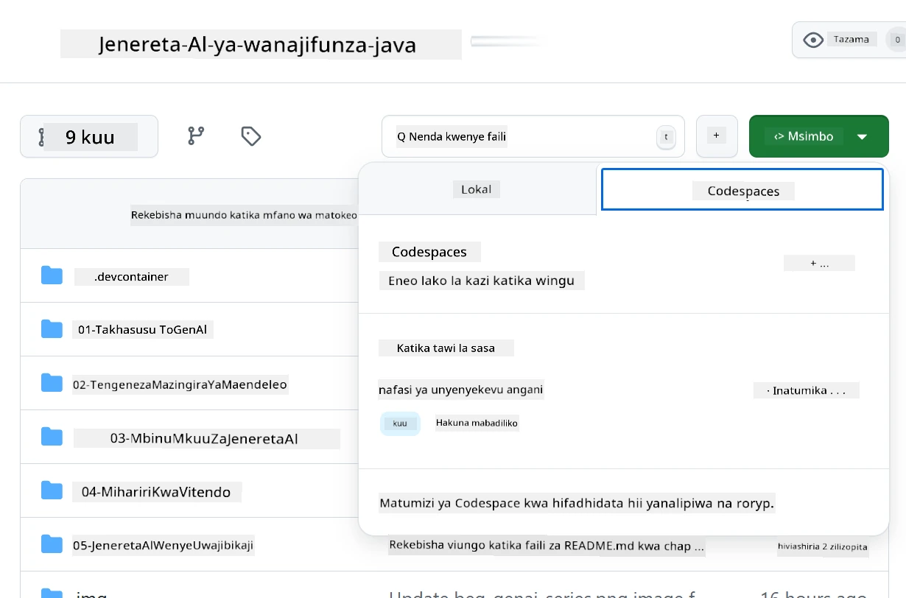
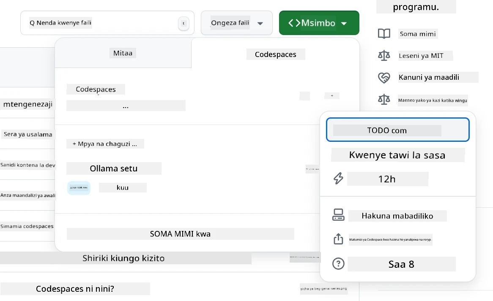
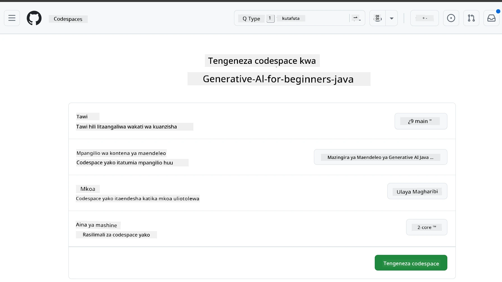
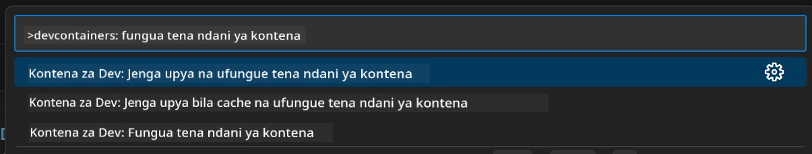
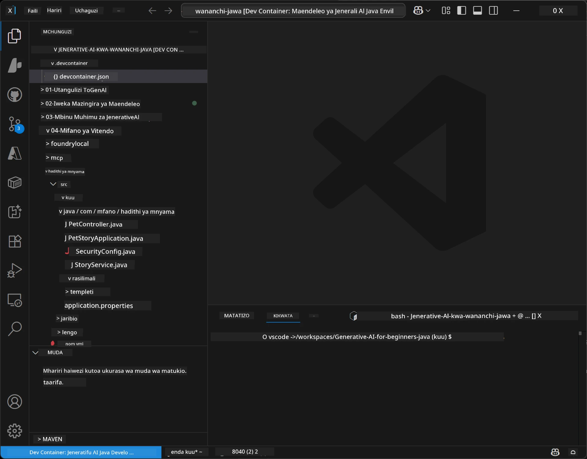
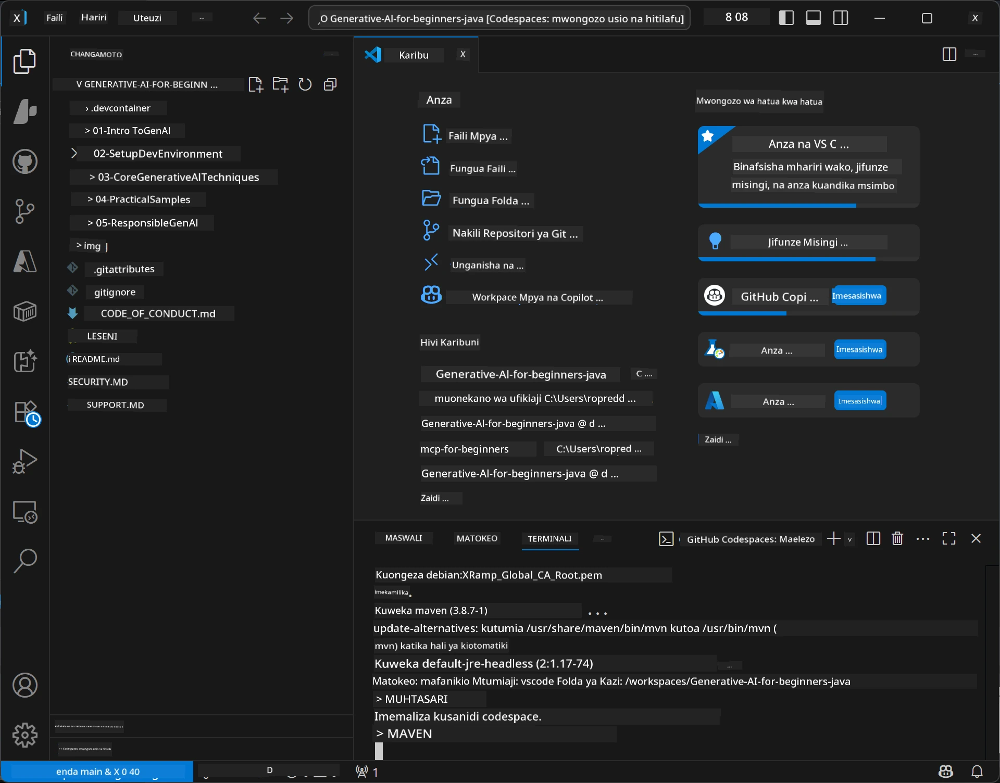

# Kuweka Mazingira ya Maendeleo kwa AI Zinazotengeneza kwa Java

> **Anza Haraka:** Toa mifano yako ya AI kwenye **Azure AI Foundry** kama msimbo kwa Bicep + `azd` kwa dakika chache — ona [Mwongozo wa Kuweka Azure AI Foundry](getting-started-azure-openai.md). Uthibitishaji ni **bila funguo** (Microsoft Entra ID), hivyo hakuna funguo za API za kusimamia.

## Utajifunza Nini

- Tengeneza mazingira ya maendeleo ya Java kwa maombi ya AI
- Chagua na usanidi mazingira yako ya maendeleo unayopendelea (kipaumbele wingu na Codespaces, kontena ya maendeleo ya kiasili, au usanidi kamili wa eneo la msimbo)
- Jaribu usanidi wako kwa kuungana na mfano wa Azure AI Foundry

## Jedwali la Yaliyomo

- [Utajifunza Nini](#utajifunza-nini)
- [Utangulizi](#utangulizi)
- [Hatua 1: Weka Mazingira Yako ya Maendeleo](#hatua-1-weka-mazingira-yako-ya-maendeleo)
  - [Chaguo A: GitHub Codespaces (Inayopendekezwa)](#chaguo-a-github-codespaces-inayopendekezwa)
  - [Chaguo B: Kontena ya Maendeleo ya Kiasili](#chaguo-b-kontena-ya-maendeleo-ya-kiasili)
  - [Chaguo C: Tumia Usanidi Wako uliopo wa Kiasili](#chaguo-c-tumia-usanidi-wako-uliopo-wa-kiasili)
- [Hatua 2: Toa Azure AI Foundry](#hatua-2-toa-azure-ai-foundry)
- [Hatua 3: Jaribu Usanidi Wako](#hatua-3-jaribu-usanidi-wako)
- [Matatizo](#matatizo)
- [Muhtasari](#muhtasari)
- [Hatua Zijazo](#hatua-zijazo)

## Utangulizi

Sura hii itakuongoza jinsi ya kuanzisha mazingira ya maendeleo. Tutatumia **Azure AI Foundry** kwa mifano yote katika kozi hii. Unatoa mifano kama msimbo kwa Bicep na CLI ya Mtaalamu wa Azure (`azd`), kisha kuungana na **uthibitishaji bila funguo** (Microsoft Entra ID) — hakuna funguo za API za kunakili au kuvuja.

**Hakuna usanidi wa eneo la msimbo unahitajika!** Unaweza kutumia GitHub Codespaces, inayotoa mazingira kamili ya maendeleo kwa kivinjari chako, na kutoa Foundry kutoka hapo.

Tunatumia **Azure AI Foundry** kwa kozi hii kwa sababu ni:
- **Imetolewa kama msimbo** — moja ya `azd up` hutoa akaunti na uenezaji wa mfano
- **Bila funguo** — thibitisha kwa kuingia kwa Azure au kitambulisho kilichosimamiwa
- **Tayari kwa uzalishaji** — msimbo uleule unaendesha kiasili na Azure
- **Inayobadilika** — badilisha mifano kwa kubadilisha jina la uenezaji, si msimbo wako

> **Kumbuka**: Uenezaji wa Azure AI Foundry unatozwa kwa tokeni (lipa-kama-unavyotumia). Angalia [mwongozo wa kuweka Azure AI Foundry](getting-started-azure-openai.md) kwa maelezo ya utoaji, kanda, na gharama.


## Hatua 1: Weka Mazingira Yako ya Maendeleo

<a name="quick-start-cloud"></a>

Tumeunda kontena ya maendeleo iliyowekwa mapema ili kupunguza muda wa usanidi na kuhakikisha una vifaa vyote muhimu kwa kozi hii ya AI Zinazotengeneza kwa Java. Chagua njia yako unayopendelea ya maendeleo:

### Chaguzi za Kuweka Mazingira:

#### Chaguo A: GitHub Codespaces (Inayopendekezwa)

**Anza kuchora msimbo kwa dakika 2 - hakuna usanidi wa kiasili unahitajika!**

1. Chakaza hazina hii kwenye akaunti yako ya GitHub
   > **Kumbuka**: Ikiwa unataka kuhariri usanidi wa msingi tafadhali tazama [Usanidi wa Kontena ya Maendeleo](../../../.devcontainer/devcontainer.json)
2. Bofya **Code** → kichupo cha **Codespaces** → **...** → **Mpya na chaguzi...**
3. Tumia chaguo-msingi – hiki kitachagua **Usanidi wa kontena ya maendeleo**: **Mazinga AI ya Java yaliyotengenezwa kwa kozi hii** devcontainer ya kawaida
4. Bofya **Unda codespace**
5. Subiri ~dakika 2 kwa mazingira kuwa tayari
6. Endelea kwa [Hatua 2: Toa Azure AI Foundry](#hatua-2-toa-azure-ai-foundry)








> **Faida za Codespaces**:
> - Hakuna usanidi wa eneo la msimbo unahitajika
> - Inaendeshwa kwenye kifaa chochote chenye kivinjari
> - Imesanidiwa mapema na vifaa na utegemezi vyote
> - Saa 60 za bure kwa mwezi kwa akaunti za mtu binafsi
> - Mazingira sawa kwa wanafunzi wote

#### Chaguo B: Kontena ya Maendeleo ya Kiasili

**Kwa watengenezaji wanaopendelea ukuzaji wa kiasili kwa kutumia Docker**

1. Chakaza na kunakili hazina hii kwenye kompyuta yako ya kiasili
   > **Kumbuka**: Ikiwa unataka kuhariri usanidi wa msingi tafadhali tazama [Usanidi wa Kontena ya Maendeleo](../../../.devcontainer/devcontainer.json)
2. Sakinisha [Docker Desktop](https://www.docker.com/products/docker-desktop/) na [VS Code](https://code.visualstudio.com/)
3. Sakinisha ugani wa [Dev Containers extension](https://marketplace.visualstudio.com/items?itemName=ms-vscode-remote.remote-containers) kwenye VS Code
4. Fungua folda ya hazina kwenye VS Code
5. Ukihamasishwa, bofya **Fungua tena katika Kontena** (au tumia `Ctrl+Shift+P` → "Dev Containers: Reopen in Container")
6. Subiri kontena ianze na kujenga
7. Endelea kwa [Hatua 2: Toa Azure AI Foundry](#hatua-2-toa-azure-ai-foundry)





#### Chaguo C: Tumia Usanidi Wako uliopo wa Kiasili

**Kwa watengenezaji wenye mazingira ya Java yaliyopo tayari**

Mahitaji:
- [Java 21+](https://www.oracle.com/java/technologies/javase/jdk21-archive-downloads.html) 
- [Maven 3.9+](https://maven.apache.org/download.cgi)
- [VS Code](https://code.visualstudio.com) au IDE unayopendelea

Hatua:
1. Nakili hazina hii kwenye kompyuta yako ya kiasili
2. Fungua mradi kwenye IDE yako
3. Endelea kwa [Hatua 2: Toa Azure AI Foundry](#hatua-2-toa-azure-ai-foundry)

> **Ushauri wa Mtaalamu**: Ikiwa una mashine yenye sifa ndogo lakini unataka VS Code eneo la msimbo, tumia GitHub Codespaces! Unaweza kuunganisha VS Code yako ya eneo kwa Codespace inayoshikiliwa wingu kwa faida bora ya vyote viwili.




## Hatua 2: Toa Azure AI Foundry

Toa mifano ya AI ya kozi katika Azure AI Foundry kama msimbo. Kutoka kwenye mizizi ya hazina:

```bash
cd 02-SetupDevEnvironment
azd auth login
az login
azd up
```

`azd` huuliza jina la mazingira, usajili, na kanda, hutengeneza akaunti ya Azure AI Foundry na uenezaji wa `gpt-5.6-luna` na `text-embedding-3-small`, na huandika kiungo cha mwisho kwenye `.env` ya mfano - yote na uthibitishaji **bila funguo** (hakuna funguo za API).

> **Maelezo kamili:** Tazama [Mwongozo wa Kuweka Azure AI Foundry](getting-started-azure-openai.md) kwa mahitaji, mbadala wa mkono (portal), mwongozo wa kanda, na maelezo ya gharama/usafishaji.

## Hatua 3: Jaribu Usanidi Wako

Mara mifano yako ya Foundry itakapopelekwa, jaribu muunganisho na programu ya mfano katika [`02-SetupDevEnvironment/examples/basic-chat-azure`](../../../02-SetupDevEnvironment/examples/basic-chat-azure).

1. Fungua terminali katika mazingira yako ya maendeleo.
2. Nenda kwenye mfano:
   ```bash
   cd 02-SetupDevEnvironment/examples/basic-chat-azure
   ```
3. Hakikisha umeingia (uthibitishaji bila funguo unahitaji tokeni):
   ```bash
   az login
   ```
   > Ikiwa ulitumia `azd up`, faili ya `.env` yenye kiungo chako tayari imeandikwa kwako.
4. Endesha programu:
   ```bash
   mvn clean spring-boot:run
   ```

Unapaswa kuona jibu kutoka kwa mfano wa `gpt-5.6-luna`.

### Kuelewa Msimbo wa Mfano

[Mfano wa basic-chat](./examples/basic-chat-azure/README.md) unatumia **Spring Boot 4.1.1** na **Spring AI 2.0.1**. ChatClient ya Spring AI inategemea SDK rasmi ya OpenAI Java, ikijiunga na kiungo cha Azure OpenAI **v1** kwa uthibitishaji bila funguo.

**Msimbo huu hufanya yafuatayo:**
- **Unajiunga** na Azure AI Foundry kwa kutumia kuingia kwako Azure (Microsoft Entra ID) — hakuna funguo za API
- **Kutuma** ombi kwa mfano wa `gpt-5.6-luna`
- **Kupokea** na kuonyesha majibu ya AI
- **Kukagua** usanidi wako unafanya kazi vizuri

**Tegemezi Muhimu** (sehemu kutoka [pom.xml](../../../02-SetupDevEnvironment/examples/basic-chat-azure/pom.xml)):
```xml
<dependency>
    <groupId>org.springframework.ai</groupId>
    <artifactId>spring-ai-starter-model-openai</artifactId>
</dependency>
<dependency>
    <groupId>com.openai</groupId>
    <artifactId>openai-java</artifactId>
</dependency>
<dependency>
    <groupId>com.azure</groupId>
    <artifactId>azure-identity</artifactId>
    <version>${azure-identity.version}</version>
</dependency>
```

POM inadhibiti OpenAI Java **4.63.1** na inaweka Azure Identity **1.18.6** wazi. Spring AI 2 iliangusha starter maalum ya Azure; Azure Identity bado inahitajika kwa bean ya cheti cha kuthibitisha.

**Usanidi** ([application.yml](../../../02-SetupDevEnvironment/examples/basic-chat-azure/src/main/resources/application.yml)):
```yaml
spring:
  ai:
    openai:
      base-url: ${AZURE_OPENAI_ENDPOINT}
      microsoft-foundry: true
      chat:
        model: ${AZURE_OPENAI_DEPLOYMENT:gpt-5.6-luna}
        reasoning-effort: none
        max-completion-tokens: 500
```

Uthibitishaji bila funguo umewekwa wazi katika [BasicChatApplication.java](../../../02-SetupDevEnvironment/examples/basic-chat-azure/src/main/java/com/example/BasicChatApplication.java), si kutegemea kuwepo kwa funguo ya API. Cheti chake cha bearer kinatumia `DefaultAzureCredential` na eneo la `https://ai.azure.com/.default`, na `OpenAIClient` inalenga `/openai/v1`. Programu inampa mteja huyo mfano wa mazungumzo wa Spring AI, hivyo `OPENAI_API_KEY` ya dunia hawezi kubadilisha uthibitishaji wa Azure.

Mipangilio ya mazungumzo iko moja kwa moja chini ya `spring.ai.openai.chat`, bila kipengele cha `options`. Somo linaendelea na Chat Completions na `reasoning-effort: none` na kikomo cha 500-token; halitegesi `temperature` wala `max-tokens`. Angalia [marejeleo ya usanidi wa mfano](./examples/basic-chat-azure/README.md#spring-configuration) kwa uchaguzi wa API na mwongozo wa kuitisha zana.

## Muhtasari

Baada ya kukamilisha hatua hizo hapo juu, utakuwa umefanya:

- Kutumia Azure AI Foundry kama msimbo kwa Bicep + `azd`
- Kuendesha mazingira yako ya maendeleo ya Java (iwe ni Codespaces, kontena za maendeleo, au eneo la kiasili)
- Kuunganishwa na Azure AI Foundry kwa uthibitishaji bila funguo (Microsoft Entra ID) — hakuna funguo za API
- Kujaribu kila kitu kinafanya kazi kwa mfano rahisi unaozungumza na mfano wako

## Hatua Zijazo

[Sura ya 3: Mbinu Muhimu za AI Zinazotengeneza](../03-CoreGenerativeAITechniques/README.md)

## Matatizo

Kuna matatizo? Hapa kuna shida za kawaida na suluhisho:

- **Uthibitishaji haufanikiwi (401/403)?** 
  - Endesha `az login` — uthibitishaji ni bila funguo, hivyo lazima uingie
  - Hakikisha akaunti yako ina jukumu la **Cognitive Services OpenAI User** kwenye rasilimali
  - Ikiwa umefanya utoaji hivi karibuni, subiri dakika moja kwa mgawanyo wa jukumu huyo kufanikia

- **Maven haionekani?** 
  - Ikiwa unatumia kontena za maendeleo/Codespaces, Maven inapaswa kuwa imewekwa awali
  - Kwa usanidi wa kiasili, hakikisha Java 21+ na Maven 3.9+ vimewekwa
  - Jaribu `mvn --version` kuthibitisha usanidi

- **`azd` haionekani au utoaji unashindwa?** 
  - Sakinisha [CLI ya Mtaalamu wa Azure](https://aka.ms/azure-dev/install) na endesha `azd auth login`
  - Chagua kanda ambapo `gpt-5.6-luna` na `text-embedding-3-small` zinapatikana (mfano `eastus2`), na upeo wa kutosha kwenye usajili uliuchagua
  - Tazama [mwongozo wa kuweka Azure AI Foundry](getting-started-azure-openai.md) kwa maelezo

- **Kontena ya maendeleo haianzi?** 
  - Hakikisha Docker Desktop inaendesha (kwa maendeleo ya kiasili)
  - Jaribu kujenga tena kontena: `Ctrl+Shift+P` → "Dev Containers: Rebuild Container"

- **Makosa ya kukusanya programu?**
  - Hakikisha uko kwenye saraka sahihi: `02-SetupDevEnvironment/examples/basic-chat-azure`
  - Jaribu kusafisha na kujenga tena: `mvn clean compile`

> **Unahitaji msaada?**: Bado unakutana na matatizo? Fungua tatizo kwenye hazina na tutakusaidia.

---

<!-- CO-OP TRANSLATOR DISCLAIMER START -->
**Kionyozo**:
Hati hii imetafsiriwa kwa kutumia huduma ya tafsiri ya AI [Co-op Translator](https://github.com/Azure/co-op-translator). Ingawa tunajitahidi kupata usahihi, tafadhali fahamu kwamba tafsiri za kiotomatiki zinaweza kuwa na makosa au upungufu wa usahihi. Hati ya asili katika lugha yake halisi inapaswa kuchukuliwa kama chanzo cha mamlaka. Kwa taarifa muhimu, tafsiri ya kitaalamu inayofanywa na binadamu inapendekezwa. Hatutojibu kwa kuelewa vibaya au tafsiri potofu zinazotokea kutokana na matumizi ya tafsiri hii.
<!-- CO-OP TRANSLATOR DISCLAIMER END -->