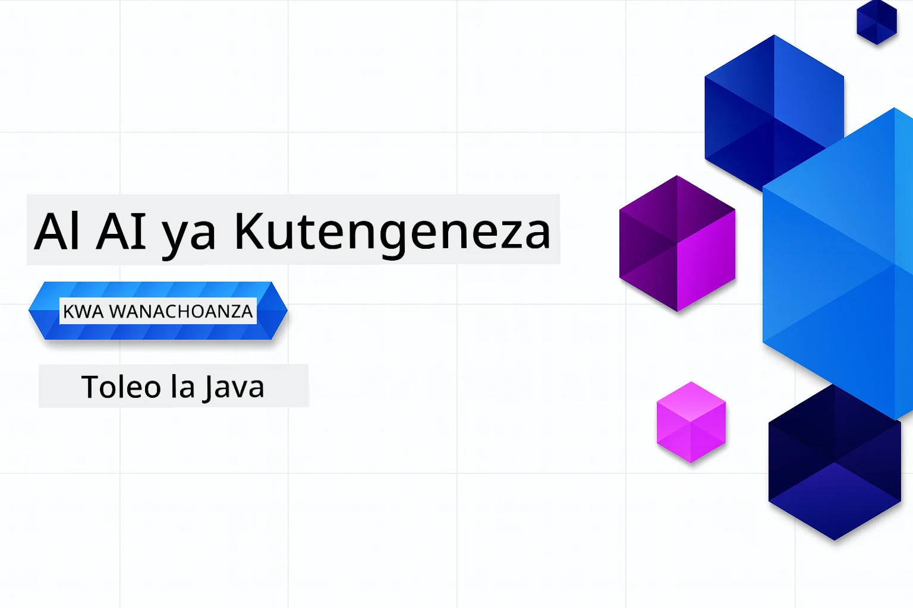

# AI ya Kizazi kwa Waanzilishi - Toleo la Java
[](https://discord.gg/nTYy5BXMWG)



**Muda wa Kujitolea**: Warsha yote inaweza kufanyika mtandaoni bila kuanzisha kitu cha ndani. Kuanzisha mazingira kunachukua dakika 2, huku kuchunguza mifano kunahitaji masaa 1-3 kulingana na kina cha uchunguzi.

> **Anza Haraka** 

1. Changia hii hifadhi kwenye akaunti yako ya GitHub
2. Bofya **Code** → kichupo cha **Codespaces** → **...** → **Mpya na chaguo...**
3. Tumia chaguo za kawaida – hii itachagua kontena la Maendeleo lililoundwa kwa kozi hii
4. Bofya **Unda codespace**
5. Subiri takriban dakika 2 kwa mazingira kuwa tayari
6. Nenda moja kwa moja kwenye [Sura ya 2: Toa Azure AI Foundry](./02-SetupDevEnvironment/README.md#step-2-provision-azure-ai-foundry)

## Msaada wa Lugha Nyingi

### Inasaidiwa kupitia Kitendo cha GitHub (Moja kwa Moja & Daima Iliyosasishwa)

<!-- CO-OP TRANSLATOR LANGUAGES TABLE START -->
[Kiarabu](../ar/README.md) | [Kibengali](../bn/README.md) | [Kibulgaria](../bg/README.md) | [Kiburma (Myanmar)](../my/README.md) | [Kichina (Rahisi)](../zh-CN/README.md) | [Kichina (Marefu, Hong Kong)](../zh-HK/README.md) | [Kichina (Marefu, Macau)](../zh-MO/README.md) | [Kichina (Marefu, Taiwan)](../zh-TW/README.md) | [Kikroeshia](../hr/README.md) | [Kicheki](../cs/README.md) | [Kidanishi](../da/README.md) | [Kiholanzi](../nl/README.md) | [Kiestonia](../et/README.md) | [Kifini](../fi/README.md) | [Kifaransa](../fr/README.md) | [Kijerumani](../de/README.md) | [Kigiriki](../el/README.md) | [Kiebrania](../he/README.md) | [Kihindi](../hi/README.md) | [Kihungaria](../hu/README.md) | [Kiindonesia](../id/README.md) | [Kiitaliano](../it/README.md) | [Kijapani](../ja/README.md) | [Kikannada](../kn/README.md) | [Kikmeru](../km/README.md) | [Kikorea](../ko/README.md) | [Kilithuania](../lt/README.md) | [Kimalay](../ms/README.md) | [Kimalayalam](../ml/README.md) | [Kimarathi](../mr/README.md) | [Kinepali](../ne/README.md) | [Kipidgin cha Nigeria](../pcm/README.md) | [Kinorwe](../no/README.md) | [Kiajemi (Farsi)](../fa/README.md) | [Kilpolishi](../pl/README.md) | [Kireno (Brazil)](../pt-BR/README.md) | [Kireno (Portugal)](../pt-PT/README.md) | [Kipunabi (Gurmukhi)](../pa/README.md) | [Kiromania](../ro/README.md) | [Kirusi](../ru/README.md) | [Kiserbia (Cyrillic)](../sr/README.md) | [Kislovaiki](../sk/README.md) | [Kislovenia](../sl/README.md) | [Kihispania](../es/README.md) | [Kiswahili](./README.md) | [Kiswidi](../sv/README.md) | [Kitagalogi (Filipino)](../tl/README.md) | [Kitamil](../ta/README.md) | [Kitelugu](../te/README.md) | [Kithai](../th/README.md) | [Kituruki](../tr/README.md) | [Kiukraini](../uk/README.md) | [Kiurdu](../ur/README.md) | [Kivietinamu](../vi/README.md)

> **Unapendelea Kufanya Nakala Kwenye Kompyuta Yako?**
>
> Hii hifadhi ina tafsiri zaidi ya 50 za lugha ambazo huongeza kiasi cha kupakua kwa kiasi kikubwa. Ili kunakili bila tafsiri, tumia sparse checkout:
>
> **Bash / macOS / Linux:**
> ```bash
> git clone --filter=blob:none --sparse https://github.com/microsoft/Generative-AI-for-beginners-java.git
> cd Generative-AI-for-beginners-java
> git sparse-checkout set --no-cone '/*' '!translations' '!translated_images'
> ```
>
> **CMD (Windows):**
> ```cmd
> git clone --filter=blob:none --sparse https://github.com/microsoft/Generative-AI-for-beginners-java.git
> cd Generative-AI-for-beginners-java
> git sparse-checkout set --no-cone "/*" "!translations" "!translated_images"
> ```
>
> Hii inakupa kila kitu unachohitaji kukamilisha kozi kwa upakuaji wa kasi zaidi.
<!-- CO-OP TRANSLATOR LANGUAGES TABLE END -->

## Muundo wa Kozi & Njia ya Kujifunza

### **Sura ya 1: Utangulizi wa AI ya Kizazi**
- **Mafundisho Muhimu**: Kuelewa Modeli Kubwa za Lugha, tokens, embeddings, na uwezo wa AI
- **Eneo la AI la Java**: Muhtasari wa Spring AI na OpenAI SDKs
- **Itifaki ya Muktadha wa Modeli**: Utangulizi wa MCP na nafasi yake katika mawasiliano ya mawakala wa AI
- **Matumizi ya Vitendo**: Hali halisi ikijumuisha chatbots na uzalishaji wa maudhui
- **[→ Anza Sura ya 1](./01-IntroToGenAI/README.md)**

### **Sura ya 2: Kuanzisha Mazingira ya Maendeleo**
- **Azure AI Foundry**: Toa GPT-5.6 Luna chat na text-embedding-3-small embeddings kwa Bicep na Azure Developer CLI (azd)
- **Spring Boot 4.1.1 + Spring AI 2.0.1**: Jifunze na `ChatClient`, linalotegemea rasmi OpenAI Java SDK na Azure OpenAI v1
- **Uthibitisho Bila Funguo**: Unganisha kwa usalama na Microsoft Entra ID — hakuna funguo za API za kusimamia
- **Zana za Maendeleo**: Kontena za Docker, VS Code, na usanidi wa GitHub Codespaces
- **[→ Anza Sura ya 2](./02-SetupDevEnvironment/README.md)**

### **Sura ya 3: Mbinu za Msingi za AI ya Kizazi**
- **SDK Rasmi ya OpenAI Java**: Piga simu moja kwa moja Azure OpenAI v1 na uthibitisho bila funguo
- **Uhandisi wa Prompt**: Mbinu za majibu bora ya modeli ya AI
- **Embeddings na Operesheni za Vector**: Tekeleza utafutaji wa maana na kufanana
- **Uzalishaji ulioboreshwa kwa Urejeshaji (RAG)**: Changanya AI na vyanzo vyako vya data
- **Kupiga Simu za Kazi**: Panua uwezo wa AI kwa zana na viendelezaji maalum
- **[→ Anza Sura ya 3](./03-CoreGenerativeAITechniques/README.md)**

### **Sura ya 4: Matumizi ya Vitendo & Miradi**
- **Mzalishaji wa Hadithi za Wanyama** (`petstory/`): Uzalishaji wa maudhui ya ubunifu na Azure AI Foundry
- **Maonyesho ya Foundry ya Ndani** (`foundrylocal/`): Uingizaji wa modeli ya AI ya ndani na OpenAI Java SDK
- **Huduma ya Kihesabu ya MCP** (`calculator/`): Utekelezaji wa msingi wa Itifaki ya Muktadha wa Modeli na Spring AI
- **[→ Anza Sura ya 4](./04-PracticalSamples/README.md)**

### **Sura ya 5: Maendeleo ya AI ya Kuwajibika**
- **Usalama wa Maudhui wa Azure AI Foundry**: Jaribu uzuiaji wa maudhui na mifumo ya usalama (vizuizi vya ngumu na kukataa kwa hofu)
- **Maonyesho ya AI ya Kuwajibika**: Mfano wa vitendo unaoonyesha jinsi mifumo ya usalama ya AI ya kisasa inavyofanya kazi
- **Miongozo Bora**: Miongozo muhimu kwa maendeleo na matumizi ya AI kwa maadili
- **[→ Anza Sura ya 5](./05-ResponsibleGenAI/README.md)**

## Rasilimali Zaidi

<!-- CO-OP TRANSLATOR OTHER COURSES START -->
### LangChain
[](https://aka.ms/langchain4j-for-beginners)
[](https://aka.ms/langchainjs-for-beginners?WT.mc_id=m365-94501-dwahlin)
[](https://github.com/microsoft/langchain-for-beginners?WT.mc_id=m365-94501-dwahlin)
---

### Azure / Edge / MCP / Mawakala
[](https://github.com/microsoft/AZD-for-beginners?WT.mc_id=academic-105485-koreyst)
[](https://github.com/microsoft/edgeai-for-beginners?WT.mc_id=academic-105485-koreyst)
[](https://github.com/microsoft/mcp-for-beginners?WT.mc_id=academic-105485-koreyst)
[](https://github.com/microsoft/ai-agents-for-beginners?WT.mc_id=academic-105485-koreyst)

---
 
### Mfululizo wa AI ya Kizazi
[](https://github.com/microsoft/generative-ai-for-beginners?WT.mc_id=academic-105485-koreyst)
[-9333EA?style=for-the-badge&labelColor=E5E7EB&color=9333EA)](https://github.com/microsoft/Generative-AI-for-beginners-dotnet?WT.mc_id=academic-105485-koreyst)
[-C084FC?style=for-the-badge&labelColor=E5E7EB&color=C084FC)](https://github.com/microsoft/generative-ai-for-beginners-java?WT.mc_id=academic-105485-koreyst)
[-E879F9?style=for-the-badge&labelColor=E5E7EB&color=E879F9)](https://github.com/microsoft/generative-ai-with-javascript?WT.mc_id=academic-105485-koreyst)

---
 
### Kujifunza Msingi
[](https://aka.ms/ml-beginners?WT.mc_id=academic-105485-koreyst)
[](https://aka.ms/datascience-beginners?WT.mc_id=academic-105485-koreyst)
[](https://aka.ms/ai-beginners?WT.mc_id=academic-105485-koreyst)
[](https://github.com/microsoft/Security-101?WT.mc_id=academic-96948-sayoung)
[](https://aka.ms/webdev-beginners?WT.mc_id=academic-105485-koreyst)
[](https://aka.ms/iot-beginners?WT.mc_id=academic-105485-koreyst)
[](https://github.com/microsoft/xr-development-for-beginners?WT.mc_id=academic-105485-koreyst)

---
 
### Mfululizo wa Copilot
[](https://aka.ms/GitHubCopilotAI?WT.mc_id=academic-105485-koreyst)
[](https://github.com/microsoft/mastering-github-copilot-for-dotnet-csharp-developers?WT.mc_id=academic-105485-koreyst)
[](https://github.com/microsoft/CopilotAdventures?WT.mc_id=academic-105485-koreyst)
<!-- CO-OP TRANSLATOR OTHER COURSES END -->

## Kupata Msaada

Ukikumbwa na shida au ukiwa na maswali kuhusu ujenzi wa programu za AI. Jiunge na wanafunzi wenzako na watengenezaji wenye uzoefu katika majadiliano kuhusu MCP. Ni jamii inayosaidia ambapo maswali yanakaribishwa na maarifa yanashirikiwa kwa hiari.

[](https://discord.gg/nTYy5BXMWG)

Ikiwa una maoni juu ya bidhaa au makosa wakati wa ujenzi tembelea:

[](https://aka.ms/foundry/forum)

---

<!-- CO-OP TRANSLATOR DISCLAIMER START -->
**Kionyozo**:
Hati hii imetafsiriwa kwa kutumia huduma ya tafsiri ya AI [Co-op Translator](https://github.com/Azure/co-op-translator). Ingawa tunajitahidi kupata usahihi, tafadhali fahamu kwamba tafsiri za kiotomatiki zinaweza kuwa na makosa au upungufu wa usahihi. Hati ya asili katika lugha yake halisi inapaswa kuchukuliwa kama chanzo cha mamlaka. Kwa taarifa muhimu, tafsiri ya kitaalamu inayofanywa na binadamu inapendekezwa. Hatutojibu kwa kuelewa vibaya au tafsiri potofu zinazotokea kutokana na matumizi ya tafsiri hii.
<!-- CO-OP TRANSLATOR DISCLAIMER END -->