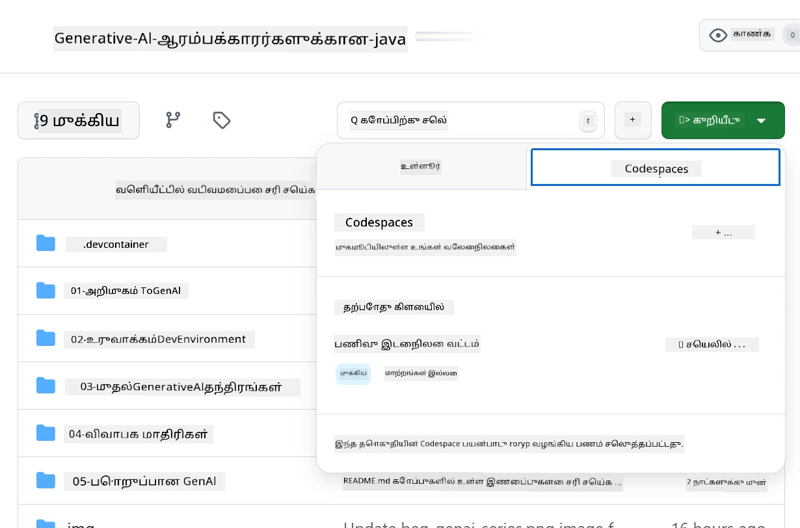
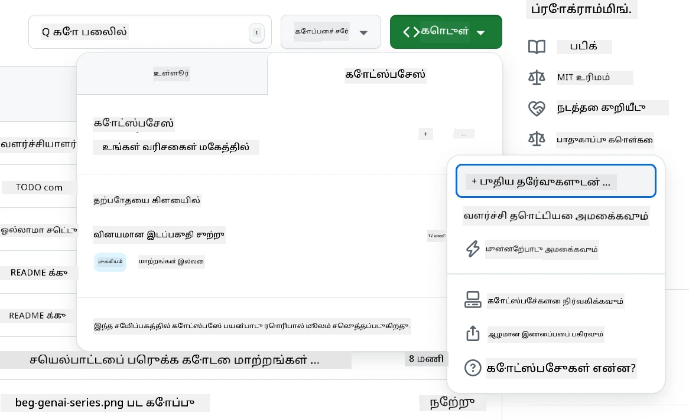
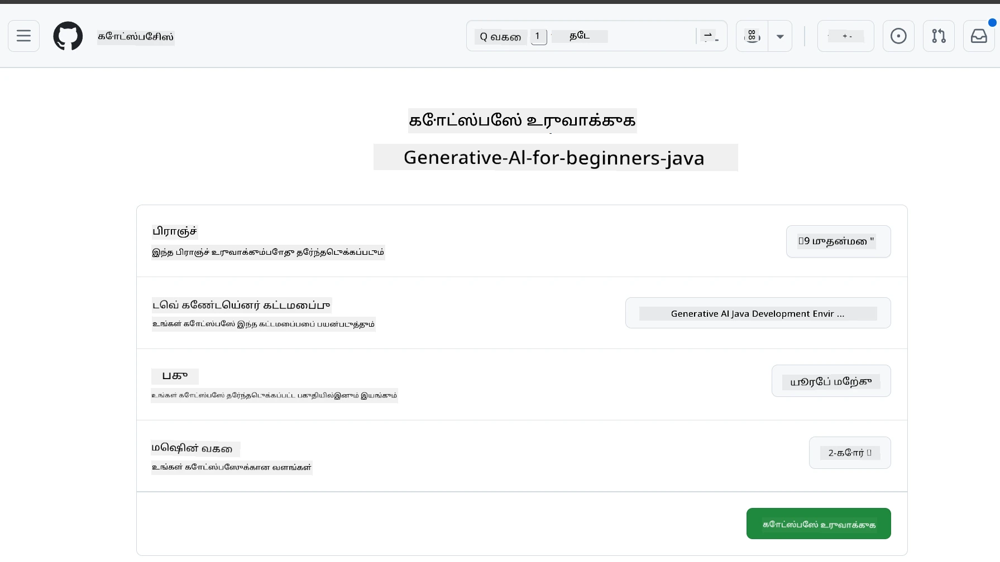
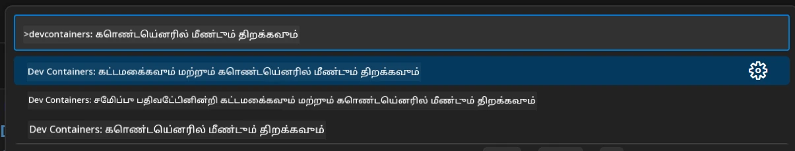
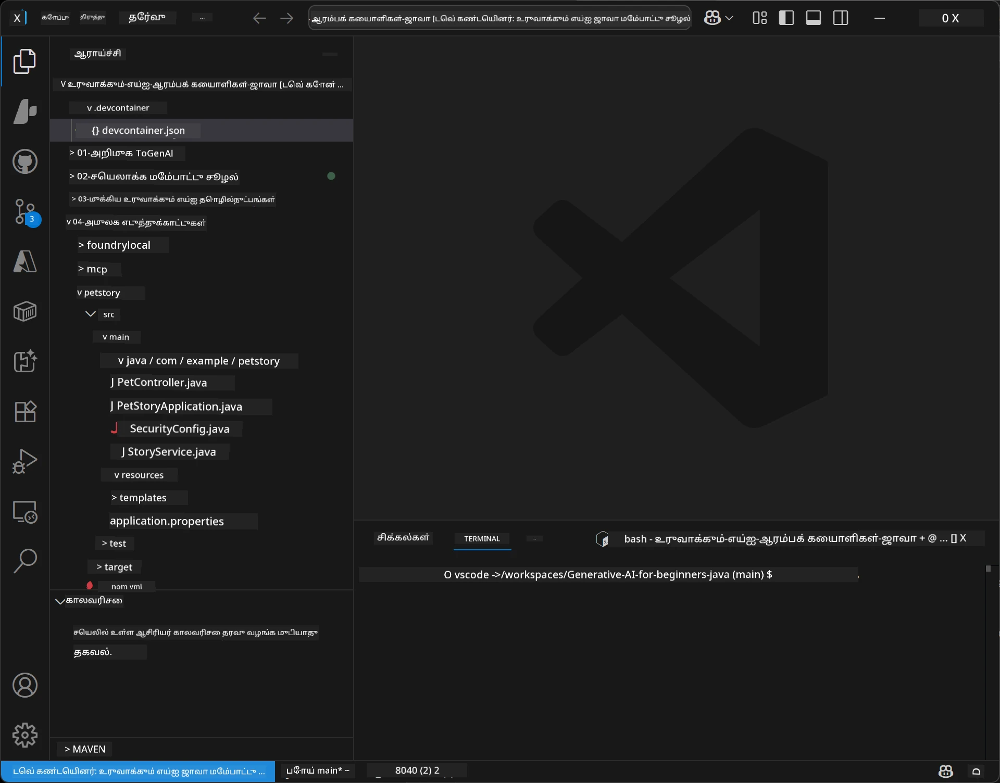
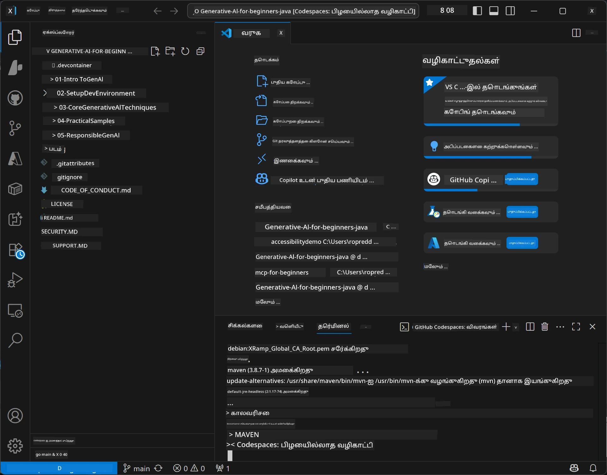

# ஜாவாவுக்கான உருவாக்கும் AI க்கான மேம்பாட்டு சூழலை அமைத்தல்

> **விரைவு தொடக்கம்:** உங்கள் AI மாதிரிகளை Bicep + `azd` உடன் குறியீடாக **Azure AI Foundry** இல் சில நிமிடங்களில் வழங்கவும் — [Azure AI Foundry அமைப்பு வழிகாட்டி](getting-started-azure-openai.md) ஐ காணவும். உறுதிப்படுத்தல் **கீழை வேண்டாம்** (Microsoft Entra ID), ஆகவே API விசைகள் மேலாண்மை செய்ய தேவையில்லை.

## நீங்கள் கற்றுக்கொள்ளவிருப்பது

- AI பயன்பாடுகளுக்கான ஜாவா மேம்பாட்டு சூழலை அமைத்தல்
- உங்கள் விருப்பமான மேம்பாட்டு சூழலை தேர்ந்தெடுத்து கட்டமைத்தல் (குறைந்தாக Codespaces உடன் கிளவுட் முதன்மை, உள்ளூர் dev container, அல்லது முழு உள்ளூர் அமைப்பு)
- Azure AI Foundry மாதிரியுடன் இணைத்து உங்கள் அமைப்பை பரிசோதனை செய்வது

## உள்ளடக்கம் அட்டவணை

- [நீங்கள் கற்றுக்கொள்ளவுள்ளவை](#நீங்கள்-கற்றுக்கொள்ளவிருப்பது)
- [அறிமுகம்](#அறிமுகம்)
- [படி 1: உங்கள் மேம்பாட்டு சூழலை அமைத்தல்](#படி-1-உங்கள்-மேம்பாட்டு-சூழலை-அமைத்தல்)
  - [விருப்பம் A: GitHub Codespaces ( பரிந்துரைக்கப்படுகிறது)](#விருப்பம்-a-github-codespaces-பரிந்துரைக்கப்படுகிறது)
  - [விருப்பம் B: உள்ளூர் dev container](#விருப்பம்-b-உள்ளூர்-dev-container)
  - [விருப்பம் C: உங்கள் தற்போதைய உள்ளூர் இன்ஸ்டாலேஷனை பயன்படுத்துதல்](#விருப்பம்-c-உங்கள்-தற்போதைய-உள்ளூர்-நிறுவலைப்-பயன்படுத்துக)
- [படி 2: Azure AI Foundry ஐ வழங்குதல்](#படி-2-azure-ai-foundry-ஐ-வழங்குதல்)
- [படி 3: உங்கள் அமைப்பை சோதிக்கவும்](#படி-3-உங்கள்-அமைப்பை-சோதிக்கவும்)
- [சிக்கல் தீர்வு](#சிக்கல்-தீர்வு)
- [சுருக்கம்](#சுருக்கம்)
- [அடுத்த படிகள்](#அடுத்த-படிகள்)

## அறிமுகம்

இந்த அதிகாரத்தில் நீங்கள் ஒரு மேம்பாட்டு சூழலை அமைக்கும் முறையை கற்றுக்கொள்வீர்கள். இந்த பாட நெறியிலிருந்து நாம் அனைத்து மாதிரிகளுக்கும் **Azure AI Foundry** ஐ பயன்படுத்துகிறோம். நீங்கள் Bicep மற்றும் Azure Developer CLI (`azd`) கொண்டு மாதிரிகளை குறியீடாக வழங்குவீர்கள், பின்னர் **கீழை வேண்டாமையுடன்** (Microsoft Entra ID) இணைக்கலாம் — API விசைகள் எடுத்து நகலெடுக்க தேவையில்லை.

**உள்ளூர் அமைப்பு தேவையில்லை!** நீங்கள் GitHub Codespaces ஐ பயன்படுத்தலாம், இது உங்கள் உலாவியில் முழுமையான மேம்பாட்டு சூழலை வழங்குகிறது, அங்கே இருந்து Foundry ஐ வழங்கலாம்.

இந்த பாட நெறிக்காக நாம் **Azure AI Foundry** ஐ பயன்படுத்துவதற்கான காரணங்கள்:
- **குறியீடாக வழங்கப்படுகிறது** — ஒரு `azd up` கட்டளை கணக்கு மற்றும் மாதிரி மேற்பார்வைகளை தானாக இடுகிறது
- **கீழை வேண்டாமை** — உங்கள் Azure உள்நுழைவுடன் அல்லது நிர்வகிக்கப்பட்ட அடையாளத்துடன் உறுதிப்படுத்து
- **தயாரிப்பு தயாரானது** — ஒரே குறியீடு உள்ளூரிலும் Azure லும் இயங்கும்
- **நெகிழ்வானது** — உங்கள் குறியீட்டை மாற்றாமல் மேற்பார்வை பெயரை மாற்று மூலம் மாதிரிகளை மாற்றலாம்

> **கவனிக்கவும்**: Azure AI Foundry மேற்பார்வைகள் டோக்கன் அடிப்படையில் கட்டணப்படுகிறது (பணம் பயன்படுத்தியபடி). வழங்கல், பிராந்திய மற்றும் செலவு விவரங்களுக்கு [Azure AI Foundry அமைப்பு வழிகாட்டி](getting-started-azure-openai.md) ஐ பார்வையிடவும்.


## படி 1: உங்கள் மேம்பாட்டு சூழலை அமைத்தல்

<a name="quick-start-cloud"></a>

இந்த உருவாக்கும் AI ஜாவா பாடத்திற்க்காக அதிகாரபூர்வமாக முன்னிருப்பு செய்யப்பட்ட dev container ஒன்றை தயார் செய்துள்ளோம், இது உங்களை அமைக்க நேரம் குறைக்கும் மற்றும் தேவையான அனைத்து கருவிகளையும் உங்களுக்கு வழங்கும். உங்கள் விருப்பமான மேம்பாட்டு முறையை தேர்ந்தெடுக்கவும்:

### சூழல் அமைப்பு விருப்பங்கள்:

#### விருப்பம் A: GitHub Codespaces ( பரிந்துரைக்கப்படுகிறது)

**2 நிமிடங்களில் குறியீடு தொடங்கு - உள்ளூர் அமைப்பு தேவையில்லை!**

1. இந்த நிரல்பதிவை உங்கள் GitHub கணக்குக்கு ஃபோர்க் செய்யவும்
   > **கவனிக்கவும்**: அடிப்படை கட்டமைப்பை மாற்ற விரும்பினால், [Dev Container Configuration](../../../.devcontainer/devcontainer.json) ஐ பார்வையிடவும்
2. **Code** → **Codespaces** தாவலை கிளிக் செய்க → **...** → **New with options...** கிளிக் செய்க
3. இயல்புத்தொகுப்புகளை பயன்படுத்தவும் – இது இந்த பாடத்திற்கான **Dev container configuration**: **உருவாக்கும் AI ஜாவா மேம்பாட்டு சூழல்** என்ற தனிப்பயன் devcontainer ஐத் தேர்வு செய்யும்
4. **Create codespace** கிளிக் செய்க
5. சூழல் தயார் ஆக ~2 நிமிடங்கள் காத்திருக்கவும்
6. [படி 2: Azure AI Foundry ஐ வழங்குதல்](#படி-2-azure-ai-foundry-ஐ-வழங்குதல்) பயணிக்கவும்








> **Codespaces நன்மைகள்**:
> - உள்ளூர் நிறுவல் தேவையில்லை
> - உலாவி இருக்கும் எந்த சாதனமும் வேலை செய்யும்
> - அனைத்து கருவிகள் மற்றும் சார்புகளுடன் முன்கூட்டியே செட் செய்தது
> - தனிப்பட்ட கணக்குகளுக்கு மாதத்திற்கு இலவசமாக 60 மணி நேரம்
> - அனைத்து கற்றுக்கொள்பவர்களுக்கும் ஒரே மாதிரியான சூழல்

#### விருப்பம் B: உள்ளூர் Dev Container

**Docker உடன் உள்ளூர் மேம்பாட்டை விரும்பும் மேம்பாளர்களுக்குத்**

1. இந்த நிரல்பதிவை ஃபோர்க் செய்து உங்கள் உள்ளூர் கணினிக்கு கிளோன் செய்யவும்
   > **கவனிக்கவும்**: அடிப்படை கட்டமைப்பை மாற்ற விரும்பினால், [Dev Container Configuration](../../../.devcontainer/devcontainer.json) ஐ பார்வையிடவும்
2. [Docker Desktop](https://www.docker.com/products/docker-desktop/) மற்றும் [VS Code](https://code.visualstudio.com/) ஐ நிறுவவும்
3. VS Code இல் [Dev Containers விரிவாக்கம்](https://marketplace.visualstudio.com/items?itemName=ms-vscode-remote.remote-containers) ஐ நிறுவவும்
4. நிரல்பதிவு கோப்புறையை VS Code இல் திறக்கவும்
5. கேட்கும்போது, **Reopen in Container** கிளிக் செய்க (அல்லது `Ctrl+Shift+P` → "Dev Containers: Reopen in Container" பயன்படுத்தவும்)
6. கன்டெய்நரை கட்டி ஆரம்பிக்க காத்திருக்கவும்
7. [படி 2: Azure AI Foundry ஐ வழங்குதல்](#படி-2-azure-ai-foundry-ஐ-வழங்குதல்) பயணிக்கவும்





#### விருப்பம் C: உங்கள் தற்போதைய உள்ளூர் நிறுவலைப் பயன்படுத்துக

**தற்போதைய ஜாவா சூழல்களுடைய மேம்பாளர்களுக்குத்**

தேவைகள்:
- [Java 21+](https://www.oracle.com/java/technologies/javase/jdk21-archive-downloads.html) 
- [Maven 3.9+](https://maven.apache.org/download.cgi)
- [VS Code](https://code.visualstudio.com) அல்லது உங்கள் விருப்பமான IDE

படிகள்:
1. இந்த நிரல்பதிவை உங்கள் உள்ளூர் கணினிக்கு கிளோன் செய்யவும்
2. உங்கள் IDE இல் திட்டத்தை திறக்கவும்
3. [படி 2: Azure AI Foundry ஐ வழங்குதல்](#படி-2-azure-ai-foundry-ஐ-வழங்குதல்) பயணிக்கவும்

> **சிறப்பு அறிவுரை**: குறைந்த தொழில்நுட்ப Spec கொண்ட கணினி இருந்தாலும், உள்ளூர் VS Code ஆக விரும்பினால், GitHub Codespaces ஐ பயன்படுத்துங்கள்! உங்கள் உள்ளூர் VS Code ஐ கிளவுட்-தொகுக்கப்பட்ட Codespace உடன் இணைக்கலாம்.




## படி 2: Azure AI Foundry ஐ வழங்குதல்

பாட நெறிய AI மாதிரிகளை Azure AI Foundry க்கு குறியீடாக வழங்கவும். நிரல்பதிவு மூலத்தில் இருந்து:

```bash
cd 02-SetupDevEnvironment
azd auth login
az login
azd up
```

`azd` சூழல் பெயர், சந்தா மற்றும் பிராந்தியத்தை கேட்டு, `gpt-5.6-luna` மற்றும் `text-embedding-3-small` மேற்பார்வைகளுடன் Azure AI Foundry கணக்கை வழங்கி, எடுத்துக்காட்டு `.env` கோப்பில் இடைமுக முகவரியை எழுதும் - இது அனைத்தும் **கீழை வேண்டாமை** உறுதிமொழியுடன் (API விசைகள் தேவையில்லை).

> **முழு விளக்கம்:** தேவைகள், கையேடு (போர்டல்) மாற்று, பிராந்திய வழிகாட்டி மற்றும் செலவு/தேர்வு குறிப்பு ஆகியவை [Azure AI Foundry அமைப்பு வழிகாட்டியில்](getting-started-azure-openai.md) உள்ளன.

## படி 3: உங்கள் அமைப்பை சோதிக்கவும்

உங்கள் Foundry மாதிரிகள் வழங்கப்பட்ட பிறகு, எடுத்துக்காட்டு App ஐ [`02-SetupDevEnvironment/examples/basic-chat-azure`](../../../02-SetupDevEnvironment/examples/basic-chat-azure) இல் இணைத்து சோதிக்கவும்.

1. உங்கள் மேம்பாட்டு சூழலில் கட்டளை வரியை திறக்கவும்.
2. எடுத்துக்காட்டுக்கு செல்லவும்:
   ```bash
   cd 02-SetupDevEnvironment/examples/basic-chat-azure
   ```
3. உள்நுழைந்துள்ளீர்கள் என்பதை உறுதி செய்யவும் (கீழை வேண்டாமை உறுதிப்படுத்த டோக்கன் தேவை):
   ```bash
   az login
   ```
   > நீங்கள் `azd up` ஓட்டியிருந்தால், உங்கள் இடைமுக முகவரியுடன் `.env` கோப்பு ஏற்கனவே எழுதப்பட்டிருக்கும்.
4. செயலியை இயக்கவும்:
   ```bash
   mvn clean spring-boot:run
   ```

`gpt-5.6-luna` மாதிரியிலிருந்து பதிலை காண்பீர்கள்.

### எடுத்துக்காட்டு குறியீட்டை புரிதல்

[basic-chat எடுத்துக்காட்டு](./examples/basic-chat-azure/README.md) **Spring Boot 4.1.1** மற்றும் **Spring AI 2.0.1** ஐ பயன்படுத்துகிறது. Spring AI இன் `ChatClient` அதிகாரப்பூர்வமான OpenAI ஜாவா SDK கொண்டு ஆதரிக்கப்படுகின்றது, Azure OpenAI **v1** இடைமுகத்துடன் கீழை வேண்டாமை உறுதிமொழியுடன் இணைக்கின்றது.

**இந்த குறியீடு என்ன செய்கிறது:**
- உங்கள் Azure உள்நுழைவுடன் (Microsoft Entra ID) Azure AI Foundry உடன் **இணைக்கிறது** — API விசை இல்லை
- `gpt-5.6-luna` மாதிரிக்கு ஒரு கேள்வி (prompt) **அனுப்புகிறது**
- AI பதில்களை **பெறுகிறது** மற்றும் அச்சடிக்கிறது
- உங்கள் அமைப்பு சரியாக வேலை செய்கிறது என **சோதிக்கிறது**

**முக்கிய சார்புகள்** ([pom.xml](../../../02-SetupDevEnvironment/examples/basic-chat-azure/pom.xml) இல் இருந்து துணுக்காக):
```xml
<dependency>
    <groupId>org.springframework.ai</groupId>
    <artifactId>spring-ai-starter-model-openai</artifactId>
</dependency>
<dependency>
    <groupId>com.openai</groupId>
    <artifactId>openai-java</artifactId>
</dependency>
<dependency>
    <groupId>com.azure</groupId>
    <artifactId>azure-identity</artifactId>
    <version>${azure-identity.version}</version>
</dependency>
```

POM OpenAI ஜாவா **4.63.1** ஐ நிர்வகிக்கிறது மற்றும் Azure Identity **1.18.6** ஐ தெளிவாகச் சொல்கிறது. Spring AI 2 Azure-சார்ந்த ஸ்டார்டரை அகற்றியது; Azure அடையாளம் இன்னும் அங்கீகார பீனுக்கு தேவை.

**கட்டமைப்பு** ([application.yml](../../../02-SetupDevEnvironment/examples/basic-chat-azure/src/main/resources/application.yml)):
```yaml
spring:
  ai:
    openai:
      base-url: ${AZURE_OPENAI_ENDPOINT}
      microsoft-foundry: true
      chat:
        model: ${AZURE_OPENAI_DEPLOYMENT:gpt-5.6-luna}
        reasoning-effort: none
        max-completion-tokens: 500
```

கீழை வேண்டாமை உறுதிமொழி [BasicChatApplication.java](../../../02-SetupDevEnvironment/examples/basic-chat-azure/src/main/java/com/example/BasicChatApplication.java) இல் தெளிவாக அமைக்கப்பட்டுள்ளது; API விசை இல்லாததால் அனுமானிக்கப்படவில்லை. அதற்கு `DefaultAzureCredential` ஐ `https://ai.azure.com/.default` பரப்பில் பயன்படுத்துகிறது, மற்றும் `OpenAIClient` `/openai/v1` ஐ குறிக்கிறது. செயலி அந்த கிளையண்டை Spring AI க்கான chat மாதிரிக்கு வழங்குகிறது, ஆகவே உலகளாவிய `OPENAI_API_KEY` Azure உறுதிமொழியை மறுக்கும் இயலாது.

உரையாடல் அமைப்புகள் நேரடியாக `spring.ai.openai.chat` கீழ் உள்ளன, `options` பகுதி இல்லாமல். பாடம் Chat Completions ஐ `reasoning-effort: none` மற்றும் 500 டோக்கன் முடிவளவு உடன் வைத்திருக்கிறது; `temperature` அல்லது `max-tokens` அமைக்கவில்லை. API தேர்வு மற்றும் கருவி அழைப்புக்கு [எடுத்துக்காட்டு கட்டமைப்பு குறிப்பு](./examples/basic-chat-azure/README.md#spring-configuration) ஐ பார்வையிடவும்.

## சுருக்கம்

மேலேயுள்ள படிகளை முடித்த பிறகு, நீங்கள்:

- Bicep + `azd` கொண்டு Azure AI Foundry மாதிரிகளை குறியீடாக வழங்கியிருப்பீர்கள்
- உங்கள் ஜாவா மேம்பாட்டு சூழலை இயக்கியிருப்பீர்கள் (Codespaces, dev container, அல்லது உள்ளூர் அமைப்பு ஒன்றை பயன்படுத்தினால்)
- கீழை வேண்டாமை உறுதிமொழியுடன் (Microsoft Entra ID) Azure AI Foundry உடன் இணைந்திருப்பீர்கள் — API விசைகள் இல்லாமல்
- உங்கள் மாதிரியுடன் உரையாடும் எளிய எடுத்துக்காட்டுடன் அனைத்தும் சரியாக இயங்குவதை சோதித்திருப்பீர்கள்

## அடுத்த படிகள்

[அதிபரம் 3: மைய உருவாக்கும் AI தொழில்நுட்பங்கள்](../03-CoreGenerativeAITechniques/README.md)

## சிக்கல் தீர்வு

சிக்கல்கள் உள்ளதா? பொதுவான பிரச்சினைகள் மற்றும் தீர்வுகள் இங்கே:

- **உறுதிப்படுத்தல் தோல்வியடையிறதா (401/403)?** 
  - `az login` ஓட்டவும் — உறுதிப்படுத்தல் கீழை வேண்டாமை, ஆகவே உள்நுழைக்கப்பட்டிருக்க வேண்டும்
  - உங்கள் கணக்கில் அந்த வளத்தில் **Cognitive Services OpenAI User** பங்கு இருக்கிறதா என்று சரிபார்க்கவும்
  - நீங்கள் இப்போது வழங்கியிருந்தால், பங்கு பதவியிடுதல் பரவ சில நிமிடங்கள் காத்திருங்கள்

- **Maven காணப்படவில்லை?** 
  - dev container அல்லது Codespaces பயன்படுத்தினால், Maven முன்கூட்டியே நிறுவப்பட்டிருக்க வேண்டும்
  - உள்ளூர் அமைப்பில், Java 21+ மற்றும் Maven 3.9+ நிறுவப்பட்டிருக்க வேண்டும்
  - நிறுவலை சரிபார்க்க `mvn --version` முயற்சிக்கவும்

- **`azd` காணப்படவில்லை அல்லது வழங்கல் தோல்வியா?** 
  - [Azure Developer CLI](https://aka.ms/azure-dev/install) ஐ நிறுவி `azd auth login` ஓட்டவும்
  - `gpt-5.6-luna` மற்றும் `text-embedding-3-small` கிடைக்கும் பிராந்தியத்தை தேர்ந்தெடுக்கவும் (உதாரணமாக `eastus2`), மற்றும் உங்கள் க்கான சந்தாவில் போதுமான அளவுடன்
  - விரிவான விவரங்களுக்கு [Azure AI Foundry அமைப்பு வழிகாட்டி](getting-started-azure-openai.md) ஐ காணவும்

- **Dev container தொடங்கவில்லையா?** 
  - Docker Desktop ஓடிவிருக்கிறதா என உறுதி செய்யவும் (உள்ளூர் மேம்பாட்டுக்காக)
  - கன்டெய்னரை மறுதிறக்க முயற்சிக்கவும்: `Ctrl+Shift+P` → "Dev Containers: Rebuild Container"

- **பயன்பாடு சுருக்கல் பிழைகள்?**
  - சரியான அடைவை உள்ளீர்களா என்று உறுதி செய்யவும்: `02-SetupDevEnvironment/examples/basic-chat-azure`
  - சுத்தம் செய்து மறுதானியுங்கள்: `mvn clean compile`

> **உதவி தேவை?** இன்னும் சிக்கல்களா? நிரல்பதிவில் ஒரு பிரச்சினை திறக்கவும், நாங்கள் உதவுவோம்.

---

<!-- CO-OP TRANSLATOR DISCLAIMER START -->
**மறுப்பு**:
இந்த ஆவணம் AI மொழிபெயர்ப்பு சேவை [Co-op Translator](https://github.com/Azure/co-op-translator) பயன்படுத்தி மொழிபெயர்க்கப்பட்டுள்ளது. நாங்கள் துல்லியத்திற்காக முயற்சி செய்துள்ளோம், ஆனால் தானாக செய்யப்படும் மொழிபெயர்ப்புகளில் பிழைகள் அல்லது தவறுகள் இருக்கலாம் என்பதை கவனத்தில் கொள்ளவும். அசல் ஆவணம் அதன் தாய்மொழியில் அதிகாரப்பூர்வ ஆதாரமாக கருதப்பட வேண்டும். முக்கியமான தகவல்களுக்கு, தொழில்நுட்பமான மனித மொழிபெயர்ப்பு பரிந்துரைக்கப்படுகிறது. இந்த மொழிபெயர்ப்பைப் பயன்படுத்துவதால் ஏற்படும் எந்த தவறான புரிதல்கள் அல்லது தவறான விளக்கத்திற்கும் நாங்கள் பொறுப்பில்வில்லை.
<!-- CO-OP TRANSLATOR DISCLAIMER END -->