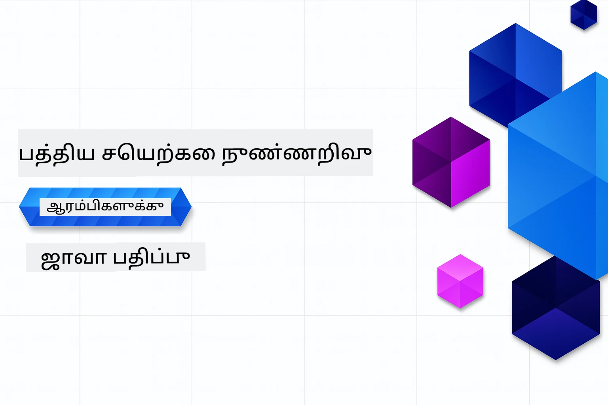

# தொடக்கம் செய்யும் மக்களுக்கான ஜெனரேட்டிவ் AI - Java பதிப்பு
[](https://discord.gg/nTYy5BXMWG)



**நேரம்கொடுக்கும் அளவு**: உள்ளூர் அமைப்பு இல்லாமல் முழு பணிமனையை ஆன்லைனில் முடிக்க முடியும். சுற்றுப்பாா்வை அமைப்பது 2 நிமிடங்கள் ஆகும், மாதிரிகளை ஆராய்வது ஆராய்ச்சியின் ஆழத்தைப் பொருத்து 1-3 மணி நேரம் ஆகலாம்.

> **விரைவான துவக்கம்** 

1. இந்த களஞ்சியத்தை உங்கள் GitHub கணக்கிற்கு Fork செய்யவும்
2. **Code** → **Codespaces** தாவலை கிளிக் செய்யவும் → **...** → **New with options...**
3. இயல்புத்தேர்வுகளை பயன்படுத்தவும் – இது இந்த பாடத்துக்கான மேம்பாட்டு பெட்டி தேர்ந்தெடுக்கப்படும்
4. **Create codespace** க்ளிக் செய்யவும்
5. ماحولம் தயாராக ~2 நிமிடங்கள் காத்திருக்கவும்
6. நேரடியாக [அத்தியாயம் 2: Azure AI Foundry வழங்கல்](./02-SetupDevEnvironment/README.md#step-2-provision-azure-ai-foundry) க்கு செல்லவும்

## பல மொழி ஆதரவு

### GitHub Action மூலம் ஆதரவு (தானியங்கி மற்றும் எப்போதும் புதுப்பிக்கப்பட்டது)

<!-- CO-OP TRANSLATOR LANGUAGES TABLE START -->
[அரபு](../ar/README.md) | [பெங்காலி](../bn/README.md) | [பல்கேரியன்](../bg/README.md) | [புர்மீஸ் (மியான்மார்)](../my/README.md) | [சீன (எளிய)](../zh-CN/README.md) | [சீன (பாரம்பரியம், ஹாங்காங்)](../zh-HK/README.md) | [சீன (பாரம்பரியம், மாகாவ்)](../zh-MO/README.md) | [சீன (பாரம்பரியம், தைவான்)](../zh-TW/README.md) | [குரோஷியன்](../hr/README.md) | [செக்](../cs/README.md) | [டானிஷ்](../da/README.md) | [டச்சு](../nl/README.md) | [எஸ்டோனியன்](../et/README.md) | [பின்லாந்து](../fi/README.md) | [பிரெஞ்சு](../fr/README.md) | [ஜெர்மன்](../de/README.md) | [கிரேக்கம்](../el/README.md) | [ஹீப்ரூ](../he/README.md) | [இந்தி](../hi/README.md) | [ஹங்கேரியன்](../hu/README.md) | [இந்தோனேசியன்](../id/README.md) | [இத்தாலியன்](../it/README.md) | [ஜப்பானீஸ்](../ja/README.md) | [கன்னடா](../kn/README.md) | [க்மர்](../km/README.md) | [கொரியன்](../ko/README.md) | [லிதுவேனியன்](../lt/README.md) | [மலாய்](../ms/README.md) | [மலையாளம்](../ml/README.md) | [மராத்தி](../mr/README.md) | [நேபாளி](../ne/README.md) | [நைஜீரியன் பிட்கின்](../pcm/README.md) | [நார்வேசியன்](../no/README.md) | [பர்ஸியன் (ஃபார்ஸி)](../fa/README.md) | [போலிஷ்](../pl/README.md) | [போர்ச்சுகீஸ் (பிரேசில்)](../pt-BR/README.md) | [போர்ச்சுகீஸ் (போர்ச்சுகல்)](../pt-PT/README.md) | [பஞ்சாபி (குருமுகி)](../pa/README.md) | [ரோமானியன்](../ro/README.md) | [ரஷ்யன்](../ru/README.md) | [செர்பியன் (சைரிலிக்)](../sr/README.md) | [ஸ்லோவாக்](../sk/README.md) | [ஸ்லோவேனியன்](../sl/README.md) | [ஸ்பானிஷ்](../es/README.md) | [ஸ்வாஹிலி](../sw/README.md) | [ஸ்வீடிஷ்](../sv/README.md) | [தகாலோக (பிலிப்பீனோ)](../tl/README.md) | [தமிழ்](./README.md) | [தெலுங்கு](../te/README.md) | [தை](../th/README.md) | [துருக்கிஷ்](../tr/README.md) | [உக்ரைனியன்](../uk/README.md) | [உருது](../ur/README.md) | [வியட்நாமீஸ்](../vi/README.md)

> **உள்ளூரில் கிளோன் செய்ய விரும்புகிறீர்களா?**
>
> இந்தக் களஞ்சியம் 50+ மொழி மொழிபெயர்ப்புக்களை உள்ளடக்கியதனால் பதிவிறக்கும் அளவு பெரிதாகிவிடும். மொழிபெயர்ப்புகள் இல்லாமல் கிளோன் செய்ய, sparse checkout பயன்படுத்தவும்:
>
> **Bash / macOS / Linux:**
> ```bash
> git clone --filter=blob:none --sparse https://github.com/microsoft/Generative-AI-for-beginners-java.git
> cd Generative-AI-for-beginners-java
> git sparse-checkout set --no-cone '/*' '!translations' '!translated_images'
> ```
>
> **CMD (Windows):**
> ```cmd
> git clone --filter=blob:none --sparse https://github.com/microsoft/Generative-AI-for-beginners-java.git
> cd Generative-AI-for-beginners-java
> git sparse-checkout set --no-cone "/*" "!translations" "!translated_images"
> ```
>
> இது உங்களுக்கு பாடத்தை முடிக்க தேவையான அனைத்தையும் மிக விரைவான பதிவிறக்கம் உடன் தரும்.
<!-- CO-OP TRANSLATOR LANGUAGES TABLE END -->

## பாட அமைப்பு & கற்றல் பாதை

### **அத்தியாயம் 1: ஜெனரேட்டிவ் AIக்கு அறிமுகம்**
- **முக்கிய கருத்துக்கள்**: பெரிய மொழி மாதிரிகள், டோக்கன்கள், கருவிகள் மற்றும் AI திறன்கள் பற்றி புரிதல்
- **Java AI சூழல்**: Spring AI மற்றும் OpenAI SDKகளின் மேம்பார்வை
- **மாதிரி உள்ளடக்க நெறிமுறை**: MCPக்கு அறிமுகம் மற்றும் AI முகவரிகளின் தொடர்பு பங்கு
- **பயன்பாட்டுக் களஞ்சியம்**: உரையாடல் மெஷின்கள் மற்றும் உள்ளடக்க உருவாக்கம் உட்பட பயன்பாடுகள்
- **[→ அத்தியாயம் 1 தொடக்கம்](./01-IntroToGenAI/README.md)**

### **அத்தியாயம் 2: மேம்பாட்டு சூழல் அமைப்பு**
- **Azure AI Foundry**: GPT-5.6 Luna உரையாடல் மற்றும் text-embedding-3-small கருவிகளுடன் Bicep மற்றும் Azure Developer CLI (azd) பயன்படுத்தி வழங்கல்
- **Spring Boot 4.1.1 + Spring AI 2.0.1**: `ChatClient` உடன் கற்றல், அதிகாரப்பூர்வ OpenAI Java SDK மற்றும் Azure OpenAI v1 ஐ ஆதரிப்புடன்
- **முக்கியம் இல்லாத प्रमाणीकरणம்**: Microsoft Entra ID உடன் பாதுகாப்பாக இணைக — எந்த API விசைகளும் தேவையில்லை
- **மேம்பாட்டு கருவிகள்**: Docker கான்டெய்னர்கள், VS Code மற்றும் GitHub Codespaces அமைப்புகள்
- **[→ அத்தியாயம் 2 தொடக்கம்](./02-SetupDevEnvironment/README.md)**

### **அத்தியாயம் 3: முக்கிய ஜெனரேட்டிவ் AI நுட்பங்கள்**
- **அதிகாரப்பூர்வ OpenAI Java SDK**: keyless authentication உடன் நேரடியாக Azure OpenAI v1 ஐ அழைக்கவும்
- **பிராரம்ப நிகழ்ச்சி பொறியியல்**: சிறந்த AI மாதிரி பதில்களுக்கு தொழில்நுட்பங்கள்
- **கருவிகள் & வெக்டர் செயல்பாடுகள்**: அர்த்தவியல் தேடல் மற்றும் ஒத்திசைவு ஏற்படுத்தல்
- **திரும்ப பெறுதல்-வலுவடையான உருவாக்கம் (RAG)**: AIஐ உங்கள் சொந்த தரவுத் தொற்றிகளுடன் இணைத்தல்
- **செயல்பாட்டு அழைப்பு**: தனிப்பயன் கருவிகள் மற்றும் பிளக்கின்களுடன் AI திறனை விரிவாக்கம் செய்யவும்
- **[→ அத்தியாயம் 3 தொடக்கம்](./03-CoreGenerativeAITechniques/README.md)**

### **அத்தியாயம் 4: நடைமுறை பயன்பாடுகள் & திட்டங்கள்**
- **பண்பொருள் கதை உற்பத்தியாளர்** (`petstory/`): Azure AI Foundry உடன் படைப்பாற்றல் உள்ளடக்கம் உருவாக்கம்
- **Foundry உள்ளூர் டெமோ** (`foundrylocal/`): OpenAI Java SDK உடன் உள்ளூர் AI மாதிரி ஒருங்கிணைவு
- **MCP கணக்கீட்டு சேவை** (`calculator/`): Spring AI உடன் அடிப்படை மாதிரி உள்ளடக்க நெறிமுறை நடைமுறைப்படுத்தல்
- **[→ அத்தியாயம் 4 தொடக்கம்](./04-PracticalSamples/README.md)**

### **அத்தியாயம் 5: பொறுப்பான AI மேம்பாடு**
- **Azure AI Foundry உள்ளடக்கம் பாதுகாப்பு**: உள்ளடக்கம் வடிகட்டி மற்றும் பாதுகாப்பு முறைகளை சோதனை செய்தல் (கடுமையான தடைகள் மற்றும் மிருகான மறுப்பு)
- **பொறுப்பான AI டெமோ**: நவீன AI பாதுகாப்பு முறைகள் நடைமுறையில் எப்படி பணிபுரிகின்றன என்பதற்கான செய்முறை எடுத்துக்காட்டு
- **சிறந்த நடைமுறைகள்**: நெறிமுறை AI மேம்பாடு மற்றும் கையளிப்பு செய்ய தேவையான வழிகாட்டுதல்கள்
- **[→ அத்தியாயம் 5 தொடக்கம்](./05-ResponsibleGenAI/README.md)**

## கூடுதல் வளங்கள்

<!-- CO-OP TRANSLATOR OTHER COURSES START -->
### LangChain
[](https://aka.ms/langchain4j-for-beginners)
[](https://aka.ms/langchainjs-for-beginners?WT.mc_id=m365-94501-dwahlin)
[](https://github.com/microsoft/langchain-for-beginners?WT.mc_id=m365-94501-dwahlin)
---

### Azure / Edge / MCP / முகவர்கள்
[](https://github.com/microsoft/AZD-for-beginners?WT.mc_id=academic-105485-koreyst)
[](https://github.com/microsoft/edgeai-for-beginners?WT.mc_id=academic-105485-koreyst)
[](https://github.com/microsoft/mcp-for-beginners?WT.mc_id=academic-105485-koreyst)
[](https://github.com/microsoft/ai-agents-for-beginners?WT.mc_id=academic-105485-koreyst)

---
 
### ஜெனரேட்டிவ் AI தொடர்
[](https://github.com/microsoft/generative-ai-for-beginners?WT.mc_id=academic-105485-koreyst)
[-9333EA?style=for-the-badge&labelColor=E5E7EB&color=9333EA)](https://github.com/microsoft/Generative-AI-for-beginners-dotnet?WT.mc_id=academic-105485-koreyst)
[-C084FC?style=for-the-badge&labelColor=E5E7EB&color=C084FC)](https://github.com/microsoft/generative-ai-for-beginners-java?WT.mc_id=academic-105485-koreyst)
[-E879F9?style=for-the-badge&labelColor=E5E7EB&color=E879F9)](https://github.com/microsoft/generative-ai-with-javascript?WT.mc_id=academic-105485-koreyst)

---
 
### முக்கிய கற்றல்
[](https://aka.ms/ml-beginners?WT.mc_id=academic-105485-koreyst)
[](https://aka.ms/datascience-beginners?WT.mc_id=academic-105485-koreyst)
[](https://aka.ms/ai-beginners?WT.mc_id=academic-105485-koreyst)
[](https://github.com/microsoft/Security-101?WT.mc_id=academic-96948-sayoung)
[](https://aka.ms/webdev-beginners?WT.mc_id=academic-105485-koreyst)
[](https://aka.ms/iot-beginners?WT.mc_id=academic-105485-koreyst)
[](https://github.com/microsoft/xr-development-for-beginners?WT.mc_id=academic-105485-koreyst)

---
 
### Copilot தொடர்
[](https://aka.ms/GitHubCopilotAI?WT.mc_id=academic-105485-koreyst)
[](https://github.com/microsoft/mastering-github-copilot-for-dotnet-csharp-developers?WT.mc_id=academic-105485-koreyst)
[](https://github.com/microsoft/CopilotAdventures?WT.mc_id=academic-105485-koreyst)
<!-- CO-OP TRANSLATOR OTHER COURSES END -->

## உதவி பெறுதல்

AI செயலிகள் உருவாக்கியதில் சிக்கல் ஏற்பட்டால் அல்லது கேள்விகள் இருந்தால். MCP பற்றி மற்ற கற்றவர்கள் மற்றும் அனுபவம் வாய்ந்த மேம்படுத்துநர்களுடன் விவாதிக்க இணைந்துகொள்ளுங்கள். கேள்விகள் வரவேற்கப்படுவது மற்றும் அறிவு சுதந்திரமாக பகிரப்பட்டது அங்கு ஒரு ஆதரவான சமூகமாக உள்ளது.

[](https://discord.gg/nTYy5BXMWG)

தயாரிப்பு கருத்து அல்லது பிழைகள் தொடர்பாக்கா் கட்டமைப்பது போது அங்குச் செல்லவும்:

[](https://aka.ms/foundry/forum)

---

<!-- CO-OP TRANSLATOR DISCLAIMER START -->
**மறுப்பு**:
இந்த ஆவணம் AI மொழிபெயர்ப்பு சேவை [Co-op Translator](https://github.com/Azure/co-op-translator) பயன்படுத்தி மொழிபெயர்க்கப்பட்டுள்ளது. நாங்கள் துல்லியத்திற்காக முயற்சி செய்துள்ளோம், ஆனால் தானாக செய்யப்படும் மொழிபெயர்ப்புகளில் பிழைகள் அல்லது தவறுகள் இருக்கலாம் என்பதை கவனத்தில் கொள்ளவும். அசல் ஆவணம் அதன் தாய்மொழியில் அதிகாரப்பூர்வ ஆதாரமாக கருதப்பட வேண்டும். முக்கியமான தகவல்களுக்கு, தொழில்நுட்பமான மனித மொழிபெயர்ப்பு பரிந்துரைக்கப்படுகிறது. இந்த மொழிபெயர்ப்பைப் பயன்படுத்துவதால் ஏற்படும் எந்த தவறான புரிதல்கள் அல்லது தவறான விளக்கத்திற்கும் நாங்கள் பொறுப்பில்வில்லை.
<!-- CO-OP TRANSLATOR DISCLAIMER END -->