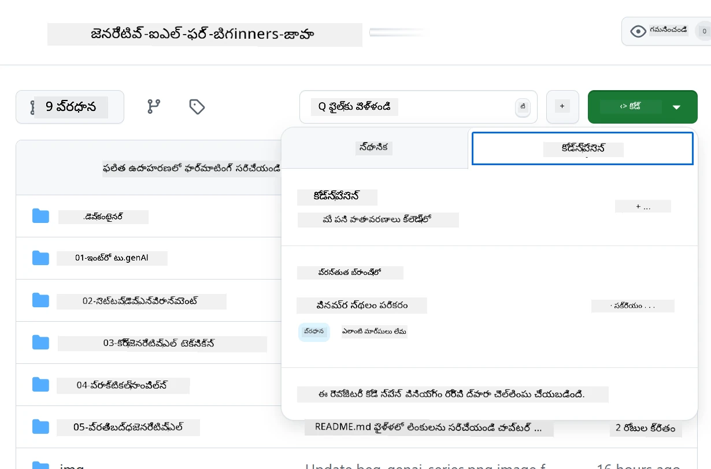
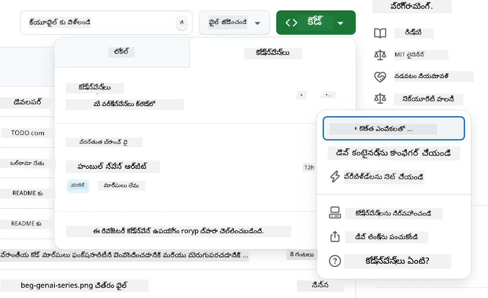
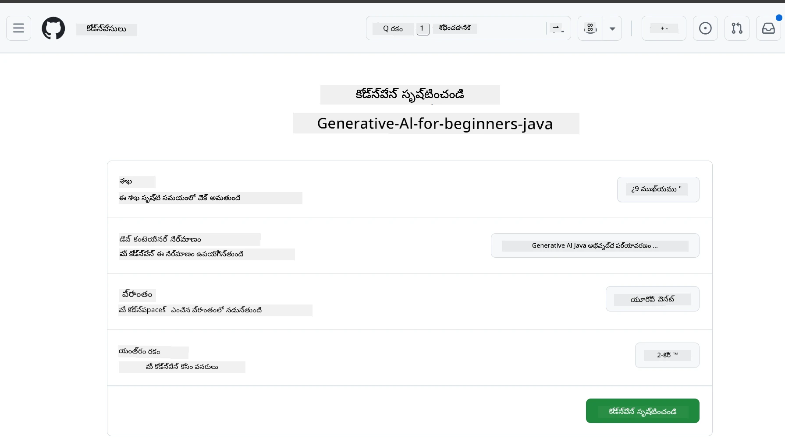
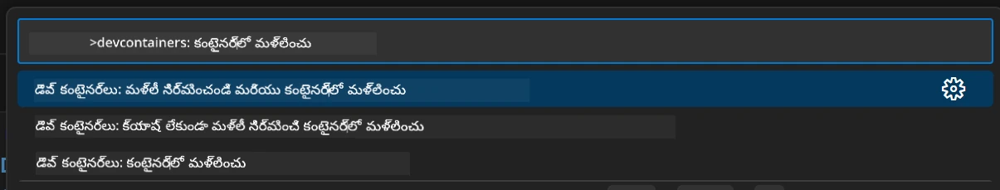
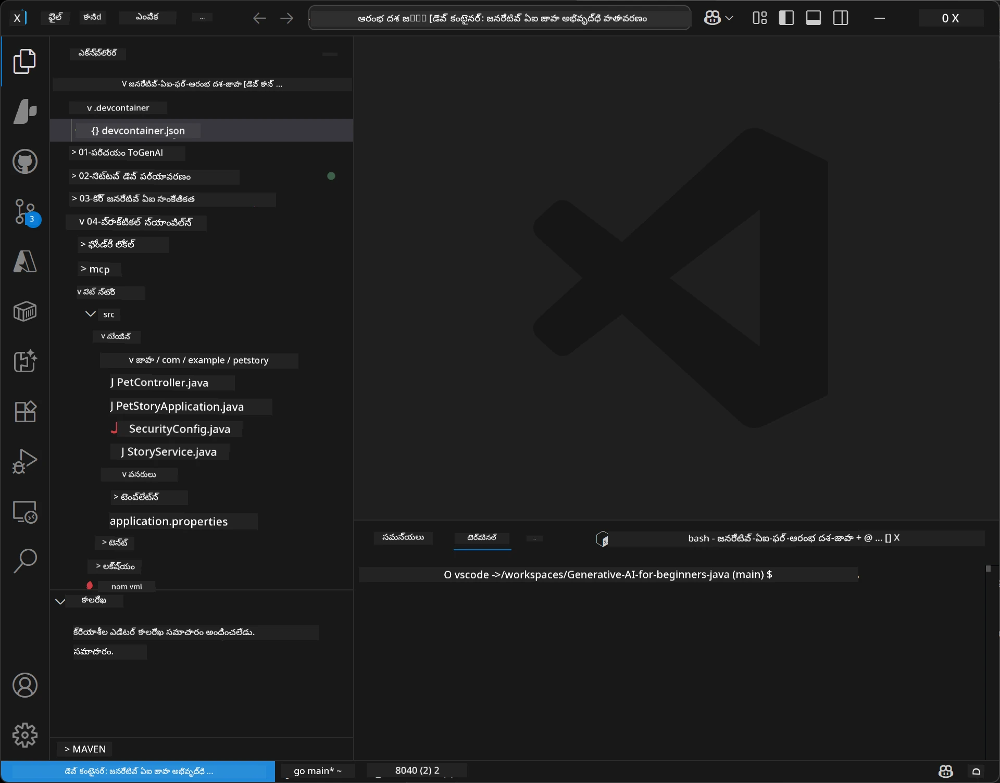
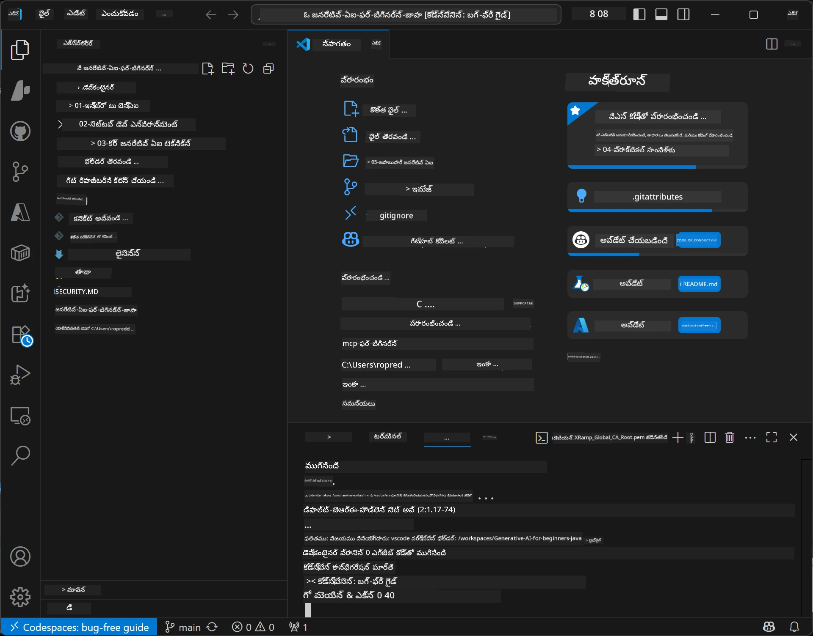

# జనరేటివ్ AI కోసం Java అభివృద్ధి పర్యావరణం ఏర్పాటు చేయడం

> **త్వరిత ప్రారంభం:** మీ AI మోడల్స్‌ ను **Azure AI Foundry**లో Bicep + `azd` తో కొడ్ రూపంలో కొన్ని నిమిషాల్లో ప్రొవైడ్ చేయండి — [Azure AI Foundry సెటప్ గైడ్](getting-started-azure-openai.md)ని చూడండి. అథెంటికేషన్ **కీలెస్** (Microsoft Entra ID) గా ఉంటుంది, కాబట్టి API కీలను నిర్వహించాల్సిన అవసరం లేదు.

## మీరు నేర్చుకొనేది

- AI అప్లికేషన్‌ల కోసం Java అభివృద్ధి పర్యావరణాన్ని ఏర్పాటు చేయడం
- మీకు ఇష్టమైన అభివృద్ధి పర్యావరణాన్ని ఎంపిక చేసి కాన్ఫిగర్ చేసుకోవడం (క్లౌడ్-ఫస్ట్ Codespaces తో, స్థానిక dev కంటైనర్ లేదా పూర్తి స్థానిక సెటప్)
- Azure AI Foundry మోడల్‌కి కనెక్ట్ అయి మీ సెటప్‌ని టెస్ట్ చేయడం

## విషయాల పట్టిక

- [మీరు నేర్చుకొనేది](#మీరు-నేర్చుకొనేది)
- [పరిచయం](#పరిచయం)
- [దశ 1: మీ అభివృద్ధి పర్యావరణం ఏర్పాటు చేయడం](#దశ-1-మీ-అభివృద్ధి-పర్యావరణం-ఏర్పాటు-చేయడం)
  - [ఎంపిక A: GitHub Codespaces (సిఫార్సు చేయబడింది)](#ఎంపిక-a-github-codespaces-సిఫార్సు-చేయబడింది)
  - [ఎంపిక B: స్థానిక dev కంటైనర్](#ఎంపిక-b-స్థానిక-dev-కంటైనర్)
  - [ఎంపిక C: మీ ప్రస్తుత స్థానిక ఇన్స్టలేషన్ ఉపయోగించడం](#ఎంపిక-c-మీ-ప్రస్తుత-స్థానిక-ఇన్స్టలేషన్-ఉపయోగించడం)
- [దశ 2: Azure AI Foundry ప్రొవిజన్ చేయడం](#దశ-2-azure-ai-foundry-ని-ప్రొవిజన్-చేయడం)
- [దశ 3: మీ సెటప్‌ని టెస్ట్ చేయడం](#దశ-3-మీ-సెటప్‌ని-టెస్ట్-చేయడం)
- [సమస్యలకు పరిష్కారం](#సమస్య-పరిష్కారం)
- [సారం](#సారం)
- [తర్వాతి దశలు](#తర్వాతి-దశలు)

## పరిచయం

ఈ అధ్యాయం, అభివృద్ధి పర్యావరణం ఏర్పాటు చేయడంలో మీకు మార్గదర్శకత్వం ఇస్తుంది. ఈ కోర్సు అంతా మోడల్స్ కోసం **Azure AI Foundry** ఉపయోగించబడుతుంది. మీరు మోడల్స్‌ను Bicep మరియు Azure Developer CLI (`azd`)తో కోడ్‌గా ప్రొవైడ్ చేస్తారు, ఆపై **కీలెస్ అథెంటికేషన్** (Microsoft Entra ID) తో కనెక్ట్ అవుతారు — ఏ API కీలను కాపీ చేయాల్సిన లేదా లీక్ చేయాల్సిన అవసరం లేదు.

**స్థానిక సెటప్ కావాల్సిన అవసరం లేదు!** మీరు GitHub Codespaces ఉపయోగించవచ్చు, ఇది మీ బ్రౌజర్లో పూర్తిస్థాయి అభివృద్ధి పర్యావరణాన్ని అందిస్తుంది, అక్కడినుండి Foundryని ప్రొవైడ్ చేయవచ్చు.

ఈ కోర్సు కోసం మేము **Azure AI Foundry** ఉపయోగిస్తున్నాము ఎందుకంటే:
- **కోడ్‌గా ప్రొవైడ్ చేయబడింది** — ఒక `azd up` కలౌడ్ ఖాతా మరియు మోడల్ డిప్లాయ్‌మెంట్‌లను డిప్లాయ్ చేస్తుంది
- **కీలెస్** — మీ Azure సైన్-ఇన్ లేదా మేనేజ్డ్ ఐడెంటిటీతో అథెంటికేట్ అవుతుంది
- **ప్రొడక్షన్-సిద్ధం** — అదే కోడ్ స్థానికంగా మరియు Azureలో పనిచేస్తుంది
- **లవచికమైన** — మీ కోడ్ మార్చకుండానే డిప్లాయ్‌మెంట్ పేరు మార్చి మోడల్స్ మార్చుకోవచ్చు

> **గమనిక**: Azure AI Foundry డిప్లాయ్‌మెంట్‌లు టోకెన్ ప్రకారం బిల్లు చేస్తాయి (పే-యస్-యూ-గో). ప్రొవిజనింగ్, ప్రాంతం మరియు ఖర్చు వివరాల కోసం [Azure AI Foundry సెటప్ గైడ్](getting-started-azure-openai.md)ని చూడండి.


## దశ 1: మీ అభివృద్ధి పర్యావరణం ఏర్పాటు చేయడం

<a name="quick-start-cloud"></a>

ఈ Generative AI for Java కోర్సు కోసం అవసరమైన అన్ని టూల్స్ ఉండేలా, సెటప్ సమయాన్ని తగ్గించేందుకు మేము ఒక ముందుగా కాన్ఫిగర్ చేసిన అభివృద్ధి కంటైనర్ ఏర్పాటు చేశాం. మీకు ఇష్టమైన అభివృద్ధి విధానాన్ని ఎంచుకోండి:

### పర్యావరణం సెటప్ ఎంపికలు:

#### ఎంపిక A: GitHub Codespaces (సిఫార్సు చేయబడింది)

**2 నిమిషాలలో కోడింగ్ ప్రారంభించండి - స్థానిక సెటప్ అవసరం లేదు!**

1. ఈ రిపొజిటరీని మీ GitHub ఖాతాకు Fork చేయండి
   > **గమనిక**: మీరు బేసిక్ కాన్ఫిగ్ సవరించాలనుకుంటే [Dev Container Configuration](../../../.devcontainer/devcontainer.json)ని చూడండి
2. **Code** → **Codespaces** ట్యాబ్ → **...** → **New with options...** క్లిక్ చేయండి
3. డిఫాల్ట్స్ ఉపయోగించండి – ఇది ఈ కోర్సు కోసం సృష్టించిన **Generative AI Java Development Environment** అనే Dev container కాన్ఫిగరేషన్‌ను ఎంచుకుంటుంది
4. **Create codespace** క్లిక్ చేయండి
5. పర్యావరణం సిద్ధంకావడానికి సుమారు 2 నిమిషాలు వేచి ఉండండి
6. [దశ 2: Azure AI Foundry ప్రొవిజన్ చేయడం](#దశ-2-azure-ai-foundry-ని-ప్రొవిజన్-చేయడం)కి కొనసాగండి








> **Codespaces లాభాలు**:
> - స్థానిక ఇన్స్టలేషన్ అవసరం లేదు
> - ఏ బ్రౌజర్ ఉన్న పరికరంలో పని చేస్తుంది
> - అన్ని అవసరమైన టూల్స్ మరియు డిపెండెన్సీలతో ముందే కాన్ఫిగర్ చేయబడి ఉంటుంది
> - వ్యక్తిగత ఖాతాలకు నెలకు 60 గంటలు ఉచితం
> - అన్ని విద్యార్థులకు సమాన పర్యావరణం

#### ఎంపిక B: స్థానిక dev కంటైనర్

**Docker తో స్థానిక అభివృద్ధిని ఇష్టపడే డెవలపర్లకు**

1. ఈ రిపొజిటరీని Fork చేసి స్థానిక మెషีน్లో clone చేయండి
   > **గమనిక**: మీరు బేసిక్ కాన్ఫిగ్ సవరించాలనుకుంటే [Dev Container Configuration](../../../.devcontainer/devcontainer.json)ని చూసుకోండి
2. [Docker Desktop](https://www.docker.com/products/docker-desktop/) మరియు [VS Code](https://code.visualstudio.com/) ఇన్స్టాల్ చేయండి
3. VS Codeలో [Dev Containers ఎక్స్‌టెన్షన్](https://marketplace.visualstudio.com/items?itemName=ms-vscode-remote.remote-containers) ఇన్స్టాల్ చేయండి
4. రిపొజిటరీ ఫోల్డర్‌ను VS Codeలో ఓపెన్ చేయండి
5. ప్రాంప్టు వచ్చినపుడు **Reopen in Container** క్లిక్ చేయండి (లేదా `Ctrl+Shift+P` → "Dev Containers: Reopen in Container" ఉపయోగించండి)
6. కంటైనర్ బిల్డ్ అయి మొదలవ్వడానికి వేచి ఉండండి
7. [దశ 2: Azure AI Foundry ప్రొవిజన్ చేయడం](#దశ-2-azure-ai-foundry-ని-ప్రొవిజన్-చేయడం)కి కొనసాగండి





#### ఎంపిక C: మీ ప్రస్తుత స్థానిక ఇన్స్టలేషన్ ఉపయోగించడం

**ఉన్న Java పర్యావరణాలతో ఉన్న డెవలపర్లకు**

మునుపటి షరతులు:
- [Java 21+](https://www.oracle.com/java/technologies/javase/jdk21-archive-downloads.html) 
- [Maven 3.9+](https://maven.apache.org/download.cgi)
- [VS Code](https://code.visualstudio.com) లేదా మీ ఇష్టమైన IDE

దశలు:
1. ఈ రిపొజిటరీని మీ స్థానిక మెషీన్‌లో clone చేయండి
2. ప్రాజెక్టును మీ IDEలో ఓపెన్ చేయండి
3. [దశ 2: Azure AI Foundry ప్రొవిజన్ చేయడం](#దశ-2-azure-ai-foundry-ని-ప్రొవిజన్-చేయడం)కి కొనసాగండి

> **ప్రో చిట్కా**: మీ మెషీన్ తక్కువ సామర్థ్యం గలదైతే కానీ VS Code స్థానికంగా కావాలంటే, GitHub Codespaces ఉపయోగించండి! మీరు మీ స్థానిక VS Codeని క్లౌడ్-హోస్టెడ్ Codespaceకు కనెక్ట్ చేసుకోవచ్చు, ఇద్దరి లాభాలు పొందడం కోసం.




## దశ 2: Azure AI Foundry ని ప్రొవిజన్ చేయడం

కోర్సు AI మోడల్స్‌ని Azure AI Foundryలో కోడ్ రూపంలో డిప్లాయ్ చేయండి. రిపొజిటరీ రూట్ నుండి:

```bash
cd 02-SetupDevEnvironment
azd auth login
az login
azd up
```

`azd` మీరు ఎన్విరాన్మెంట్ పేరు, సబ్స్క్రిప్షన్, ప్రాంతం కోరుతుంది, `gpt-5.6-luna` మరియు `text-embedding-3-small` డిప్లాయ్‌మెంట్‌లతో Azure AI Foundry ఖాతాను ప్రొవైడ్ చేస్తుంది, మరియు ఉదాహరణ `.env` ఫైల్లో ఎండ్‌పాయింట్ వ్రాస్తుంది - అన్నీ **కీలెస్** authentication తో (ఏ API కీలలు అవసరం కావు).

> **పూర్తి వాక్‌త్రూ:** అవసరాల గురించి, మాన్యువల్ (పోర్టల్) ప్రత్యామ్నాయం, ప్రాంత మార్గదర్శనం, ఖర్చు/క్లీనప్ గమనికల కోసం [Azure AI Foundry Setup Guide](getting-started-azure-openai.md)ని చూడండి.

## దశ 3: మీ సెటప్‌ని టెస్ట్ చేయడం

ఒకసారి మీరు Foundry మోడల్స్ ప్రొవైడ్ చేసిన తర్వాత, [02-SetupDevEnvironment/examples/basic-chat-azure](../../../02-SetupDevEnvironment/examples/basic-chat-azure) లోని ఉదాహరణ అప్లికేషన్‌తో కనెక్షన్‌ను టెస్ట్ చేయండి.

1. మీ అభివృద్ధి పర్యావరణంలో టెర్మినల్ ఓపెన్ చేయండి.
2. ఉదాహరణ ఫోల్డర్‌కు వెళ్లండి:
   ```bash
   cd 02-SetupDevEnvironment/examples/basic-chat-azure
   ```
3. మీరు సైన్ఇన్‌ అయినట్లు నిర్ధారించుకోండి (కీలెస్ authentication కి టోకెన్ అవసరం):
   ```bash
   az login
   ```
   > మీరు `azd up` నడిపి ఉంటే, మీ ఎండ్‌పాయింట్ కలిగిన `.env` ఫైల్ ఇప్పటికే వ్రాయబడింది.
4. అప్లికేషన్ నడిపించండి:
   ```bash
   mvn clean spring-boot:run
   ```

మీరు `gpt-5.6-luna` మోడల్ నుండి ఒక ప్రతిస్పందన చూడాలి.

### ఉదాహరణ కోడ్ అర్థం చేసుకోవడం

[basic-chat ఉదాహరణ](./examples/basic-chat-azure/README.md) **Spring Boot 4.1.1** మరియు **Spring AI 2.0.1** ఉపయోగిస్తుంది. Spring AI లోని `ChatClient` అధికార OpenAI Java SDK ఆధారంగా ఉంది, Azure OpenAI **v1** ఎండ్‌పాయింట్‌కు కీలెస్ authentication తో కనెక్ట్ అవుతుంది.

**కోడ్ ఏమి చేస్తుంది:**
- Azure AI Foundryకు మీ Azure సైన్-ఇన్ (Microsoft Entra ID) తో కనెక్ట్ అవుతుంది — ఏ API కీ లేకుండా
- `gpt-5.6-luna` మోడల్‌కు ప్రాంప్ట్ పంపుతుంది
- AI నుండి ప్రతిస్పందన అందుకొని ప్రదర్శిస్తుంది
- మీ సెటప్ సరిగా పనిచేస్తుందేమో ధృవీకరిస్తుంది

**ముఖ్యమైన డిపెండెన్సీలు** ([pom.xml](../../../02-SetupDevEnvironment/examples/basic-chat-azure/pom.xml) న్నుంచి ఉదాహరణ):
```xml
<dependency>
    <groupId>org.springframework.ai</groupId>
    <artifactId>spring-ai-starter-model-openai</artifactId>
</dependency>
<dependency>
    <groupId>com.openai</groupId>
    <artifactId>openai-java</artifactId>
</dependency>
<dependency>
    <groupId>com.azure</groupId>
    <artifactId>azure-identity</artifactId>
    <version>${azure-identity.version}</version>
</dependency>
```

POM OpenAI Java **4.63.1** మరియు Azure Identity **1.18.6** ని స్పష్టంగా నిర్వచిస్తుంది. Spring AI 2 లో Azure-స్పెసిఫిక్ స్టార్టర్ తీసివేయబడింది; Azure Identity క్రెడెన్షియల్ బీన్ కోసం ఇంకా అవసరం.

**కాన్ఫిగరేషన్** ([application.yml](../../../02-SetupDevEnvironment/examples/basic-chat-azure/src/main/resources/application.yml)):
```yaml
spring:
  ai:
    openai:
      base-url: ${AZURE_OPENAI_ENDPOINT}
      microsoft-foundry: true
      chat:
        model: ${AZURE_OPENAI_DEPLOYMENT:gpt-5.6-luna}
        reasoning-effort: none
        max-completion-tokens: 500
```

కీలెస్ authentication స్పష్టంగా [BasicChatApplication.java](../../../02-SetupDevEnvironment/examples/basic-chat-azure/src/main/java/com/example/BasicChatApplication.java) లో కాన్ఫిగర్ చేయబడింది, API కీ లేకుండా కాదు. దాని బేరర్ క్రెడెన్షియల్ `DefaultAzureCredential` ఉపయోగిస్తుంది, `https://ai.azure.com/.default` స్కోప్ తో, మరియు `OpenAIClient` `/openai/v1`ను లక్ష్యంగా పెట్టుకుంది. యాప్ ఆ క్లయింట్‌ను Spring AI చాట్ మోడల్‌కి అందిస్తుంది, కాబట్టి గ్లోబల్ `OPENAI_API_KEY` Azure authentication‌ను ఓవర్‌రైడ్ చేయదు.

చాట్ సెట్టింగ్స్ `spring.ai.openai.chat` కింద నేరుగా ఉన్నాయి, `options` బ్లాక్ లేకుండా. పాఠం Chat Completions ను `reasoning-effort: none` మరియు 500 టోకెన్ పూర్తికరణ కాప్‌తో ఉంచుతుంది; `temperature` లేదా `max-tokens` సెట్స్ చేయదు. API ఎంపిక మరియు టూల్ కాలింగ్ కోసం [ఉదాహరణ కాన్ఫిగరేషన్ రిఫరెన్స్](./examples/basic-chat-azure/README.md#spring-configuration) చూడండి.

## సారం

పై దశలను పూర్తి చేసిన తర్వాత, మీ వద్ద:

- Bicep + `azd` తో కోడ్‌గా Azure AI Foundry మోడల్స్ ప్రొవైడ్ చేసారు
- Java అభివృద్ధి పర్యావరణం పని చేస్తుంది (Codespaces, dev కంటైనర్లు, లేదా స్థానికంగా ఉండొచ్చు)
- కీలెస్ authentication (Microsoft Entra ID) తో Azure AI Foundry కు కనెక్ట్ అయ్యారు — ఏ API కీలు అవసరం లేదు
- మీ మోడల్‌తో কথা చెయ్యి ఒక సులభమైన ఉదాహరణతో పరీక్షించారు

## తర్వాతి దశలు

[అధ్యాయం 3: కోర్ జనరేటివ్ AI సాంకేతికతలు](../03-CoreGenerativeAITechniques/README.md)

## సమస్య పరిష్కారం

సమస్యలున్నాయా? ఇక్కడ సాధారణ సమస్యలు మరియు పరిష్కారాలు ఉన్నాయి:

- **అథెంటికేషన్ విఫలమవుతుందా (401/403)?** 
  - `az login` నడపండి — authentication కీలెస్, కాబట్టి మీరు సైన్-ఇన్ అయి ఉండాలి
  - మీ ఖాతాకు రిసోర్స్ లో **Cognitive Services OpenAI User** రోల్ ఉన్నదని ధృవీకరించుకోండి
  - మీరు తాజాగా ప్రొవైడ్ చేసినట్లైతే, రోల్ అసైన్‌మెంట్ ప్రపగేట్ అవ్వడానికి కొంత సమయం వేచుకోండి

- **Maven కనిపించడంలేదా?** 
  - dev కంటైనర్లు/Codespaces ఉపయోగిస్తుంటే, Maven ముందే ఇన్స్టాల్ అయి ఉంటుంది
  - స్థానిక సెటప్ కోసం, Java 21+ మరియు Maven 3.9+ ఇన్స్టాల్ చేసుకున్నట్టుగా చూసుకోండి
  - ఇన్స్టలేషన్ ధృవీకరించడానికి `mvn --version` ప్రయత్నించండి

- **`azd` కనిపించడం లేదా ప్రొవిజనింగ్ విఫలం?** 
  - [Azure Developer CLI](https://aka.ms/azure-dev/install) ఇన్స్టాల్ చేసి `azd auth login` నడపండి
  - `gpt-5.6-luna` మరియు `text-embedding-3-small` అందుబాటులో ఉన్న ప్రాంతం ఎంచుకోండి (ఉదా: `eastus2`), మరియు మీ సబ్స్క్రిప్షన్‌లో సరిపడా క్వోటా ఉండాలి
  - వివరాల కోసం [Azure AI Foundry సెటప్ గైడ్](getting-started-azure-openai.md) చూడండి

- **Dev కంటైనర్ మొదలవడం కాదు?** 
  - Docker Desktop రన్ అవుతోంది కాబట్టి చెక్ చేసుకోండి (స్థానిక అభివృద్ధి కోసం)
  - కంటైనర్ పునరావృతిగా కట్టించడానికి ప్రయత్నించండి: `Ctrl+Shift+P` → "Dev Containers: Rebuild Container"

- **అప్లికేషన్ కాంపైల్ లో లోపాలు?**
  - సరైన డైరెక్టరీలో ఉన్నారా చూసుకోండి: `02-SetupDevEnvironment/examples/basic-chat-azure`
  - క్లియర్ చేసి మళ్లీ కాంపైల్ చేయడానికి ప్రయత్నించండి: `mvn clean compile`

> **సహాయం కావాలా?**: ఇంకా సమస్యలు ఉంటే రిపొజిటరీలో ఒక ఇష్యూ సృష్టించండి, మేము మీకు సహాయం చేస్తాం.

---

<!-- CO-OP TRANSLATOR DISCLAIMER START -->
**అస్వీకరణ**:
ఈ పత్రం AI అనువాద సేవ [Co-op Translator](https://github.com/Azure/co-op-translator) ఉపయోగించి అనువదించబడింది. మేము ఖచ్చితత్వానికి ప్రయత్నిస్తున్నప్పటికీ, ఆటోమేటెడ్ అనువాదాలు తప్పులు లేదా అసమగ్రతలను కలిగి ఉండవచ్చు. దాని స్వదేశ భాషలో ఉన్న అసలు పత్రాన్ని అధికారం కలిగిన మూలంగా పరిగణించాలి. కీలకమైన సమాచారం కోసం, ప్రొఫెషనల్ మానవ అనువాదాన్ని సిఫారసు చేస్తాము. ఈ అనువాదం ఉపయోగం వల్ల కలిగే ఏవైనా అపార్థాలు లేదా తప్పుదారులు కోసం మేము బాధ్యత వహించము.
<!-- CO-OP TRANSLATOR DISCLAIMER END -->