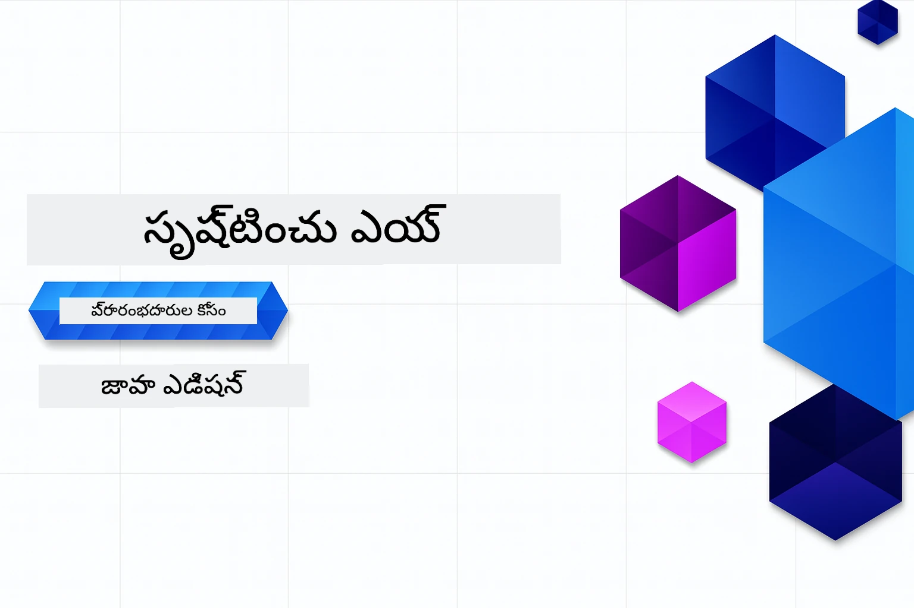

# ప్రారంభikkilar కోసం జనరೇಟివ్ AI - Java సంచిక
[](https://discord.gg/nTYy5BXMWG)



**సమయ నిబద్ధత**: మొత్తం వర్క్‌షాప్ స్థానిక సెటప్ లేకుండా ఆన్‌లైన్‌లో పూర్తయవుతుంది. పరిసరాల సెటప్‌కు 2 నిమిషాలు పడుతుంది, నమూనాలను అన్వేషించడంలో అన్వేషణ లోతు ఆధారంగా 1-3 గంటల వరకు కావచ్చు.

> **త్వరిత ప్రారంభం** 

1. ఈ రిపోజిటరీని మీ GitHub ఖాతాకు ఫోర్క్ చేయండి
2. క్లిక్ చేయండి **Code** → **Codespaces** ట్యాబ్ → **...** → **New with options...**
3. డిఫాల్ట్స్ ఉపయోగించండి – ఇది ఈ కోర్సుకు సృష్టించిన అభివృద్ధి కాన్టెయినర్‌ను ఎంచుకుంటుంది
4. క్లిక్ చేయండి **Create codespace**
5. పరిసరాలు సిద్ధంగా ఉండటానికి సుమారు 2 నిమిషాలు వేచి ఉండండి
6. నేరుగా [అధ్యాయం 2: Azure AI Foundryని ప్రావిధాన్ చేయండి](./02-SetupDevEnvironment/README.md#step-2-provision-azure-ai-foundry)కు వెళ్లండి

## బహుభాషా మద్దతు

### GitHub చర్య ద్వారా మద్దతు (ఆటోమేటెడ్ & ఎప్పుడూ తాజా)

<!-- CO-OP TRANSLATOR LANGUAGES TABLE START -->
[అరబిక్](../ar/README.md) | [బెంగాలీ](../bn/README.md) | [బల్గేరియన్](../bg/README.md) | [బర్మీస్ (మయన్మార్)](../my/README.md) | [చైనా (సింప్లిఫైడ్)](../zh-CN/README.md) | [చైనా (ట్రెడిషనల్, హాంకాంగ్)](../zh-HK/README.md) | [చైనా (ట్రెడిషనల్, మకావు)](../zh-MO/README.md) | [చైనా (ట్రెడిషనల్, తైవాన్)](../zh-TW/README.md) | [క్రొయేషియన్](../hr/README.md) | [చెక్](../cs/README.md) | [డానిష్](../da/README.md) | [డచ్](../nl/README.md) | [ఎస్టోనియన్](../et/README.md) | [ఫిన్నిష్](../fi/README.md) | [ఫ్రెంచ్](../fr/README.md) | [జర్మన్](../de/README.md) | [గ్రీక్](../el/README.md) | [హేబ్రూ](../he/README.md) | [హిందీ](../hi/README.md) | [హంగేరియన్](../hu/README.md) | [ఇండోనేషియన్](../id/README.md) | [ఇటాలియన్](../it/README.md) | [జపనీస్](../ja/README.md) | [కన్నడ](../kn/README.md) | [ఖ్మేర్](../km/README.md) | [కొరియన్](../ko/README.md) | [లిథ్వేనియన్](../lt/README.md) | [మలయ్](../ms/README.md) | [మలయాళం](../ml/README.md) | [మరాఠీ](../mr/README.md) | [నేపాళీ](../ne/README.md) | [నైజీరియన్ పిడగిన్](../pcm/README.md) | [నార్వేజియన్](../no/README.md) | [పర్శియన్ (ఫార్సీ)](../fa/README.md) | [పోలిష్](../pl/README.md) | [పోర్చుగీసు (బ్రెజిల్)](../pt-BR/README.md) | [పోర్చుగీసు (పోర్టుగల్)](../pt-PT/README.md) | [పంజాబీ (గుర్ముఖి)](../pa/README.md) | [రోమానియన్](../ro/README.md) | [రష్యన్](../ru/README.md) | [సెర్బియన్ (సిరిలిక్)](../sr/README.md) | [స్లోవాక్](../sk/README.md) | [స్లోవీనియన్](../sl/README.md) | [స్పానిష్](../es/README.md) | [స్వాహిలి](../sw/README.md) | [స్వీడిష్](../sv/README.md) | [టాగాలాగ్ (ఫిలిపినో)](../tl/README.md) | [తమిళ్](../ta/README.md) | [తెలుగు](./README.md) | [థాయ్](../th/README.md) | [తుర్కిష్](../tr/README.md) | [ఉక్రెయిన్](../uk/README.md) | [ఉర్దూ](../ur/README.md) | [వియత్నామీస్](../vi/README.md)

> **స్థానికంగా క్లోన్ చేయాలని விருப்பு ఉంటే?**
>
> ఈ రిపోజిటరీలో 50+ భాషా అనువాదాలు ఉన్నాయి, ఇవి డౌన్లోడ్ పరిమాణాన్ని గణనీయంగా పెంచుతాయి. అనువాదాలు లేకుండా క్లోన్ చేసేందుకు స్పార్స్ చెక్అవుట్ ఉపయోగించండి:
>
> **Bash / macOS / Linux:**
> ```bash
> git clone --filter=blob:none --sparse https://github.com/microsoft/Generative-AI-for-beginners-java.git
> cd Generative-AI-for-beginners-java
> git sparse-checkout set --no-cone '/*' '!translations' '!translated_images'
> ```
>
> **CMD (Windows):**
> ```cmd
> git clone --filter=blob:none --sparse https://github.com/microsoft/Generative-AI-for-beginners-java.git
> cd Generative-AI-for-beginners-java
> git sparse-checkout set --no-cone "/*" "!translations" "!translated_images"
> ```
>
> ఇది కోర్సును పూర్తిచేయడానికి మీరు అవసరమైన అన్ని దాన్ని తక్కువ సమయంతో డౌన్లోడ్ చేస్తుంది.
<!-- CO-OP TRANSLATOR LANGUAGES TABLE END -->

## కోర్సు నిర్మాణం & నేర్చుకునే మార్గం

### **అధ్యాయం 1: జనరేటివ్ AI పరిచయం**
- **మూల సూత్రాలు**: పెద్ద భాషా మోడ్యూల్స్, టోకన్లు, ఎంబెడ్డింగ్స్ మరియు AI సామర్ధ్యాలను అవగాహన చేసుకోవడం
- **Java AI ఎకోసిస్టమ్**: Spring AI మరియు OpenAI SDKs సమీక్ష
- **మోడల్ కాంటెక్స్ట్ ప్రోటోకాల్**: MCPకి పరిచయం మరియు AI ఏజెంట్ కమ్యూనికేషన్‌లో ఇది చేసే పాత్ర
- **ప్రయోగాత్మక అనువర్తనాలు**: చాట్‌బాట్స్, కంటెంట్ ఉత్పత్తి సహా వాస్తవ ప్రపంచ పరిస్థితులు
- **[→ అధ్యాయం 1 ప్రారంభించండి](./01-IntroToGenAI/README.md)**

### **అధ్యాయం 2: అభివృద్ధి పరిసర సెటప్**
- **Azure AI Foundry**: Bicep మరియు Azure Developer CLI (azd)తో GPT-5.6 Luna చాట్ మరియు text-embedding-3-small ఎంబెడ్డింగ్స్ ప్రావిధానీకరణ
- **Spring Boot 4.1.1 + Spring AI 2.0.1**: అధికారిక OpenAI Java SDK మరియు Azure OpenAI v1 ఆధారంగా `ChatClient`తో నేర్చుకోండి
- **కీలెస్ ప్రామాణీకరణ**: Microsoft Entra IDతో సురక్షితంగా కనెక్ట్ అవ్వండి – ఏ API కీలు నిర్వహించాల్సిన అవసరం లేదు
- **అభివృద్ధి సాధనాలు**: Docker కంటెయినర్లు, VS కోడ్, మరియు GitHub Codespaces కాన్ఫిగరేషన్
- **[→ అధ్యాయం 2 ప్రారంభించండి](./02-SetupDevEnvironment/README.md)**

### **అధ్యాయం 3: మూల జనరేటివ్ AI సాంకేతికతలు**
- **మరాఫైస్ అధికారిక OpenAI Java SDK**: కీలెస్ ప్రామాణీకరణతో Azure OpenAI v1కి నేరుగా కాల్ చేయండి
- **ప్రాంప్ట్ ఇంజనీరింగ్**: AI మోడల్ ప్రతిస్పందనల కోసం సాంకేతిక నైపుణ్యాలు
- **ఎంబెడ్డింగ్స్ & వెక్టర్ ఆపరేషన్లు**: సేమాంటిక్ సెర్చ్ మరియు సాదృశ్య మ్యాచ్ చేయడం అమలు చేయండి
- **రిట్రీవల్-ఆగ్మెంటెడ్ జనరేషన్ (RAG)**: AIను మీ స్వంత డేటా వనరులతో కలపండి
- **ఫంక్షన్ కాలింగ్**: అనుకూల సాధనాలు మరియు ప్లగ్ఇన్‌లతో AI సామర్ధ్యాలను విస్తరించండి
- **[→ అధ్యాయం 3 ప్రారంభించండి](./03-CoreGenerativeAITechniques/README.md)**

### **అధ్యాయం 4: ప్రయోగాత్మక అనువర్తనాలు & ప్రాజెక్టులు**
- **పెట్ స్టోరీ జనరేటర్** (`petstory/`): Azure AI Foundryతో సృజనాత్మక కంటెంట్ ఉత్పత్తి
- **Foundry స్థానిక డెమో** (`foundrylocal/`): OpenAI Java SDKతో స్థానిక AI మోడల్ ఇంటిగ్రేషన్
- **MCP కాలిక్యులేటర్ సర్వీస్** (`calculator/`): Spring AIతో ప్రాథమిక మోడల్ కాంటెక్స్ట్ ప్రోటోకాల్ అమలు
- **[→ అధ్యాయం 4 ప్రారంభించండి](./04-PracticalSamples/README.md)**

### **అధ్యాయం 5: బాధ్యతాయుత AI అభివృద్ధి**
- **Azure AI Foundry కంటెంట్ సేఫ్టీ**: అంతర్బుద్ధి కంటెంట్ ఫిల్టరింగ్ మరియు సేఫ్టీ మెకానిజంకు పరీక్షలు (హార్డ్ బ్లాక్స్ మరియు సాఫ్ట్ రిజెక్షన్స్)
- **బాధ్యతాయుత AI డెమో**: ఆధునిక AI సేఫ్టీ ప్రణాళికలు ప్రాక్టికల్‌లో ఎలా పని చేస్తాయో చూపించే హ్యాండ్స్-ఆన్ ఉదాహరణ
- **ముందస్తు ఆచారాలు**: నైతిక AI అభివృద్ధి మరియు నియామకానికి అవసరమైన మార్గదర్శకాలు
- **[→ అధ్యాయం 5 ప్రారంభించండి](./05-ResponsibleGenAI/README.md)**

## అదనపు వనరులు

<!-- CO-OP TRANSLATOR OTHER COURSES START -->
### LangChain
[](https://aka.ms/langchain4j-for-beginners)
[](https://aka.ms/langchainjs-for-beginners?WT.mc_id=m365-94501-dwahlin)
[](https://github.com/microsoft/langchain-for-beginners?WT.mc_id=m365-94501-dwahlin)
---

### Azure / Edge / MCP / ఏజెంట్లు
[](https://github.com/microsoft/AZD-for-beginners?WT.mc_id=academic-105485-koreyst)
[](https://github.com/microsoft/edgeai-for-beginners?WT.mc_id=academic-105485-koreyst)
[](https://github.com/microsoft/mcp-for-beginners?WT.mc_id=academic-105485-koreyst)
[](https://github.com/microsoft/ai-agents-for-beginners?WT.mc_id=academic-105485-koreyst)

---
 
### జనరేటివ్ AI సిరీస్
[](https://github.com/microsoft/generative-ai-for-beginners?WT.mc_id=academic-105485-koreyst)
[-9333EA?style=for-the-badge&labelColor=E5E7EB&color=9333EA)](https://github.com/microsoft/Generative-AI-for-beginners-dotnet?WT.mc_id=academic-105485-koreyst)
[-C084FC?style=for-the-badge&labelColor=E5E7EB&color=C084FC)](https://github.com/microsoft/generative-ai-for-beginners-java?WT.mc_id=academic-105485-koreyst)
[-E879F9?style=for-the-badge&labelColor=E5E7EB&color=E879F9)](https://github.com/microsoft/generative-ai-with-javascript?WT.mc_id=academic-105485-koreyst)

---
 
### ముఖ్యమైన అభ్యాసం
[](https://aka.ms/ml-beginners?WT.mc_id=academic-105485-koreyst)
[](https://aka.ms/datascience-beginners?WT.mc_id=academic-105485-koreyst)
[](https://aka.ms/ai-beginners?WT.mc_id=academic-105485-koreyst)
[](https://github.com/microsoft/Security-101?WT.mc_id=academic-96948-sayoung)
[](https://aka.ms/webdev-beginners?WT.mc_id=academic-105485-koreyst)
[](https://aka.ms/iot-beginners?WT.mc_id=academic-105485-koreyst)
[](https://github.com/microsoft/xr-development-for-beginners?WT.mc_id=academic-105485-koreyst)

---
 
### కోపైలట్ సిరీస్
[](https://aka.ms/GitHubCopilotAI?WT.mc_id=academic-105485-koreyst)
[](https://github.com/microsoft/mastering-github-copilot-for-dotnet-csharp-developers?WT.mc_id=academic-105485-koreyst)
[](https://github.com/microsoft/CopilotAdventures?WT.mc_id=academic-105485-koreyst)
<!-- CO-OP TRANSLATOR OTHER COURSES END -->

## సహాయం పొందడం

మీరు మనసు తగ్గిపోతే లేదా AI యాప్స్ నిర్మాణం పై ఏవైనా ప్రశ్నలు ఉన్నట్లయితే, MCP గురించి చర్చలలో భాగంగా ఇతర అభ్యాసకులు మరియు అనుభవజ్ఞులైన డెవలపర్లలో చేరండి. ఇది ప్రశ్నలు స్వాగతించే మరియు జ్ఞానాన్ని స్వేచ్ఛగా పంచుకునే మద్దతు సమాజం.

[](https://discord.gg/nTYy5BXMWG)

మీరు ఉత్పత్తి అభిప్రాయం లేదా შეცతులు నివేదించాలనుకుంటే:

[](https://aka.ms/foundry/forum)

---

<!-- CO-OP TRANSLATOR DISCLAIMER START -->
**అస్వీకరణ**:
ఈ పత్రం AI అనువాద సేవ [Co-op Translator](https://github.com/Azure/co-op-translator) ఉపయోగించి అనువదించబడింది. మేము ఖచ్చితత్వానికి ప్రయత్నిస్తున్నప్పటికీ, ఆటోమేటెడ్ అనువాదాలు తప్పులు లేదా అసమగ్రతలను కలిగి ఉండవచ్చు. దాని స్వదేశ భాషలో ఉన్న అసలు పత్రాన్ని అధికారం కలిగిన మూలంగా పరిగణించాలి. కీలకమైన సమాచారం కోసం, ప్రొఫెషనల్ మానవ అనువాదాన్ని సిఫారసు చేస్తాము. ఈ అనువాదం ఉపయోగం వల్ల కలిగే ఏవైనా అపార్థాలు లేదా తప్పుదారులు కోసం మేము బాధ్యత వహించము.
<!-- CO-OP TRANSLATOR DISCLAIMER END -->