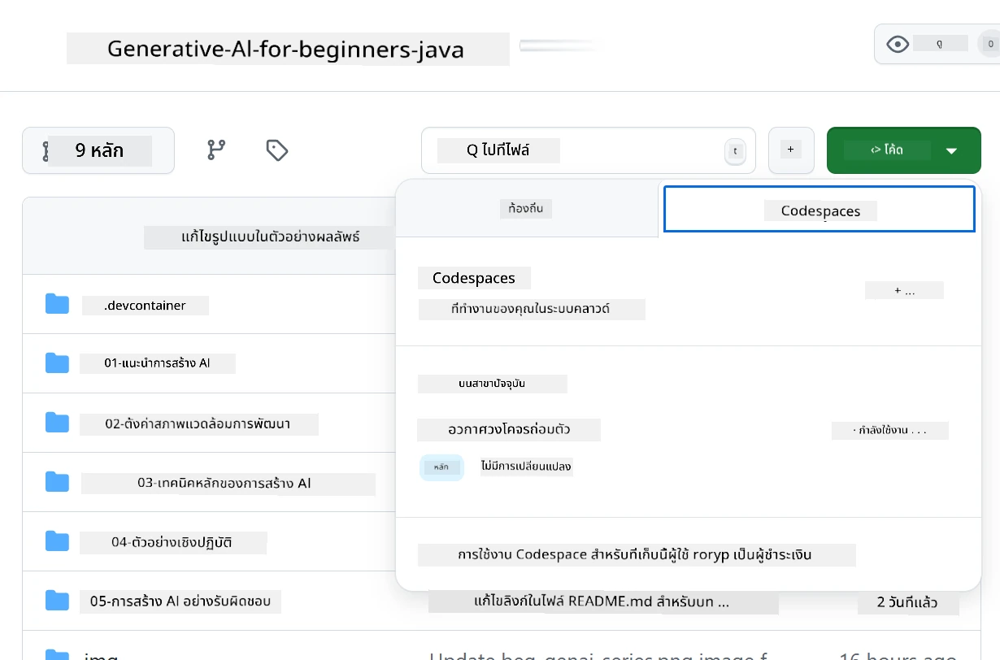
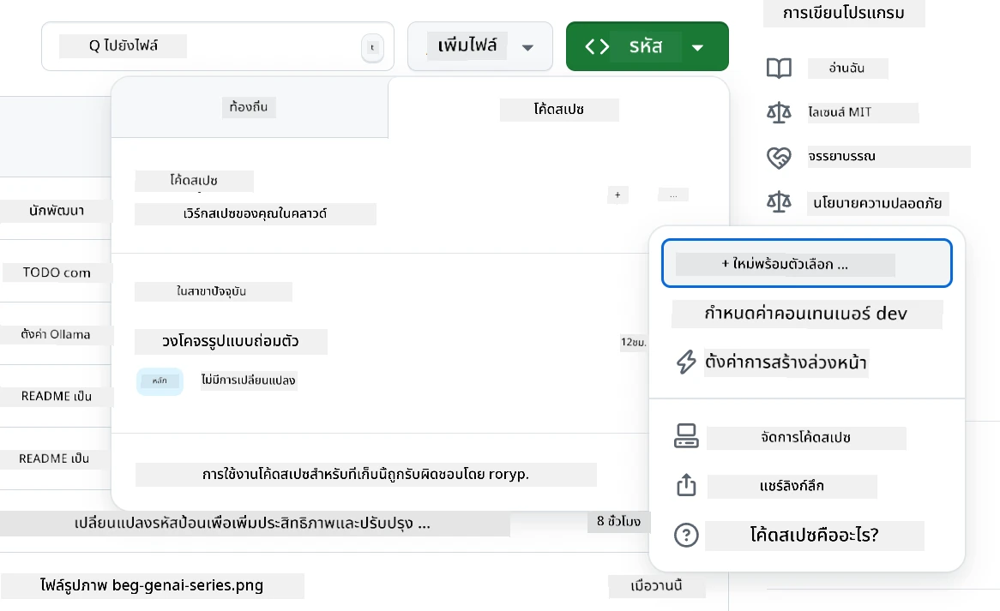
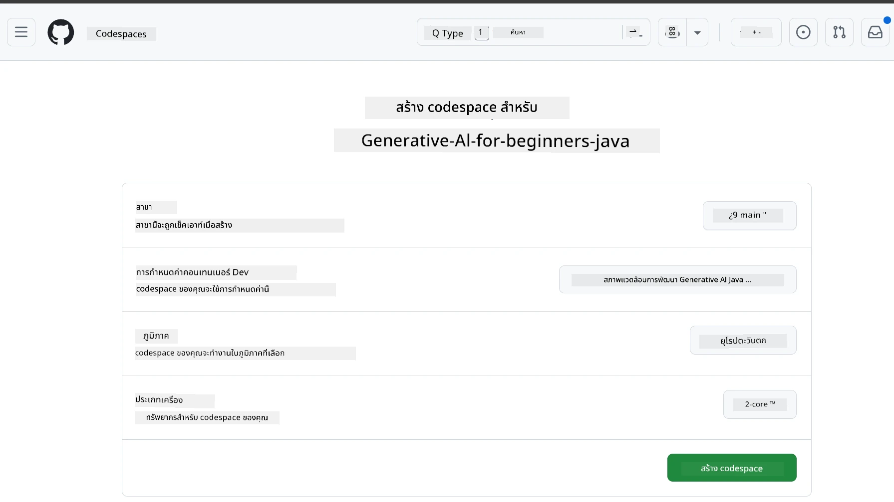
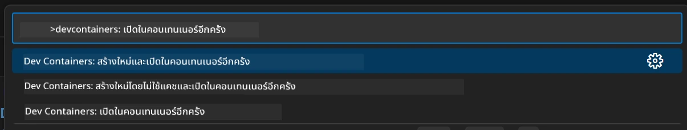
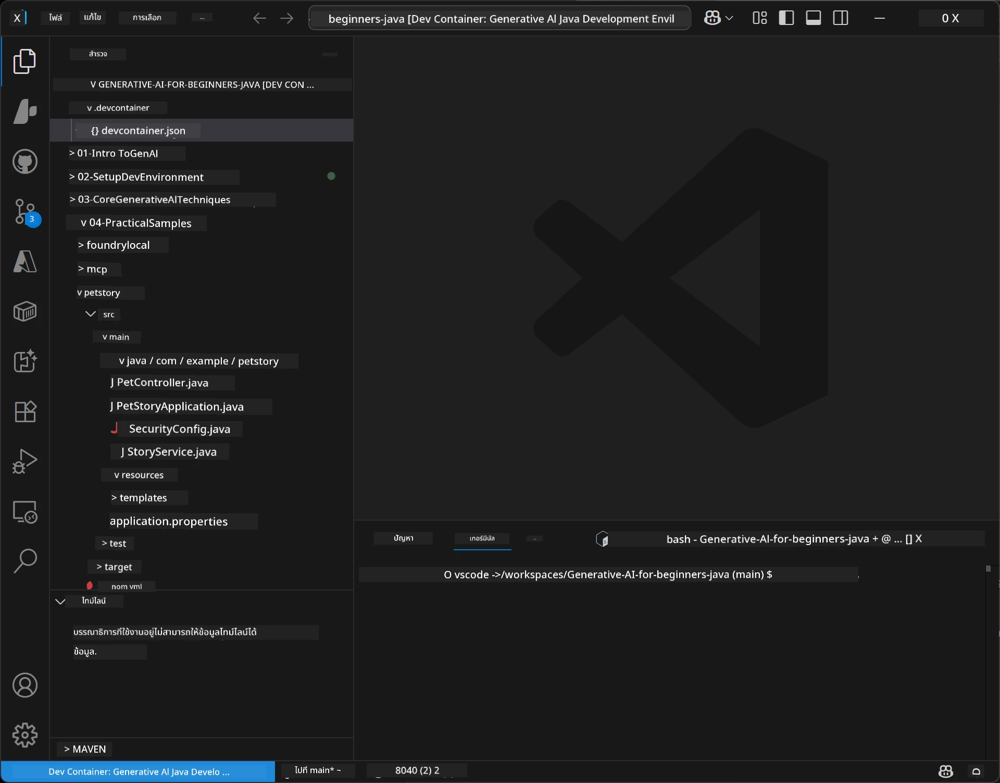
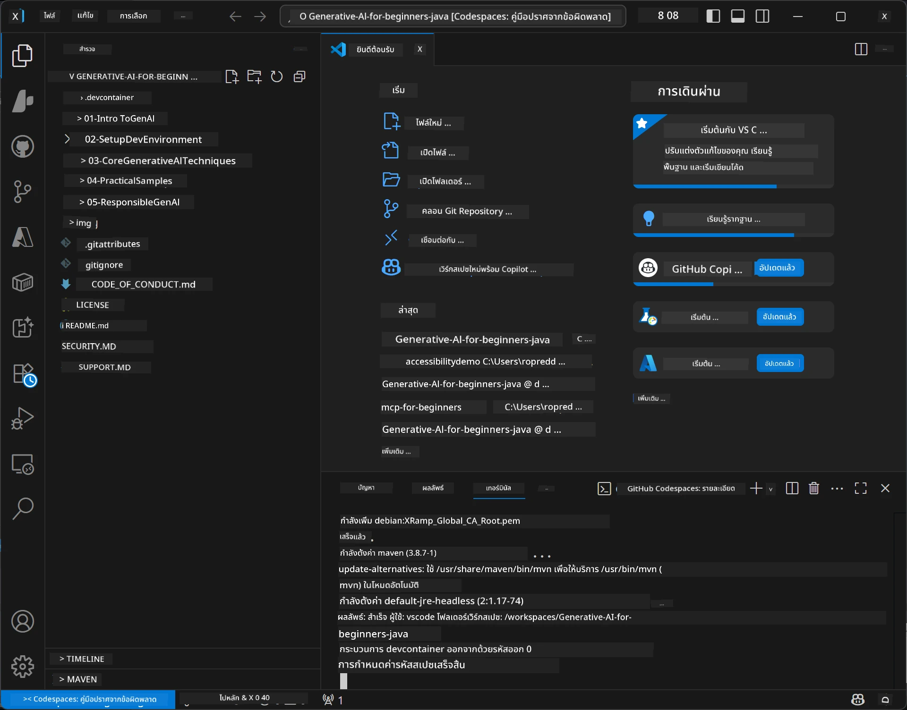

# การตั้งค่าสภาพแวดล้อมการพัฒนาสำหรับ Generative AI สำหรับ Java

> **เริ่มต้นอย่างรวดเร็ว:** จัดเตรียมโมเดล AI ของคุณบน **Azure AI Foundry** เป็นโค้ดด้วย Bicep + `azd` ในไม่กี่นาที — ดูที่ [Azure AI Foundry Setup Guide](getting-started-azure-openai.md) การรับรองความถูกต้องเป็นแบบ **ไม่มีคีย์** (Microsoft Entra ID) ดังนั้นจึงไม่มีคีย์ API ที่ต้องจัดการ

## สิ่งที่คุณจะได้เรียนรู้

- การตั้งค่าสภาพแวดล้อมการพัฒนา Java สำหรับแอป AI
- เลือกและกำหนดค่าสภาพแวดล้อมการพัฒนาที่คุณชื่นชอบ (cloud-first ด้วย Codespaces, dev container ท้องถิ่น หรือการตั้งค่าเต็มรูปแบบท้องถิ่น)
- ทดสอบการตั้งค่าของคุณโดยเชื่อมต่อกับโมเดล Azure AI Foundry

## สารบัญ

- [สิ่งที่คุณจะได้เรียนรู้](#สิ่งที่คุณจะได้เรียนรู้)
- [บทนำ](#บทนำ)
- [ขั้นตอนที่ 1: ตั้งค่าสภาพแวดล้อมการพัฒนาของคุณ](#ขั้นตอนที่-1-ตั้งค่าสภาพแวดล้อมการพัฒนาของคุณ)
  - [ทางเลือก A: GitHub Codespaces (แนะนำ)](#ทางเลือก-a-github-codespaces-แนะนำ)
  - [ทางเลือก B: Local Dev Container](#ทางเลือก-b-local-dev-container)
  - [ทางเลือก C: ใช้การติดตั้งท้องถิ่นที่มีอยู่ของคุณ](#ทางเลือก-c-ใช้การติดตั้งท้องถิ่นที่มีอยู่ของคุณ)
- [ขั้นตอนที่ 2: จัดเตรียม Azure AI Foundry](#ขั้นตอนที่-2-จัดเตรียม-azure-ai-foundry)
- [ขั้นตอนที่ 3: ทดสอบการตั้งค่าของคุณ](#ขั้นตอนที่-3-ทดสอบการตั้งค่าของคุณ)
- [การแก้ไขปัญหา](#การแก้ไขปัญหา)
- [สรุป](#สรุป)
- [ขั้นตอนต่อไป](#ขั้นตอนต่อไป)

## บทนำ

บทนี้จะแนะนำคุณผ่านการตั้งค่าสภาพแวดล้อมการพัฒนา เราจะใช้ **Azure AI Foundry** สำหรับโมเดลตลอดคอร์สนี้ คุณจัดเตรียมโมเดลเป็นโค้ดด้วย Bicep และ Azure Developer CLI (`azd`) จากนั้นเชื่อมต่อด้วย **การรับรองความถูกต้องแบบไม่มีคีย์** (Microsoft Entra ID) — ไม่มีคีย์ API ให้ก็อปปี้หรือรั่วไหล

**ไม่ต้องตั้งค่าท้องถิ่น!** คุณสามารถใช้ GitHub Codespaces ซึ่งให้สภาพแวดล้อมการพัฒนาเต็มรูปแบบในเบราว์เซอร์ของคุณ และจัดเตรียม Foundry จากที่นั่น

เราใช้ **Azure AI Foundry** สำหรับคอร์สนี้เพราะ:
- **จัดเตรียมเป็นโค้ด** — เพียง `azd up` ตัวเดียวก็ปรับใช้บัญชีและการปรับใช้โมเดลได้
- **ไม่มีคีย์** — รับรองความถูกต้องด้วยการเข้าสู่ระบบ Azure หรือ managed identity
- **พร้อมใช้งานสำหรับการผลิต** — โค้ดเดียวกันรันได้ทั้งท้องถิ่นและใน Azure
- **ยืดหยุ่น** — เปลี่ยนโมเดลได้โดยเปลี่ยนชื่อการปรับใช้ ไม่ใช่โค้ดของคุณ

> **หมายเหตุ**: การปรับใช้ Azure AI Foundry คิดค่าบริการตามจำนวนโทเคน (จ่ายตามการใช้งาน) ดูที่ [Azure AI Foundry setup guide](getting-started-azure-openai.md) สำหรับรายละเอียดการจัดเตรียม ภูมิภาค และค่าใช้จ่าย


## ขั้นตอนที่ 1: ตั้งค่าสภาพแวดล้อมการพัฒนาของคุณ

<a name="quick-start-cloud"></a>

เราได้สร้าง dev container ที่ตั้งค่าล่วงหน้าเพื่อช่วยลดเวลาการตั้งค่าและให้แน่ใจว่าคุณมีเครื่องมือที่จำเป็นทั้งหมดสำหรับคอร์ส Generative AI for Java เลือกวิธีการพัฒนาที่คุณชอบ:

### ตัวเลือกการตั้งค่าสภาพแวดล้อม:

#### ทางเลือก A: GitHub Codespaces (แนะนำ)

**เริ่มเขียนโค้ดได้ใน 2 นาที - ไม่ต้องตั้งค่าท้องถิ่น!**

1. Fork รีโพสิทอรีนี้ไปยังบัญชี GitHub ของคุณ
   > **หมายเหตุ**: หากคุณต้องการแก้ไขการตั้งค่าพื้นฐาน โปรดดูที่ [Dev Container Configuration](../../../.devcontainer/devcontainer.json)
2. คลิก **Code** → แท็บ **Codespaces** → **...** → **New with options...**
3. ใช้ค่าตั้งต้น — ตัวเลือกนี้จะเลือก **Dev container configuration**: **Generative AI Java Development Environment** devcontainer ที่สร้างขึ้นเฉพาะสำหรับคอร์สนี้
4. คลิก **Create codespace**
5. รอประมาณ 2 นาทีจนกว่าสภาพแวดล้อมจะพร้อมใช้งาน
6. ดำเนินการต่อที่ [ขั้นตอนที่ 2: จัดเตรียม Azure AI Foundry](#ขั้นตอนที่-2-จัดเตรียม-azure-ai-foundry)








> **ประโยชน์ของ Codespaces**:
> - ไม่ต้องติดตั้งท้องถิ่น
> - ทำงานได้บนอุปกรณ์ใดก็ได้ที่มีเบราว์เซอร์
> - ตั้งค่าล่วงหน้าพร้อมเครื่องมือและ dependencies ทั้งหมด
> - ฟรี 60 ชั่วโมงต่อเดือนสำหรับบัญชีส่วนตัว
> - สภาพแวดล้อมที่สอดคล้องสำหรับผู้เรียนทุกคน

#### ทางเลือก B: Local Dev Container

**สำหรับนักพัฒนาที่ชอบพัฒนาท้องถิ่นด้วย Docker**

1. Fork และ clone รีโพสิทอรีนี้มายังเครื่องท้องถิ่นของคุณ
   > **หมายเหตุ**: หากคุณต้องการแก้ไขการตั้งค่าพื้นฐาน โปรดดูที่ [Dev Container Configuration](../../../.devcontainer/devcontainer.json)
2. ติดตั้ง [Docker Desktop](https://www.docker.com/products/docker-desktop/) และ [VS Code](https://code.visualstudio.com/)
3. ติดตั้ง [Dev Containers extension](https://marketplace.visualstudio.com/items?itemName=ms-vscode-remote.remote-containers) ใน VS Code
4. เปิดโฟลเดอร์รีโพสิทอรีใน VS Code
5. เมื่อมีข้อความแจ้ง ให้คลิก **Reopen in Container** (หรือใช้ `Ctrl+Shift+P` → "Dev Containers: Reopen in Container")
6. รอให้ container สร้างและเริ่มต้น
7. ดำเนินการต่อที่ [ขั้นตอนที่ 2: จัดเตรียม Azure AI Foundry](#ขั้นตอนที่-2-จัดเตรียม-azure-ai-foundry)





#### ทางเลือก C: ใช้การติดตั้งท้องถิ่นที่มีอยู่ของคุณ

**สำหรับนักพัฒนาที่มีสภาพแวดล้อม Java อยู่แล้ว**

ข้อกำหนดเบื้องต้น:
- [Java 21+](https://www.oracle.com/java/technologies/javase/jdk21-archive-downloads.html) 
- [Maven 3.9+](https://maven.apache.org/download.cgi)
- [VS Code](https://code.visualstudio.com) หรือ IDE ที่คุณชื่นชอบ

ขั้นตอน:
1. Clone รีโพสิทอรีนี้มายังเครื่องท้องถิ่นของคุณ
2. เปิดโปรเจกต์ใน IDE ของคุณ
3. ดำเนินการต่อที่ [ขั้นตอนที่ 2: จัดเตรียม Azure AI Foundry](#ขั้นตอนที่-2-จัดเตรียม-azure-ai-foundry)

> **เคล็ดลับมือโปร**: หากคุณมีเครื่องสเปกต่ำแต่ต้องการใช้ VS Code ท้องถิ่น ให้ใช้ GitHub Codespaces! คุณสามารถเชื่อมต่อ VS Code ท้องถิ่นของคุณกับ Codespace ที่โฮสต์บนคลาวด์เพื่อประสบการณ์ที่ดีที่สุดทั้งสองแบบ




## ขั้นตอนที่ 2: จัดเตรียม Azure AI Foundry

ปรับใช้โมเดล AI ของคอร์สไปยัง Azure AI Foundry ในรูปแบบโค้ด จาก root ของรีโพสิทอรี:

```bash
cd 02-SetupDevEnvironment
azd auth login
az login
azd up
```

`azd` จะขอชื่อสภาพแวดล้อม การสมัครสมาชิก และภูมิภาค จากนั้นจัดเตรียมบัญชี Azure AI Foundry พร้อมการปรับใช้ `gpt-5.6-luna` และ `text-embedding-3-small` และเขียน endpoint ลงในไฟล์ `.env` ของตัวอย่าง — ทั้งหมดนี้ด้วยการรับรองความถูกต้องแบบ **ไม่มีคีย์** (ไม่มีคีย์ API)

> **คู่มือเต็ม:** ดูที่ [Azure AI Foundry Setup Guide](getting-started-azure-openai.md) สำหรับข้อกำหนดเบื้องต้น ตัวเลือกคู่มือ (ผ่านพอร์ทัล) คำแนะนำภูมิภาค และบันทึกค่าใช้จ่าย/การลบข้อมูล

## ขั้นตอนที่ 3: ทดสอบการตั้งค่าของคุณ

เมื่อโมเดล Foundry ของคุณได้รับการจัดเตรียมแล้ว ให้ทดสอบการเชื่อมต่อกับแอปตัวอย่างใน [`02-SetupDevEnvironment/examples/basic-chat-azure`](../../../02-SetupDevEnvironment/examples/basic-chat-azure)

1. เปิดเทอร์มินัลในสภาพแวดล้อมการพัฒนาของคุณ
2. ไปที่ตัวอย่าง:
   ```bash
   cd 02-SetupDevEnvironment/examples/basic-chat-azure
   ```
3. ตรวจสอบว่าคุณลงชื่อเข้าใช้แล้ว (การรับรองความถูกต้องแบบไม่มีคีย์ต้องการโทเคน):
   ```bash
   az login
   ```
   > หากคุณรัน `azd up` ไฟล์ `.env` ที่มี endpoint ของคุณจะถูกเขียนไว้แล้ว
4. รันแอปพลิเคชัน:
   ```bash
   mvn clean spring-boot:run
   ```

คุณควรเห็นการตอบกลับจากโมเดล `gpt-5.6-luna`

### ทำความเข้าใจกับโค้ดตัวอย่าง

ตัวอย่าง [basic-chat](./examples/basic-chat-azure/README.md) ใช้ **Spring Boot 4.1.1** และ **Spring AI 2.0.1** `ChatClient` ของ Spring AI รองรับโดย OpenAI Java SDK อย่างเป็นทางการ เชื่อมต่อกับ Azure OpenAI **v1** โดยใช้การรับรองความถูกต้องแบบไม่มีคีย์

**สิ่งที่โค้ดนี้ทำ:**
- **เชื่อมต่อ** กับ Azure AI Foundry โดยใช้การเข้าสู่ระบบ Azure ของคุณ (Microsoft Entra ID) — ไม่มีคีย์ API
- **ส่ง** prompt ไปยังโมเดล `gpt-5.6-luna`
- **รับ** แล้วแสดงผลการตอบสนองของ AI
- **ตรวจสอบ** ว่าการตั้งค่าของคุณทำงานอย่างถูกต้อง

**Dependencies หลัก** (บางส่วนจาก [pom.xml](../../../02-SetupDevEnvironment/examples/basic-chat-azure/pom.xml)):
```xml
<dependency>
    <groupId>org.springframework.ai</groupId>
    <artifactId>spring-ai-starter-model-openai</artifactId>
</dependency>
<dependency>
    <groupId>com.openai</groupId>
    <artifactId>openai-java</artifactId>
</dependency>
<dependency>
    <groupId>com.azure</groupId>
    <artifactId>azure-identity</artifactId>
    <version>${azure-identity.version}</version>
</dependency>
```

POM จัดการ OpenAI Java **4.63.1** และตั้งค่า Azure Identity **1.18.6** อย่างชัดเจน Spring AI 2 ได้ลบ starter เฉพาะ Azure ออก แต่ยังคงต้องใช้ Azure Identity สำหรับ credential bean

**การกำหนดค่า** ([application.yml](../../../02-SetupDevEnvironment/examples/basic-chat-azure/src/main/resources/application.yml)):
```yaml
spring:
  ai:
    openai:
      base-url: ${AZURE_OPENAI_ENDPOINT}
      microsoft-foundry: true
      chat:
        model: ${AZURE_OPENAI_DEPLOYMENT:gpt-5.6-luna}
        reasoning-effort: none
        max-completion-tokens: 500
```

การรับรองความถูกต้องแบบไม่มีคีย์ถูกกำหนดไว้อย่างชัดเจนใน [BasicChatApplication.java](../../../02-SetupDevEnvironment/examples/basic-chat-azure/src/main/java/com/example/BasicChatApplication.java) ไม่ได้ถูกอนุมานจากการไม่มีคีย์ API credential ของผู้ถือใช้ `DefaultAzureCredential` กับสโคป `https://ai.azure.com/.default` และ `OpenAIClient` มีเป้าหมายที่ `/openai/v1` แอปจะมอบ client นั้นให้กับโมเดล chat ของ Spring AI ดังนั้น `OPENAI_API_KEY` ทั่วโลกจึงไม่สามารถแทนที่การรับรองความถูกต้องของ Azure ได้

การตั้งค่า chat อยู่โดยตรงใต้ `spring.ai.openai.chat` โดยไม่มีบล็อก `options` บทเรียนนี้ยังคงใช้ Chat Completions ด้วย `reasoning-effort: none` และจำกัด completion ที่ 500 โทเคน; ไม่ได้ตั้งค่า `temperature` หรือ `max-tokens` ดูที่ [คู่มือการกำหนดค่าของตัวอย่าง](./examples/basic-chat-azure/README.md#spring-configuration) สำหรับคำแนะนำเรื่อง API ที่เลือกและการเรียกใช้เครื่องมือ

## สรุป

หลังจากทำขั้นตอนข้างต้นเสร็จคุณจะได้:

- โมเดล Azure AI Foundry ที่จัดเตรียมเป็นโค้ดด้วย Bicep + `azd`
- ได้สภาพแวดล้อมการพัฒนา Java ของคุณทำงาน (ไม่ว่าจะเป็น Codespaces, dev containers หรือท้องถิ่น)
- เชื่อมต่อกับ Azure AI Foundry ด้วยการรับรองความถูกต้องแบบไม่มีคีย์ (Microsoft Entra ID) — ไม่มีคีย์ API
- ทดสอบว่าทุกอย่างทำงานด้วยตัวอย่างง่ายๆ ที่สื่อสารกับโมเดลของคุณ

## ขั้นตอนต่อไป

[บทที่ 3: เทคนิคหลักของ Generative AI](../03-CoreGenerativeAITechniques/README.md)

## การแก้ไขปัญหา

มีปัญหาไหม? นี่คือปัญหาทั่วไปและวิธีแก้:

- **การรับรองความถูกต้องล้มเหลว (401/403)?** 
  - รัน `az login` — การรับรองความถูกต้องเป็นแบบไม่มีคีย์ ดังนั้นคุณต้องลงชื่อเข้าใช้
  - ตรวจสอบว่าบัญชีของคุณมีบทบาท **Cognitive Services OpenAI User** บนทรัพยากร
  - หากคุณเพิ่งจัดเตรียม รอประมาณหนึ่งนาทีให้การมอบหมายบทบาทแพร่กระจาย

- **หา Maven ไม่เจอ?** 
  - หากใช้ dev containers/Codespaces ควรติดตั้ง Maven มาแล้ว
  - สำหรับการตั้งค่าท้องถิ่น ตรวจสอบให้แน่ใจว่าติดตั้ง Java 21+ และ Maven 3.9+
  - ลอง `mvn --version` เพื่อยืนยันการติดตั้ง

- **หา `azd` ไม่เจอหรือ provisioning ล้มเหลว?** 
  - ติดตั้ง [Azure Developer CLI](https://aka.ms/azure-dev/install) และรัน `azd auth login`
  - เลือกภูมิภาคที่มี `gpt-5.6-luna` และ `text-embedding-3-small` ให้บริการ (เช่น `eastus2`) พร้อมโควต้าที่เพียงพอใน subscription ที่เลือก
  - ดูที่ [Azure AI Foundry setup guide](getting-started-azure-openai.md) สำหรับรายละเอียด

- **dev container ไม่เริ่มต้น?** 
  - ตรวจสอบว่า Docker Desktop กำลังทำงาน (สำหรับการพัฒนาท้องถิ่น)
  - ลองสร้าง container ใหม่: `Ctrl+Shift+P` → "Dev Containers: Rebuild Container"

- **ข้อผิดพลาดในการคอมไพล์แอปพลิเคชัน?**
  - ตรวจสอบว่าคุณอยู่ในไดเรกทอรีที่ถูกต้อง: `02-SetupDevEnvironment/examples/basic-chat-azure`
  - ลองทำความสะอาดและคอมไพล์ใหม่: `mvn clean compile`

> **ต้องการความช่วยเหลือ?**: ยังมีปัญหาอยู่ไหม? เปิด issue ในรีโพสิทอรีและเราจะช่วยคุณ

---

<!-- CO-OP TRANSLATOR DISCLAIMER START -->
**ปฏิเสธความรับผิดชอบ**:
เอกสารนี้ได้รับการแปลโดยใช้บริการแปลภาษา AI [Co-op Translator](https://github.com/Azure/co-op-translator) ขณะที่เราพยายามให้ความถูกต้อง โปรดทราบว่าการแปลโดยอัตโนมัติอาจมีข้อผิดพลาดหรือความไม่ถูกต้อง เอกสารต้นฉบับในภาษาต้นทางควรถูกพิจารณาเป็นแหล่งข้อมูลที่เชื่อถือได้ สำหรับข้อมูลที่สำคัญ แนะนำให้ใช้การแปลโดยมนุษย์มืออาชีพ เราไม่รับผิดชอบต่อความเข้าใจผิดหรือการตีความที่ผิดพลาดที่เกิดขึ้นจากการใช้การแปลนี้
<!-- CO-OP TRANSLATOR DISCLAIMER END -->