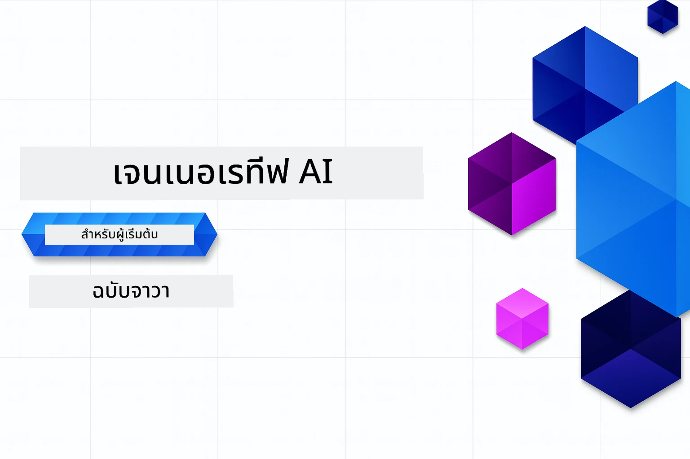

# ปัญญาประดิษฐ์เชิงสร้างสรรค์สำหรับผู้เริ่มต้น - รุ่น Java
[](https://discord.gg/nTYy5BXMWG)



**เวลาที่ต้องใช้**: เวิร์คช็อปทั้งหมดสามารถทำออนไลน์ได้โดยไม่ต้องตั้งค่าท้องถิ่น การตั้งค่าสภาพแวดล้อมใช้เวลา 2 นาที และการสำรวจตัวอย่างใช้เวลาประมาณ 1-3 ชั่วโมงขึ้นอยู่กับความลึกของการสำรวจ

> **เริ่มต้นอย่างรวดเร็ว**

1. Fork ที่เก็บนี้ไปยังบัญชี GitHub ของคุณ
2. คลิก **Code** → แท็บ **Codespaces** → **...** → **New with options...**
3. ใช้ค่าเริ่มต้น – จะเลือก container สำหรับการพัฒนาที่สร้างขึ้นสำหรับหลักสูตรนี้
4. คลิก **Create codespace**
5. รอประมาณ 2 นาทีจนกว่าสภาพแวดล้อมจะพร้อม
6. ไปที่ [บทที่ 2: การจัดเตรียม Azure AI Foundry](./02-SetupDevEnvironment/README.md#step-2-provision-azure-ai-foundry) ได้เลย

## การรองรับหลายภาษา

### รองรับผ่าน GitHub Action (อัตโนมัติ & อัปเดตเสมอ)

<!-- CO-OP TRANSLATOR LANGUAGES TABLE START -->
[Arabic](../ar/README.md) | [Bengali](../bn/README.md) | [Bulgarian](../bg/README.md) | [Burmese (Myanmar)](../my/README.md) | [Chinese (Simplified)](../zh-CN/README.md) | [Chinese (Traditional, Hong Kong)](../zh-HK/README.md) | [Chinese (Traditional, Macau)](../zh-MO/README.md) | [Chinese (Traditional, Taiwan)](../zh-TW/README.md) | [Croatian](../hr/README.md) | [Czech](../cs/README.md) | [Danish](../da/README.md) | [Dutch](../nl/README.md) | [Estonian](../et/README.md) | [Finnish](../fi/README.md) | [French](../fr/README.md) | [German](../de/README.md) | [Greek](../el/README.md) | [Hebrew](../he/README.md) | [Hindi](../hi/README.md) | [Hungarian](../hu/README.md) | [Indonesian](../id/README.md) | [Italian](../it/README.md) | [Japanese](../ja/README.md) | [Kannada](../kn/README.md) | [Khmer](../km/README.md) | [Korean](../ko/README.md) | [Lithuanian](../lt/README.md) | [Malay](../ms/README.md) | [Malayalam](../ml/README.md) | [Marathi](../mr/README.md) | [Nepali](../ne/README.md) | [Nigerian Pidgin](../pcm/README.md) | [Norwegian](../no/README.md) | [Persian (Farsi)](../fa/README.md) | [Polish](../pl/README.md) | [Portuguese (Brazil)](../pt-BR/README.md) | [Portuguese (Portugal)](../pt-PT/README.md) | [Punjabi (Gurmukhi)](../pa/README.md) | [Romanian](../ro/README.md) | [Russian](../ru/README.md) | [Serbian (Cyrillic)](../sr/README.md) | [Slovak](../sk/README.md) | [Slovenian](../sl/README.md) | [Spanish](../es/README.md) | [Swahili](../sw/README.md) | [Swedish](../sv/README.md) | [Tagalog (Filipino)](../tl/README.md) | [Tamil](../ta/README.md) | [Telugu](../te/README.md) | [Thai](./README.md) | [Turkish](../tr/README.md) | [Ukrainian](../uk/README.md) | [Urdu](../ur/README.md) | [Vietnamese](../vi/README.md)

> **ต้องการโคลนในเครื่องไหม?**
>
> ที่เก็บนี้รวมการแปลภาษากว่า 50 ภาษา ซึ่งเพิ่มขนาดการดาวน์โหลดอย่างมาก หากต้องการโคลนโดยไม่รวมการแปล ให้ใช้ sparse checkout:
>
> **Bash / macOS / Linux:**
> ```bash
> git clone --filter=blob:none --sparse https://github.com/microsoft/Generative-AI-for-beginners-java.git
> cd Generative-AI-for-beginners-java
> git sparse-checkout set --no-cone '/*' '!translations' '!translated_images'
> ```
>
> **CMD (Windows):**
> ```cmd
> git clone --filter=blob:none --sparse https://github.com/microsoft/Generative-AI-for-beginners-java.git
> cd Generative-AI-for-beginners-java
> git sparse-checkout set --no-cone "/*" "!translations" "!translated_images"
> ```
>
> วิธีนี้จะให้ทุกสิ่งที่คุณต้องการเพื่อทำหลักสูตรให้เสร็จด้วยการดาวน์โหลดที่เร็วขึ้นมาก
<!-- CO-OP TRANSLATOR LANGUAGES TABLE END -->

## โครงสร้างหลักสูตร & เส้นทางการเรียนรู้

### **บทที่ 1: บทนำสู่ปัญญาประดิษฐ์เชิงสร้างสรรค์**
- **แนวคิดหลัก**: ทำความเข้าใจโมเดลภาษาขนาดใหญ่, โทเค็น, embeddings และความสามารถของ AI
- **ระบบนิเวศ Java AI**: ภาพรวมของ Spring AI และ OpenAI SDKs
- **โปรโตคอลบริบทของโมเดล**: บทนำสู่ MCP และบทบาทในการสื่อสารเอเย่นต์ AI
- **แอปพลิเคชันเชิงปฏิบัติ**: สถานการณ์จริงรวมถึงแชทบอทและการสร้างเนื้อหา
- **[→ เริ่มบทที่ 1](./01-IntroToGenAI/README.md)**

### **บทที่ 2: การตั้งค่าสภาพแวดล้อมพัฒนา**
- **Azure AI Foundry**: จัดเตรียม GPT-5.6 Luna chat และ text-embedding-3-small embeddings ด้วย Bicep และ Azure Developer CLI (azd)
- **Spring Boot 4.1.1 + Spring AI 2.0.1**: เรียนรู้กับ `ChatClient` รองรับโดย OpenAI Java SDK อย่างเป็นทางการและ Azure OpenAI v1
- **การรับรองความถูกต้องแบบไม่ใช้คีย์**: เชื่อมต่ออย่างปลอดภัยด้วย Microsoft Entra ID — ไม่มีคีย์ API ให้จัดการ
- **เครื่องมือพัฒนา**: Docker containers, VS Code และการตั้งค่า GitHub Codespaces
- **[→ เริ่มบทที่ 2](./02-SetupDevEnvironment/README.md)**

### **บทที่ 3: เทคนิคหลักของปัญญาประดิษฐ์เชิงสร้างสรรค์**
- **OpenAI Java SDK อย่างเป็นทางการ**: เรียกใช้งาน Azure OpenAI v1 โดยตรงด้วยการรับรองความถูกต้องแบบไม่ใช้คีย์
- **การสร้างคำสั่ง (Prompt Engineering)**: เทคนิคสำหรับการตอบสนองที่ดีที่สุดของโมเดล AI
- **Embeddings & การดำเนินการเวกเตอร์**: นำไปใช้การค้นหาความหมายและการจับคู่ความคล้ายคลึง
- **Retrieval-Augmented Generation (RAG)**: รวม AI กับแหล่งข้อมูลของคุณเอง
- **Function Calling**: ขยายความสามารถของ AI ด้วยเครื่องมือและปลั๊กอินที่กำหนดเอง
- **[→ เริ่มบทที่ 3](./03-CoreGenerativeAITechniques/README.md)**

### **บทที่ 4: การประยุกต์ใช้และโครงการเชิงปฏิบัติ**
- **Pet Story Generator** (`petstory/`): การสร้างเนื้อหาอย่างสร้างสรรค์ด้วย Azure AI Foundry
- **Foundry Local Demo** (`foundrylocal/`): การรวมโมเดล AI ในเครื่องด้วย OpenAI Java SDK
- **MCP Calculator Service** (`calculator/`): การใช้งานเบื้องต้นของ Model Context Protocol ด้วย Spring AI
- **[→ เริ่มบทที่ 4](./04-PracticalSamples/README.md)**

### **บทที่ 5: การพัฒนาปัญญาประดิษฐ์อย่างรับผิดชอบ**
- **Azure AI Foundry Content Safety**: ทดสอบระบบกรองเนื้อหาและกลไกความปลอดภัยในตัว (การบล็อกอย่างเข้มงวดและการปฏิเสธอย่างนุ่มนวล)
- **ตัวอย่างการใช้งาน AI อย่างรับผิดชอบ**: ตัวอย่างการใช้งานจริงที่แสดงวิธีการทำงานของระบบความปลอดภัย AI สมัยใหม่
- **แนวปฏิบัติที่ดีที่สุด**: แนวทางสำคัญสำหรับการพัฒนาและใช้งาน AI อย่างมีจริยธรรม
- **[→ เริ่มบทที่ 5](./05-ResponsibleGenAI/README.md)**

## แหล่งข้อมูลเพิ่มเติม

<!-- CO-OP TRANSLATOR OTHER COURSES START -->
### LangChain
[](https://aka.ms/langchain4j-for-beginners)
[](https://aka.ms/langchainjs-for-beginners?WT.mc_id=m365-94501-dwahlin)
[](https://github.com/microsoft/langchain-for-beginners?WT.mc_id=m365-94501-dwahlin)
---

### Azure / Edge / MCP / Agents
[](https://github.com/microsoft/AZD-for-beginners?WT.mc_id=academic-105485-koreyst)
[](https://github.com/microsoft/edgeai-for-beginners?WT.mc_id=academic-105485-koreyst)
[](https://github.com/microsoft/mcp-for-beginners?WT.mc_id=academic-105485-koreyst)
[](https://github.com/microsoft/ai-agents-for-beginners?WT.mc_id=academic-105485-koreyst)

---
 
### ชุดปัญญาประดิษฐ์เชิงสร้างสรรค์
[](https://github.com/microsoft/generative-ai-for-beginners?WT.mc_id=academic-105485-koreyst)
[-9333EA?style=for-the-badge&labelColor=E5E7EB&color=9333EA)](https://github.com/microsoft/Generative-AI-for-beginners-dotnet?WT.mc_id=academic-105485-koreyst)
[-C084FC?style=for-the-badge&labelColor=E5E7EB&color=C084FC)](https://github.com/microsoft/generative-ai-for-beginners-java?WT.mc_id=academic-105485-koreyst)
[-E879F9?style=for-the-badge&labelColor=E5E7EB&color=E879F9)](https://github.com/microsoft/generative-ai-with-javascript?WT.mc_id=academic-105485-koreyst)

---
 
### การเรียนรู้หลัก
[](https://aka.ms/ml-beginners?WT.mc_id=academic-105485-koreyst)
[](https://aka.ms/datascience-beginners?WT.mc_id=academic-105485-koreyst)
[](https://aka.ms/ai-beginners?WT.mc_id=academic-105485-koreyst)
[](https://github.com/microsoft/Security-101?WT.mc_id=academic-96948-sayoung)
[](https://aka.ms/webdev-beginners?WT.mc_id=academic-105485-koreyst)
[](https://aka.ms/iot-beginners?WT.mc_id=academic-105485-koreyst)
[](https://github.com/microsoft/xr-development-for-beginners?WT.mc_id=academic-105485-koreyst)

---
 
### ชุด Copilot
[](https://aka.ms/GitHubCopilotAI?WT.mc_id=academic-105485-koreyst)
[](https://github.com/microsoft/mastering-github-copilot-for-dotnet-csharp-developers?WT.mc_id=academic-105485-koreyst)
[](https://github.com/microsoft/CopilotAdventures?WT.mc_id=academic-105485-koreyst)
<!-- CO-OP TRANSLATOR OTHER COURSES END -->

## ข้อมูลช่วยเหลือ

หากคุณติดขัดหรือมีคำถามเกี่ยวกับการสร้างแอป AI เข้าร่วมกับเพื่อนนักเรียนและนักพัฒนาที่มีประสบการณ์ในการพูดคุยเกี่ยวกับ MCP นี่คือชุมชนที่สนับสนุนซึ่งยินดีตอบคำถามและแลกเปลี่ยนความรู้กันอย่างเสรี

[](https://discord.gg/nTYy5BXMWG)

หากคุณมีข้อเสนอแนะเกี่ยวกับผลิตภัณฑ์หรือพบข้อผิดพลาดขณะสร้างโปรดไปที่:

[](https://aka.ms/foundry/forum)

---

<!-- CO-OP TRANSLATOR DISCLAIMER START -->
**ปฏิเสธความรับผิดชอบ**:
เอกสารนี้ได้รับการแปลโดยใช้บริการแปลภาษา AI [Co-op Translator](https://github.com/Azure/co-op-translator) ขณะที่เราพยายามให้ความถูกต้อง โปรดทราบว่าการแปลโดยอัตโนมัติอาจมีข้อผิดพลาดหรือความไม่ถูกต้อง เอกสารต้นฉบับในภาษาต้นทางควรถูกพิจารณาเป็นแหล่งข้อมูลที่เชื่อถือได้ สำหรับข้อมูลที่สำคัญ แนะนำให้ใช้การแปลโดยมนุษย์มืออาชีพ เราไม่รับผิดชอบต่อความเข้าใจผิดหรือการตีความที่ผิดพลาดที่เกิดขึ้นจากการใช้การแปลนี้
<!-- CO-OP TRANSLATOR DISCLAIMER END -->