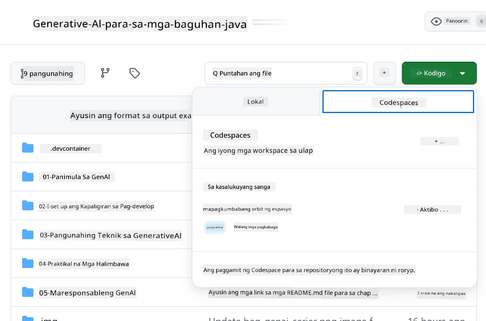
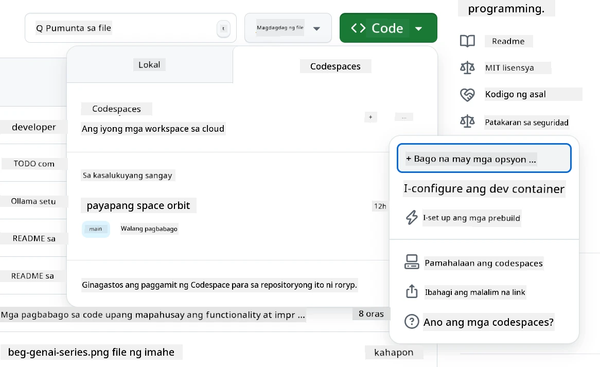
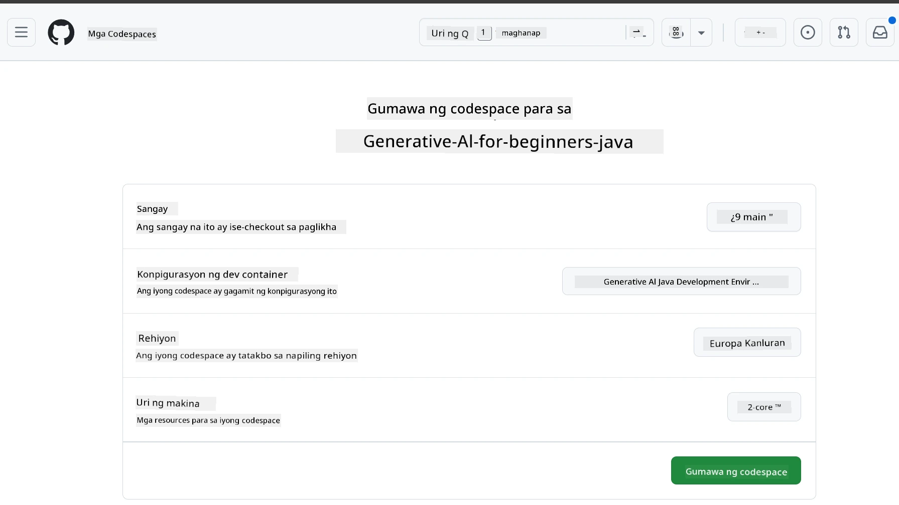
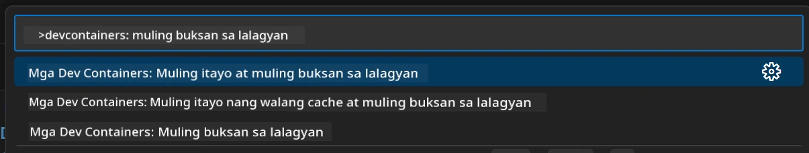
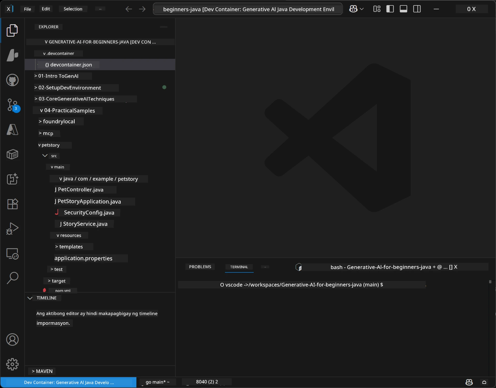
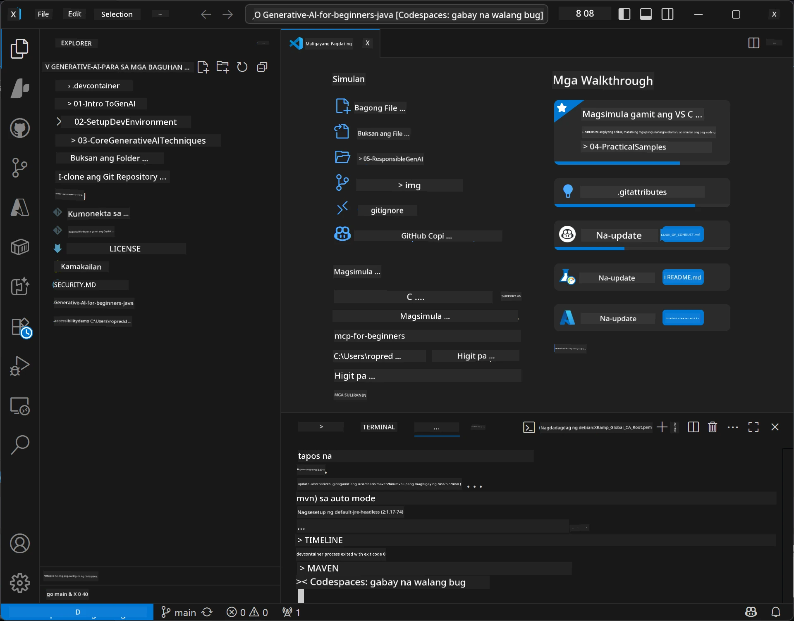

# Pagsasaayos ng Development Environment para sa Generative AI para sa Java

> **Mabilisang Simula:** I-provision ang iyong mga AI models sa **Azure AI Foundry** bilang code gamit ang Bicep + `azd` sa loob ng ilang minuto — tingnan ang [Azure AI Foundry Setup Guide](getting-started-azure-openai.md). Ang authentication ay **keyless** (Microsoft Entra ID), kaya walang API keys na kailangang i-manage.

## Ano ang Matututuhan Mo

- Mag-set up ng Java development environment para sa mga AI application
- Pumili at i-configure ang iyong nais na development environment (cloud-first gamit ang Codespaces, local dev container, o full local setup)
- Subukan ang iyong setup sa pamamagitan ng pagkonekta sa isang Azure AI Foundry model

## Talaan ng mga Nilalaman

- [Ano ang Matututuhan Mo](#ano-ang-matututuhan-mo)
- [Panimula](#panimula)
- [Hakbang 1: I-set Up ang Iyong Development Environment](#hakbang-1-i-set-up-ang-iyong-development-environment)
  - [Opsyon A: GitHub Codespaces (Inirerekomenda)](#opsyon-a-github-codespaces-inirerekomenda)
  - [Opsyon B: Local Dev Container](#opsyon-b-local-dev-container)
  - [Opsyon C: Gamitin ang Iyong Kasalukuyang Lokal na Installation](#opsyon-c-gamitin-ang-iyong-kasalukuyang-lokal-na-installation)
- [Hakbang 2: I-Provision ang Azure AI Foundry](#hakbang-2-i-provision-ang-azure-ai-foundry)
- [Hakbang 3: Subukan ang Iyong Setup](#hakbang-3-subukan-ang-iyong-setup)
- [Pag-troubleshoot](#pag-troubleshoot)
- [Buod](#buod)
- [Mga Susunod na Hakbang](#mga-susunod-na-hakbang)

## Panimula

Ang kabanatang ito ang gagabay sa iyo sa pagsasaayos ng development environment. Gagamitin natin ang **Azure AI Foundry** para sa mga model sa buong kurso na ito. I-pro-provision mo ang mga modelo bilang code gamit ang Bicep at Azure Developer CLI (`azd`), pagkatapos ay kumonekta gamit ang **keyless authentication** (Microsoft Entra ID) — walang API keys na kakailanganing kopyahin o malantad.

**Walang kinakailangang lokal na setup!** Maaari mong gamitin ang GitHub Codespaces, na nagbibigay ng buong development environment sa iyong browser, at i-provision ang Foundry mula doon.

Ginagamit namin ang **Azure AI Foundry** para sa kurso na ito dahil ito ay:
- **Provisioned bilang code** — isang `azd up` lang ay nagde-deploy ng account at mga deployment ng modelo
- **Keyless** — mag-authenticate gamit ang iyong Azure sign-in o managed identity
- **Handa na para sa production** — parehas na code ang tumatakbo lokal at sa Azure
- **Flexible** — palitan ang mga modelo sa pamamagitan ng pagbago ng pangalan ng deployment, hindi ang code mo

> **Tandaan**: Ang mga deployment sa Azure AI Foundry ay sinisingil kada token (pay-as-you-go). Tingnan ang [Azure AI Foundry setup guide](getting-started-azure-openai.md) para sa impormasyon tungkol sa provisioning, region, at mga gastos.


## Hakbang 1: I-set Up ang Iyong Development Environment

<a name="quick-start-cloud"></a>

Nilikha namin ang isang preconfigured development container upang mabawasan ang oras ng setup at matiyak na mayroon kang lahat ng kinakailangang mga tools para sa kursong Generative AI para sa Java. Piliin ang iyong gustong paraan ng pag-develop:

### Mga Opsyon sa Pagsasaayos ng Environment:

#### Opsyon A: GitHub Codespaces (Inirerekomenda)

**Magsimulang mag-code sa loob ng 2 minuto - walang kinakailangang lokal na setup!**

1. I-fork ang repository na ito sa iyong GitHub account
   > **Tandaan**: Kung nais mong i-edit ang basic na config, pakitingnan ang [Dev Container Configuration](../../../.devcontainer/devcontainer.json)
2. I-click ang **Code** → tab na **Codespaces** → **...** → **New with options...**
3. Gamitin ang mga default — pipiliin nito ang **Dev container configuration**: **Generative AI Java Development Environment** custom devcontainer na ginawa para sa kursong ito
4. I-click ang **Create codespace**
5. Maghintay ng halos 2 minuto para maging handa ang environment
6. Magpatuloy sa [Hakbang 2: I-Provision ang Azure AI Foundry](#hakbang-2-i-provision-ang-azure-ai-foundry)








> **Mga Benepisyo ng Codespaces**:
> - Walang kinakailangang lokal na installation
> - Gumagana sa anumang device na may browser
> - Pre-configured na may lahat ng tools at dependencies
> - Libre ng 60 oras kada buwan para sa mga personal account
> - Pare-parehong environment para sa lahat ng mga nag-aaral

#### Opsyon B: Local Dev Container

**Para sa mga developer na mas gustong mag-develop nang lokal gamit ang Docker**

1. I-fork at i-clone ang repository na ito sa iyong lokal na makina
   > **Tandaan**: Kung nais mong i-edit ang basic na config, pakitingnan ang [Dev Container Configuration](../../../.devcontainer/devcontainer.json)
2. I-install ang [Docker Desktop](https://www.docker.com/products/docker-desktop/) at [VS Code](https://code.visualstudio.com/)
3. I-install ang [Dev Containers extension](https://marketplace.visualstudio.com/items?itemName=ms-vscode-remote.remote-containers) sa VS Code
4. Buksan ang folder ng repository sa VS Code
5. Kapag na-prompt, i-click ang **Reopen in Container** (o gamitin ang `Ctrl+Shift+P` → "Dev Containers: Reopen in Container")
6. Maghintay habang binubuo at sinisimulan ang container
7. Magpatuloy sa [Hakbang 2: I-Provision ang Azure AI Foundry](#hakbang-2-i-provision-ang-azure-ai-foundry)





#### Opsyon C: Gamitin ang Iyong Kasalukuyang Lokal na Installation

**Para sa mga developer na may umiiral nang Java environments**

Mga Kinakailangan:
- [Java 21+](https://www.oracle.com/java/technologies/javase/jdk21-archive-downloads.html) 
- [Maven 3.9+](https://maven.apache.org/download.cgi)
- [VS Code](https://code.visualstudio.com) o ang iyong paboritong IDE

Mga Hakbang:
1. I-clone ang repository na ito sa iyong lokal na makina
2. Buksan ang proyekto sa iyong IDE
3. Magpatuloy sa [Hakbang 2: I-Provision ang Azure AI Foundry](#hakbang-2-i-provision-ang-azure-ai-foundry)

> **Pro Tip**: Kung mababa ang specs ng iyong makina pero gusto mong gamitin ang VS Code nang lokal, gamitin ang GitHub Codespaces! Maaari mong ikonekta ang iyong lokal na VS Code sa isang cloud-hosted Codespace para sa pinakamahusay na kumbinasyon.




## Hakbang 2: I-Provision ang Azure AI Foundry

I-deploy ang mga AI model ng kurso sa Azure AI Foundry bilang code. Mula sa root ng repository:

```bash
cd 02-SetupDevEnvironment
azd auth login
az login
azd up
```

Hihingin ng `azd` ang pangalan ng environment, subscription, at region, i-pro-provision ang Azure AI Foundry account gamit ang `gpt-5.6-luna` at `text-embedding-3-small` deployments, at isusulat ang endpoint sa `.env` ng example — lahat gamit ang **keyless** authentication (walang API keys).

> **Buong walkthrough:** Tingnan ang [Azure AI Foundry Setup Guide](getting-started-azure-openai.md) para sa mga kinakailangan, manu-manong (portal) na alternatibo, gabay sa region, at mga tala tungkol sa gastos/paglinis.

## Hakbang 3: Subukan ang Iyong Setup

Kapag na-provision na ang iyong Foundry models, subukan ang koneksyon gamit ang example app sa [`02-SetupDevEnvironment/examples/basic-chat-azure`](../../../02-SetupDevEnvironment/examples/basic-chat-azure).

1. Buksan ang terminal sa iyong development environment.
2. Pumunta sa example:
   ```bash
   cd 02-SetupDevEnvironment/examples/basic-chat-azure
   ```
3. Siguraduhing naka-sign in ka (kailangan ang token para sa keyless auth):
   ```bash
   az login
   ```
   > Kung pinatakbo mo ang `azd up`, awtomatikong naisulat na ang `.env` file kasama ang iyong endpoint para sa iyo.
4. Patakbuhin ang application:
   ```bash
   mvn clean spring-boot:run
   ```

Makikita mo dapat ang tugon mula sa modelong `gpt-5.6-luna`.

### Pag-unawa sa Example Code

Ang [basic-chat example](./examples/basic-chat-azure/README.md) ay gumagamit ng **Spring Boot 4.1.1** at **Spring AI 2.0.1**. Ang `ChatClient` ng Spring AI ay suportado ng opisyal na OpenAI Java SDK, na kumokonekta sa Azure OpenAI **v1** endpoint gamit ang keyless authentication.

**Ano ang ginagawa ng code na ito:**
- **Kumokonekta** sa Azure AI Foundry gamit ang iyong Azure sign-in (Microsoft Entra ID) — walang API key
- **Nagsusumite** ng prompt sa modelong `gpt-5.6-luna`
- **Tumatanggap** at ipinapakita ang tugon ng AI
- **Tinitiyak** na maayos ang iyong setup

**Pangunahing Dependencies** (excerpt mula sa [pom.xml](../../../02-SetupDevEnvironment/examples/basic-chat-azure/pom.xml)):
```xml
<dependency>
    <groupId>org.springframework.ai</groupId>
    <artifactId>spring-ai-starter-model-openai</artifactId>
</dependency>
<dependency>
    <groupId>com.openai</groupId>
    <artifactId>openai-java</artifactId>
</dependency>
<dependency>
    <groupId>com.azure</groupId>
    <artifactId>azure-identity</artifactId>
    <version>${azure-identity.version}</version>
</dependency>
```

Pinamamahalaan ng POM ang OpenAI Java **4.63.1** at tahasang inaayos ang Azure Identity **1.18.6**. Inalis ng Spring AI 2 ang Azure-specific starter; kailangan pa rin ang Azure Identity para sa credential bean.

**Konfigurasyon** ([application.yml](../../../02-SetupDevEnvironment/examples/basic-chat-azure/src/main/resources/application.yml)):
```yaml
spring:
  ai:
    openai:
      base-url: ${AZURE_OPENAI_ENDPOINT}
      microsoft-foundry: true
      chat:
        model: ${AZURE_OPENAI_DEPLOYMENT:gpt-5.6-luna}
        reasoning-effort: none
        max-completion-tokens: 500
```

Ang keyless auth ay tahasang naka-configure sa [BasicChatApplication.java](../../../02-SetupDevEnvironment/examples/basic-chat-azure/src/main/java/com/example/BasicChatApplication.java), hindi mula sa pagkawala ng API key. Ginagamit ang `DefaultAzureCredential` na may saklaw na `https://ai.azure.com/.default` bilang bearer credential, at ang `OpenAIClient` ay tumutukoy sa `/openai/v1`. Ibinibigay ng app ang client na iyon sa chat model ng Spring AI, kaya hindi ma-ooverride ng global `OPENAI_API_KEY` ang Azure authentication.

Ang mga setting sa chat ay diretso sa ilalim ng `spring.ai.openai.chat`, walang `options` block. Pinananatili ng leksyon ang Chat Completions gamit ang `reasoning-effort: none` at 500-token na completion cap; hindi nito itinakda ang `temperature` o `max-tokens`. Tingnan ang [example's configuration reference](./examples/basic-chat-azure/README.md#spring-configuration) para sa API choice at tool-calling na gabay.

## Buod

Pagkatapos makumpleto ang mga hakbang sa itaas, magkakaroon ka ng:

- Na-provision ang Azure AI Foundry models bilang code gamit ang Bicep + `azd`
- Nagpaandar ng iyong Java development environment (Codepspaces, dev containers, o lokal)
- Nakakonekta sa Azure AI Foundry gamit ang keyless authentication (Microsoft Entra ID) — walang API keys
- Nasubukan ang lahat gamit ang simpleng halimbawa na nakikipag-usap sa iyong modelo

## Mga Susunod na Hakbang

[Kabanata 3: Core Generative AI Techniques](../03-CoreGenerativeAITechniques/README.md)

## Pag-troubleshoot

May problema? Narito ang karaniwang mga isyu at solusyon:

- **Authentication nabibigo (401/403)?** 
  - Patakbuhin ang `az login` — keyless ang authentication kaya kailangang naka-sign in ka
  - Siguraduhing mayroong **Cognitive Services OpenAI User** role ang iyong account sa resource
  - Kapag kakapag-provision lang, maghintay ng isang minuto para sa role assignment na maipasa

- **Maven hindi makita?** 
  - Kung gumagamit ng dev containers/Codespaces, pre-installed na ang Maven
  - Para sa lokal na setup, siguraduhing naka-install ang Java 21+ at Maven 3.9+
  - Subukan ang `mvn --version` para i-verify ang installation

- **`azd` hindi makita o nabibigo ang provisioning?** 
  - I-install ang [Azure Developer CLI](https://aka.ms/azure-dev/install) at patakbuhin ang `azd auth login`
  - Pumili ng rehiyon kung saan available ang `gpt-5.6-luna` at `text-embedding-3-small` (halimbawa `eastus2`), at may sapat na quota sa napiling subscription
  - Tingnan ang [Azure AI Foundry setup guide](getting-started-azure-openai.md) para sa detalye

- **Hindi nagsisimula ang dev container?** 
  - Siguraduhing tumatakbo ang Docker Desktop (para sa lokal na development)
  - Subukang i-rebuild ang container: `Ctrl+Shift+P` → "Dev Containers: Rebuild Container"

- **Mga error sa compilation ng application?**
  - Siguraduhing nasa tamang direktoryo: `02-SetupDevEnvironment/examples/basic-chat-azure`
  - Subukang linisin at i-rebuild: `mvn clean compile`

> **Kailangan ng tulong?**: Kung may problema pa rin, magbukas ng isyu sa repository at tutulungan ka namin.

---

<!-- CO-OP TRANSLATOR DISCLAIMER START -->
**Pagtatanggi**:
Ang dokumentong ito ay isinalin gamit ang serbisyo ng AI translation na [Co-op Translator](https://github.com/Azure/co-op-translator). Bagama't nagsusumikap kami para sa katumpakan, pakatandaan na ang awtomatikong pagsasalin ay maaaring maglaman ng mga pagkakamali o hindi pagkakatugma. Ang orihinal na dokumento sa orihinal nitong wika ang dapat ituring na pangunahing sanggunian. Para sa mahahalagang impormasyon, inirerekomenda ang propesyonal na pagsasalin ng tao. Hindi kami mananagot sa anumang maling pagkakaintindi o maling interpretasyon na nagmula sa paggamit ng pagsasaling ito.
<!-- CO-OP TRANSLATOR DISCLAIMER END -->