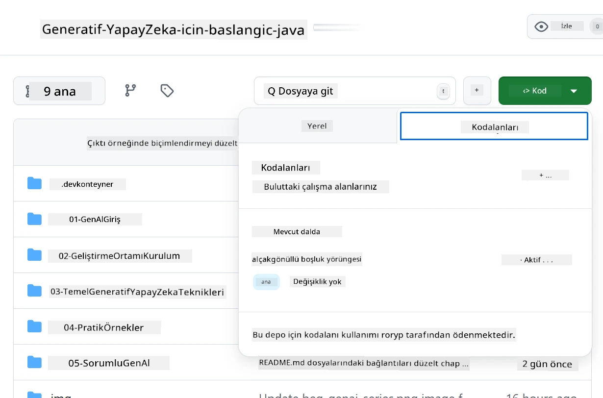
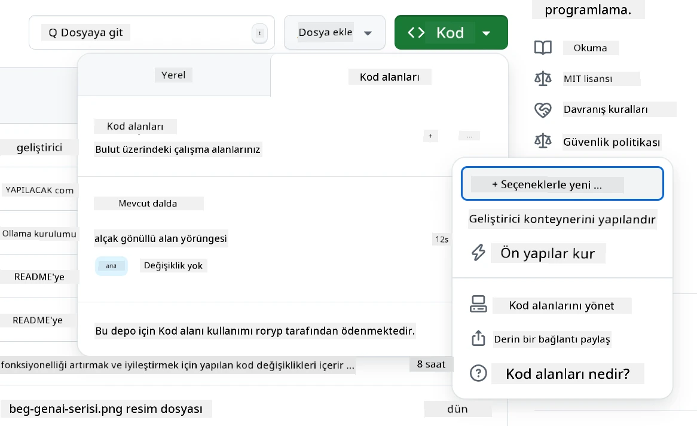
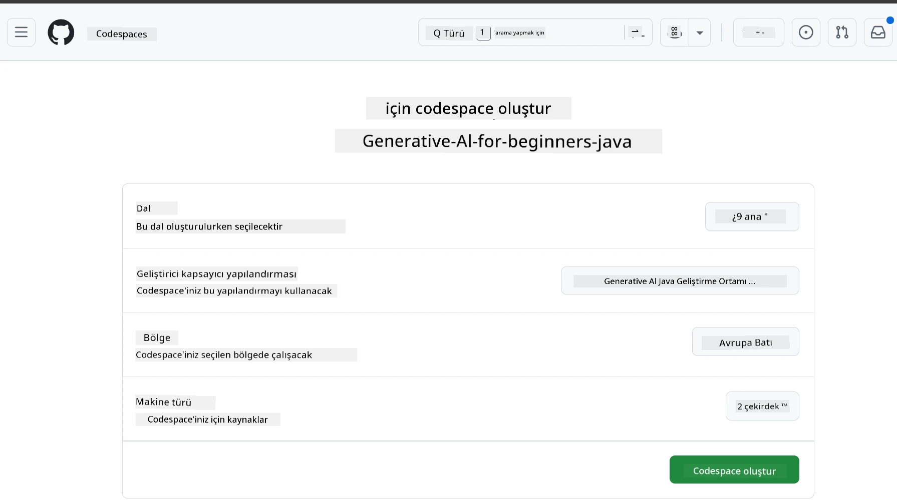
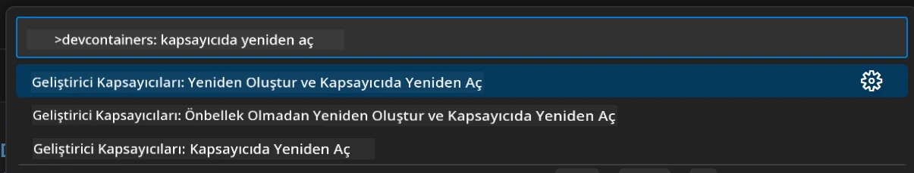
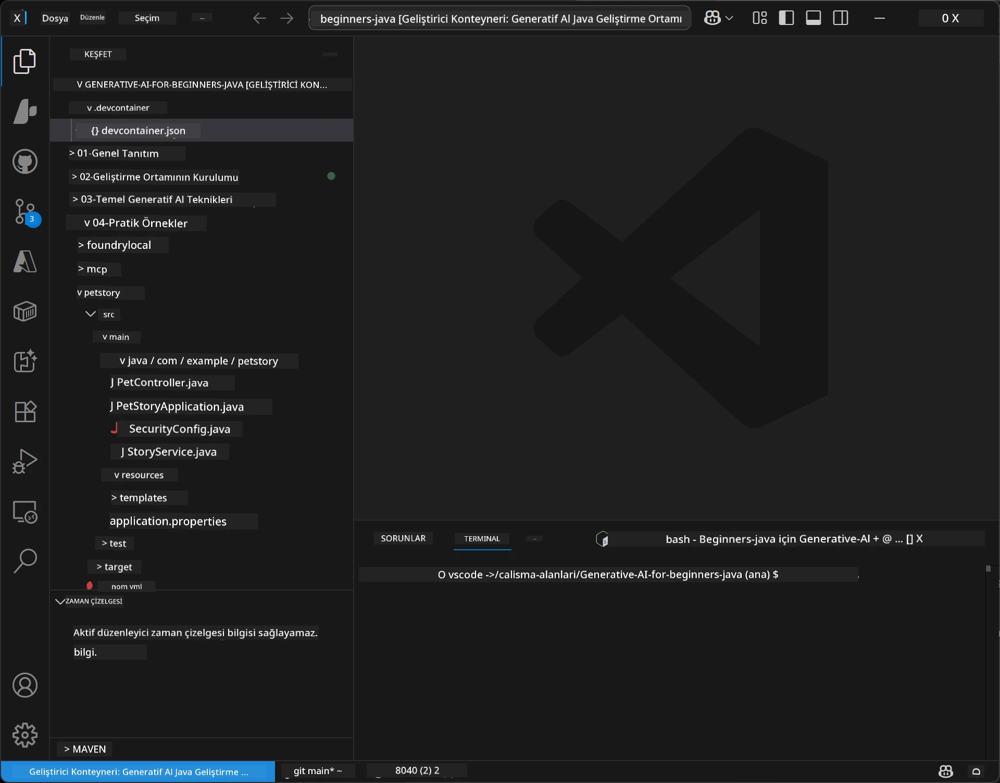
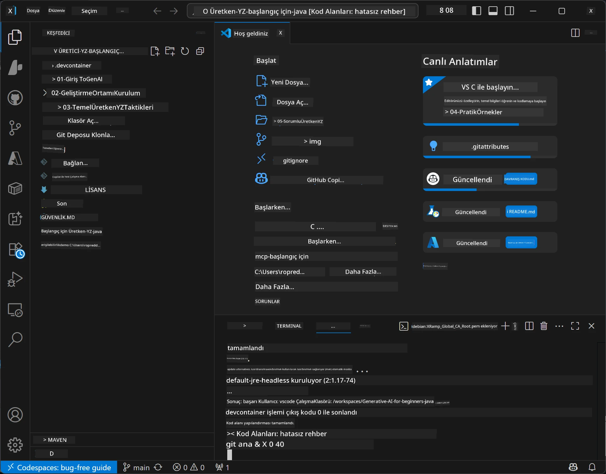

# Java için Üretken Yapay Zeka Geliştirme Ortamını Kurma

> **Hızlı Başlangıç:** AI modellerinizi birkaç dakika içinde Bicep + `azd` ile kod olarak **Azure AI Foundry** üzerinde sağlayın — bkz. [Azure AI Foundry Kurulum Kılavuzu](getting-started-azure-openai.md). Kimlik doğrulama **anahtarsızdır** (Microsoft Entra ID), bu nedenle API anahtarı yönetmeniz gerekmez.

## Neler Öğreneceksiniz

- AI uygulamaları için bir Java geliştirme ortamı kurma
- Tercih ettiğiniz geliştirme ortamını seçme ve yapılandırma (öncelikli bulut olan Codespaces, yerel geliştirme kapsayıcısı veya tam yerel kurulum)
- Azure AI Foundry modeline bağlanarak kurulumunuzu test etme

## İçindekiler

- [Neler Öğreneceksiniz](#neler-öğreneceksiniz)
- [Giriş](#giriş)
- [Adım 1: Geliştirme Ortamınızı Kurun](#adım-1-geliştirme-ortamınızı-kurun)
  - [Seçenek A: GitHub Codespaces (Önerilen)](#seçenek-a-github-codespaces-önerilen)
  - [Seçenek B: Yerel Geliştirme Kapsayıcısı](#seçenek-b-yerel-geliştirme-kapsayıcısı)
  - [Seçenek C: Mevcut Yerel Kurulumunuzu Kullanın](#seçenek-c-mevcut-yerel-kurulumunuzu-kullanın)
- [Adım 2: Azure AI Foundry Sağlama](#adım-2-azure-ai-foundry-sağlama)
- [Adım 3: Kurulumu Test Edin](#adım-3-kurulumu-test-edin)
- [Sorun Giderme](#sorun-giderme)
- [Özet](#özet)
- [Sonraki Adımlar](#sonraki-adımlar)

## Giriş

Bu bölümde, bir geliştirme ortamının nasıl kurulacağını öğreneceksiniz. Bu ders boyunca modeller için **Azure AI Foundry** kullanacağız. Modelleri Bicep ve Azure Geliştirici CLI (`azd`) ile kod olarak sağlarsınız, ardından **anahtarsız kimlik doğrulama** (Microsoft Entra ID) ile bağlanırsınız — kopyalanacak veya sızdırılacak API anahtarı yok.

**Yerel kurulum gerekmez!** Tarayıcınızda tam bir geliştirme ortamı sağlayan GitHub Codespaces’i kullanabilirsiniz ve Foundry'i oradan sağlayabilirsiniz.

Bu kurs için **Azure AI Foundry** kullanıyoruz çünkü:
- **Kod olarak sağlanır** — tek bir `azd up` hesabı ve model dağıtımlarını kurar
- **Anahtarsızdır** — Azure oturum açmanız veya yönetilen bir kimlik ile kimlik doğrulama yapar
- **Prodüksiyon hazırdır** — aynı kod yerel ve Azure’da çalışır
- **Esnektir** — kodunuzu değiştirmeden dağıtım adını değiştirerek modelleri değiştirin

> **Not**: Azure AI Foundry dağıtımları token başına ücretlendirilir (kullandıkça öde). Sağlama, bölge ve maliyet detayları için [Azure AI Foundry kurulum kılavuzuna](getting-started-azure-openai.md) bakın.


## Adım 1: Geliştirme Ortamınızı Kurun

<a name="quick-start-cloud"></a>

Bu Java Üretken AI kursu için kurulumu en aza indirmek ve gerekli tüm araçlara sahip olmanızı sağlamak amacıyla önceden yapılandırılmış bir geliştirme kapsayıcısı oluşturduk. Tercih ettiğiniz geliştirme yöntemini seçin:

### Ortam Kurulum Seçenekleri:

#### Seçenek A: GitHub Codespaces (Önerilen)

**2 dakikada kodlamaya başlayın - yerel kurulum gerekmez!**

1. Bu depoyu GitHub hesabınıza çatallayın
   > **Not**: Temel yapılandırmayı düzenlemek isterseniz [Dev Container Yapılandırması] (../.devcontainer/devcontainer.json) na bakın
2. **Code** → **Codespaces** sekmesine tıklayın → **...** → **Seçeneklerle yeni...** seçin
3. Varsayılanları kullanın – bu, bu kurs için oluşturulan **Generative AI Java Development Environment** özel devcontainer yapılandırmasını seçecektir
4. **Create codespace** butonuna tıklayın
5. Ortamın hazır olması için yaklaşık 2 dakika bekleyin
6. [Adım 2: Azure AI Foundry Sağlama](#adım-2-azure-ai-foundry-sağlama) bölümüne geçin








> **Codespaces'in Avantajları**:
> - Yerel kurulum gerekmez
> - Tarayıcı olan herhangi bir cihazda çalışır
> - Tüm araçlar ve bağımlılıklar önceden yapılandırılmıştır
> - Kişisel hesaplar için aylık 60 saat ücretsiz
> - Tüm katılımcılar için tutarlı ortam sağlar

#### Seçenek B: Yerel Geliştirme Kapsayıcısı

**Docker ile yerel geliştirmeyi tercih eden geliştiriciler için**

1. Bu depoyu çatallayıp yerel makinenize klonlayın
   > **Not**: Temel yapılandırmayı düzenlemek isterseniz [Dev Container Yapılandırması](../../../.devcontainer/devcontainer.json) na bakın
2. [Docker Desktop](https://www.docker.com/products/docker-desktop/) ve [VS Code](https://code.visualstudio.com/) yükleyin
3. VS Code’da [Dev Containers eklentisini](https://marketplace.visualstudio.com/items?itemName=ms-vscode-remote.remote-containers) yükleyin
4. Depo klasörünü VS Code’da açın
5. İstendiğinde **Reopen in Container** seçeneğine tıklayın (veya `Ctrl+Shift+P` → "Dev Containers: Reopen in Container" kullanın)
6. Kapsayıcının oluşturulup başlamasını bekleyin
7. [Adım 2: Azure AI Foundry Sağlama](#adım-2-azure-ai-foundry-sağlama) bölümüne geçin





#### Seçenek C: Mevcut Yerel Kurulumunuzu Kullanın

**Mevcut Java ortamları olan geliştiriciler için**

Önkoşullar:
- [Java 21+](https://www.oracle.com/java/technologies/javase/jdk21-archive-downloads.html)
- [Maven 3.9+](https://maven.apache.org/download.cgi)
- [VS Code](https://code.visualstudio.com) veya tercih ettiğiniz IDE

Adımlar:
1. Bu depoyu yerel makinenize klonlayın
2. Projeyi IDE'nizde açın
3. [Adım 2: Azure AI Foundry Sağlama](#adım-2-azure-ai-foundry-sağlama) adımına geçin

> **Profesyonel İpucu**: Donanımı düşük olan ancak yerel VS Code kullanmak isteyenler GitHub Codespaces’i tercih etsin! En iyisi, yerel VS Code'unuzu bulutta barındırılan Codespace'e bağlamaktır.




## Adım 2: Azure AI Foundry Sağlama

Dersin AI modellerini Azure AI Foundry'de kod olarak dağıtın. Depo kökünden:

```bash
cd 02-SetupDevEnvironment
azd auth login
az login
azd up
```

`azd`, bir ortam adı, abonelik ve bölge ister; `gpt-5.6-luna` ve `text-embedding-3-small` dağıtımları ile bir Azure AI Foundry hesabı sağlar ve örneğin `.env` dosyasına uç noktayı yazar — tümü **anahtarsız** kimlik doğrulama ile (API anahtarı yok).

> **Tam rehber:** Önkoşullar, manuel (portal) alternatifler, bölge bilgisi ve maliyet/temizlik notları için [Azure AI Foundry Kurulum Kılavuzuna](getting-started-azure-openai.md) bakın.

## Adım 3: Kurulumu Test Edin

Foundry modelleriniz sağlandıktan sonra, bağlantıyı [`02-SetupDevEnvironment/examples/basic-chat-azure`](../../../02-SetupDevEnvironment/examples/basic-chat-azure) örnek uygulaması ile test edin.

1. Geliştirme ortamınızdaki terminali açın.
2. Örneğe gidin:
   ```bash
   cd 02-SetupDevEnvironment/examples/basic-chat-azure
   ```
3. Oturum açtığınızdan emin olun (anahtarsız kimlik doğrulama token gerektirir):
   ```bash
   az login
   ```
   > Eğer `azd up` komutunu çalıştırdıysanız, uç noktayı içeren `.env` dosyası zaten oluşturulmuştur.
4. Uygulamayı çalıştırın:
   ```bash
   mvn clean spring-boot:run
   ```

`gpt-5.6-luna` modelinden bir yanıt görmelisiniz.

### Örnek Kodun Anlaşılması

[basic-chat örneği](./examples/basic-chat-azure/README.md) **Spring Boot 4.1.1** ve **Spring AI 2.0.1** kullanır. Spring AI'nin `ChatClient`i resmi OpenAI Java SDK tarafından desteklenir, Azure OpenAI **v1** uç noktasına anahtarsız kimlik doğrulama ile bağlanır.

**Bu kod ne yapar:**
- Azure AI Foundry’ye Azure oturum açmanızla (Microsoft Entra ID) bağlanır — API anahtarı yok
- `gpt-5.6-luna` modeline bir komut gönderir
- Yapay zekanın yanıtını alır ve gösterir
- Kurulumunuzun doğru çalıştığını doğrular

**Ana Bağımlılıklar** ([pom.xml](../../../02-SetupDevEnvironment/examples/basic-chat-azure/pom.xml) özet):
```xml
<dependency>
    <groupId>org.springframework.ai</groupId>
    <artifactId>spring-ai-starter-model-openai</artifactId>
</dependency>
<dependency>
    <groupId>com.openai</groupId>
    <artifactId>openai-java</artifactId>
</dependency>
<dependency>
    <groupId>com.azure</groupId>
    <artifactId>azure-identity</artifactId>
    <version>${azure-identity.version}</version>
</dependency>
```

POM, OpenAI Java **4.63.1**’i yönetir ve Azure Identity **1.18.6**'yı açıkça belirler. Spring AI 2, Azure’a özgü başlatıcıyı kaldırdı; ancak kimlik bilgisi bileşeni için Azure Identity hâlâ gereklidir.

**Yapılandırma** ([application.yml](../../../02-SetupDevEnvironment/examples/basic-chat-azure/src/main/resources/application.yml)):
```yaml
spring:
  ai:
    openai:
      base-url: ${AZURE_OPENAI_ENDPOINT}
      microsoft-foundry: true
      chat:
        model: ${AZURE_OPENAI_DEPLOYMENT:gpt-5.6-luna}
        reasoning-effort: none
        max-completion-tokens: 500
```

Anahtarsız kimlik doğrulama, [BasicChatApplication.java](../../../02-SetupDevEnvironment/examples/basic-chat-azure/src/main/java/com/example/BasicChatApplication.java) içinde açıkça yapılandırılmıştır, API anahtarının yokluğundan türetilmemiştir. Taşıyıcı kimlik bilgisi `DefaultAzureCredential` kullanır ve `https://ai.azure.com/.default` kapsamıyla `OpenAIClient` `/openai/v1` adresine yönelir. Uygulama, bu istemciyi Spring AI sohbet modeline sağlar; böylece genel bir `OPENAI_API_KEY` Azure kimlik doğrulamasını geçersiz kılamaz.

Sohbet ayarları `spring.ai.openai.chat` altında doğrudan yer alır, `options` bloğu yoktur. Ders, Chat Completions’ı `reasoning-effort: none` ve 500 token tamamlaması sınırı ile korur; `temperature` veya `max-tokens` ayarlanmaz. API seçimi ve araç çağırma rehberi için [örneğin yapılandırma referansına](./examples/basic-chat-azure/README.md#spring-configuration) bakınız.

## Özet

Yukarıdaki adımları tamamladıktan sonra:

- Azure AI Foundry modellerini Bicep + `azd` ile kod olarak sağladınız
- Java geliştirme ortamınızı çalışır hale getirdiniz (Codespaces, dev container veya yerel fark etmez)
- Azure AI Foundry’ye anahtarsız kimlik doğrulama (Microsoft Entra ID) ile bağlandınız — API anahtarı yok
- Modelinizle konuşan basit bir örnekle her şeyin çalıştığını test ettiniz

## Sonraki Adımlar

[Bölüm 3: Temel Üretken AI Teknikleri](../03-CoreGenerativeAITechniques/README.md)

## Sorun Giderme

Sorun mu yaşıyorsunuz? İşte yaygın problemler ve çözümleri:

- **Kimlik doğrulama başarısız mı oluyor (401/403)?**
  - `az login` çalıştırın — kimlik doğrulama anahtarsızdır, bu yüzden oturum açmalısınız
  - Hesabınızın kaynaktaki **Cognitive Services OpenAI User** rolüne sahip olduğunu doğrulayın
  - Yeni sağlama yaptıysanız, rol atamasının yayılması için bir dakika bekleyin

- **Maven bulunamadı mı?**
  - Dev container/Codespaces kullanıyorsanız, Maven önceden kuruludur
  - Yerel kurulum için Java 21+ ve Maven 3.9+ yüklü olmalıdır
  - Kurulumu doğrulamak için `mvn --version` komutunu deneyin

- **`azd` bulunamadı veya sağlama başarısız mı oluyor?**
  - [Azure Developer CLI](https://aka.ms/azure-dev/install) yükleyin ve `azd auth login` çalıştırın
  - `gpt-5.6-luna` ve `text-embedding-3-small` modellerinin bulunduğu (ör. `eastus2`) ve seçilen aboneliğinizin yeterli kota sahibi olduğu bir bölge seçin
  - Ayrıntılar için [Azure AI Foundry kurulum kılavuzuna](getting-started-azure-openai.md) bakın

- **Dev container başlamıyor mu?**
  - Docker Desktop’ın çalıştığından emin olun (yerel geliştirme için)
  - Kapsayıcıyı yeniden oluşturmayı deneyin: `Ctrl+Shift+P` → "Dev Containers: Rebuild Container"

- **Uygulama derleme hataları mı var?**
  - Doğru dizindesiniz, örn: `02-SetupDevEnvironment/examples/basic-chat-azure`
  - Temizleme ve yeniden derleme yapın: `mvn clean compile`

> **Yardım mı lazım?**: Hâlâ sorun mu yaşıyorsunuz? Depoda bir sorun açın, size yardımcı olalım.

---

<!-- CO-OP TRANSLATOR DISCLAIMER START -->
**Feragatname**:
Bu belge, AI çeviri hizmeti [Co-op Translator](https://github.com/Azure/co-op-translator) kullanılarak çevrilmiştir. Doğruluk için çaba sarf etsek de, otomatik çevirilerin hata veya yanlışlık içerebileceğini lütfen unutmayınız. Orijinal belge, kendi dilinde yetkili kaynak olarak kabul edilmelidir. Kritik bilgiler için profesyonel insan çevirisi önerilir. Bu çevirinin kullanımı sonucu ortaya çıkabilecek yanlış anlamalardan veya yanlış yorumlamalardan sorumlu değiliz.
<!-- CO-OP TRANSLATOR DISCLAIMER END -->