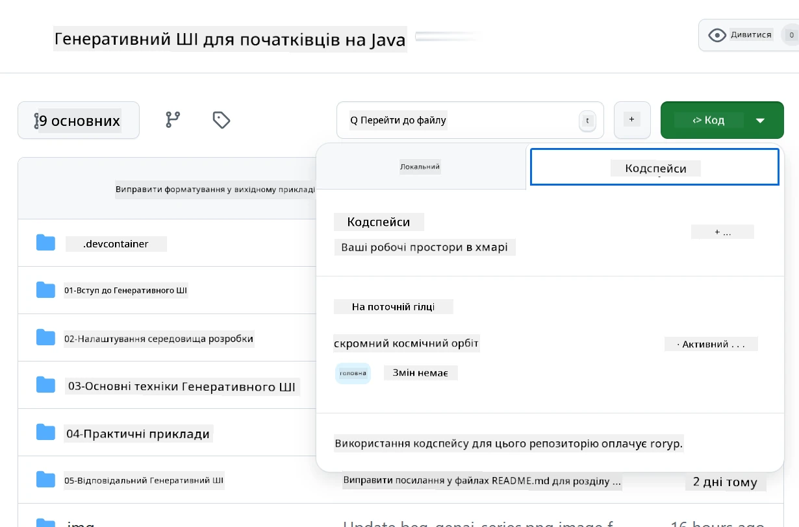
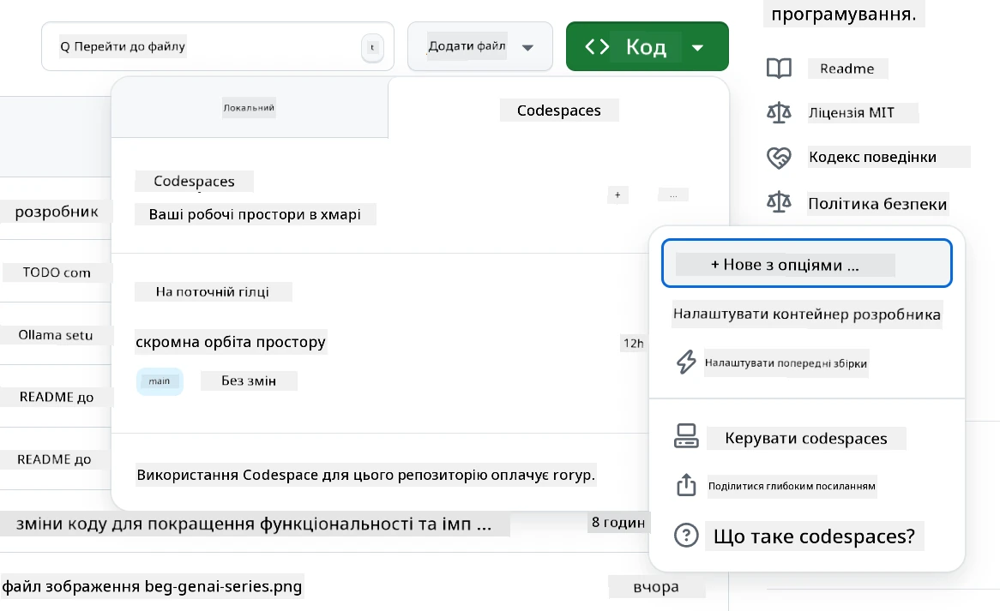
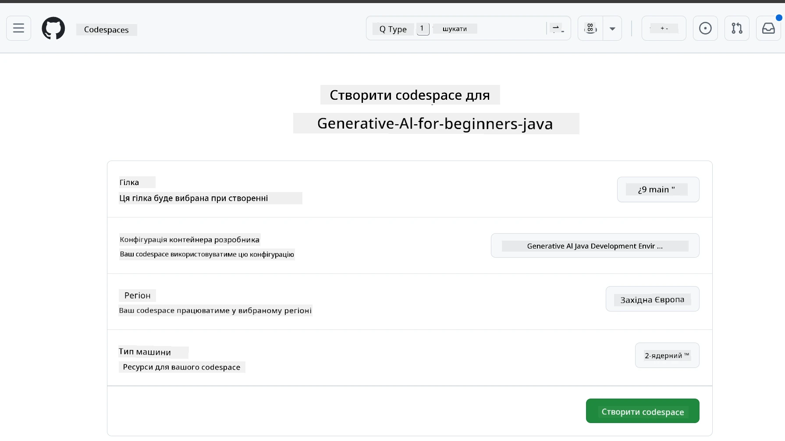
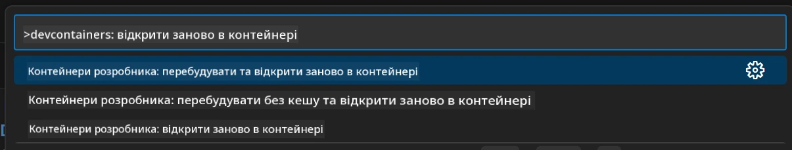
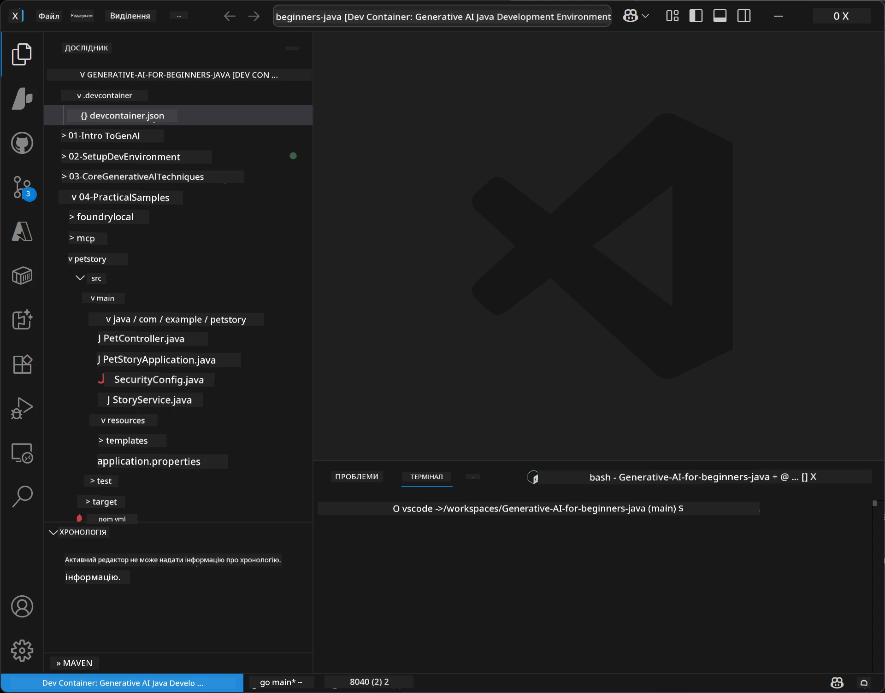
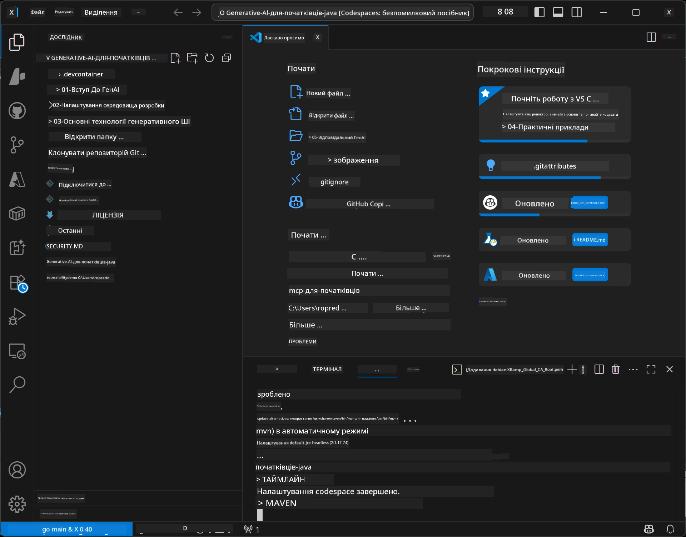

# Налаштування середовища розробки для генеративного ШІ на Java

> **Швидкий старт:** Розгортайте ваші AI-моделі на **Azure AI Foundry** як код за допомогою Bicep + `azd` за кілька хвилин — дивіться [Посібник із налаштування Azure AI Foundry](getting-started-azure-openai.md). Аутентифікація **без ключів** (Microsoft Entra ID), тому не потрібно керувати API-ключами.

## Чого ви навчитеся

- Налаштовувати середовище розробки Java для AI-застосунків
- Обирати і налаштовувати улюблене середовище розробки (cloud-first з Codespaces, локальний dev container або повне локальне налаштування)
- Тестувати налаштування, підключаючись до моделі Azure AI Foundry

## Зміст

- [Чого ви навчитеся](#чого-ви-навчитеся)
- [Вступ](#вступ)
- [Крок 1: Налаштування середовища розробки](#крок-1-налаштування-середовища-розробки)
  - [Варіант A: GitHub Codespaces (рекомендовано)](#варіант-a-github-codespaces-рекомендовано)
  - [Варіант B: Локальний Dev Container](#варіант-b-локальний-dev-container)
  - [Варіант C: Використання вашої наявної локальної інсталяції](#варіант-c-використання-вашої-наявної-локальної-інсталяції)
- [Крок 2: Розгортання Azure AI Foundry](#крок-2-розгортання-azure-ai-foundry)
- [Крок 3: Тестування налаштувань](#крок-3-тестування-налаштувань)
- [Усунення неполадок](#усунення-неполадок)
- [Підсумок](#підсумок)
- [Наступні кроки](#наступні-кроки)

## Вступ

Цей розділ проведе вас крок за кроком через налаштування середовища розробки. Протягом курсу ми будемо використовувати **Azure AI Foundry** для моделей. Ви розгортаєте моделі як код за допомогою Bicep та Azure Developer CLI (`azd`), потім підключаєтесь через **автентифікацію без ключів** (Microsoft Entra ID) — без копіювання чи витоку API-ключів.

**Локальна установка не потрібна!** Ви можете скористатися GitHub Codespaces, який надає повне середовище розробки у вашому браузері та розгортати Foundry звідти.

Ми використовуємо **Azure AI Foundry** для цього курсу, тому що це:
- **Розгортається як код** — одна команда `azd up` розгортає обліковий запис і деплойменти моделей
- **Без ключів** — аутентифікуються через ваш вхід в Azure або керований ідентичність
- **Готове до продуктивного використання** — той самий код працює локально і в Azure
- **Гнучке** — змінюйте моделі, змінюючи ім’я деплойменту, а не код

> **Примітка:** Розгортання Azure AI Foundry тарифікуються за кількість токенів (плати за фактом використання). Дивіться [посібник налаштування Azure AI Foundry](getting-started-azure-openai.md) для деталей розгортання, регіону і вартості.


## Крок 1: Налаштування середовища розробки

<a name="quick-start-cloud"></a>

Ми створили попередньо налаштований контейнер для розробки, щоб мінімізувати час налаштування і гарантувати наявність усіх необхідних інструментів для цього курсу Generative AI for Java. Оберіть улюблений спосіб розробки:

### Варіанти налаштування середовища:

#### Варіант A: GitHub Codespaces (рекомендовано)

**Почніть писати код за 2 хвилини — локальна установка не потрібна!**

1. Форкніть цей репозиторій у свій акаунт GitHub
   > **Примітка:** Якщо хочете змінити базову конфігурацію, дивіться [Конфігурацію Dev Container](../../../.devcontainer/devcontainer.json)
2. Натисніть **Code** → вкладку **Codespaces** → **...** → **New with options...**
3. Залиште параметри за замовчуванням — буде обрано **Конфігурацію Dev Container**: **Generative AI Java Development Environment**, створену спеціально для курсу
4. Натисніть **Create codespace**
5. Почекайте ~2 хвилини, поки середовище буде готове
6. Перейдіть до [Кроку 2: Розгортання Azure AI Foundry](#крок-2-розгортання-azure-ai-foundry)








> **Переваги Codespaces**:
> - Не потрібно локально встановлювати нічого
> - Працює на будь-якому пристрої з браузером
> - Попередньо налаштоване зі всіма інструментами й залежностями
> - Безкоштовно 60 годин на місяць для особистих акаунтів
> - Однорідне середовище для всіх учнів

#### Варіант B: Локальний Dev Container

**Для розробників, які віддають перевагу локальній розробці з Docker**

1. Форкніть і клонуте цей репозиторій на локальний комп’ютер
   > **Примітка:** Якщо хочете змінити базову конфігурацію, дивіться [Конфігурацію Dev Container](../../../.devcontainer/devcontainer.json)
2. Встановіть [Docker Desktop](https://www.docker.com/products/docker-desktop/) та [VS Code](https://code.visualstudio.com/)
3. Встановіть розширення [Dev Containers](https://marketplace.visualstudio.com/items?itemName=ms-vscode-remote.remote-containers) у VS Code
4. Відкрийте папку репозиторію у VS Code
5. По запиту натисніть **Reopen in Container** (або скористайтеся `Ctrl+Shift+P` → "Dev Containers: Reopen in Container")
6. Почекайте, доки контейнер збудується та запуститься
7. Перейдіть до [Кроку 2: Розгортання Azure AI Foundry](#крок-2-розгортання-azure-ai-foundry)





#### Варіант C: Використання вашої наявної локальної інсталяції

**Для розробників із наявними Java-середовищами**

Вимоги:
- [Java 21+](https://www.oracle.com/java/technologies/javase/jdk21-archive-downloads.html) 
- [Maven 3.9+](https://maven.apache.org/download.cgi)
- [VS Code](https://code.visualstudio.com) або ваш улюблений IDE

Кроки:
1. Клонуйте цей репозиторій на локальний комп’ютер
2. Відкрийте проект у вашому IDE
3. Перейдіть до [Кроку 2: Розгортання Azure AI Foundry](#крок-2-розгортання-azure-ai-foundry)

> **Порада:** Якщо у вас слабкий комп’ютер, але ви хочете локальний VS Code, використовуйте GitHub Codespaces! Ви можете підключити локальний VS Code до хмарного Codespace і отримати переваги двох світів.




## Крок 2: Розгортання Azure AI Foundry

Розгорніть моделі AI курсу у Azure AI Foundry як код. З кореня репозиторію:

```bash
cd 02-SetupDevEnvironment
azd auth login
az login
azd up
```

`azd` запитує назву середовища, підписку та регіон, розгортає обліковий запис Azure AI Foundry із деплойментами `gpt-5.6-luna` і `text-embedding-3-small`, і записує endpoint у `.env` прикладу — все з автентифікацією **без ключів** (без API-ключів).

> **Повний гайд:** Дивіться [Посібник із налаштування Azure AI Foundry](getting-started-azure-openai.md) для вимог, ручного (портального) варіанту, вибору регіону та нотаток про вартість/очищення.

## Крок 3: Тестування налаштувань

Після розгортання моделей Foundry протестуйте з’єднання з прикладною програмою в [`02-SetupDevEnvironment/examples/basic-chat-azure`](../../../02-SetupDevEnvironment/examples/basic-chat-azure).

1. Відкрийте термінал у вашому середовищі розробки.
2. Перейдіть у папку прикладу:
   ```bash
   cd 02-SetupDevEnvironment/examples/basic-chat-azure
   ```
3. Переконайтеся, що увійшли в систему (для автентифікації без ключів потрібен токен):
   ```bash
   az login
   ```
   > Якщо ви запускали `azd up`, файл `.env` з вашим endpoint уже був створений.
4. Запустіть додаток:
   ```bash
   mvn clean spring-boot:run
   ```

Ви маєте побачити відповідь від моделі `gpt-5.6-luna`.

### Розуміння прикладного коду

[Приклад basic-chat](./examples/basic-chat-azure/README.md) використовує **Spring Boot 4.1.1** і **Spring AI 2.0.1**. `ChatClient` Spring AI базується на офіційному OpenAI Java SDK, підключається до Azure OpenAI **v1** endpoint з автентифікацією без ключів.

**Що робить цей код:**
- **Підключається** до Azure AI Foundry за допомогою вашого Azure-входу (Microsoft Entra ID) — без API-ключа
- **Надсилає** запит до моделі `gpt-5.6-luna`
- **Отримує** і відображає відповідь AI
- **Перевіряє**, що налаштування працює коректно

**Основні залежності** (фрагмент з [pom.xml](../../../02-SetupDevEnvironment/examples/basic-chat-azure/pom.xml)):
```xml
<dependency>
    <groupId>org.springframework.ai</groupId>
    <artifactId>spring-ai-starter-model-openai</artifactId>
</dependency>
<dependency>
    <groupId>com.openai</groupId>
    <artifactId>openai-java</artifactId>
</dependency>
<dependency>
    <groupId>com.azure</groupId>
    <artifactId>azure-identity</artifactId>
    <version>${azure-identity.version}</version>
</dependency>
```

POM керує OpenAI Java **4.63.1** і явно встановлює Azure Identity **1.18.6**. Spring AI 2 прибрав Azure-специфічний стартер; Azure Identity все ще потрібен для credential bean.

**Конфігурація** ([application.yml](../../../02-SetupDevEnvironment/examples/basic-chat-azure/src/main/resources/application.yml)):
```yaml
spring:
  ai:
    openai:
      base-url: ${AZURE_OPENAI_ENDPOINT}
      microsoft-foundry: true
      chat:
        model: ${AZURE_OPENAI_DEPLOYMENT:gpt-5.6-luna}
        reasoning-effort: none
        max-completion-tokens: 500
```

Автентифікація без ключів налаштована явно в [BasicChatApplication.java](../../../02-SetupDevEnvironment/examples/basic-chat-azure/src/main/java/com/example/BasicChatApplication.java), а не виведена з відсутності API-ключа. Його bearer credential використовує `DefaultAzureCredential` з областю `https://ai.azure.com/.default`, а `OpenAIClient` орієнтований на `/openai/v1`. Додаток передає цей клієнт чат-моделі Spring AI, тому глобальний ключ `OPENAI_API_KEY` не може замінити автентифікацію Azure.

Налаштування чату знаходяться безпосередньо під `spring.ai.openai.chat`, без блоку `options`. У уроці збережено Chat Completions з `reasoning-effort: none` і обмеженням на 500 токенів; `temperature` і `max-tokens` не встановлені. Дивіться [довідку конфігурації прикладу](./examples/basic-chat-azure/README.md#spring-configuration) для вибору API та виклику інструментів.

## Підсумок

Після виконання вищенаведених кроків ви:

- Розгорнули моделі Azure AI Foundry як код за допомогою Bicep + `azd`
- Запустили середовище розробки Java (Codespaces, dev контейнер або локальне)
- Підключилися до Azure AI Foundry за автентифікацією без ключів (Microsoft Entra ID) — без API-ключів
- Перевірили, що все працює, на простому прикладі, який взаємодіє із вашою моделлю

## Наступні кроки

[Розділ 3: Основні методи генеративного ШІ](../03-CoreGenerativeAITechniques/README.md)

## Усунення неполадок

Маєте проблеми? Ось поширені проблеми та рішення:

- **Проблеми з аутентифікацією (401/403)?** 
  - Запустіть `az login` — аутентифікація без ключів, потрібно бути увійшли в систему
  - Переконайтеся, що вашому акаунту присвоєно роль **Cognitive Services OpenAI User** для ресурсу
  - Якщо ви щойно розгорнули, зачекайте хвилину, поки роль буде застосована

- **Не знайдено Maven?** 
  - Якщо використовуєте dev контейнер/Codespaces, Maven повинен бути встановлений за замовчуванням
  - Для локальної установки переконайтеся, що Java 21+ і Maven 3.9+ встановлені
  - Спробуйте `mvn --version` для перевірки установки

- **Не знайдено `azd` або помилка розгортання?** 
  - Встановіть [Azure Developer CLI](https://aka.ms/azure-dev/install) і виконайте `azd auth login`
  - Оберіть регіон, де доступні `gpt-5.6-luna` і `text-embedding-3-small` (наприклад, `eastus2`), з достатньою квотою у вашій підписці
  - Дивіться [посібник налаштування Azure AI Foundry](getting-started-azure-openai.md) для деталей

- **Dev контейнер не запускається?** 
  - Переконайтеся, що Docker Desktop запущений (для локальної розробки)
  - Спробуйте перебудувати контейнер: `Ctrl+Shift+P` → "Dev Containers: Rebuild Container"

- **Помилки компіляції застосунку?**
  - Переконайтеся, що ви у правильному каталозі: `02-SetupDevEnvironment/examples/basic-chat-azure`
  - Спробуйте очистити та зібрати знову: `mvn clean compile`

> **Потрібна допомога?**: Якщо проблеми залишилися, створіть issue у репозиторії, і ми допоможемо.

---

<!-- CO-OP TRANSLATOR DISCLAIMER START -->
**Відмова від відповідальності**:
Цей документ було перекладено за допомогою сервісу штучного інтелекту для перекладу [Co-op Translator](https://github.com/Azure/co-op-translator). Хоча ми прагнемо до точності, будь ласка, майте на увазі, що автоматичні переклади можуть містити помилки або неточності. Оригінальний документ рідною мовою слід вважати авторитетним джерелом. Для критично важливої інформації рекомендується професійний людський переклад. Ми не несемо відповідальності за будь-які непорозуміння або неправильні тлумачення, що виникли внаслідок використання цього перекладу.
<!-- CO-OP TRANSLATOR DISCLAIMER END -->