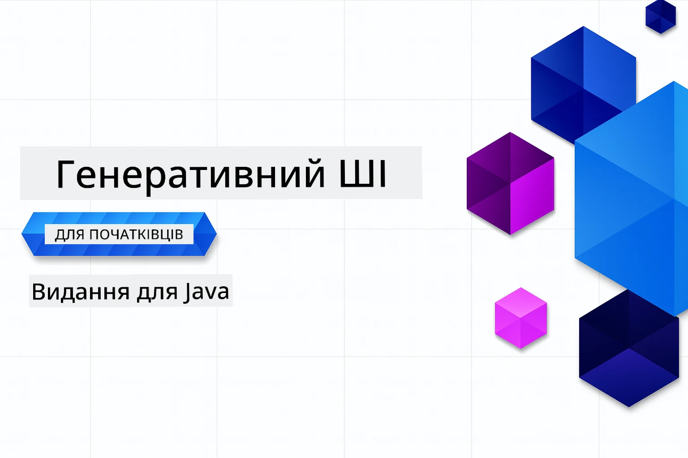

# Генеративний ШІ для Початківців – Java Версія
[](https://discord.gg/nTYy5BXMWG)



**Часові Витрати**: Весь воркшоп можна пройти онлайн без локального налаштування. Налаштування середовища займає 2 хвилини, а дослідження прикладів – від 1 до 3 годин залежно від глибини вивчення.

> **Швидкий Старт** 

1. Зробіть форк цього репозиторію у своєму обліковому записі GitHub
2. Натисніть **Code** → вкладка **Codespaces** → **...** → **New with options...**
3. Використовуйте налаштування за замовчуванням – це вибере контейнер для розробки, створений для цього курсу
4. Натисніть **Create codespace**
5. Дочекайтеся приблизно 2 хвилин для готовності середовища
6. Перейдіть безпосередньо до [Розділу 2: Provision Azure AI Foundry](./02-SetupDevEnvironment/README.md#step-2-provision-azure-ai-foundry)

## Підтримка Багатьох Мов

### Підтримка через GitHub Action (Автоматично та Завжди Оновлено)

<!-- CO-OP TRANSLATOR LANGUAGES TABLE START -->
[Арабська](../ar/README.md) | [Бенгалі](../bn/README.md) | [Болгарська](../bg/README.md) | [Бірманська (М’янма)](../my/README.md) | [Китайська (спрощена)](../zh-CN/README.md) | [Китайська (традиційна, Гонконг)](../zh-HK/README.md) | [Китайська (традиційна, Макао)](../zh-MO/README.md) | [Китайська (традиційна, Тайвань)](../zh-TW/README.md) | [Хорватська](../hr/README.md) | [Чеська](../cs/README.md) | [Данська](../da/README.md) | [Голландська](../nl/README.md) | [Естонська](../et/README.md) | [Фінська](../fi/README.md) | [Французька](../fr/README.md) | [Німецька](../de/README.md) | [Грецька](../el/README.md) | [Іврит](../he/README.md) | [Гінді](../hi/README.md) | [Угорська](../hu/README.md) | [Індонезійська](../id/README.md) | [Італійська](../it/README.md) | [Японська](../ja/README.md) | [Каннада](../kn/README.md) | [Кхмер](../km/README.md) | [Корейська](../ko/README.md) | [Литовська](../lt/README.md) | [Малайська](../ms/README.md) | [Малаялам](../ml/README.md) | [Маратхі](../mr/README.md) | [Непальська](../ne/README.md) | [Нігерійський Піджин](../pcm/README.md) | [Норвезька](../no/README.md) | [Перська (Фарсі)](../fa/README.md) | [Польська](../pl/README.md) | [Португальська (Бразилія)](../pt-BR/README.md) | [Португальська (Португалія)](../pt-PT/README.md) | [Пенджабі (Гурмукхі)](../pa/README.md) | [Румунська](../ro/README.md) | [Російська](../ru/README.md) | [Сербська (кирилиця)](../sr/README.md) | [Словацька](../sk/README.md) | [Словенська](../sl/README.md) | [Іспанська](../es/README.md) | [Свахілі](../sw/README.md) | [Шведська](../sv/README.md) | [Тагалог (Філіппінська)](../tl/README.md) | [Тамільська](../ta/README.md) | [Телугу](../te/README.md) | [Тайська](../th/README.md) | [Турецька](../tr/README.md) | [Українська](./README.md) | [Урду](../ur/README.md) | [В’єтнамська](../vi/README.md)

> **Віддаєте перевагу клонувати локально?**
>
> Цей репозиторій містить понад 50 мовних перекладів, що значно збільшує розмір завантаження. Щоб клонувати без перекладів, використовуйте sparse checkout:
>
> **Bash / macOS / Linux:**
> ```bash
> git clone --filter=blob:none --sparse https://github.com/microsoft/Generative-AI-for-beginners-java.git
> cd Generative-AI-for-beginners-java
> git sparse-checkout set --no-cone '/*' '!translations' '!translated_images'
> ```
>
> **CMD (Windows):**
> ```cmd
> git clone --filter=blob:none --sparse https://github.com/microsoft/Generative-AI-for-beginners-java.git
> cd Generative-AI-for-beginners-java
> git sparse-checkout set --no-cone "/*" "!translations" "!translated_images"
> ```
>
> Це дасть вам усе необхідне для проходження курсу з набагато швидшим завантаженням.
<!-- CO-OP TRANSLATOR LANGUAGES TABLE END -->

## Структура Курсу та Навчальний Шлях

### **Розділ 1: Вступ до Генеративного ШІ**
- **Основні Концепти**: Розуміння великих мовних моделей, токенів, ембеддингів та можливостей ШІ
- **Екосистема Java AI**: Огляд Spring AI та OpenAI SDK
- **Протокол Контексту Моделі**: Вступ до MCP та його роль у спілкуванні агентів ШІ
- **Практичне Застосування**: Реальні сценарії, включаючи чатботів і генерацію контенту
- **[→ Почати Розділ 1](./01-IntroToGenAI/README.md)**

### **Розділ 2: Налаштування Середовища Розробки**
- **Azure AI Foundry**: Підготовка чат-бота GPT-5.6 Luna і ембеддингів text-embedding-3-small за допомогою Bicep та Azure Developer CLI (azd)
- **Spring Boot 4.1.1 + Spring AI 2.0.1**: Навчання з `ChatClient`, підтримуваним офіційним OpenAI Java SDK та Azure OpenAI v1
- **Аутентифікація без Ключа**: Безпечне підключення через Microsoft Entra ID — без необхідності керувати API ключами
- **Інструменти Розробки**: Docker контейнери, VS Code, та конфігурація GitHub Codespaces
- **[→ Почати Розділ 2](./02-SetupDevEnvironment/README.md)**

### **Розділ 3: Основні Техніки Генеративного ШІ**
- **Офіційний OpenAI Java SDK**: Виклик Azure OpenAI v1 безпосередньо з аутентифікацією без ключа
- **Інженерія Запитів**: Техніки для оптимальних відповідей моделі ШІ
- **Ембеддинги та Векторні Операції**: Реалізація семантичного пошуку та пошуку схожості
- **Retrieval-Augmented Generation (RAG)**: Поєднання ШІ з вашими джерелами даних
- **Виклики Функцій**: Розширення можливостей ШІ за допомогою власних інструментів і плагінів
- **[→ Почати Розділ 3](./03-CoreGenerativeAITechniques/README.md)**

### **Розділ 4: Практичні Застосування та Проєкти**
- **Генератор Історій про Тварин** (`petstory/`): Креативне генерування контенту з Azure AI Foundry
- **Foundry Local Demo** (`foundrylocal/`): Локальна інтеграція ШІ-моделі з OpenAI Java SDK
- **Сервіс Калькулятора MCP** (`calculator/`): Базова реалізація Протоколу Контексту Моделі з Spring AI
- **[→ Почати Розділ 4](./04-PracticalSamples/README.md)**

### **Розділ 5: Відповідальна Розробка ШІ**
- **Безпека Контенту в Azure AI Foundry**: Тестування вбудованих механізмів фільтрації і безпеки контенту (жорсткий блок та м’які відмови)
- **Демонстрація Відповідальної Розробки ШІ**: Практичний приклад роботи сучасних систем безпеки ШІ
- **Найкращі Практики**: Основні рекомендації для етичної розробки та впровадження ШІ
- **[→ Почати Розділ 5](./05-ResponsibleGenAI/README.md)**

## Додаткові Ресурси

<!-- CO-OP TRANSLATOR OTHER COURSES START -->
### LangChain
[](https://aka.ms/langchain4j-for-beginners)
[](https://aka.ms/langchainjs-for-beginners?WT.mc_id=m365-94501-dwahlin)
[](https://github.com/microsoft/langchain-for-beginners?WT.mc_id=m365-94501-dwahlin)
---

### Azure / Edge / MCP / Агенти
[](https://github.com/microsoft/AZD-for-beginners?WT.mc_id=academic-105485-koreyst)
[](https://github.com/microsoft/edgeai-for-beginners?WT.mc_id=academic-105485-koreyst)
[](https://github.com/microsoft/mcp-for-beginners?WT.mc_id=academic-105485-koreyst)
[](https://github.com/microsoft/ai-agents-for-beginners?WT.mc_id=academic-105485-koreyst)

---
 
### Серія про Генеративний ШІ
[](https://github.com/microsoft/generative-ai-for-beginners?WT.mc_id=academic-105485-koreyst)
[-9333EA?style=for-the-badge&labelColor=E5E7EB&color=9333EA)](https://github.com/microsoft/Generative-AI-for-beginners-dotnet?WT.mc_id=academic-105485-koreyst)
[-C084FC?style=for-the-badge&labelColor=E5E7EB&color=C084FC)](https://github.com/microsoft/generative-ai-for-beginners-java?WT.mc_id=academic-105485-koreyst)
[-E879F9?style=for-the-badge&labelColor=E5E7EB&color=E879F9)](https://github.com/microsoft/generative-ai-with-javascript?WT.mc_id=academic-105485-koreyst)

---
 
### Основне Навчання
[](https://aka.ms/ml-beginners?WT.mc_id=academic-105485-koreyst)
[](https://aka.ms/datascience-beginners?WT.mc_id=academic-105485-koreyst)
[](https://aka.ms/ai-beginners?WT.mc_id=academic-105485-koreyst)
[](https://github.com/microsoft/Security-101?WT.mc_id=academic-96948-sayoung)
[](https://aka.ms/webdev-beginners?WT.mc_id=academic-105485-koreyst)
[](https://aka.ms/iot-beginners?WT.mc_id=academic-105485-koreyst)
[](https://github.com/microsoft/xr-development-for-beginners?WT.mc_id=academic-105485-koreyst)

---
 
### Серія Copilot
[](https://aka.ms/GitHubCopilotAI?WT.mc_id=academic-105485-koreyst)
[](https://github.com/microsoft/mastering-github-copilot-for-dotnet-csharp-developers?WT.mc_id=academic-105485-koreyst)
[](https://github.com/microsoft/CopilotAdventures?WT.mc_id=academic-105485-koreyst)
<!-- CO-OP TRANSLATOR OTHER COURSES END -->

## Отримання Допомоги

Якщо ви застрягли або маєте питання щодо створення AI-додатків, приєднуйтесь до спільноти учнів і досвідчених розробників для обговорень MCP. Це підтримуюча спільнота, де питання вітаються, а знання вільно обмінюються.

[](https://discord.gg/nTYy5BXMWG)

Якщо у вас є відгуки про продукт або ви зіткнулися з помилками під час розробки, відвідайте:

[](https://aka.ms/foundry/forum)

---

<!-- CO-OP TRANSLATOR DISCLAIMER START -->
**Відмова від відповідальності**:
Цей документ було перекладено за допомогою сервісу штучного інтелекту для перекладу [Co-op Translator](https://github.com/Azure/co-op-translator). Хоча ми прагнемо до точності, будь ласка, майте на увазі, що автоматичні переклади можуть містити помилки або неточності. Оригінальний документ рідною мовою слід вважати авторитетним джерелом. Для критично важливої інформації рекомендується професійний людський переклад. Ми не несемо відповідальності за будь-які непорозуміння або неправильні тлумачення, що виникли внаслідок використання цього перекладу.
<!-- CO-OP TRANSLATOR DISCLAIMER END -->