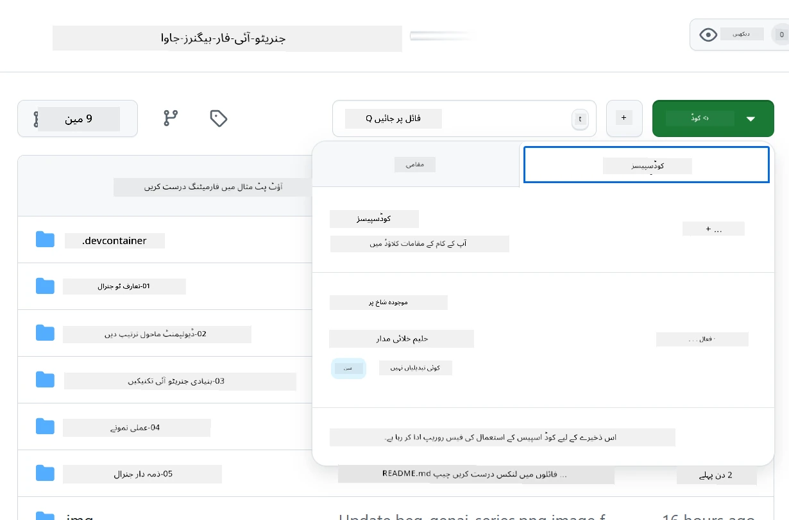
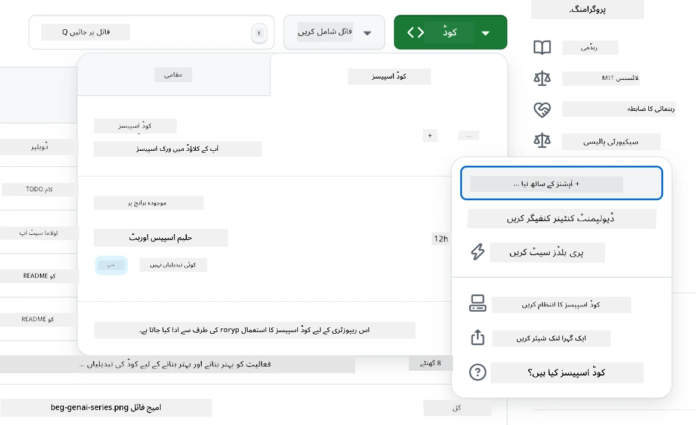
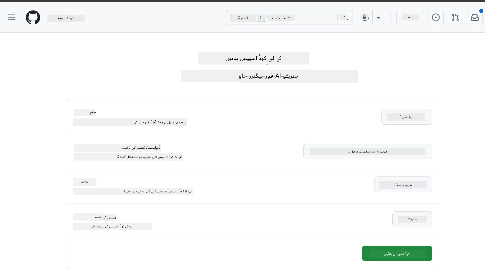
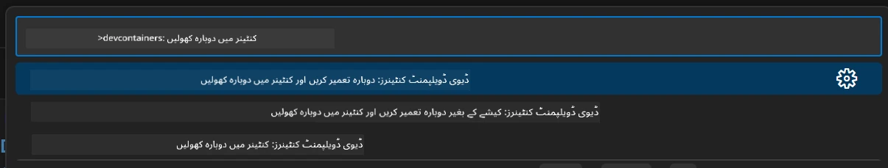
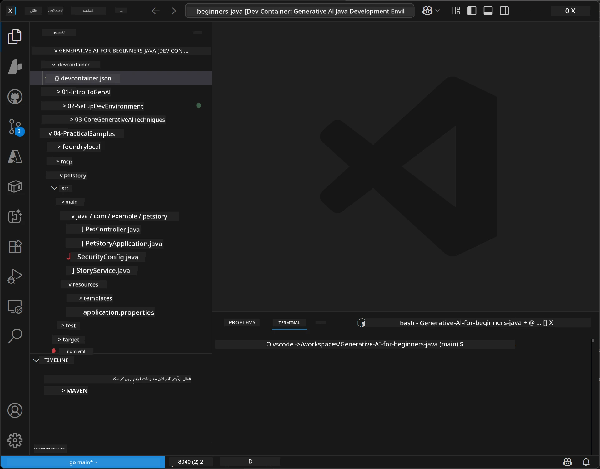
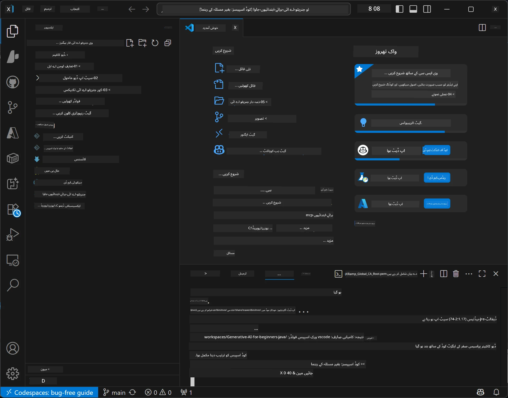

# جاوا کے لیے جنریٹیو AI کا ڈیولپمنٹ ماحول ترتیب دینا

> **فوری آغاز:** اپنے AI ماڈلز کو چند منٹوں میں Bicep + `azd` کے ساتھ **Azure AI Foundry** پر بطور کوڈ مہیا کریں — [Azure AI Foundry سیٹ اپ گائیڈ](getting-started-azure-openai.md) دیکھیں۔ تصدیق **کلیدی بغیر** (Microsoft Entra ID) ہے، لہذا آپ کو کوئی API کیز منظم کرنے کی ضرورت نہیں۔

## آپ کیا سیکھیں گے

- AI ایپلیکیشنز کے لیے جاوا ڈیولپمنٹ ماحول ترتیب دینا
- اپنی پسندیدہ ڈیولپمنٹ ماحول منتخب اور ترتیب دینا (کلاؤڈ اولین Codespaces کے ساتھ، لوکل ڈیول کنٹینر، یا مکمل لوکل سیٹ اپ)
- Azure AI Foundry ماڈل سے جڑ کر اپنی ترتیب کی جانچ کرنا

## فہرستِ مضامین

- [آپ کیا سیکھیں گے](#آپ-کیا-سیکھیں-گے)
- [تعارف](#تعارف)
- [مرحلہ 1: اپنا ڈیولپمنٹ ماحول ترتیب دیں](#مرحلہ-1-اپنا-ڈیولپمنٹ-ماحول-ترتیب-دیں)
  - [اختیار A: GitHub Codespaces (تجویز کردہ)](#اختیار-a-github-codespaces-تجویز-کردہ)
  - [اختیار B: لوکل ڈیول کنٹینر](#اختیار-b-لوکل-ڈیول-کنٹینر)
  - [اختیار C: اپنے موجودہ لوکل انسٹالیشن کا استعمال کریں](#اختیار-c-اپنے-موجودہ-لوکل-انسٹالیشن-کا-استعمال-کریں)
- [مرحلہ 2: Azure AI Foundry کو مہیا کریں](#مرحلہ-2-azure-ai-foundry-مہیا-کریں)
- [مرحلہ 3: اپنی ترتیب کی جانچ کریں](#مرحلہ-3-اپنی-ترتیب-کی-جانچ-کریں)
- [مسائل کا حل](#مسائل-کا-حل)
- [خلاصہ](#خلاصہ)
- [اگلے اقدامات](#اگلے-اقدامات)

## تعارف

یہ باب آپ کو ڈیولپمنٹ ماحول ترتیب دینے میں رہنمائی کرے گا۔ ہم اس کورس کے دوران **Azure AI Foundry** کا ماڈلز کے لیے استعمال کریں گے۔ آپ Bicep اور Azure Developer CLI (`azd`) کے ساتھ ماڈلز کو بطور کوڈ مہیا کرتے ہیں، پھر **کلیدی بغیر تصدیق** (Microsoft Entra ID) کے ساتھ جڑتے ہیں — کوئی API کیز کاپی یا لیک کرنے کی ضرورت نہیں۔

**کوئی لوکل سیٹ اپ ضروری نہیں!** آپ GitHub Codespaces استعمال کر سکتے ہیں، جو آپ کے براؤزر میں مکمل ڈیولپمنٹ ماحول فراہم کرتا ہے، اور وہاں سے Foundry کو مہیا کریں۔

ہم اس کورس کے لیے **Azure AI Foundry** اس لیے استعمال کرتے ہیں کیونکہ یہ:
- **کوڈ کے طور پر مہیا ہوتا ہے** — ایک `azd up` اکاؤنٹ اور ماڈل کے تعیناتیاں کرتا ہے
- **کلیدی بغیر** — اپنے Azure سائن ان یا مینیجڈ شناخت کے ساتھ تصدیق کریں
- **پیداوار کے لیے تیار** — وہی کوڈ مقامی اور Azure میں چلتا ہے
- **لچکدار** — اپنی کوڈ کی بجائے تعیناتی کا نام بدل کر ماڈلز کو تبدیل کریں

> **نوٹ**: Azure AI Foundry کی تعیناتیاں ٹوکن کے حساب سے بل کی جاتی ہیں (جتنا استعمال کریں اتنا ادائیگی کریں)۔ مہیا کاری، علاقہ، اور لاگت کی تفصیلات کے لیے [Azure AI Foundry سیٹ اپ گائیڈ](getting-started-azure-openai.md) دیکھیں۔


## مرحلہ 1: اپنا ڈیولپمنٹ ماحول ترتیب دیں

<a name="quick-start-cloud"></a>

ہم نے سیٹ اپ کا وقت کم کرنے اور اس بات کو یقینی بنانے کے لیے ایک پری کنفیگرڈ ڈیولپمنٹ کنٹینر بنایا ہے کہ آپ کے پاس اس جنریٹیو AI برائے جاوا کورس کے لیے تمام ضروری ٹولز موجود ہوں۔ اپنی پسند کی ڈیولپمنٹ روش منتخب کریں:

### ماحول ترتیب کے اختیارات:

#### اختیار A: GitHub Codespaces (تجویز کردہ)

**2 منٹ میں کوڈنگ شروع کریں - کوئی لوکل سیٹ اپ ضروری نہیں!**

1. اس ریپوزیٹری کو اپنے GitHub اکاؤنٹ پر فورک کریں
   > **نوٹ**: اگر آپ بنیادی کنفیگریشن میں ترمیم کرنا چاہتے ہیں تو براہ کرم [Dev Container Configuration](../../../.devcontainer/devcontainer.json) دیکھیں
2. **Code** → **Codespaces** ٹیب → **...** → **New with options...** پر کلک کریں
3. ڈیفالٹ کا استعمال کریں – یہ کورس کے لیے بنائے گئے **Dev container configuration**: **Generative AI Java Development Environment** منتخب کرے گا
4. **Create codespace** پر کلک کریں
5. ماحول تیار ہونے کے لیے تقریباً 2 منٹ انتظار کریں
6. [مرحلہ 2: Azure AI Foundry مہیا کریں](#مرحلہ-2-azure-ai-foundry-مہیا-کریں) پر جائیں








> **Codespaces کے فوائد**:
> - کوئی لوکل انسٹالیشن ضروری نہیں
> - کسی بھی ڈیوائس پر براؤزر کے ساتھ کام کرتا ہے
> - تمام ٹولز اور انحصار کے ساتھ پری-کنفیگرڈ
> - ذاتی اکاؤنٹس کے لیے ماہانہ 60 گھنٹے مفت
> - تمام سیکھنے والوں کے لیے یکساں ماحول

#### اختیار B: لوکل ڈیول کنٹینر

**ان ڈویلپرز کے لیے جو Docker کے ساتھ لوکل ڈیولپمنٹ کو ترجیح دیتے ہیں**

1. اس ریپوزیٹری کو فورک اور کلون کریں اپنے لوکل مشین پر
   > **نوٹ**: اگر آپ بنیادی کنفیگریشن میں ترمیم کرنا چاہتے ہیں تو براہ کرم [Dev Container Configuration](../../../.devcontainer/devcontainer.json) دیکھیں
2. [Docker Desktop](https://www.docker.com/products/docker-desktop/) اور [VS Code](https://code.visualstudio.com/) انسٹال کریں
3. VS Code میں [Dev Containers extension](https://marketplace.visualstudio.com/items?itemName=ms-vscode-remote.remote-containers) انسٹال کریں
4. ریپوزیٹری فولڈر VS Code میں کھولیں
5. حکم ملنے پر **Reopen in Container** پر کلک کریں (یا `Ctrl+Shift+P` → "Dev Containers: Reopen in Container" استعمال کریں)
6. کنٹینر کے بننے اور شروع ہونے کا انتظار کریں
7. [مرحلہ 2: Azure AI Foundry مہیا کریں](#مرحلہ-2-azure-ai-foundry-مہیا-کریں) پر جائیں





#### اختیار C: اپنے موجودہ لوکل انسٹالیشن کا استعمال کریں

**ان ڈویلپرز کے لیے جن کے پاس موجودہ جاوا ماحولیات ہیں**

تقاضے:
- [Java 21+](https://www.oracle.com/java/technologies/javase/jdk21-archive-downloads.html)
- [Maven 3.9+](https://maven.apache.org/download.cgi)
- [VS Code](https://code.visualstudio.com) یا اپنی پسندیدہ IDE

اقدامات:
1. اس ریپوزیٹری کو اپنے لوکل مشین پر کلون کریں
2. پروجیکٹ کو اپنی IDE میں کھولیں
3. [مرحلہ 2: Azure AI Foundry مہیا کریں](#مرحلہ-2-azure-ai-foundry-مہیا-کریں) پر جائیں

> **پرو ٹپ**: اگر آپ کے پاس کم صلاحیت والا مشین ہے لیکن آپ لوکل VS Code استعمال کرنا چاہتے ہیں، تو GitHub Codespaces استعمال کریں! آپ اپنے لوکل VS Code کو کلاؤڈ ہوسٹڈ Codespace سے جوڑ سکتے ہیں تاکہ دونوں کی بہترین سہولیات مل سکیں۔




## مرحلہ 2: Azure AI Foundry مہیا کریں

کورس کے AI ماڈلز کو Azure AI Foundry پر بطور کوڈ مہیا کریں۔ ریپوزیٹری روٹ سے:

```bash
cd 02-SetupDevEnvironment
azd auth login
az login
azd up
```

`azd` آپ سے ماحول کا نام، سبسکرپشن، اور علاقہ پوچھتا ہے، `gpt-5.6-luna` اور `text-embedding-3-small` تعیناتیوں کے ساتھ Azure AI Foundry اکاؤنٹ مہیا کرتا ہے، اور مثال کی `.env` فائل میں اینڈپوائنٹ لکھتا ہے - سب کچھ **کلیدی بغیر** تصدیق کے ساتھ (کوئی API کیز نہیں)۔

> **مکمل رہنمائی:** تقاضے، دستی (پورٹل) متبادل، علاقہ کی رہنمائی، اور لاگت/صفائی کے نوٹس کے لیے [Azure AI Foundry سیٹ اپ گائیڈ](getting-started-azure-openai.md) دیکھیں۔

## مرحلہ 3: اپنی ترتیب کی جانچ کریں

جب آپ کے Foundry ماڈلز مہیا ہو جائیں، تو مثال ایپ کے ساتھ کنکشن کی جانچ کریں [`02-SetupDevEnvironment/examples/basic-chat-azure`](../../../02-SetupDevEnvironment/examples/basic-chat-azure) میں۔

1. اپنے ڈیولپمنٹ ماحول میں ٹرمینل کھولیں۔
2. مثال فولڈر پر جائیں:
   ```bash
   cd 02-SetupDevEnvironment/examples/basic-chat-azure
   ```
3. یقینی بنائیں کہ آپ سائن ان ہیں (کلیدی بغیر تصدیق کے لیے ٹوکن چاہیے):
   ```bash
   az login
   ```
   > اگر آپ نے `azd up` چلایا ہے، تو آپ کے اینڈپوائنٹ کے ساتھ `.env` فائل پہلے ہی لکھی جا چکی ہے۔
4. ایپلیکیشن چلائیں:
   ```bash
   mvn clean spring-boot:run
   ```

آپ کو `gpt-5.6-luna` ماڈل سے جواب ملنا چاہیے۔

### مثال کوڈ کو سمجھنا

[basic-chat مثال](./examples/basic-chat-azure/README.md) **Spring Boot 4.1.1** اور **Spring AI 2.0.1** استعمال کرتی ہے۔ Spring AI کا `ChatClient` سرکاری OpenAI جاوا SDK پر مبنی ہے، جو Azure OpenAI **v1** اینڈپوائنٹ سے کلیدی بغیر تصدیق کے ساتھ جڑتا ہے۔

**یہ کوڈ کیا کرتا ہے:**
- آپ کے Azure سائن ان (Microsoft Entra ID) کے ذریعے Azure AI Foundry سے جڑتا ہے — کوئی API کی نہیں
- `gpt-5.6-luna` ماڈل کو پرامپٹ بھیجتا ہے
- AI کا جواب حاصل اور نمایش کرتا ہے
- تصدیق کرتا ہے کہ آپ کی ترتیب درست کام کر رہی ہے

**اہم انحصارات** ([pom.xml](../../../02-SetupDevEnvironment/examples/basic-chat-azure/pom.xml) سے اقتباس):
```xml
<dependency>
    <groupId>org.springframework.ai</groupId>
    <artifactId>spring-ai-starter-model-openai</artifactId>
</dependency>
<dependency>
    <groupId>com.openai</groupId>
    <artifactId>openai-java</artifactId>
</dependency>
<dependency>
    <groupId>com.azure</groupId>
    <artifactId>azure-identity</artifactId>
    <version>${azure-identity.version}</version>
</dependency>
```

POM OpenAI Java **4.63.1** کو منظم کرتا ہے اور Azure Identity **1.18.6** کو واضح طور پر سیٹ کرتا ہے۔ Spring AI 2 نے Azure خاص اسٹارٹر کو ہٹا دیا؛ Azure Identity اب بھی اسناد کے لیے ضروری ہے۔

**کنفیگریشن** ([application.yml](../../../02-SetupDevEnvironment/examples/basic-chat-azure/src/main/resources/application.yml)):
```yaml
spring:
  ai:
    openai:
      base-url: ${AZURE_OPENAI_ENDPOINT}
      microsoft-foundry: true
      chat:
        model: ${AZURE_OPENAI_DEPLOYMENT:gpt-5.6-luna}
        reasoning-effort: none
        max-completion-tokens: 500
```

کلیدی بغیر کی تصدیق واضح طور پر [BasicChatApplication.java](../../../02-SetupDevEnvironment/examples/basic-chat-azure/src/main/java/com/example/BasicChatApplication.java) میں ترتیب دی گئی ہے، غیر موجود API کی سے نہیں۔ اس کا بیئرر اسناد `DefaultAzureCredential` استعمال کرتا ہے جس کے ساتھ `https://ai.azure.com/.default` اسکوپ ہوتا ہے، اور اس کا `OpenAIClient` `/openai/v1` پر نشانہ بناتا ہے۔ ایپ وہ کلائنٹ Spring AI کے چیٹ ماڈل کو فراہم کرتی ہے، اس لیے عالمی `OPENAI_API_KEY` Azure تصدیق کو اوور رائیڈ نہیں کر سکتا۔

چیٹ کی ترتیبات `spring.ai.openai.chat` کے نیچے براہ راست ہیں، بغیر `options` بلاک کے۔ سبق چیٹ مکملات کو `reasoning-effort: none` اور 500 ٹوکن کی حد کے ساتھ رکھتا ہے؛ یہ `temperature` یا `max-tokens` سیٹ نہیں کرتا۔ API کے انتخاب اور ٹول کالنگ کی رہنمائی کے لیے [مثال کی کنفیگریشن ریفرنس](./examples/basic-chat-azure/README.md#spring-configuration) دیکھیں۔

## خلاصہ

مذکورہ بالا مراحل مکمل کرنے کے بعد، آپ کے پاس ہوگا:

- Bicep + `azd` کے ساتھ Azure AI Foundry ماڈلز کو بطور کوڈ مہیا کیا ہوا
- جاوا ڈیولپمنٹ ماحول چل رہا ہے (چاہے وہ Codespaces ہو، ڈیول کنٹینرز ہو، یا لوکل)
- کلیدی بغیر تصدیق (Microsoft Entra ID) کے ساتھ Azure AI Foundry سے منسلک ہے — کوئی API کیز نہیں
- ایک سادہ مثال کے ذریعے سب کچھ کام کرنے کی جانچ کی ہے جو آپ کے ماڈل سے بات کرتی ہے

## اگلے اقدامات

[باب 3: بنیادی جنریٹیو AI تکنیکیں](../03-CoreGenerativeAITechniques/README.md)

## مسائل کا حل

مسائل ہیں؟ یہاں عام مسائل اور حل موجود ہیں:

- **تصدیق ناکام ہو رہی ہے (401/403)?**
  - `az login` چلائیں — تصدیق کلیدی بغیر ہے، لہذا آپ کو سائن ان ہونا چاہیے
  - یقینی بنائیں کہ آپ کے اکاؤنٹ کو ریسورس پر **Cognitive Services OpenAI User** کا کردار ملا ہوا ہے
  - اگر آپ نے ابھی حال ہی میں مہیا کیا ہے، تو کردار کی تفویض کے پھیلنے کے لیے ایک منٹ انتظار کریں

- **Maven نہیں ملا؟**
  - اگر آپ dev containers/Codespaces استعمال کر رہے ہیں، تو Maven پہلے سے انسٹال ہونا چاہیے
  - لوکل سیٹ اپ کے لیے، یقینی بنائیں کہ Java 21+ اور Maven 3.9+ انسٹال ہیں
  - تصدیق کے لیے `mvn --version` آزمائیں

- **`azd` نہیں ملا یا مہیا کرنا ناکام ہو رہا ہے؟**
  - [Azure Developer CLI](https://aka.ms/azure-dev/install) انسٹال کریں اور `azd auth login` چلائیں
  - ایک ایسا علاقہ منتخب کریں جہاں `gpt-5.6-luna` اور `text-embedding-3-small` دستیاب ہوں (مثلاً `eastus2`)، اور آپ کے منتخب سبسکرپشن میں کافی کوٹا ہو
  - تفصیلات کے لیے [Azure AI Foundry سیٹ اپ گائیڈ](getting-started-azure-openai.md) دیکھیں

- **Dev container شروع نہیں ہو رہا؟**
  - یقینی بنائیں کہ Docker Desktop چل رہا ہو (لوکل ڈیولپمنٹ کے لیے)
  - کنٹینر کو دوبارہ بنانے کی کوشش کریں: `Ctrl+Shift+P` → "Dev Containers: Rebuild Container"

- **ایپلیکیشن کمپائلیشن کی غلطیاں؟**
  - یقینی بنائیں کہ آپ صحیح ڈائریکٹری میں ہیں: `02-SetupDevEnvironment/examples/basic-chat-azure`
  - کلین اور ریبلڈ کرنے کی کوشش کریں: `mvn clean compile`

> **مدد چاہیے؟**: مسائل برقرار ہیں؟ ریپوزیٹری میں ایک مسئلہ کھولیں اور ہم آپ کی مدد کریں گے۔

---

<!-- CO-OP TRANSLATOR DISCLAIMER START -->
**ڈس کلیمر**:
یہ دستاویز AI ترجمہ سروس [Co-op Translator](https://github.com/Azure/co-op-translator) کے ذریعے ترجمہ کی گئی ہے۔ جبکہ ہم درستگی کے لیے کوشاں ہیں، براہ کرم اس بات سے آگاہ رہیں کہ خودکار ترجمے میں غلطیاں یا عدم درستیاں ہو سکتی ہیں۔ اصل دستاویز اپنے مادری زبان میں مستند ماخذ سمجھی جائے گی۔ حساس معلومات کے لیے پیشہ ور انسانی ترجمہ کی سفارش کی جاتی ہے۔ اس ترجمے کے استعمال سے پیدا ہونے والی کسی بھی غلط فہمی یا غلط تشریح کی ذمہ داری ہم قبول نہیں کرتے۔
<!-- CO-OP TRANSLATOR DISCLAIMER END -->