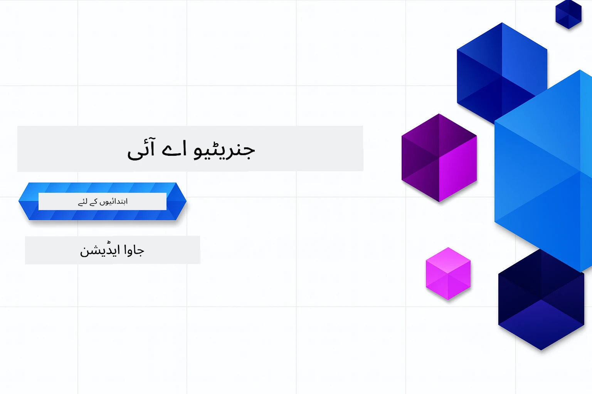

# ابتدائیوں کے لیے جنریٹو اے آئی - جاوا ایڈیشن
[](https://discord.gg/nTYy5BXMWG)



**وقت کی پابندی**: پورا ورکشاپ آن لائن مکمل کیا جا سکتا ہے بغیر کسی لوکل سیٹ اپ کے۔ ماحول کی تیاری میں 2 منٹ لگتے ہیں، اور نمونوں کو دریافت کرنے میں 1-3 گھنٹے لگ سکتے ہیں جس کا انحصار دریافت کی گہرائی پر ہے۔

> **فوری آغاز**

1. اس ریپوزیٹری کو اپنے GitHub اکاؤنٹ پر فورک کریں
2. کلک کریں **Code** → **Codespaces** ٹیب → **...** → **New with options...**
3. ڈیفالٹ استعمال کریں – یہ اس کورس کے لیے تیار کردہ Development container کو منتخب کرے گا
4. کلک کریں **Create codespace**
5. تقریبا 2 منٹ انتظار کریں جب تک ماحول تیار نہ ہو جائے
6. براہ راست [باب 2: Azure AI Foundry کی فراہمی](./02-SetupDevEnvironment/README.md#step-2-provision-azure-ai-foundry) پر جائیں

## کثیر لسانی معاونت

### GitHub Action کے ذریعے معاون (خودکار اور ہمیشہ تازہ ترین)

<!-- CO-OP TRANSLATOR LANGUAGES TABLE START -->
[Arabic](../ar/README.md) | [Bengali](../bn/README.md) | [Bulgarian](../bg/README.md) | [Burmese (Myanmar)](../my/README.md) | [Chinese (Simplified)](../zh-CN/README.md) | [Chinese (Traditional, Hong Kong)](../zh-HK/README.md) | [Chinese (Traditional, Macau)](../zh-MO/README.md) | [Chinese (Traditional, Taiwan)](../zh-TW/README.md) | [Croatian](../hr/README.md) | [Czech](../cs/README.md) | [Danish](../da/README.md) | [Dutch](../nl/README.md) | [Estonian](../et/README.md) | [Finnish](../fi/README.md) | [French](../fr/README.md) | [German](../de/README.md) | [Greek](../el/README.md) | [Hebrew](../he/README.md) | [Hindi](../hi/README.md) | [Hungarian](../hu/README.md) | [Indonesian](../id/README.md) | [Italian](../it/README.md) | [Japanese](../ja/README.md) | [Kannada](../kn/README.md) | [Khmer](../km/README.md) | [Korean](../ko/README.md) | [Lithuanian](../lt/README.md) | [Malay](../ms/README.md) | [Malayalam](../ml/README.md) | [Marathi](../mr/README.md) | [Nepali](../ne/README.md) | [Nigerian Pidgin](../pcm/README.md) | [Norwegian](../no/README.md) | [Persian (Farsi)](../fa/README.md) | [Polish](../pl/README.md) | [Portuguese (Brazil)](../pt-BR/README.md) | [Portuguese (Portugal)](../pt-PT/README.md) | [Punjabi (Gurmukhi)](../pa/README.md) | [Romanian](../ro/README.md) | [Russian](../ru/README.md) | [Serbian (Cyrillic)](../sr/README.md) | [Slovak](../sk/README.md) | [Slovenian](../sl/README.md) | [Spanish](../es/README.md) | [Swahili](../sw/README.md) | [Swedish](../sv/README.md) | [Tagalog (Filipino)](../tl/README.md) | [Tamil](../ta/README.md) | [Telugu](../te/README.md) | [Thai](../th/README.md) | [Turkish](../tr/README.md) | [Ukrainian](../uk/README.md) | [Urdu](./README.md) | [Vietnamese](../vi/README.md)

> **مقامی طور پر کلون کرنا پسند کرتے ہیں؟**
>
> اس ریپوزیٹری میں 50+ زبانوں کے تراجم شامل ہیں جو ڈاؤن لوڈ کے حجم کو نمایاں طور پر بڑھاتے ہیں۔ تراجم کے بغیر کلون کرنے کے لیے sparse checkout استعمال کریں:
>
> **Bash / macOS / Linux:**
> ```bash
> git clone --filter=blob:none --sparse https://github.com/microsoft/Generative-AI-for-beginners-java.git
> cd Generative-AI-for-beginners-java
> git sparse-checkout set --no-cone '/*' '!translations' '!translated_images'
> ```
>
> **CMD (Windows):**
> ```cmd
> git clone --filter=blob:none --sparse https://github.com/microsoft/Generative-AI-for-beginners-java.git
> cd Generative-AI-for-beginners-java
> git sparse-checkout set --no-cone "/*" "!translations" "!translated_images"
> ```
>
> اس سے آپ کو کورس مکمل کرنے کے لیے ضرورت کی ہر چیز مل جائے گی اور ڈاؤن لوڈ بھی بہت تیز ہوگا۔
<!-- CO-OP TRANSLATOR LANGUAGES TABLE END -->

## کورس کی ساخت اور سیکھنے کا راستہ

### **باب 1: جنریٹو اے آئی کا تعارف**
- **بنیادی تصورات**: بڑے زبان ماڈلز، ٹوکنز، ایمبیڈنگز، اور اے آئی کی صلاحیتوں کو سمجھنا
- **جاوا AI ماحولیاتی نظام**: سپرنگ AI اور OpenAI SDKs کا جائزہ
- **ماڈل کانٹیکسٹ پروٹوکول**: MCP کا تعارف اور AI ایجنٹ کمیونیکیشن میں اس کا کردار
- **عملی استعمالات**: حقیقی دنیا کے منظرنامے بشمول چیٹ بوٹس اور مواد کی تخلیق
- **[→ باب 1 شروع کریں](./01-IntroToGenAI/README.md)**

### **باب 2: ترقیاتی ماحول کی تیاری**
- **Azure AI Foundry**: Bicep اور Azure Developer CLI (azd) کے ذریعے GPT-5.6 Luna چیٹ اور text-embedding-3-small ایمبیڈنگز فراہم کریں
- **Spring Boot 4.1.1 + Spring AI 2.0.1**: `ChatClient` کے ساتھ سیکھیں، جو آفیشل OpenAI جاوا SDK اور Azure OpenAI v1 سے معاونت حاصل کرتا ہے
- **کی لیس آتھنٹیکیشن**: Microsoft Entra ID کے ذریعے محفوظ طریقے سے کنیکٹ ہوں — کوئی API کیز مینیج کرنے کی ضرورت نہیں
- **ترقیاتی اوزار**: ڈاکر کنٹینرز، VS Code، اور GitHub Codespaces کی ترتیب
- **[→ باب 2 شروع کریں](./02-SetupDevEnvironment/README.md)**

### **باب 3: بنیادی جنریٹو اے آئی تکنیکیں**
- **آفیشل OpenAI جاوا SDK**: کی لیس آتھنٹیکیشن کے ساتھ براہ راست Azure OpenAI v1 کو کال کریں
- **پرومپٹ انجینئرنگ**: AI ماڈل کے بہترین ردعمل کے لیے تکنیکیں
- **ایمبیڈنگز اور ویکٹر آپریشنز**: معنوی تلاش اور مماثلت کے لیے نفاذ کریں
- **ریٹریول آگمینٹڈ جنریشن (RAG)**: AI کو اپنے ڈیٹا ذرائع کے ساتھ ملائیں
- **فنکشن کالنگ**: مخصوص ٹولز اور پلگ انز کے ساتھ AI صلاحیتوں کو بڑھائیں
- **[→ باب 3 شروع کریں](./03-CoreGenerativeAITechniques/README.md)**

### **باب 4: عملی استعمالات اور پروجیکٹس**
- **پالتو کہانی جنریٹر** (`petstory/`): Azure AI Foundry کے ساتھ تخلیقی مواد کی تخلیق
- **Foundry Local ڈیمو** (`foundrylocal/`): OpenAI جاوا SDK کے ساتھ مقامی AI ماڈل کا انضمام
- **MCP کیلکولیٹر سروس** (`calculator/`): Spring AI کے ساتھ بنیادی ماڈل کانٹیکسٹ پروٹوکول کا نفاذ
- **[→ باب 4 شروع کریں](./04-PracticalSamples/README.md)**

### **باب 5: ذمہ دار AI کی ترقی**
- **Azure AI Foundry مواد کی حفاظت**: بلٹ ان مواد فلٹرنگ اور حفاظتی میکانزم (ہارڈ بلاکس اور سافٹ ریفیوزلز) کا تجربہ کریں
- **ذمہ دار AI ڈیمو**: عملی مثال جو دکھاتی ہے کہ جدید AI حفاظتی نظام کیسے کام کرتے ہیں
- **بہترین طریقے**: اخلاقی AI کی ترقی اور نفاذ کے لیے ضروری رہنما اصول
- **[→ باب 5 شروع کریں](./05-ResponsibleGenAI/README.md)**

## اضافی وسائل

<!-- CO-OP TRANSLATOR OTHER COURSES START -->
### LangChain
[](https://aka.ms/langchain4j-for-beginners)
[](https://aka.ms/langchainjs-for-beginners?WT.mc_id=m365-94501-dwahlin)
[](https://github.com/microsoft/langchain-for-beginners?WT.mc_id=m365-94501-dwahlin)
---

### Azure / Edge / MCP / Agents
[](https://github.com/microsoft/AZD-for-beginners?WT.mc_id=academic-105485-koreyst)
[](https://github.com/microsoft/edgeai-for-beginners?WT.mc_id=academic-105485-koreyst)
[](https://github.com/microsoft/mcp-for-beginners?WT.mc_id=academic-105485-koreyst)
[](https://github.com/microsoft/ai-agents-for-beginners?WT.mc_id=academic-105485-koreyst)

---
 
### جنریٹو اے آئی سیریز
[](https://github.com/microsoft/generative-ai-for-beginners?WT.mc_id=academic-105485-koreyst)
[-9333EA?style=for-the-badge&labelColor=E5E7EB&color=9333EA)](https://github.com/microsoft/Generative-AI-for-beginners-dotnet?WT.mc_id=academic-105485-koreyst)
[-C084FC?style=for-the-badge&labelColor=E5E7EB&color=C084FC)](https://github.com/microsoft/generative-ai-for-beginners-java?WT.mc_id=academic-105485-koreyst)
[-E879F9?style=for-the-badge&labelColor=E5E7EB&color=E879F9)](https://github.com/microsoft/generative-ai-with-javascript?WT.mc_id=academic-105485-koreyst)

---
 
### بنیادی تعلیم
[](https://aka.ms/ml-beginners?WT.mc_id=academic-105485-koreyst)
[](https://aka.ms/datascience-beginners?WT.mc_id=academic-105485-koreyst)
[](https://aka.ms/ai-beginners?WT.mc_id=academic-105485-koreyst)
[](https://github.com/microsoft/Security-101?WT.mc_id=academic-96948-sayoung)
[](https://aka.ms/webdev-beginners?WT.mc_id=academic-105485-koreyst)
[](https://aka.ms/iot-beginners?WT.mc_id=academic-105485-koreyst)
[](https://github.com/microsoft/xr-development-for-beginners?WT.mc_id=academic-105485-koreyst)

---
 
### کوپائلٹ سیریز
[](https://aka.ms/GitHubCopilotAI?WT.mc_id=academic-105485-koreyst)
[](https://github.com/microsoft/mastering-github-copilot-for-dotnet-csharp-developers?WT.mc_id=academic-105485-koreyst)
[](https://github.com/microsoft/CopilotAdventures?WT.mc_id=academic-105485-koreyst)
<!-- CO-OP TRANSLATOR OTHER COURSES END -->

## مدد حاصل کرنا

اگر آپ پھنس جائیں یا AI ایپلیکیشنز بنانے کے بارے میں کوئی سوال ہو، تو MCP پر بحث و مباحثے کے لیے دیگر سیکھنے والوں اور تجربہ کار ڈیولپرز سے شامل ہوں۔ یہ ایک معاون کمیونٹی ہے جہاں سوالات خوش آمدید ہیں اور علم بلا معاوضہ شئیر کیا جاتا ہے۔

[](https://discord.gg/nTYy5BXMWG)

اگر آپ کو پروڈکٹ کی رائے یا تعمیر کے دوران غلطیاں ملیں تو ملاحظہ کریں:

[](https://aka.ms/foundry/forum)

---

<!-- CO-OP TRANSLATOR DISCLAIMER START -->
**ڈس کلیمر**:
یہ دستاویز AI ترجمہ سروس [Co-op Translator](https://github.com/Azure/co-op-translator) کے ذریعے ترجمہ کی گئی ہے۔ جبکہ ہم درستگی کے لیے کوشاں ہیں، براہ کرم اس بات سے آگاہ رہیں کہ خودکار ترجمے میں غلطیاں یا عدم درستیاں ہو سکتی ہیں۔ اصل دستاویز اپنے مادری زبان میں مستند ماخذ سمجھی جائے گی۔ حساس معلومات کے لیے پیشہ ور انسانی ترجمہ کی سفارش کی جاتی ہے۔ اس ترجمے کے استعمال سے پیدا ہونے والی کسی بھی غلط فہمی یا غلط تشریح کی ذمہ داری ہم قبول نہیں کرتے۔
<!-- CO-OP TRANSLATOR DISCLAIMER END -->