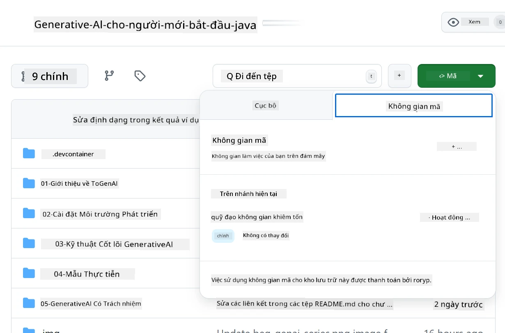
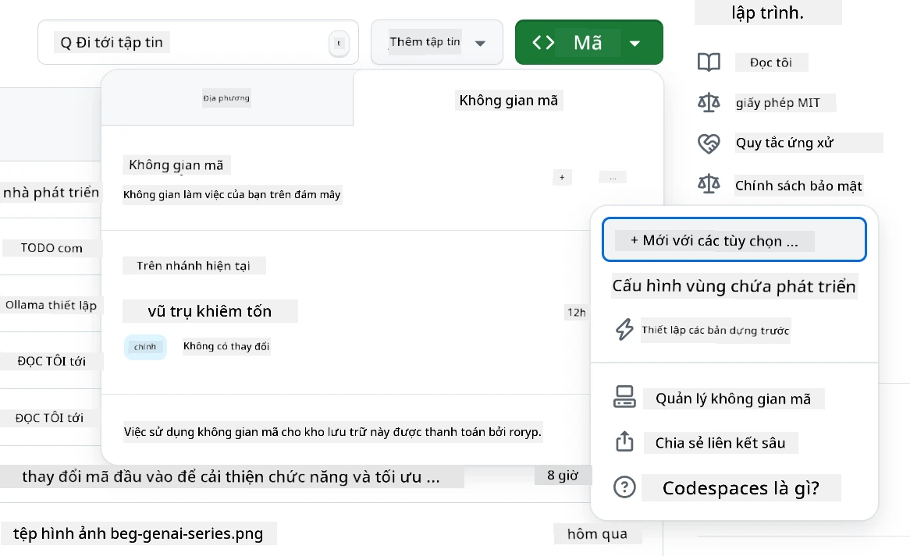
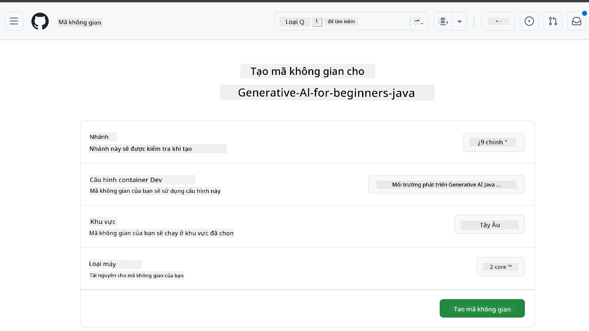
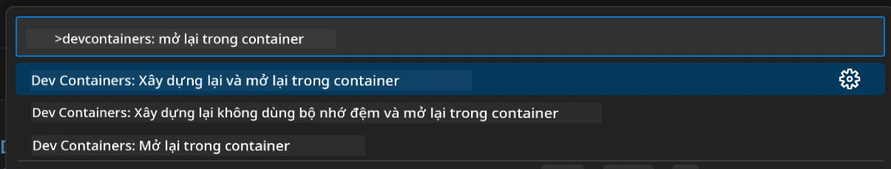
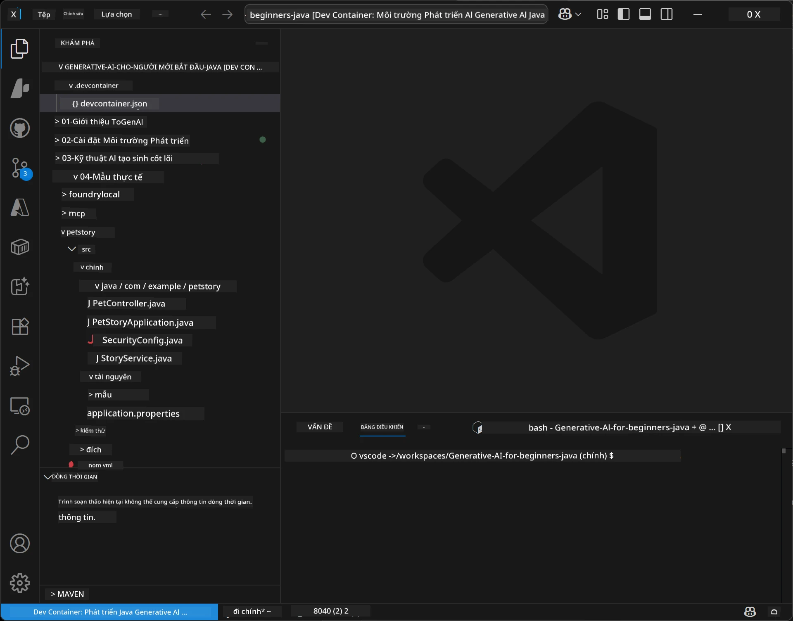
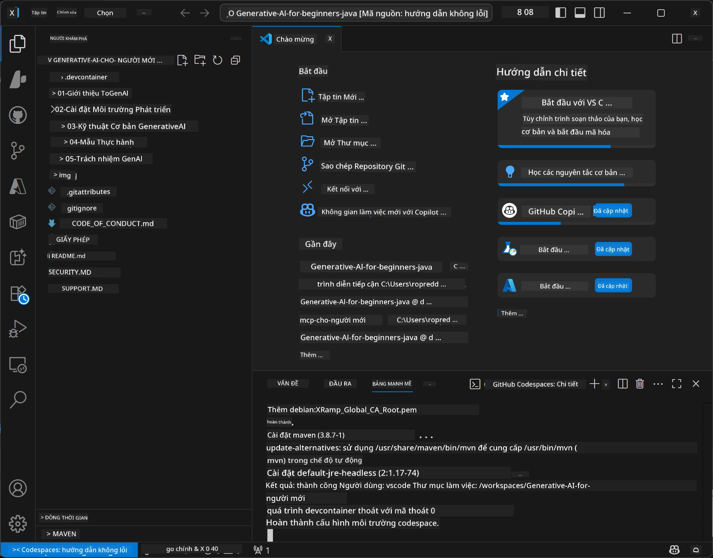

# Thiết Lập Môi Trường Phát Triển cho Generative AI cho Java

> **Bắt Đầu Nhanh:** Cung cấp các mô hình AI của bạn trên **Azure AI Foundry** dưới dạng mã nguồn với Bicep + `azd` chỉ trong vài phút — xem [Hướng Dẫn Thiết Lập Azure AI Foundry](getting-started-azure-openai.md). Xác thực là **không cần khóa** (Microsoft Entra ID), nên không có khóa API để quản lý.

## Những Gì Bạn Sẽ Học

- Thiết lập môi trường phát triển Java cho ứng dụng AI
- Lựa chọn và cấu hình môi trường phát triển ưa thích của bạn (ưu tiên đám mây với Codespaces, vùng chứa phát triển cục bộ, hoặc thiết lập cục bộ đầy đủ)
- Kiểm tra thiết lập bằng cách kết nối với mô hình Azure AI Foundry

## Mục Lục

- [Những Gì Bạn Sẽ Học](#những-gì-bạn-sẽ-học)
- [Giới Thiệu](#giới-thiệu)
- [Bước 1: Thiết Lập Môi Trường Phát Triển](#bước-1-thiết-lập-môi-trường-phát-triển)
  - [Tùy Chọn A: GitHub Codespaces (Khuyến nghị)](#tùy-chọn-a-github-codespaces-khuyến-nghị)
  - [Tùy Chọn B: Vùng Chứa Phát Triển Cục Bộ](#tùy-chọn-b-vùng-chứa-phát-triển-cục-bộ)
  - [Tùy Chọn C: Sử Dụng Cài Đặt Cục Bộ Hiện Có](#tùy-chọn-c-sử-dụng-cài-đặt-cục-bộ-hiện-có)
- [Bước 2: Cung Cấp Azure AI Foundry](#bước-2-cung-cấp-azure-ai-foundry)
- [Bước 3: Kiểm Tra Thiết Lập](#bước-3-kiểm-tra-thiết-lập)
- [Khắc Phục Sự Cố](#khắc-phục-sự-cố)
- [Tóm Tắt](#tóm-tắt)
- [Các Bước Tiếp Theo](#các-bước-tiếp-theo)

## Giới Thiệu

Chương này sẽ hướng dẫn bạn thiết lập môi trường phát triển. Chúng ta sẽ sử dụng **Azure AI Foundry** cho các mô hình trong suốt khóa học này. Bạn cung cấp các mô hình dưới dạng mã với Bicep và Azure Developer CLI (`azd`), sau đó kết nối với **xác thực không cần khóa** (Microsoft Entra ID) — không có khóa API nào cần sao chép hoặc rò rỉ.

**Không cần thiết lập cục bộ!** Bạn có thể sử dụng GitHub Codespaces, cung cấp một môi trường phát triển đầy đủ trong trình duyệt, và cung cấp Foundry từ đó.

Chúng tôi chọn **Azure AI Foundry** cho khóa học này vì nó:
- **Được cung cấp dưới dạng mã** — một lệnh `azd up` triển khai tài khoản và triển khai mô hình
- **Không cần khóa** — xác thực bằng đăng nhập Azure hoặc danh tính được quản lý
- **Sẵn sàng cho sản xuất** — cùng mã chạy cả cục bộ và trên Azure
- **Linh hoạt** — thay đổi mô hình chỉ bằng cách đổi tên triển khai, không thay đổi mã nguồn

> **Lưu ý**: Triển khai Azure AI Foundry tính phí theo token (trả theo mức sử dụng). Xem [hướng dẫn cài đặt Azure AI Foundry](getting-started-azure-openai.md) để biết chi tiết về cung cấp, vùng, và chi phí.


## Bước 1: Thiết Lập Môi Trường Phát Triển

<a name="quick-start-cloud"></a>

Chúng tôi đã tạo một vùng chứa phát triển được cấu hình sẵn để giảm thiểu thời gian thiết lập và đảm bảo bạn có tất cả các công cụ cần thiết cho khóa học Generative AI cho Java này. Hãy chọn cách phát triển ưa thích của bạn:

### Các Tùy Chọn Thiết Lập Môi Trường:

#### Tùy Chọn A: GitHub Codespaces (Khuyến nghị)

**Bắt đầu viết mã trong 2 phút - không cần thiết lập cục bộ!**

1. Fork kho lưu trữ này vào tài khoản GitHub của bạn
   > **Lưu ý**: Nếu bạn muốn chỉnh sửa cấu hình cơ bản vui lòng xem [Cấu Hình Vùng Chứa Phát Triển](../../../.devcontainer/devcontainer.json)
2. Nhấn **Code** → tab **Codespaces** → **...** → **Mới với tùy chọn...**
3. Dùng các mặc định – điều này sẽ chọn **Cấu hình vùng chứa phát triển**: **Môi Trường Phát Triển Generative AI Java** devcontainer tùy chỉnh cho khóa học này
4. Nhấn **Tạo codespace**
5. Chờ khoảng 2 phút để môi trường sẵn sàng
6. Tiếp tục tới [Bước 2: Cung Cấp Azure AI Foundry](#bước-2-cung-cấp-azure-ai-foundry)








> **Lợi ích của Codespaces**:
> - Không cần cài đặt cục bộ
> - Hoạt động trên mọi thiết bị có trình duyệt
> - Được cấu hình sẵn với tất cả công cụ và phụ thuộc
> - Miễn phí 60 giờ mỗi tháng cho tài khoản cá nhân
> - Môi trường đồng nhất cho tất cả người học

#### Tùy Chọn B: Vùng Chứa Phát Triển Cục Bộ

**Dành cho nhà phát triển thích phát triển cục bộ với Docker**

1. Fork và clone kho lưu trữ này xuống máy cục bộ của bạn
   > **Lưu ý**: Nếu bạn muốn chỉnh sửa cấu hình cơ bản vui lòng xem [Cấu Hình Vùng Chứa Phát Triển](../../../.devcontainer/devcontainer.json)
2. Cài đặt [Docker Desktop](https://www.docker.com/products/docker-desktop/) và [VS Code](https://code.visualstudio.com/)
3. Cài đặt [Tiện ích mở rộng Dev Containers](https://marketplace.visualstudio.com/items?itemName=ms-vscode-remote.remote-containers) trong VS Code
4. Mở thư mục kho lưu trữ trong VS Code
5. Khi được hỏi, nhấn **Mở lại trong vùng chứa** (hoặc dùng `Ctrl+Shift+P` → "Dev Containers: Reopen in Container")
6. Chờ vùng chứa xây dựng và khởi động
7. Tiếp tục tới [Bước 2: Cung Cấp Azure AI Foundry](#bước-2-cung-cấp-azure-ai-foundry)





#### Tùy Chọn C: Sử Dụng Cài Đặt Cục Bộ Hiện Có

**Dành cho nhà phát triển đã có môi trường Java hiện có**

Điều kiện tiên quyết:
- [Java 21+](https://www.oracle.com/java/technologies/javase/jdk21-archive-downloads.html) 
- [Maven 3.9+](https://maven.apache.org/download.cgi)
- [VS Code](https://code.visualstudio.com) hoặc IDE bạn ưa thích

Các bước:
1. Clone kho lưu trữ này về máy cục bộ
2. Mở dự án trong IDE của bạn
3. Tiếp tục tới [Bước 2: Cung Cấp Azure AI Foundry](#bước-2-cung-cấp-azure-ai-foundry)

> **Mẹo Chuyên Nghiệp**: Nếu máy bạn cấu hình thấp nhưng muốn dùng VS Code cục bộ, hãy dùng GitHub Codespaces! Bạn có thể kết nối VS Code cục bộ với Codespace trên đám mây để tận hưởng lợi ích của cả hai.




## Bước 2: Cung Cấp Azure AI Foundry

Triển khai các mô hình AI của khóa học tới Azure AI Foundry dưới dạng mã. Từ thư mục gốc của kho lưu trữ:

```bash
cd 02-SetupDevEnvironment
azd auth login
az login
azd up
```

`azd` sẽ hỏi tên môi trường, đăng ký, và vùng, triển khai tài khoản Azure AI Foundry với các triển khai `gpt-5.6-luna` và `text-embedding-3-small`, và ghi điểm cuối vào file `.env` của ví dụ - tất cả với xác thực **không cần khóa** (không có khóa API).

> **Hướng dẫn đầy đủ:** Xem [Hướng Dẫn Thiết Lập Azure AI Foundry](getting-started-azure-openai.md) để biết điều kiện tiên quyết, phương pháp thủ công (qua portal), hướng dẫn vùng, và lưu ý về chi phí/dọn dẹp.

## Bước 3: Kiểm Tra Thiết Lập

Khi các mô hình Foundry được cung cấp, kiểm tra kết nối dùng ứng dụng ví dụ trong [`02-SetupDevEnvironment/examples/basic-chat-azure`](../../../02-SetupDevEnvironment/examples/basic-chat-azure).

1. Mở terminal trong môi trường phát triển của bạn.
2. Di chuyển tới ví dụ:
   ```bash
   cd 02-SetupDevEnvironment/examples/basic-chat-azure
   ```
3. Đảm bảo bạn đã đăng nhập (xác thực không cần khóa cần token):
   ```bash
   az login
   ```
   > Nếu bạn đã chạy `azd up`, file `.env` cùng điểm cuối đã được ghi sẵn.
4. Chạy ứng dụng:
   ```bash
   mvn clean spring-boot:run
   ```

Bạn sẽ thấy phản hồi từ mô hình `gpt-5.6-luna`.

### Hiểu Về Mã Ví Dụ

Ví dụ [basic-chat](./examples/basic-chat-azure/README.md) sử dụng **Spring Boot 4.1.1** và **Spring AI 2.0.1**. `ChatClient` của Spring AI dựa trên OpenAI Java SDK chính thức, kết nối tới điểm cuối Azure OpenAI **v1** với xác thực không cần khóa.

**Mã nguồn này thực hiện:**
- **Kết nối** với Azure AI Foundry qua đăng nhập Azure (Microsoft Entra ID) — không cần khóa API
- **Gửi** yêu cầu đến mô hình `gpt-5.6-luna`
- **Nhận** và hiển thị phản hồi từ AI
- **Xác thực** rằng thiết lập hoạt động đúng

**Các phụ thuộc chính** (trích từ [pom.xml](../../../02-SetupDevEnvironment/examples/basic-chat-azure/pom.xml)):
```xml
<dependency>
    <groupId>org.springframework.ai</groupId>
    <artifactId>spring-ai-starter-model-openai</artifactId>
</dependency>
<dependency>
    <groupId>com.openai</groupId>
    <artifactId>openai-java</artifactId>
</dependency>
<dependency>
    <groupId>com.azure</groupId>
    <artifactId>azure-identity</artifactId>
    <version>${azure-identity.version}</version>
</dependency>
```

POM quản lý OpenAI Java **4.63.1** và đặt rõ Azure Identity **1.18.6**. Spring AI 2 đã bỏ starter riêng cho Azure; Azure Identity vẫn cần cho bean chứng thực.

**Cấu hình** ([application.yml](../../../02-SetupDevEnvironment/examples/basic-chat-azure/src/main/resources/application.yml)):
```yaml
spring:
  ai:
    openai:
      base-url: ${AZURE_OPENAI_ENDPOINT}
      microsoft-foundry: true
      chat:
        model: ${AZURE_OPENAI_DEPLOYMENT:gpt-5.6-luna}
        reasoning-effort: none
        max-completion-tokens: 500
```

Xác thực không cần khóa được cấu hình rõ ràng trong [BasicChatApplication.java](../../../02-SetupDevEnvironment/examples/basic-chat-azure/src/main/java/com/example/BasicChatApplication.java), không được suy luận từ việc vắng mặt khóa API. Chứng thực bearer sử dụng `DefaultAzureCredential` với phạm vi `https://ai.azure.com/.default`, và `OpenAIClient` nhắm tới `/openai/v1`. Ứng dụng cung cấp client này cho mô hình chat của Spring AI, nên biến toàn cục `OPENAI_API_KEY` không thể ghi đè xác thực Azure.

Cấu hình chat đặt trực tiếp dưới `spring.ai.openai.chat`, không có khối `options`. Bài học giữ lại Chat Completions với `reasoning-effort: none` và giới hạn hoàn thành 500 token; không thiết lập `temperature` hoặc `max-tokens`. Xem [tham khảo cấu hình ví dụ](./examples/basic-chat-azure/README.md#spring-configuration) về lựa chọn API và hướng dẫn gọi công cụ.

## Tóm Tắt

Sau khi hoàn tất các bước trên, bạn sẽ có:

- Các mô hình Azure AI Foundry được cung cấp như mã với Bicep + `azd`
- Môi trường phát triển Java của bạn sẵn sàng (dù là Codespaces, vùng chứa phát triển, hay cục bộ)
- Kết nối với Azure AI Foundry bằng xác thực không cần khóa (Microsoft Entra ID) — không cần khóa API
- Kiểm tra mọi thứ hoạt động với ví dụ đơn giản nói chuyện với mô hình của bạn

## Các Bước Tiếp Theo

[Chương 3: Kỹ Thuật Generative AI Cốt Lõi](../03-CoreGenerativeAITechniques/README.md)

## Khắc Phục Sự Cố

Gặp vấn đề? Dưới đây là các lỗi phổ biến và cách giải quyết:

- **Xác thực thất bại (401/403)?** 
  - Chạy `az login` — xác thực không cần khóa, bạn phải đăng nhập
  - Xác nhận tài khoản bạn có vai trò **Cognitive Services OpenAI User** trên tài nguyên
  - Nếu bạn vừa mới cung cấp, chờ một phút để vai trò được cập nhật

- **Không tìm thấy Maven?** 
  - Nếu dùng vùng chứa phát triển/Codespaces, Maven nên đã được cài sẵn
  - Với thiết lập cục bộ, đảm bảo Java 21+ và Maven 3.9+ đã được cài
  - Thử `mvn --version` để kiểm tra cài đặt

- **Không tìm thấy `azd` hoặc cung cấp thất bại?** 
  - Cài đặt [Azure Developer CLI](https://aka.ms/azure-dev/install) và chạy `azd auth login`
  - Chọn vùng có `gpt-5.6-luna` và `text-embedding-3-small` khả dụng (vd: `eastus2`), với hạn ngạch đủ trong đăng ký của bạn
  - Xem [hướng dẫn cài đặt Azure AI Foundry](getting-started-azure-openai.md) để biết chi tiết

- **Vùng chứa phát triển không khởi động?** 
  - Đảm bảo Docker Desktop đang chạy (cho phát triển cục bộ)
  - Thử xây dựng lại vùng chứa: `Ctrl+Shift+P` → "Dev Containers: Rebuild Container"

- **Lỗi biên dịch ứng dụng?**
  - Đảm bảo bạn đang ở đúng thư mục: `02-SetupDevEnvironment/examples/basic-chat-azure`
  - Thử làm sạch và xây dựng lại: `mvn clean compile`

> **Cần giúp đỡ?**: Vẫn gặp sự cố? Mở một issue trong kho lưu trữ và chúng tôi sẽ hỗ trợ bạn.

---

<!-- CO-OP TRANSLATOR DISCLAIMER START -->
**Tuyên bố miễn trừ trách nhiệm**:
Tài liệu này đã được dịch bằng dịch vụ dịch thuật AI [Co-op Translator](https://github.com/Azure/co-op-translator). Mặc dù chúng tôi cố gắng đảm bảo độ chính xác, xin lưu ý rằng bản dịch tự động có thể chứa lỗi hoặc sai sót. Tài liệu gốc bằng ngôn ngữ gốc nên được coi là nguồn tin chính thức. Đối với thông tin quan trọng, nên sử dụng dịch vụ dịch thuật chuyên nghiệp bởi con người. Chúng tôi không chịu trách nhiệm về bất kỳ hiểu lầm hoặc giải thích sai nào phát sinh từ việc sử dụng bản dịch này.
<!-- CO-OP TRANSLATOR DISCLAIMER END -->