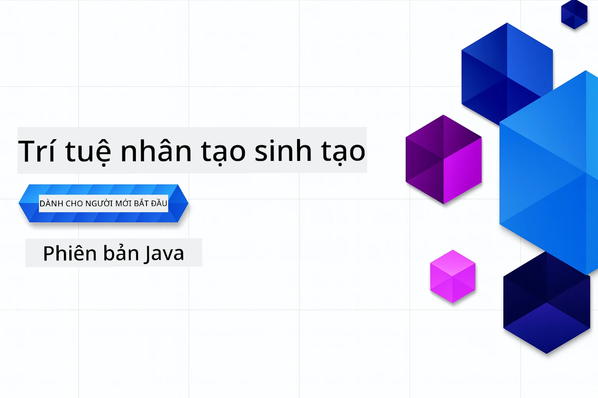

# AI Tạo Sinh cho Người Mới Bắt Đầu - Phiên Bản Java
[](https://discord.gg/nTYy5BXMWG)



**Thời Gian Cam Kết**: Toàn bộ workshop có thể hoàn thành trực tuyến mà không cần thiết lập cục bộ. Việc thiết lập môi trường mất 2 phút, việc khám phá các ví dụ mẫu mất từ 1-3 giờ tùy theo độ sâu khám phá.

> **Bắt Đầu Nhanh** 

1. Fork kho lưu trữ này vào tài khoản GitHub của bạn
2. Nhấp vào **Code** → tab **Codespaces** → **...** → **New with options...**
3. Sử dụng mặc định – điều này sẽ chọn container phát triển được tạo cho khóa học này
4. Nhấn **Create codespace**
5. Chờ khoảng ~2 phút để môi trường sẵn sàng
6. Nhảy thẳng đến [Chương 2: Cung cấp Azure AI Foundry](./02-SetupDevEnvironment/README.md#step-2-provision-azure-ai-foundry)

## Hỗ Trợ Đa Ngôn Ngữ

### Được Hỗ Trợ qua GitHub Action (Tự động & Luôn Cập Nhật)

<!-- CO-OP TRANSLATOR LANGUAGES TABLE START -->
[Tiếng Ả Rập](../ar/README.md) | [Tiếng Bengal](../bn/README.md) | [Tiếng Bungari](../bg/README.md) | [Tiếng Miến Điện (Myanmar)](../my/README.md) | [Tiếng Trung (Giản Thể)](../zh-CN/README.md) | [Tiếng Trung (Phồn Thể, Hồng Kông)](../zh-HK/README.md) | [Tiếng Trung (Phồn Thể, Macau)](../zh-MO/README.md) | [Tiếng Trung (Phồn Thể, Đài Loan)](../zh-TW/README.md) | [Tiếng Croatia](../hr/README.md) | [Tiếng Séc](../cs/README.md) | [Tiếng Đan Mạch](../da/README.md) | [Tiếng Hà Lan](../nl/README.md) | [Tiếng Estonia](../et/README.md) | [Tiếng Phần Lan](../fi/README.md) | [Tiếng Pháp](../fr/README.md) | [Tiếng Đức](../de/README.md) | [Tiếng Hy Lạp](../el/README.md) | [Tiếng Do Thái](../he/README.md) | [Tiếng Hindi](../hi/README.md) | [Tiếng Hungary](../hu/README.md) | [Tiếng Indonesia](../id/README.md) | [Tiếng Ý](../it/README.md) | [Tiếng Nhật](../ja/README.md) | [Tiếng Kannada](../kn/README.md) | [Tiếng Khmer](../km/README.md) | [Tiếng Hàn](../ko/README.md) | [Tiếng Lithuania](../lt/README.md) | [Tiếng Malay](../ms/README.md) | [Tiếng Malayalam](../ml/README.md) | [Tiếng Marathi](../mr/README.md) | [Tiếng Nepali](../ne/README.md) | [Tiếng Pidgin Nigeria](../pcm/README.md) | [Tiếng Na Uy](../no/README.md) | [Tiếng Ba Tư (Farsi)](../fa/README.md) | [Tiếng Ba Lan](../pl/README.md) | [Tiếng Bồ Đào Nha (Brazil)](../pt-BR/README.md) | [Tiếng Bồ Đào Nha (Bồ Đào Nha)](../pt-PT/README.md) | [Tiếng Punjab (Gurmukhi)](../pa/README.md) | [Tiếng Romania](../ro/README.md) | [Tiếng Nga](../ru/README.md) | [Tiếng Serbia (Chữ Cyrillic)](../sr/README.md) | [Tiếng Slovakia](../sk/README.md) | [Tiếng Slovenia](../sl/README.md) | [Tiếng Tây Ban Nha](../es/README.md) | [Tiếng Swahili](../sw/README.md) | [Tiếng Thụy Điển](../sv/README.md) | [Tiếng Tagalog (Filipino)](../tl/README.md) | [Tiếng Tamil](../ta/README.md) | [Tiếng Telugu](../te/README.md) | [Tiếng Thái](../th/README.md) | [Tiếng Thổ Nhĩ Kỳ](../tr/README.md) | [Tiếng Ukraina](../uk/README.md) | [Tiếng Urdu](../ur/README.md) | [Tiếng Việt](./README.md)

> **Ưa thích Clone Cục Bộ?**
>
> Kho lưu trữ này bao gồm hơn 50 bản dịch ngôn ngữ làm tăng đáng kể kích thước tải về. Để clone mà không có bản dịch, hãy sử dụng sparse checkout:
>
> **Bash / macOS / Linux:**
> ```bash
> git clone --filter=blob:none --sparse https://github.com/microsoft/Generative-AI-for-beginners-java.git
> cd Generative-AI-for-beginners-java
> git sparse-checkout set --no-cone '/*' '!translations' '!translated_images'
> ```
>
> **CMD (Windows):**
> ```cmd
> git clone --filter=blob:none --sparse https://github.com/microsoft/Generative-AI-for-beginners-java.git
> cd Generative-AI-for-beginners-java
> git sparse-checkout set --no-cone "/*" "!translations" "!translated_images"
> ```
>
> Điều này cung cấp cho bạn tất cả những gì cần thiết để hoàn thành khóa học với tốc độ tải về nhanh hơn nhiều.
<!-- CO-OP TRANSLATOR LANGUAGES TABLE END -->

## Cấu Trúc Khóa Học & Lộ Trình Học Tập

### **Chương 1: Giới Thiệu về AI Tạo Sinh**
- **Khái Niệm Cốt Lõi**: Hiểu về Mô hình Ngôn ngữ Lớn, tokens, embeddings, và khả năng AI
- **Hệ Sinh Thái AI Java**: Tổng quan về Spring AI và OpenAI SDKs
- **Giao Thức Ngữ Cảnh Mô Hình**: Giới thiệu MCP và vai trò trong giao tiếp đại lý AI
- **Ứng Dụng Thực Tế**: Kịch bản thế giới thực bao gồm chatbot và tạo nội dung
- **[→ Bắt đầu Chương 1](./01-IntroToGenAI/README.md)**

### **Chương 2: Thiết Lập Môi Trường Phát Triển**
- **Azure AI Foundry**: Cung cấp chat GPT-5.6 Luna và embeddings text-embedding-3-small với Bicep và Azure Developer CLI (azd)
- **Spring Boot 4.1.1 + Spring AI 2.0.1**: Học với `ChatClient`, sử dụng SDK Java OpenAI chính thức và Azure OpenAI v1
- **Xác Thực Không Khóa**: Kết nối bảo mật với Microsoft Entra ID — không cần quản lý khóa API
- **Công Cụ Phát Triển**: Container Docker, VS Code, và cấu hình GitHub Codespaces
- **[→ Bắt đầu Chương 2](./02-SetupDevEnvironment/README.md)**

### **Chương 3: Kỹ Thuật AI Tạo Sinh Cốt Lõi**
- **SDK Java OpenAI Chính Thức**: Gọi trực tiếp Azure OpenAI v1 với xác thực không khóa
- **Kỹ Thuật Prompt**: Kỹ thuật để có phản hồi tối ưu từ mô hình AI
- **Embeddings & Toán Vector**: Triển khai tìm kiếm ngữ nghĩa và so khớp tương đồng
- **Tạo Sinh Bổ Sung Truy Xuất (RAG)**: Kết hợp AI với nguồn dữ liệu của bạn
- **Gọi Hàm**: Mở rộng khả năng AI với công cụ và plugin tùy chỉnh
- **[→ Bắt đầu Chương 3](./03-CoreGenerativeAITechniques/README.md)**

### **Chương 4: Ứng Dụng Thực Tiễn & Dự Án**
- **Trình Tạo Truyện Về Thú Cưng** (`petstory/`): Tạo nội dung sáng tạo với Azure AI Foundry
- **Demo Local Foundry** (`foundrylocal/`): Tích hợp mô hình AI cục bộ với SDK Java OpenAI
- **Dịch Vụ Máy Tính MCP** (`calculator/`): Triển khai cơ bản Giao Thức Ngữ Cảnh Mô Hình với Spring AI
- **[→ Bắt đầu Chương 4](./04-PracticalSamples/README.md)**

### **Chương 5: Phát Triển AI Có Trách Nhiệm**
- **Azure AI Foundry An Toàn Nội Dung**: Thử nghiệm bộ lọc nội dung tích hợp và cơ chế an toàn (chặn cứng và từ chối nhẹ)
- **Demo AI Có Trách Nhiệm**: Ví dụ thực hành cho thấy cách hệ thống an toàn AI hiện đại hoạt động
- **Thực Tiễn Tốt Nhất**: Hướng dẫn quan trọng cho phát triển và triển khai AI có đạo đức
- **[→ Bắt đầu Chương 5](./05-ResponsibleGenAI/README.md)**

## Tài Nguyên Bổ Sung

<!-- CO-OP TRANSLATOR OTHER COURSES START -->
### LangChain
[](https://aka.ms/langchain4j-for-beginners)
[](https://aka.ms/langchainjs-for-beginners?WT.mc_id=m365-94501-dwahlin)
[](https://github.com/microsoft/langchain-for-beginners?WT.mc_id=m365-94501-dwahlin)
---

### Azure / Edge / MCP / Đại Lý
[](https://github.com/microsoft/AZD-for-beginners?WT.mc_id=academic-105485-koreyst)
[](https://github.com/microsoft/edgeai-for-beginners?WT.mc_id=academic-105485-koreyst)
[](https://github.com/microsoft/mcp-for-beginners?WT.mc_id=academic-105485-koreyst)
[](https://github.com/microsoft/ai-agents-for-beginners?WT.mc_id=academic-105485-koreyst)

---
 
### Chuỗi AI Tạo Sinh
[](https://github.com/microsoft/generative-ai-for-beginners?WT.mc_id=academic-105485-koreyst)
[-9333EA?style=for-the-badge&labelColor=E5E7EB&color=9333EA)](https://github.com/microsoft/Generative-AI-for-beginners-dotnet?WT.mc_id=academic-105485-koreyst)
[-C084FC?style=for-the-badge&labelColor=E5E7EB&color=C084FC)](https://github.com/microsoft/generative-ai-for-beginners-java?WT.mc_id=academic-105485-koreyst)
[-E879F9?style=for-the-badge&labelColor=E5E7EB&color=E879F9)](https://github.com/microsoft/generative-ai-with-javascript?WT.mc_id=academic-105485-koreyst)

---
 
### Học Tập Cốt Lõi
[](https://aka.ms/ml-beginners?WT.mc_id=academic-105485-koreyst)
[](https://aka.ms/datascience-beginners?WT.mc_id=academic-105485-koreyst)
[](https://aka.ms/ai-beginners?WT.mc_id=academic-105485-koreyst)
[](https://github.com/microsoft/Security-101?WT.mc_id=academic-96948-sayoung)
[](https://aka.ms/webdev-beginners?WT.mc_id=academic-105485-koreyst)
[](https://aka.ms/iot-beginners?WT.mc_id=academic-105485-koreyst)
[](https://github.com/microsoft/xr-development-for-beginners?WT.mc_id=academic-105485-koreyst)

---
 
### Chuỗi Copilot
[](https://aka.ms/GitHubCopilotAI?WT.mc_id=academic-105485-koreyst)
[](https://github.com/microsoft/mastering-github-copilot-for-dotnet-csharp-developers?WT.mc_id=academic-105485-koreyst)
[](https://github.com/microsoft/CopilotAdventures?WT.mc_id=academic-105485-koreyst)
<!-- CO-OP TRANSLATOR OTHER COURSES END -->

## Nhận Hỗ Trợ

Nếu bạn gặp khó khăn hoặc có bất kỳ câu hỏi nào về việc xây dựng ứng dụng AI, hãy tham gia cùng các học viên và nhà phát triển có kinh nghiệm trong các cuộc thảo luận về MCP. Đây là một cộng đồng hỗ trợ nơi các câu hỏi được hoan nghênh và kiến thức được chia sẻ tự do.

[](https://discord.gg/nTYy5BXMWG)

Nếu bạn có phản hồi về sản phẩm hoặc phát hiện lỗi trong quá trình xây dựng, vui lòng truy cập:

[](https://aka.ms/foundry/forum)

---

<!-- CO-OP TRANSLATOR DISCLAIMER START -->
**Tuyên bố miễn trừ trách nhiệm**:
Tài liệu này đã được dịch bằng dịch vụ dịch thuật AI [Co-op Translator](https://github.com/Azure/co-op-translator). Mặc dù chúng tôi cố gắng đảm bảo độ chính xác, xin lưu ý rằng bản dịch tự động có thể chứa lỗi hoặc sai sót. Tài liệu gốc bằng ngôn ngữ gốc nên được coi là nguồn tin chính thức. Đối với thông tin quan trọng, nên sử dụng dịch vụ dịch thuật chuyên nghiệp bởi con người. Chúng tôi không chịu trách nhiệm về bất kỳ hiểu lầm hoặc giải thích sai nào phát sinh từ việc sử dụng bản dịch này.
<!-- CO-OP TRANSLATOR DISCLAIMER END -->