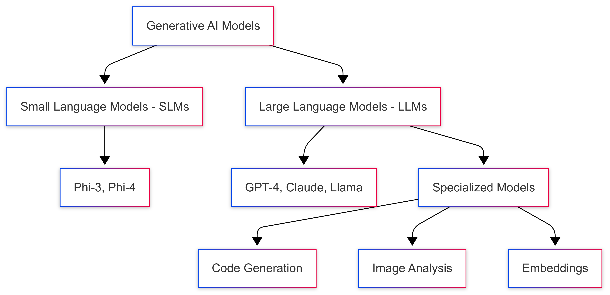

<!--
CO_OP_TRANSLATOR_METADATA:
{
  "original_hash": "75bfb080ca725e8a9aa9c80cae25fba1",
  "translation_date": "2025-07-29T14:35:41+00:00",
  "source_file": "01-IntroToGenAI/README.md",
  "language_code": "zh"
}
-->
# 生成式人工智能简介 - Java版

## 学习内容

- **生成式人工智能基础知识**，包括LLM、提示工程、tokens、嵌入和向量数据库
- **比较Java AI开发工具**，包括Azure OpenAI SDK、Spring AI和OpenAI Java SDK
- **了解模型上下文协议**及其在AI代理通信中的作用

## 目录

- [简介](../../../01-IntroToGenAI)
- [生成式人工智能概念快速回顾](../../../01-IntroToGenAI)
- [提示工程回顾](../../../01-IntroToGenAI)
- [Tokens、嵌入和代理](../../../01-IntroToGenAI)
- [Java的AI开发工具和库](../../../01-IntroToGenAI)
  - [OpenAI Java SDK](../../../01-IntroToGenAI)
  - [Spring AI](../../../01-IntroToGenAI)
  - [Azure OpenAI Java SDK](../../../01-IntroToGenAI)
- [总结](../../../01-IntroToGenAI)
- [下一步](../../../01-IntroToGenAI)

## 简介

欢迎来到《生成式人工智能入门 - Java版》的第一章！本章将为您介绍生成式人工智能的核心概念，以及如何使用Java与这些概念进行交互。您将学习AI应用的基本构建模块，包括大型语言模型（LLM）、tokens、嵌入和AI代理。我们还将探索您在本课程中使用的主要Java工具。

### 生成式人工智能概念快速回顾

生成式人工智能是一种能够根据从数据中学习到的模式和关系创建新内容（如文本、图像或代码）的人工智能。生成式AI模型可以生成类似人类的响应、理解上下文，有时甚至可以创建看起来像人类创作的内容。

在开发Java AI应用时，您将使用**生成式AI模型**来创建内容。这些模型的功能包括：

- **文本生成**：为聊天机器人、内容创作和文本补全生成类似人类的文本。
- **图像生成与分析**：生成逼真的图像、增强照片以及检测对象。
- **代码生成**：编写代码片段或脚本。

不同类型的模型针对不同任务进行了优化。例如，**小型语言模型（SLM）**和**大型语言模型（LLM）**都可以处理文本生成，但LLM通常在处理复杂任务时表现更好。对于图像相关任务，您可以使用专门的视觉模型或多模态模型。

当然，这些模型的响应并非总是完美的。您可能听说过模型“幻觉”或以权威的方式生成错误信息的情况。但通过提供清晰的指令和上下文，您可以帮助模型生成更好的响应。这就是**提示工程**的作用。

#### 提示工程回顾

提示工程是设计有效输入以引导AI模型生成期望输出的实践。它包括：

- **清晰性**：确保指令清晰且无歧义。
- **上下文**：提供必要的背景信息。
- **约束**：指定任何限制或格式。

提示工程的一些最佳实践包括提示设计、清晰指令、任务分解、单样本和少样本学习以及提示调优。测试不同的提示对于找到适合您特定用例的最佳方法至关重要。

在开发应用时，您将使用不同类型的提示：
- **系统提示**：设置模型行为的基本规则和上下文
- **用户提示**：来自应用用户的输入数据
- **助手提示**：基于系统和用户提示生成的模型响应

> **了解更多**：在[生成式AI入门课程的提示工程章节](https://github.com/microsoft/generative-ai-for-beginners/tree/main/04-prompt-engineering-fundamentals)中了解更多提示工程内容

#### Tokens、嵌入和代理

在使用生成式AI模型时，您会遇到一些术语，例如**tokens**、**嵌入**、**代理**和**模型上下文协议（MCP）**。以下是这些概念的详细介绍：

- **Tokens**：Tokens是模型中的最小文本单位，可以是单词、字符或子词。Tokens用于以模型可以理解的格式表示文本数据。例如，句子“The quick brown fox jumped over the lazy dog”可能被分解为["The", " quick", " brown", " fox", " jumped", " over", " the", " lazy", " dog"]或["The", " qu", "ick", " br", "own", " fox", " jump", "ed", " over", " the", " la", "zy", " dog"]，具体取决于分词策略。

分词是将文本分解为这些小单位的过程。这非常重要，因为模型是基于tokens而非原始文本进行操作的。提示中的token数量会影响模型的响应长度和质量，因为模型的上下文窗口有token限制（例如，GPT-4o的总上下文限制为128K tokens，包括输入和输出）。

  在Java中，您可以使用OpenAI SDK等库在向AI模型发送请求时自动处理分词。

- **嵌入**：嵌入是捕捉语义意义的token向量表示。它们是数值表示（通常是浮点数数组），使模型能够理解单词之间的关系并生成具有上下文相关性的响应。相似的单词具有相似的嵌入，从而使模型能够理解同义词和语义关系。

  在Java中，您可以使用OpenAI SDK或支持嵌入生成的其他库生成嵌入。这些嵌入对于语义搜索等任务至关重要，在语义搜索中，您希望根据意义而不是精确的文本匹配找到相似内容。

- **向量数据库**：向量数据库是针对嵌入优化的专用存储系统。它们支持高效的相似性搜索，对于需要基于语义相似性而非精确匹配从大型数据集中查找相关信息的检索增强生成（RAG）模式至关重要。

> **注意**：本课程不会涵盖向量数据库，但它们在实际应用中非常常见，因此值得一提。

- **代理和MCP**：代理是能够自主与模型、工具和外部系统交互的AI组件。模型上下文协议（MCP）提供了一种标准化方式，使代理能够安全地访问外部数据源和工具。您可以在我们的[MCP入门课程](https://github.com/microsoft/mcp-for-beginners)中了解更多内容。

在Java AI应用中，您将使用tokens进行文本处理，嵌入用于语义搜索和RAG，向量数据库用于数据检索，代理和MCP用于构建智能的工具使用系统。

### Java的AI开发工具和库

Java提供了出色的AI开发工具。我们将在本课程中探索三个主要库——OpenAI Java SDK、Azure OpenAI SDK和Spring AI。

以下是一个快速参考表，展示了每章示例中使用的SDK：

| 章节 | 示例 | SDK |
|------|------|-----|
| 02-开发环境设置 | github-models | OpenAI Java SDK |
| 02-开发环境设置 | basic-chat-azure | Spring AI Azure OpenAI |
| 03-核心生成式AI技术 | 示例 | Azure OpenAI SDK |
| 04-实用示例 | petstory | OpenAI Java SDK |
| 04-实用示例 | foundrylocal | OpenAI Java SDK |
| 04-实用示例 | calculator | Spring AI MCP SDK + LangChain4j |

**SDK文档链接：**
- [Azure OpenAI Java SDK](https://github.com/Azure/azure-sdk-for-java/tree/azure-ai-openai_1.0.0-beta.16/sdk/openai/azure-ai-openai)
- [Spring AI](https://docs.spring.io/spring-ai/reference/)
- [OpenAI Java SDK](https://github.com/openai/openai-java)
- [LangChain4j](https://docs.langchain4j.dev/)

#### OpenAI Java SDK

OpenAI SDK是OpenAI API的官方Java库。它提供了一个简单且一致的接口，用于与OpenAI的模型交互，使得将AI功能集成到Java应用中变得轻松。第2章的GitHub Models示例、第4章的Pet Story应用和Foundry Local示例展示了OpenAI SDK的使用方法。

#### Spring AI

Spring AI是一个全面的框架，为Spring应用带来了AI功能，并在不同AI提供商之间提供一致的抽象层。它与Spring生态系统无缝集成，是需要AI功能的企业Java应用的理想选择。

Spring AI的优势在于与Spring生态系统的无缝集成，使得使用熟悉的Spring模式（如依赖注入、配置管理和测试框架）构建生产级AI应用变得简单。在第2章和第4章中，您将使用Spring AI构建利用OpenAI和模型上下文协议（MCP）Spring AI库的应用。

##### 模型上下文协议（MCP）

[模型上下文协议（MCP）](https://modelcontextprotocol.io/)是一种新兴标准，使AI应用能够安全地与外部数据源和工具交互。MCP提供了一种标准化方式，使AI模型能够访问上下文信息并在您的应用中执行操作。

在第4章中，您将构建一个简单的MCP计算器服务，展示如何使用Spring AI实现模型上下文协议的基础知识，并展示如何创建基本工具集成和服务架构。

#### Azure OpenAI Java SDK

Azure OpenAI Java客户端库是OpenAI REST API的一个改编版，提供了一个符合Java习惯的接口，并与Azure SDK生态系统的其他部分集成。在第3章中，您将使用Azure OpenAI SDK构建应用，包括聊天应用、函数调用和RAG（检索增强生成）模式。

> 注意：Azure OpenAI SDK在功能上落后于OpenAI Java SDK，因此对于未来的项目，建议使用OpenAI Java SDK。

## 总结

到此为止，您已经了解了：

- 生成式人工智能的核心概念——从LLM和提示工程到tokens、嵌入和向量数据库
- Java AI开发的工具选项：Azure OpenAI SDK、Spring AI和OpenAI Java SDK
- 什么是模型上下文协议，以及它如何使AI代理能够与外部工具协作

## 下一步

[第2章：设置开发环境](../02-SetupDevEnvironment/README.md)

**免责声明**：  
本文档使用AI翻译服务[Co-op Translator](https://github.com/Azure/co-op-translator)进行翻译。尽管我们努力确保准确性，但请注意，自动翻译可能包含错误或不准确之处。应以原始语言的文档作为权威来源。对于关键信息，建议使用专业人工翻译。因使用本翻译而导致的任何误解或误读，我们概不负责。